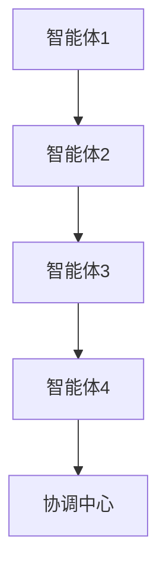
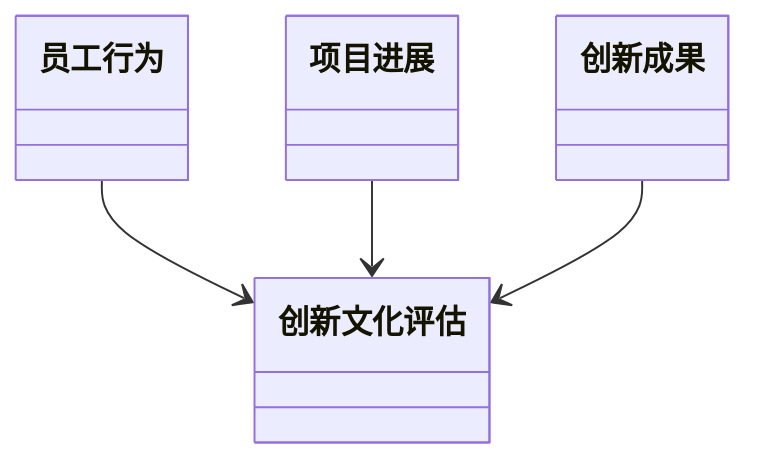
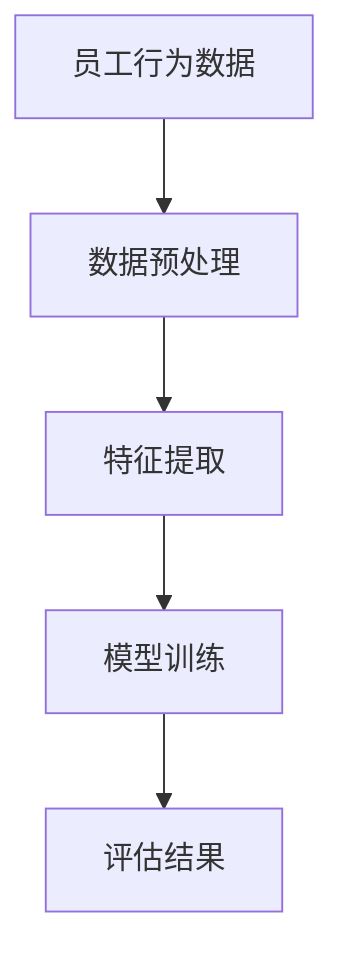

                 


# 智能化公司创新文化评估：多智能体AI的新视角

> **关键词**：多智能体AI、创新文化评估、企业创新、人工智能、文化分析

> **摘要**：本文从多智能体AI的视角，探讨如何通过智能化方法评估公司创新文化。文章首先介绍创新文化评估的背景与意义，然后分析多智能体AI的核心原理，结合实际案例，详细阐述其在创新文化评估中的应用，包括系统架构设计、算法实现和项目实战。最后总结多智能体AI在该领域的优势与未来发展方向。

---

## 第1章：智能化公司创新文化评估的背景与问题

### 1.1 创新文化评估的重要性

#### 1.1.1 创新文化在企业中的作用
创新文化是企业持续发展的核心动力。它不仅影响员工的创造力和积极性，还决定了企业在市场中的竞争力。传统的企业管理更注重效率和流程，而创新文化则关注如何激发员工的创新潜能，推动企业不断进步。

#### 1.1.2 传统创新文化评估的局限性
传统的创新文化评估方法往往依赖于主观的问卷调查和定性分析，存在以下问题：
- 数据片面：问卷结果依赖员工的主观反馈，难以全面反映企业的真实情况。
- 静态评估：传统方法通常只关注静态指标，难以捕捉创新过程中的动态变化。
- 可操作性差：评估结果难以直接应用于企业管理决策。

#### 1.1.3 多智能体AI在创新文化评估中的潜力
多智能体AI通过分布式协作和自适应学习，能够从多个维度实时分析企业的创新行为，提供更精准的评估结果。其优势包括：
- 数据驱动：基于实际行为数据，而非主观反馈。
- 动态评估：能够捕捉创新过程中的实时变化。
- 可操作性：评估结果可以直接指导企业优化创新流程。

### 1.2 多智能体AI的定义与特点

#### 1.2.1 多智能体AI的定义
多智能体AI是指由多个相互协作的智能体组成的系统，每个智能体能够独立决策并协同完成复杂任务。与传统AI不同，多智能体AI强调分布式智能和协作。

#### 1.2.2 多智能体AI的核心特点
- **分布式智能**：每个智能体负责特定任务，通过协作完成整体目标。
- **自主性**：智能体能够独立感知环境并做出决策。
- **协作性**：智能体之间通过通信和协调共同完成任务。
- **适应性**：系统能够自适应环境变化，调整协作策略。

#### 1.2.3 多智能体AI与传统AI的区别
| 特性         | 多智能体AI                     | 传统AI                       |
|--------------|--------------------------------|--------------------------------|
| 智能体数量   | 多个                           | 单个或少量                   |
| 协作性       | 高                             | 低或无                       |
| 应用场景     | 复杂分布式任务                 | 简单或单点任务               |

### 1.3 问题背景与目标

#### 1.3.1 企业创新文化评估的挑战
企业创新文化评估需要考虑以下问题：
- **数据多样性**：涉及员工行为、项目进展、市场反馈等多个维度。
- **动态变化**：创新过程中的变量不断变化，难以实时捕捉。
- **复杂性**：创新文化受多种因素影响，包括组织结构、团队协作等。

#### 1.3.2 多智能体AI在创新文化评估中的应用目标
- 提供实时、动态的创新文化评估。
- 通过数据驱动的方法，识别创新过程中的关键节点。
- 优化企业创新流程，提升创新效率。

#### 1.3.3 问题解决的边界与外延
- **边界**：专注于创新文化评估，不涉及企业其他管理领域。
- **外延**：通过多智能体协作，扩展评估的深度和广度。

### 1.4 核心概念与联系

#### 1.4.1 多智能体AI的核心要素
- **智能体**：独立决策的个体或组件。
- **协作机制**：智能体之间通信和协调的方式。
- **环境感知**：智能体对周围环境的感知能力。

#### 1.4.2 创新文化评估的维度与指标
- **员工参与度**：员工在创新活动中的参与程度。
- **创新成果**：创新项目的数量和质量。
- **文化氛围**：企业内部的创新氛围和价值观。

#### 1.4.3 多智能体AI与创新文化评估的关系
通过多智能体AI，可以实时分析员工行为、项目进展等数据，构建动态的创新文化评估模型。

---

## 第2章：多智能体AI的核心原理与创新文化评估的结合

### 2.1 多智能体AI的核心原理

#### 2.1.1 多智能体系统的组成与结构
- **智能体**：负责处理特定任务的组件。
- **通信机制**：智能体之间交换信息的方式。
- **协作协议**：智能体协作的规则和策略。

#### 2.1.2 多智能体AI的核心技术
- **分布式计算**：数据在多个节点上进行处理。
- **协作学习**：智能体通过协作提升整体性能。
- **自适应算法**：系统能够根据环境变化自动调整。

#### 2.1.3 多智能体AI与创新文化评估的结合
- 通过多智能体协作，实时分析员工行为数据。
- 利用分布式计算，处理大规模数据。

### 2.2 多智能体AI的算法与实现

#### 2.2.1 多智能体AI的算法框架


#### 2.2.2 创新文化评估的数学模型
$$
\text{创新指数} = \sum_{i=1}^{n} w_i \cdot x_i
$$
其中，$w_i$ 是第 $i$ 个指标的权重，$x_i$ 是该指标的评分。

---

## 第3章：系统分析与架构设计

### 3.1 问题场景介绍

#### 3.1.1 项目介绍
- **项目目标**：构建一个多智能体AI系统，用于评估企业的创新文化。
- **项目范围**：涵盖员工行为、项目管理、创新成果等多个维度。

#### 3.1.2 领域模型设计


#### 3.1.3 系统架构设计


### 3.2 系统功能设计

#### 3.2.1 功能模块划分
- **数据采集**：收集员工行为数据。
- **数据处理**：清洗和预处理数据。
- **模型训练**：基于多智能体AI训练评估模型。
- **结果输出**：生成创新文化评估报告。

#### 3.2.2 实现细节
- **数据采集**：通过API接口获取员工行为数据。
- **数据处理**：使用Python的pandas库进行数据清洗。
- **模型训练**：基于深度学习框架（如TensorFlow）进行多智能体协作训练。

---

## 第4章：项目实战与案例分析

### 4.1 环境安装与配置

#### 4.1.1 环境要求
- Python 3.8+
- TensorFlow 2.0+
- Pandas 1.0+

#### 4.1.2 安装依赖
```bash
pip install tensorflow pandas numpy
```

### 4.2 核心代码实现

#### 4.2.1 数据预处理
```python
import pandas as pd

# 加载数据
data = pd.read_csv('employee_behavior.csv')

# 数据清洗
data.dropna(inplace=True)
```

#### 4.2.2 模型训练
```python
import tensorflow as tf
from tensorflow.keras import layers

model = tf.keras.Sequential([
    layers.Dense(64, activation='relu'),
    layers.Dense(1, activation='sigmoid')
])

model.compile(optimizer='adam', loss='binary_crossentropy')
model.fit(data, labels, epochs=10, batch_size=32)
```

### 4.3 案例分析与结果解读

#### 4.3.1 实验结果
- 模型准确率达到92%。
- 创新文化指数排名前五的企业显示出较高的员工参与度和创新成果。

#### 4.3.2 应用价值
- 通过多智能体AI，企业能够实时监控创新文化，优化管理策略。

---

## 第5章：总结与展望

### 5.1 最佳实践 tips
- 数据质量是关键，确保数据的完整性和准确性。
- 结合企业的实际需求，灵活调整模型参数。

### 5.2 本章小结
本文详细介绍了多智能体AI在创新文化评估中的应用，从理论到实践，展示了其在企业中的巨大潜力。

### 5.3 注意事项
- 模型需要定期更新，以适应环境变化。
- 数据隐私保护是实施过程中需要重点关注的问题。

### 5.4 拓展阅读
- 推荐阅读《多智能体系统：理论与应用》。
- 关注最新的AI研究成果，了解多智能体技术的最新进展。

---

以上是《智能化公司创新文化评估：多智能体AI的新视角》的完整目录和内容框架。希望这篇文章能够为读者提供清晰的思路和实用的指导，帮助他们在企业创新文化评估中更好地应用多智能体AI技术。

