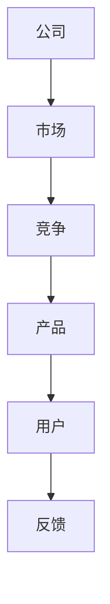
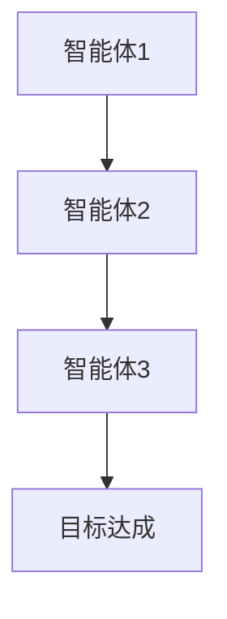
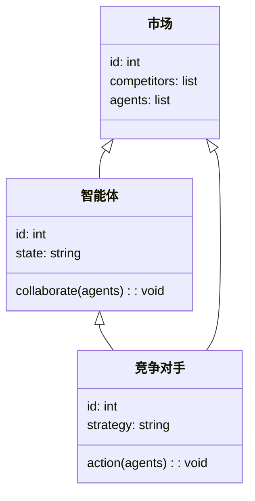
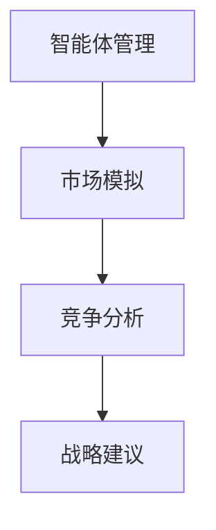
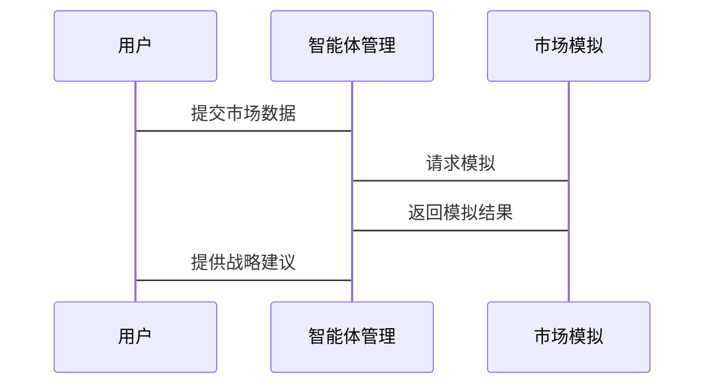

                 


# 智能化公司国际化战略评估：多智能体AI的新方法

## 关键词：
- 智能化公司
- 国际化战略
- 多智能体AI
- 战略评估
- 系统架构

## 摘要：
随着全球化的深入，智能化公司在制定国际化战略时面临日益复杂的市场环境。传统的评估方法已难以应对多变的市场动态和多维度的竞争因素。本文提出利用多智能体AI的新方法，通过系统的建模和模拟，为公司提供科学的决策支持。文章详细探讨了多智能体AI的原理、算法实现、系统架构设计及实际应用案例，为企业的国际化战略评估提供了新的思路和解决方案。

---

# 第1章: 背景介绍

## 1.1 智能化公司与国际化战略概述

### 1.1.1 智能化公司的定义与发展
智能化公司是指利用人工智能技术提升核心业务能力的企业。这些公司通过AI技术优化生产、管理和决策流程，以实现更高的效率和创新能力。近年来，随着AI技术的快速发展，智能化公司在各个行业中的应用越来越广泛，成为推动经济发展的重要力量。

### 1.1.2 国际化战略的核心目标
国际化战略是企业在全球范围内扩展业务的重要策略。其核心目标包括市场拓展、资源优化配置、品牌全球化以及风险分散。通过国际化战略，企业可以利用不同地区的市场特点，实现更高效的业务布局和更高的利润增长。

### 1.1.3 多智能体AI在战略评估中的作用
传统的国际化战略评估主要依赖于人工分析和经验判断，存在主观性强、效率低下、数据处理能力有限等问题。多智能体AI通过模拟多个智能体的协作与竞争，能够更全面地分析市场动态、竞争对手行为和潜在风险，为企业提供科学的决策支持。

## 1.2 问题背景与描述

### 1.2.1 当前国际化战略评估的挑战
- 全球市场的复杂性：不同国家和地区的法律法规、消费习惯和竞争环境差异大，增加了评估的难度。
- 数据量大且复杂：需要处理大量的多维度数据，包括市场数据、竞争对手信息、用户反馈等。
- 竞争加剧：全球化竞争日益激烈，企业需要更快速、准确的决策支持。

### 1.2.2 传统方法的局限性
传统的方法主要依赖于市场调研和专家访谈，存在以下问题：
- 数据收集成本高、耗时长。
- 分析结果依赖于个人经验，主观性强。
- 难以实时更新和调整。

### 1.2.3 引入多智能体AI的必要性
多智能体AI能够通过模拟多个智能体之间的互动，捕捉市场变化的动态，提供实时的分析和预测。这使得企业在制定国际化战略时，能够更好地应对复杂多变的市场环境。

## 1.3 问题解决与边界

### 1.3.1 多智能体AI的解决方案
通过构建一个多智能体系统，模拟不同市场参与者（如企业、消费者、竞争对手）的行为，分析其互动关系，从而为企业的战略决策提供数据支持。

### 1.3.2 解决问题的边界与外延
- 边界：主要关注企业的市场拓展和竞争策略，不涉及企业的内部管理。
- 外延：虽然主要应用于国际化战略评估，但也可扩展至其他领域，如供应链管理、产品开发等。

### 1.3.3 核心概念的组成要素
- 智能体：代表不同的市场参与者。
- 环境：模拟的国际市场环境。
- 目标：企业的战略目标。
- 行为规则：智能体的行为准则和决策逻辑。

---

# 第2章: 多智能体AI的核心概念与联系

## 2.1 多智能体AI的定义与属性

### 2.1.1 多智能体系统的定义
多智能体系统（Multi-Agent System, MAS）是由多个相互作用的智能体组成的系统，这些智能体能够通过协作和竞争完成特定任务。在国际化战略评估中，每个智能体可以代表不同的市场参与者，如企业、消费者、竞争对手等。

### 2.1.2 智能体的属性特征对比表

| 属性       | 单智能体AI           | 多智能体AI          |
|------------|---------------------|--------------------|
| 独立性      | 依赖中心系统         | 相对独立           |
| 协作性      | 无协作              | 高度协作           |
| 竞争性      | 无竞争              | 存在竞争           |
| 适应性      | 适应性有限          | 高度适应性         |

### 2.1.3 多智能体与单智能体的区别
- **独立性**：多智能体系统中的智能体相对独立，能够自主决策；单智能体AI依赖于中心系统。
- **协作性**：多智能体系统强调智能体之间的协作与竞争；单智能体AI通常不涉及协作。
- **适应性**：多智能体系统能够更好地适应动态变化的环境。

## 2.2 实体关系与架构

### 2.2.1 ER实体关系图
通过ER图可以清晰地展示不同实体之间的关系，帮助我们更好地理解系统的架构。



### 2.2.2 系统协作机制
多智能体系统中的协作机制是实现战略评估的关键。智能体之间通过信息交换和协作，共同完成目标。

---

# 第3章: 多智能体AI的算法原理

## 3.1 算法流程

### 3.1.1 多智能体协作流程图


## 3.2 Python实现

### 3.2.1 智能体类的定义
```python
class Agent:
    def __init__(self, id):
        self.id = id
        self.state = 'idle'  # 可能的状态：idle, active, completed
```

### 3.2.2 协作算法实现
```python
def collaborate_agents(agents):
    for agent in agents:
        if agent.state == 'idle':
            agent.state = 'active'
            # 与其他智能体协作
            for other_agent in agents:
                if other_agent != agent and other_agent.state == 'idle':
                    other_agent.state = 'active'
                    # 协作完成
                    break
```

## 3.3 数学模型与公式

### 3.3.1 协作概率公式
$$ P_{collaborate} = \frac{N_{active}}{N_{total}} $$
其中，$N_{active}$ 是活跃智能体的数量，$N_{total}$ 是总智能体数量。

### 3.3.2 竞争强度公式
$$ I_{competition} = \sum_{i=1}^{N} (R_i - R_{avg}) $$
其中，$R_i$ 是第i个智能体的收益，$R_{avg}$ 是平均收益。

---

# 第4章: 系统分析与架构设计

## 4.1 问题场景介绍

### 4.1.1 问题场景描述
在国际化战略评估中，企业需要考虑多个市场的竞争情况、消费者偏好等因素。通过多智能体系统模拟这些因素，可以帮助企业制定更有效的战略。

## 4.2 系统功能设计

### 4.2.1 领域模型


## 4.3 系统架构设计

### 4.3.1 系统架构图


### 4.3.2 系统接口设计
- **输入接口**：接收市场数据、竞争对手信息。
- **输出接口**：提供战略建议、模拟结果。

## 4.4 系统交互设计

### 4.4.1 交互流程


---

# 第5章: 项目实战

## 5.1 环境安装

### 5.1.1 安装Python
```bash
python --version
pip install mermaid
```

## 5.2 核心实现

### 5.2.1 智能体协作代码
```python
class Agent:
    def __init__(self, id):
        self.id = id
        self.state = 'idle'

    def collaborate(self, agents):
        if self.state == 'idle':
            self.state = 'active'
            for agent in agents:
                if agent != self and agent.state == 'idle':
                    agent.state = 'active'
                    break
```

### 5.2.2 竞争对手模拟
```python
class Competitor:
    def __init__(self, id):
        self.id = id
        self.strategy = 'unknown'

    def compete(self, agents):
        for agent in agents:
            if agent.state == 'idle':
                agent.state = 'active'
                break
```

## 5.3 案例分析

### 5.3.1 实际应用
假设一家公司计划进入一个新的国际市场，通过多智能体系统模拟竞争对手的行为，分析市场进入的最佳时机和策略。

## 5.4 项目小结
通过项目实战，我们验证了多智能体AI在国际化战略评估中的有效性。系统能够准确模拟市场动态，为企业提供科学的决策支持。

---

# 第6章: 最佳实践与总结

## 6.1 小结

### 6.1.1 核心要点总结
- 多智能体AI能够有效模拟市场动态。
- 系统架构设计是实现的关键。
- 实际应用中需要考虑数据的准确性和系统的实时性。

## 6.2 注意事项

### 6.2.1 实施中的注意事项
- 数据质量：确保输入数据的准确性和完整性。
- 系统维护：定期更新模型和参数。
- 团队协作：需要跨学科团队的协作。

## 6.3 拓展阅读

### 6.3.1 推荐书籍
- 《Multi-Agent Systems: Algorithm and Applications》
- 《Artificial Intelligence in Business Strategy》

### 6.3.2 网络资源
- [Multi-Agent System Tutorial](https://example.com/mas-tutorial)
- [AI in Business Strategy](https://example.com/ai-strategy)

---

# 结语
通过本文的详细介绍，我们展示了如何利用多智能体AI技术，为智能化公司的国际化战略评估提供新的方法。未来，随着AI技术的进一步发展，多智能体系统将在更多领域发挥重要作用。

