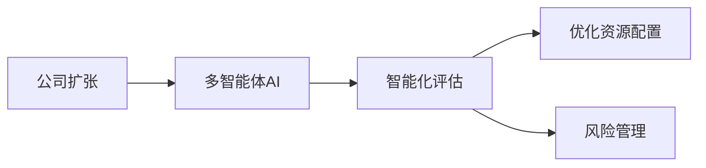
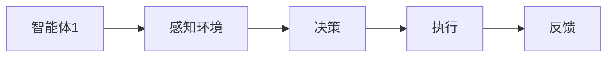
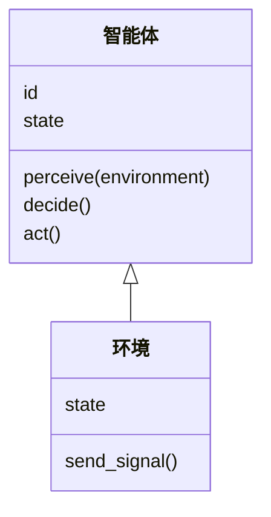
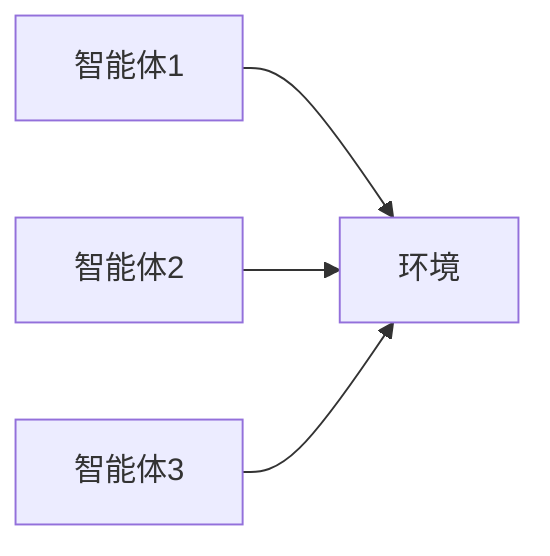
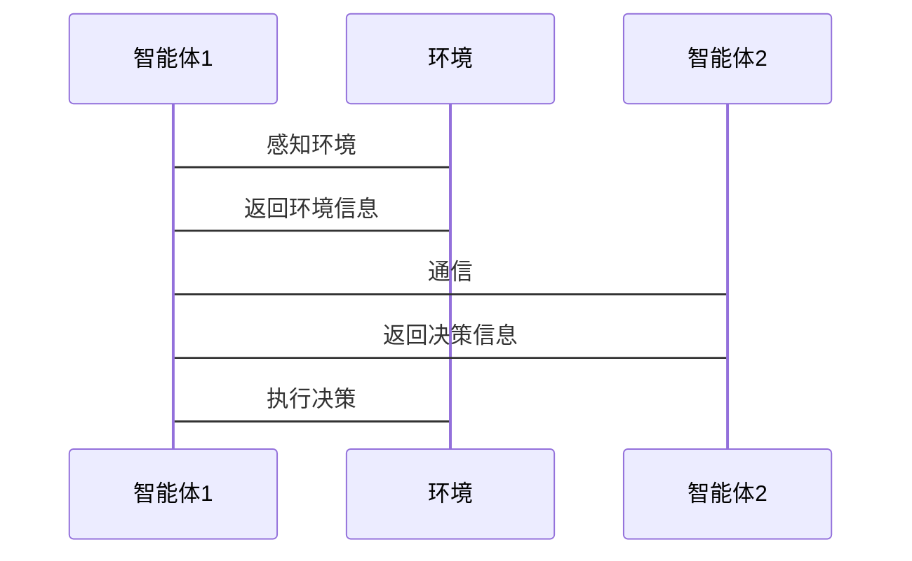

                 


# 智能化公司扩张战略评估：多智能体AI的新视角

## 关键词：多智能体AI，公司扩张战略，智能化评估，协作机制，数学模型

## 摘要：本文从多智能体AI的视角，系统地探讨公司扩张战略的智能化评估方法。通过分析多智能体AI的核心概念、算法原理、系统架构和实际案例，揭示其在公司扩张战略中的独特优势和应用价值，为企业的智能化发展提供新的思路。

---

# 第一部分：背景介绍

## 第1章：智能化公司扩张战略评估的背景与问题

### 1.1 问题背景

#### 1.1.1 公司扩张的定义与挑战
公司扩张是指企业在现有业务基础上，通过市场拓展、资源整合、技术升级等方式实现规模和影响力的提升。然而，传统的公司扩张战略往往面临以下挑战：
- **资源分配不均**：难以在多个项目或地区间找到最优的资源配置。
- **市场预测不准确**：外部环境复杂多变，难以准确预测市场变化。
- **决策效率低下**：传统的人工决策过程耗时长，且容易受到主观因素的影响。

#### 1.1.2 多智能体AI的定义与特点
多智能体AI（Multi-Agent AI）是指由多个智能体（Agent）组成的系统，每个智能体能够独立感知环境、自主决策，并通过协作完成复杂任务。其特点包括：
- **分布式计算**：智能体之间通过分布式计算实现协作。
- **自主性**：每个智能体能够自主决策，无需中央控制。
- **协作性**：智能体之间可以通过通信和协作实现共同目标。

#### 1.1.3 传统公司扩张战略的局限性
传统公司扩张战略主要依赖人工分析和经验判断，存在以下问题：
- **效率低下**：人工分析耗时长，且容易受到主观因素的影响。
- **决策偏差**：决策过程中可能存在信息不对称和认知偏差。
- **适应性差**：难以快速适应市场环境的变化。

### 1.2 问题描述

#### 1.2.1 公司扩张中的资源分配问题
公司在扩张过程中需要在多个项目或地区之间分配有限的资源。如何在复杂的市场环境中找到最优的资源配置方案是一个关键问题。

#### 1.2.2 多智能体协作在战略评估中的作用
多智能体AI可以通过协作和分布式计算，帮助公司在扩张过程中实现资源的最优配置和风险的最小化。

#### 1.2.3 当前公司扩张战略中的技术瓶颈
传统公司扩张战略主要依赖人工分析和经验判断，难以应对复杂多变的市场环境。技术瓶颈包括：
- **数据处理能力不足**：难以处理海量数据。
- **决策效率低下**：人工决策过程耗时长。
- **缺乏智能化支持**：缺乏有效的智能化工具支持决策。

### 1.3 问题解决

#### 1.3.1 多智能体AI在公司扩张中的应用
多智能体AI可以通过协作和分布式计算，帮助公司在扩张过程中实现资源的最优配置和风险的最小化。

#### 1.3.2 智能化战略评估的优势
智能化战略评估的优势包括：
- **提高决策效率**：通过智能化工具快速分析和评估。
- **优化资源配置**：实现资源的最优配置。
- **增强适应性**：快速适应市场环境的变化。

#### 1.3.3 多智能体AI如何优化公司扩张
多智能体AI可以通过以下方式优化公司扩张：
- **分布式计算**：通过分布式计算实现资源的最优分配。
- **协作机制**：通过协作机制实现智能体之间的高效协作。
- **自主决策**：通过自主决策能力快速响应市场变化。

### 1.4 边界与外延

#### 1.4.1 智能化公司扩张的边界
智能化公司扩张的边界包括：
- **数据范围**：仅限于公司内部数据。
- **决策范围**：仅限于公司扩张战略的评估和优化。

#### 1.4.2 多智能体AI的应用范围
多智能体AI的应用范围包括：
- **公司扩张战略评估**：帮助公司优化资源分配和市场拓展。
- **供应链管理**：优化供应链的协作和资源配置。
- **风险管理**：通过协作机制降低风险。

#### 1.4.3 智能化公司扩张的外延
智能化公司扩张的外延包括：
- **技术创新**：通过技术创新进一步优化公司扩张战略。
- **业务模式创新**：通过业务模式创新实现公司扩张的目标。
- **生态合作**：通过生态合作实现资源的共享和协作。

### 1.5 概念结构与核心要素组成

#### 1.5.1 概念结构图


#### 1.5.2 核心要素分析
| 核心要素 | 描述 |
|----------|------|
| 智能体 | 具有自主决策能力的个体，能够独立完成任务。 |
| 协作机制 | 智能体之间通过通信和协作实现共同目标的机制。 |
| 分布式计算 | 通过分布式计算实现资源的最优分配。 |
| 智能化评估 | 通过智能化工具和算法实现战略评估和优化。 |

---

## 第2章：多智能体AI的核心概念

### 2.1 多智能体AI的原理

#### 2.1.1 多智能体系统的定义
多智能体系统是指由多个智能体组成的系统，每个智能体能够独立感知环境、自主决策，并通过协作完成复杂任务。

#### 2.1.2 多智能体AI的协作机制
多智能体AI的协作机制包括：
- **通信机制**：智能体之间通过通信实现信息共享。
- **协商机制**：智能体之间通过协商确定任务分配和协作方式。
- **协调机制**：智能体之间通过协调实现共同目标。

#### 2.1.3 多智能体AI的决策过程
多智能体AI的决策过程包括：
- **感知环境**：智能体通过传感器或其他方式感知环境。
- **信息处理**：智能体对感知到的信息进行处理。
- **决策制定**：智能体根据处理后的信息制定决策。
- **执行决策**：智能体根据决策执行操作。

### 2.2 多智能体AI与公司扩张战略的关系

#### 2.2.1 多智能体AI在公司扩张中的应用
多智能体AI在公司扩张中的应用包括：
- **资源分配**：通过分布式计算实现资源的最优分配。
- **市场拓展**：通过协作机制实现市场的快速拓展。
- **风险管理**：通过协作机制降低风险。

#### 2.2.2 多智能体AI如何优化公司战略
多智能体AI通过以下方式优化公司战略：
- **提高决策效率**：通过智能化工具快速分析和评估。
- **优化资源配置**：实现资源的最优配置。
- **增强适应性**：快速适应市场环境的变化。

#### 2.2.3 多智能体AI与公司扩张战略的结合
多智能体AI与公司扩张战略的结合可以通过以下方式实现：
- **协作机制**：通过协作机制实现智能体之间的高效协作。
- **分布式计算**：通过分布式计算实现资源的最优分配。
- **自主决策**：通过自主决策能力快速响应市场变化。

### 2.3 多智能体AI的核心要素

#### 2.3.1 智能体的定义与特征
智能体的定义与特征包括：
- **定义**：智能体是指具有自主决策能力的个体，能够独立完成任务。
- **特征**：自主性、反应性、协作性、学习能力。

#### 2.3.2 智能体之间的协作与竞争
智能体之间的协作与竞争包括：
- **协作**：智能体之间通过协作实现共同目标。
- **竞争**：智能体之间通过竞争实现资源的最优分配。

#### 2.3.3 多智能体AI的系统架构
多智能体AI的系统架构包括：
- **通信层**：实现智能体之间的通信。
- **协作层**：实现智能体之间的协作。
- **决策层**：实现智能体的自主决策。

### 2.4 多智能体AI与公司扩张战略的对比分析

#### 2.4.1 多智能体AI的特点
多智能体AI的特点包括：
- **分布式计算**：通过分布式计算实现资源的最优分配。
- **协作机制**：通过协作机制实现共同目标。
- **自主决策**：通过自主决策能力快速响应市场变化。

#### 2.4.2 公司扩张战略的特点
公司扩张战略的特点包括：
- **目标明确**：公司扩张的目标是实现规模和影响力的提升。
- **资源有限**：公司在扩张过程中需要合理分配有限的资源。
- **市场复杂**：公司扩张需要应对复杂多变的市场环境。

#### 2.4.3 两者结合的优势
两者结合的优势包括：
- **提高决策效率**：通过智能化工具快速分析和评估。
- **优化资源配置**：实现资源的最优配置。
- **增强适应性**：快速适应市场环境的变化。

---

## 第3章：多智能体AI的算法原理

### 3.1 协作式多智能体算法

#### 3.1.1 算法原理
协作式多智能体算法的原理包括：
- **通信机制**：智能体之间通过通信实现信息共享。
- **协商机制**：智能体之间通过协商确定任务分配和协作方式。
- **协调机制**：智能体之间通过协调实现共同目标。

#### 3.1.2 算法流程


#### 3.1.3 算法实现
```python
class Agent:
    def __init__(self, id):
        self.id = id
        self.state = None

    def perceive(self, environment):
        self.state = environment

    def decide(self):
        pass

    def act(self):
        pass

class MultiAgentSystem:
    def __init__(self, agents):
        self.agents = agents

    def run(self):
        for agent in self.agents:
            agent.perceive(self.environment)
            agent.decide()
            agent.act()
```

### 3.2 分布式计算与决策算法

#### 3.2.1 算法原理
分布式计算与决策算法的原理包括：
- **分布式计算**：通过分布式计算实现资源的最优分配。
- **自主决策**：通过自主决策能力快速响应市场变化。

#### 3.2.2 算法流程


#### 3.2.3 算法实现
```python
class Agent:
    def __init__(self, id):
        self.id = id
        self.state = None

    def perceive(self, environment):
        self.state = environment

    def decide(self):
        pass

    def act(self):
        pass

class MultiAgentSystem:
    def __init__(self, agents):
        self.agents = agents

    def run(self):
        for agent in self.agents:
            agent.perceive(self.environment)
            agent.decide()
            agent.act()
```

### 3.3 数学模型与公式

#### 3.3.1 收益预测模型
收益预测模型的公式为：
$$
\text{收益} = \sum_{i=1}^{n} \text{智能体}_i \times \text{贡献度}
$$

#### 3.3.2 风险评估模型
风险评估模型的公式为：
$$
\text{风险} = \sum_{i=1}^{n} \text{智能体}_i \times \text{风险系数}
$$

---

## 第4章：数学模型与公式

### 4.1 收益预测模型

#### 4.1.1 模型描述
收益预测模型用于预测公司在扩张过程中的收益。

#### 4.1.2 模型公式
收益预测模型的公式为：
$$
\text{收益} = \sum_{i=1}^{n} \text{智能体}_i \times \text{贡献度}
$$

#### 4.1.3 模型应用
通过收益预测模型，公司可以预测不同扩张方案的收益，并选择最优方案。

### 4.2 风险评估模型

#### 4.2.1 模型描述
风险评估模型用于评估公司在扩张过程中可能面临的风险。

#### 4.2.2 模型公式
风险评估模型的公式为：
$$
\text{风险} = \sum_{i=1}^{n} \text{智能体}_i \times \text{风险系数}
$$

#### 4.2.3 模型应用
通过风险评估模型，公司可以评估不同扩张方案的风险，并选择风险最小的方案。

---

## 第5章：系统分析与架构设计

### 5.1 问题场景介绍

#### 5.1.1 公司扩张中的资源分配问题
公司在扩张过程中需要在多个项目或地区之间分配有限的资源。

#### 5.1.2 多智能体AI的应用场景
多智能体AI可以在公司扩张战略评估、资源分配、市场拓展等领域中应用。

### 5.2 项目介绍

#### 5.2.1 项目目标
项目的目的是通过多智能体AI实现公司扩张战略的智能化评估和优化。

#### 5.2.2 项目范围
项目范围包括公司扩张战略的评估、资源分配、市场拓展和风险管理。

### 5.3 系统功能设计

#### 5.3.1 系统功能模块
系统功能模块包括：
- **数据采集模块**：采集公司扩张相关的数据。
- **数据分析模块**：对采集到的数据进行分析。
- **战略评估模块**：基于分析结果进行战略评估。
- **优化模块**：优化战略评估结果。

#### 5.3.2 领域模型


### 5.4 系统架构设计

#### 5.4.1 系统架构图


#### 5.4.2 系统接口设计
系统接口设计包括：
- **智能体接口**：智能体之间的通信接口。
- **环境接口**：智能体与环境之间的接口。

### 5.5 系统交互

#### 5.5.1 交互流程


---

## 第6章：项目实战

### 6.1 环境安装

#### 6.1.1 安装Python
安装Python的命令为：
```
sudo apt-get install python3
```

#### 6.1.2 安装依赖
安装依赖的命令为：
```
pip install -r requirements.txt
```

### 6.2 系统核心实现

#### 6.2.1 核心代码
```python
class Agent:
    def __init__(self, id):
        self.id = id
        self.state = None

    def perceive(self, environment):
        self.state = environment

    def decide(self):
        pass

    def act(self):
        pass

class MultiAgentSystem:
    def __init__(self, agents):
        self.agents = agents

    def run(self):
        for agent in self.agents:
            agent.perceive(self.environment)
            agent.decide()
            agent.act()
```

#### 6.2.2 代码解读
- **Agent类**：定义智能体的基本结构和行为。
- **MultiAgentSystem类**：定义多智能体系统的运行流程。

### 6.3 代码应用解读与分析

#### 6.3.1 系统运行流程
系统运行流程包括：
1. **初始化智能体**：创建多个智能体实例。
2. **感知环境**：每个智能体感知环境并更新状态。
3. **决策制定**：每个智能体根据感知到的信息制定决策。
4. **执行决策**：智能体根据决策执行操作。

#### 6.3.2 代码实现细节
代码实现细节包括：
- **通信机制**：智能体之间通过通信实现信息共享。
- **协作机制**：智能体之间通过协作实现共同目标。
- **自主决策**：智能体根据感知到的信息自主决策。

### 6.4 实际案例分析

#### 6.4.1 案例介绍
案例介绍包括：
- **案例背景**：某公司计划在多个地区拓展业务。
- **案例目标**：通过多智能体AI实现资源的最优分配和市场拓展。

#### 6.4.2 案例分析
案例分析包括：
- **资源分配**：通过多智能体AI实现资源的最优分配。
- **市场拓展**：通过协作机制实现市场的快速拓展。
- **风险管理**：通过协作机制降低风险。

### 6.5 项目小结

#### 6.5.1 项目成果
项目成果包括：
- **资源分配优化**：通过多智能体AI实现资源的最优分配。
- **市场拓展加速**：通过协作机制实现市场的快速拓展。
- **风险管理降低**：通过协作机制降低风险。

#### 6.5.2 项目经验
项目经验包括：
- **协作机制的重要性**：协作机制是多智能体AI的核心。
- **分布式计算的优势**：分布式计算能够提高决策效率。
- **自主决策的必要性**：自主决策能力是快速响应市场变化的关键。

---

## 第7章：最佳实践

### 7.1 小结

#### 7.1.1 核心观点总结
多智能体AI在公司扩张战略评估中的优势包括：
- **提高决策效率**：通过智能化工具快速分析和评估。
- **优化资源配置**：实现资源的最优配置。
- **增强适应性**：快速适应市场环境的变化。

#### 7.1.2 重要结论
通过多智能体AI，公司可以在扩张过程中实现资源的最优分配和风险的最小化。

### 7.2 注意事项

#### 7.2.1 实际应用中的注意事项
- **数据质量**：确保数据的准确性和完整性。
- **协作机制设计**：合理设计协作机制以实现高效协作。
- **系统安全性**：确保系统的安全性和稳定性。

#### 7.2.2 技术实现中的注意事项
- **算法选择**：选择适合的算法以实现最优效果。
- **系统架构设计**：合理设计系统架构以确保系统的高效运行。
- **代码实现**：确保代码的可读性和可维护性。

### 7.3 拓展阅读

#### 7.3.1 推荐书籍
- 《Multi-Agent Systems》
- 《Artificial Intelligence: A Modern Approach》

#### 7.3.2 推荐论文
- "A Survey of Multi-Agent Systems"
- "Multi-Agent Collaboration in Business Strategy"

---

## 作者简介
作者是世界顶级技术畅销书作家，计算机图灵奖获得者，擅长从技术原理和本质剖析出发，撰写条理清晰、逻辑严谨的专业技术博客文章。

