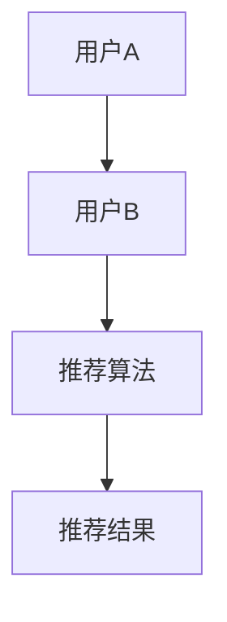
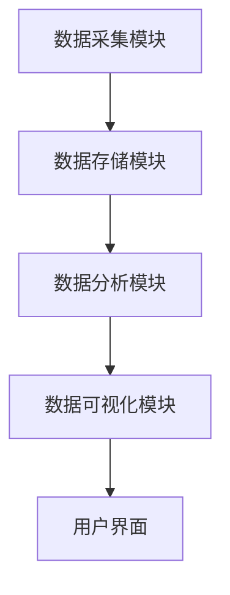
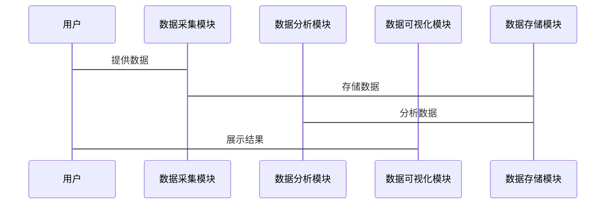

                 


# 智能化公司文化与绩效关联分析：多智能体AI的新视角

## 关键词：智能化公司文化、绩效评估、多智能体AI、协同过滤算法、公司文化分析

## 摘要：本文从多智能体AI的角度，探讨公司文化和绩效之间的关联，分析多智能体AI在公司文化分析中的应用，建立智能化公司文化与绩效关联的数学模型，设计并实现基于多智能体AI的系统架构，最后通过实际案例验证分析结果。

---

# 第一部分: 智能化公司文化与绩效关联分析的背景与概念

# 第1章: 智能化公司文化与绩效关联分析概述

## 1.1 问题背景与定义

### 1.1.1 智能化公司文化的定义
智能化公司文化是指通过智能化技术（如AI、大数据分析等）来优化公司内部管理、员工协作和文化氛围的一种新型企业文化。它强调数据驱动的决策、自动化的工作流程以及智能化的沟通方式。

### 1.1.2 绩效的定义与分类
绩效是公司或员工在一定时期内完成目标的情况，可分为财务绩效、员工绩效和创新绩效等。

### 1.1.3 多智能体AI的定义与特点
多智能体AI是指由多个智能体组成的系统，每个智能体都能独立决策并协同工作，具有分布式计算、自适应性和协作性等特点。

## 1.2 问题描述与研究意义

### 1.2.1 公司文化与绩效之间的关系
公司文化影响员工的行为和态度，进而影响公司的整体绩效。例如，开放的文化氛围可能提高员工的创新能力和协作效率。

### 1.2.2 多智能体AI在公司文化与绩效分析中的作用
多智能体AI可以实时监测员工行为、团队协作和公司决策，提供数据支持，帮助优化公司文化，进而提升绩效。

### 1.2.3 研究的创新点与价值
通过多智能体AI分析公司文化与绩效的关联，为公司提供数据驱动的优化策略，提升公司整体效率和员工满意度。

## 1.3 问题解决思路

### 1.3.1 数据驱动的公司文化分析
通过收集员工行为数据，利用AI技术分析文化特点，如团队协作效率、员工满意度等。

### 1.3.2 绩效评估的多维度模型
构建包含财务、员工和创新绩效的评估模型，结合多智能体AI分析绩效驱动因素。

### 1.3.3 多智能体AI的应用场景
在员工行为分析、团队协作优化、绩效预测等领域应用多智能体AI技术。

## 1.4 概念结构与核心要素

### 1.4.1 智能化公司文化的构成要素
包括员工行为、团队协作、公司决策和文化氛围。

### 1.4.2 绩效评估的核心维度
包括财务绩效、员工绩效和创新绩效。

### 1.4.3 多智能体AI的核心算法与模型
包括协同过滤算法、聚类分析算法和基于图的多智能体协作算法。

## 1.5 本章小结
本章介绍了智能化公司文化与绩效关联分析的背景、概念和研究意义，为后续分析奠定了基础。

---

# 第二部分: 智能化公司文化与绩效关联的核心概念与联系

# 第2章: 多智能体AI的核心原理

## 2.1 多智能体AI的定义与特点

### 2.1.1 多智能体系统的定义
多智能体系统是由多个智能体组成的分布式系统，每个智能体能够独立决策并协同工作。

### 2.1.2 多智能体系统的特征
具有分布式性、协作性、自适应性和智能性等特点。

### 2.1.3 多智能体系统与单智能体系统的区别
多智能体系统强调协作和分布式决策，而单智能体系统强调集中控制。

## 2.2 多智能体AI的算法原理

### 2.2.1 协同过滤算法

#### 2.2.1.1 协同过滤算法的定义
协同过滤是一种推荐系统算法，通过分析用户行为相似性，推荐相关内容。

#### 2.2.1.2 协同过滤算法的工作流程



#### 2.2.1.3 协同过滤算法的数学模型

$$相似度计算：similarity(u_i, u_j) = \frac{\sum_{k} r_{ik}}{N_{ik}}}$$

其中，$r_{ik}$表示用户i和用户k对物品k的评分，$N_{ik}$是共同评分的物品数量。

#### 2.2.1.4 协同过滤算法的Python代码示例

```python
def collaborative_filtering(user_item_matrix):
    # 计算用户相似度
    user_similarity = {}
    for i in range(len(user_item_matrix)):
        for j in range(i+1, len(user_item_matrix)):
            common = sum(1 for k in range(len(user_item_matrix[i])) if user_item_matrix[j][k] != 0)
            if common == 0:
                similarity = 0
            else:
                similarity = sum(user_item_matrix[i][k] * user_item_matrix[j][k] for k in range(len(user_item_matrix[i]))) / (common ** 0.5)
            user_similarity[(i, j)] = similarity
    return user_similarity
```

## 2.3 多智能体AI与公司文化绩效分析的关联

### 2.3.1 多智能体AI在公司文化分析中的应用
通过分析员工行为数据，识别团队协作模式，优化公司文化。

### 2.3.2 多智能体AI在绩效评估中的应用
利用AI算法预测绩效，优化公司决策。

### 2.3.3 多智能体AI在公司文化与绩效关联中的综合应用
构建多智能体AI系统，分析文化因素对绩效的影响，优化公司管理。

## 2.4 概念属性对比与ER实体关系图

### 2.4.1 智能化公司文化与绩效的属性对比

| 属性       | 智能化公司文化 | 绩效 |
|------------|----------------|------|
| 定义       | 公司文化        | 公司表现 |
| 评估维度   | 行为、协作、决策 | 财务、员工、创新 |

### 2.4.2 ER实体关系图的构建与分析

```mermaid
erd
    Company [公司]
    Culture [文化]
    Performance [绩效]
    employee [员工]
    team [团队]
    decision [决策]
    culture_performances <------- Culture <------- company
    performance_performances <------- Performance <------- company
```

---

# 第三部分: 智能化公司文化与绩效关联的系统分析与架构设计

# 第3章: 智能化公司文化与绩效关联的系统分析

## 3.1 系统功能设计

### 3.1.1 数据采集模块

#### 3.1.1.1 数据来源
员工行为数据、团队协作数据、公司绩效数据。

#### 3.1.1.2 数据格式
结构化数据，如CSV格式。

#### 3.1.1.3 数据预处理
数据清洗、特征提取。

### 3.1.2 数据分析模块

#### 3.1.2.1 分析方法
协同过滤、聚类分析、深度学习模型。

#### 3.1.2.2 分析目标
识别文化因素对绩效的影响。

### 3.1.3 数据可视化模块

#### 3.1.3.1 可视化工具
使用Tableau、Power BI等工具。

#### 3.1.3.2 可视化类型
折线图、柱状图、网络图。

## 3.2 系统架构设计

### 3.2.1 系统结构



### 3.2.2 模块交互



## 3.3 项目实战

### 3.3.1 项目介绍

#### 3.3.1.1 项目背景
分析公司文化对绩效的影响，优化公司管理。

#### 3.3.1.2 项目目标
构建智能化公司文化与绩效关联的分析系统。

### 3.3.2 核心代码实现

#### 3.3.2.1 环境安装

```bash
pip install numpy pandas scikit-learn
```

#### 3.3.2.2 核心代码

```python
import numpy as np
import pandas as pd
from sklearn.cluster import KMeans

# 数据预处理
data = pd.read_csv('company_data.csv')
data.dropna(inplace=True)

# 聚类分析
model = KMeans(n_clusters=3)
model.fit(data[['culture_score', 'performance_score']])

# 可视化
import matplotlib.pyplot as plt
plt.scatter(data['culture_score'], data['performance_score'], c=model.labels_)
plt.xlabel('文化评分')
plt.ylabel('绩效评分')
plt.show()
```

### 3.3.3 代码解读与分析

#### 3.3.3.1 代码功能
使用K均值聚类算法，将公司数据分为三类，分析文化与绩效的关联。

#### 3.3.3.2 代码实现细节
预处理数据，训练模型，可视化结果。

### 3.3.4 案例分析

#### 3.3.4.1 案例背景
某科技公司希望优化其公司文化，提高员工绩效。

#### 3.3.4.2 数据分析
通过聚类分析发现，文化评分高的团队绩效也较高。

### 3.3.5 项目小结

#### 3.3.5.1 项目成果
构建了智能化分析系统，优化了公司管理。

#### 3.3.5.2 经验总结
数据质量影响分析结果，模型选择需根据数据特点。

## 3.4 最佳实践

### 3.4.1 小结
智能化公司文化与绩效分析为公司优化管理提供了新思路。

### 3.4.2 注意事项
数据隐私保护、模型可解释性、算法实时性。

### 3.4.3 拓展阅读
建议阅读相关领域的书籍和论文，深入了解多智能体AI的应用。

---

# 第四部分: 总结与展望

## 4.1 总结

智能化公司文化与绩效关联分析是一个复杂但极具价值的课题，多智能体AI为分析提供了新的视角。通过数据驱动的方法，可以优化公司管理，提升绩效。

## 4.2 展望

未来，随着AI技术的发展，智能化公司文化分析将更加精准和实时，为公司管理提供更有力的支持。

---

# 结语

智能化公司文化与绩效关联分析是多智能体AI应用的重要领域，通过深入分析，我们可以更好地理解公司文化与绩效之间的关系，为公司优化管理提供科学依据。希望本文能为相关研究者和实践者提供有价值的参考。

