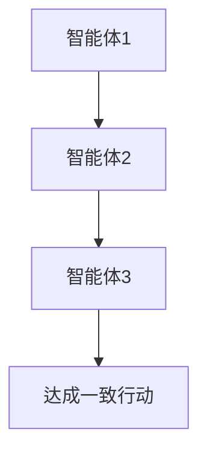
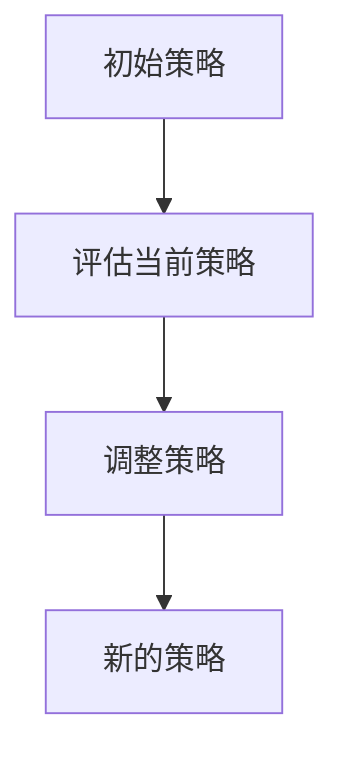
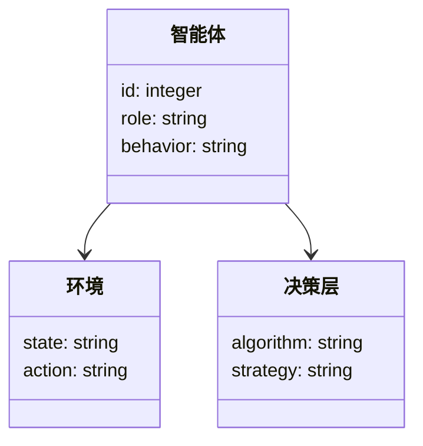
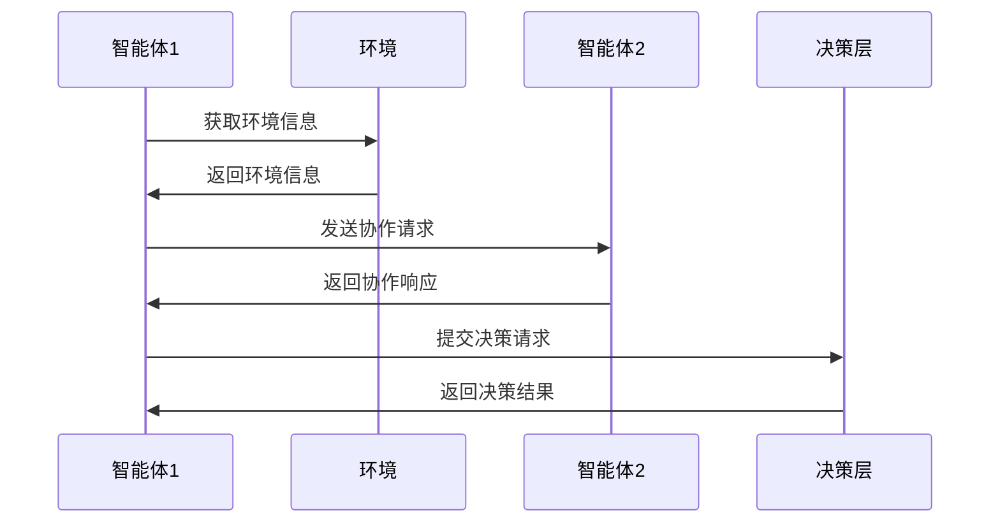

                 


# 智能化公司治理效率分析：多智能体AI的创新应用

> 关键词：公司治理、多智能体AI、智能化效率、博弈论、分布式计算

> 摘要：本文深入探讨了多智能体AI在公司治理中的创新应用，分析了其在提升治理效率和解决复杂问题方面的潜力。通过结合博弈论和分布式计算，本文提出了多智能体AI在公司治理中的数学模型和算法实现，并通过实际案例展示了其在股权分配、风险控制和战略决策中的应用价值。同时，本文还详细阐述了多智能体AI系统的架构设计和实现过程，为智能化公司治理提供了理论依据和实践指导。

---

# 第一部分: 智能化公司治理效率分析基础

## 第1章: 智能化公司治理与多智能体AI概述

### 1.1 智能化公司治理的背景与意义

#### 1.1.1 传统公司治理的局限性
传统公司治理依赖于人为决策和层级式管理，存在以下问题：
- **信息不对称**：管理层与股东之间的信息传递不透明，导致决策失误。
- **代理成本**：管理层追求自身利益最大化，可能损害股东利益。
- **决策效率低**：依赖人工判断，决策速度慢，难以应对快速变化的市场环境。

#### 1.1.2 智能化治理的定义与内涵
智能化治理是指利用人工智能技术，通过数据驱动的方式优化公司治理结构和决策过程。其核心在于：
- **数据驱动**：利用大数据分析优化决策。
- **自动化**：通过AI算法实现部分决策自动化。
- **实时性**：能够快速响应市场变化和内部需求。

#### 1.1.3 多智能体AI在公司治理中的应用价值
多智能体AI能够模拟公司内部不同角色（如股东、董事、管理层）的行为，通过协作和竞争优化治理效率。其主要价值体现在：
- **利益协调**：通过算法优化股权分配和利益分配。
- **风险控制**：实时监控企业运行，识别潜在风险。
- **决策支持**：提供数据支持的决策建议，提升决策的科学性。

### 1.2 多智能体AI的基本概念

#### 1.2.1 多智能体系统定义
多智能体系统（Multi-Agent System, MAS）是由多个相互作用的智能体组成的系统，每个智能体能够独立感知环境并做出决策。

#### 1.2.2 多智能体与单智能体的区别
| 特性         | 单智能体       | 多智能体       |
|--------------|----------------|----------------|
| 独立性       | 高             | 高             |
| 交互性       | 无             | 有             |
| 协作性       | 无             | 有             |
| 复杂性       | 低             | 高             |

#### 1.2.3 多智能体AI的核心特征
- **分布式计算**：智能体之间通过分布式网络进行通信和协作。
- **自主性**：每个智能体具有自主决策能力。
- **协作性**：智能体之间通过协作实现共同目标。

### 1.3 本章小结
本章介绍了智能化公司治理的背景、意义以及多智能体AI的基本概念，为后续章节的分析奠定了基础。

---

## 第2章: 多智能体AI的原理与技术

### 2.1 多智能体系统的组成与结构

#### 2.1.1 智能体的定义与分类
- **定义**：智能体是一种能够感知环境并采取行动以实现目标的实体。
- **分类**：
  - **简单反射型智能体**：基于当前状态做出反应。
  - **基于模型的智能体**：利用内部模型进行规划和决策。
  - **目标驱动型智能体**：根据目标选择行动。

#### 2.1.2 多智能体系统的层次结构
多智能体系统可以分为以下层次：
1. **感知层**：通过传感器或数据源获取信息。
2. **决策层**：通过算法做出决策。
3. **执行层**：将决策转化为具体行动。

#### 2.1.3 智能体之间的交互机制
- **通信**：智能体之间通过消息传递进行信息交流。
- **协作**：通过协商达成一致行动。
- **竞争**：在资源分配中可能存在竞争关系。

### 2.2 多智能体AI的关键技术

#### 2.2.1 分布式计算与通信
- **分布式计算**：通过分布式网络实现计算任务的分解与协作。
- **通信协议**：定义智能体之间的通信规则和数据格式。

#### 2.2.2 协作与协调算法
- **协作算法**：通过协商达成一致行动。
- **协调算法**：通过调整行动实现整体目标。

#### 2.2.3 学习与自适应机制
- **强化学习**：通过奖励机制优化决策策略。
- **自适应机制**：根据环境变化动态调整行为。

### 2.3 多智能体AI的数学模型

#### 2.3.1 博弈论基础
博弈论是分析多智能体协作与竞争的核心工具，常见的博弈类型包括：
- **零和博弈**：一方获益，另一方受损。
- **非零和博弈**：双方可能同时获益或同时受损。

#### 2.3.2 纳什均衡的定义与应用
**纳什均衡**是指在博弈中，每个参与者在给定其他参与者策略的情况下，无法通过单方面改变策略而提高自身收益的状态。

公式表示为：
$$
\text{纳什均衡} \iff \forall i, u_i(s_i, s_{-i}) \geq u_i(s'_i, s_{-i})
$$
其中，$s_i$是智能体i的策略，$s_{-i}$是其他智能体的策略。

#### 2.3.3 多智能体收益分配模型
多智能体收益分配可以基于贡献度进行分配，公式如下：
$$
\text{收益分配比例} = \frac{\text{贡献度}}{\sum \text{贡献度}}
$$

### 2.4 本章小结
本章详细介绍了多智能体AI的原理与关键技术，为后续章节的分析提供了理论基础。

---

## 第3章: 公司治理中的关键问题与多智能体AI的解决方案

### 3.1 公司治理中的代理问题

#### 3.1.1 代理问题的定义与表现
代理问题是由于委托人与代理人之间的利益不一致导致的。常见的表现形式包括道德风险和逆向选择。

#### 3.1.2 代理问题的传统解决方法
- **激励机制**：通过薪酬和股权激励绑定代理人利益。
- **监控机制**：通过审计和绩效考核监督代理人行为。

#### 3.1.3 多智能体AI在代理问题中的应用
多智能体AI可以通过以下方式解决代理问题：
- **利益协调**：通过算法优化股权分配和激励机制。
- **实时监控**：通过数据分析实时监控代理人的行为。

### 3.2 公司治理中的外部性问题

#### 3.2.1 外部性的定义与类型
外部性是指某一经济主体的行为对其他经济主体产生的影响，分为正外部性和负外部性。

#### 3.2.2 外部性对公司治理的影响
外部性可能导致公司治理中的利益冲突和效率损失。

#### 3.2.3 多智能体AI在外部性问题中的解决方案
多智能体AI可以通过以下方式解决外部性问题：
- **利益平衡**：通过算法实现利益的公平分配。
- **风险控制**：通过实时监控和预警系统降低外部性风险。

### 3.3 多智能体AI在公司治理中的具体应用

#### 3.3.1 股权分配与利益协调
多智能体AI可以通过博弈论模型优化股权分配，确保各方利益的均衡。

#### 3.3.2 风险评估与控制
通过实时数据分析和风险评估模型，多智能体AI可以提前识别和控制潜在风险。

#### 3.3.3 战略决策支持
多智能体AI可以通过数据驱动的方式提供战略决策支持，提高决策的科学性和效率。

### 3.4 本章小结
本章分析了公司治理中的关键问题，并提出了多智能体AI的解决方案，展示了其在提升治理效率中的重要作用。

---

## 第4章: 多智能体AI的数学模型与算法实现

### 4.1 多智能体AI的数学模型

#### 4.1.1 博弈论模型在多智能体中的应用
博弈论模型是分析多智能体协作与竞争的核心工具。常见的博弈模型包括：
- **完全信息博弈**：所有参与者都了解所有信息。
- **不完全信息博弈**：参与者只了解部分信息。

#### 4.1.2 多智能体收益分配的数学公式
收益分配可以基于贡献度进行，公式为：
$$
\text{收益分配比例} = \frac{\text{贡献度}}{\sum \text{贡献度}}
$$

#### 4.1.3 多智能体决策过程的数学表示
多智能体决策过程可以通过以下步骤表示：
1. **感知环境**：获取环境信息。
2. **计算贡献度**：评估每个智能体的贡献。
3. **分配收益**：根据贡献度分配收益。
4. **调整策略**：根据收益调整决策策略。

### 4.2 多智能体AI的算法实现

#### 4.2.1 分布式协作算法
分布式协作算法可以通过以下步骤实现：
1. **初始化**：设置初始参数。
2. **通信**：智能体之间交换信息。
3. **协作**：通过协商达成一致行动。
4. **执行**：将决策转化为具体行动。

#### 4.2.2 自适应学习算法
自适应学习算法可以通过以下步骤实现：
1. **感知环境**：获取环境信息。
2. **评估当前策略**：评估当前策略的有效性。
3. **调整策略**：根据评估结果调整策略。
4. **重复**：重复上述步骤直到达到目标。

#### 4.2.3 跨智能体通信协议
跨智能体通信协议可以通过以下步骤实现：
1. **定义消息格式**：确定消息的结构和内容。
2. **建立通信通道**：通过网络实现智能体之间的通信。
3. **消息处理**：接收并解析消息。
4. **响应消息**：根据消息内容生成响应。

### 4.3 算法实现的mermaid流程图

#### 4.3.1 分布式协作算法流程图


#### 4.3.2 自适应学习算法流程图


### 4.4 本章小结
本章详细介绍了多智能体AI的数学模型和算法实现，展示了其在公司治理中的应用潜力。

---

## 第5章: 系统架构与设计

### 5.1 系统架构设计

#### 5.1.1 多智能体AI系统整体架构
多智能体AI系统的整体架构包括以下几个部分：
- **感知层**：通过传感器或数据源获取信息。
- **决策层**：通过算法做出决策。
- **执行层**：将决策转化为具体行动。

#### 5.1.2 系统模块划分与功能设计
系统模块划分如下：
1. **智能体行为规划模块**：负责规划智能体的行为。
2. **智能体协作与协调模块**：负责智能体之间的协作与协调。
3. **智能体通信协议设计**：负责智能体之间的通信。

#### 5.1.3 系统通信协议设计
系统通信协议设计需要考虑以下几个方面：
- **消息格式**：定义消息的结构和内容。
- **通信方式**：选择合适的通信方式（如HTTP、WebSocket）。
- **安全性**：确保通信的安全性。

### 5.2 系统功能设计

#### 5.2.1 智能体行为规划模块
智能体行为规划模块需要实现以下功能：
- **感知环境**：获取环境信息。
- **计算贡献度**：评估每个智能体的贡献。
- **分配收益**：根据贡献度分配收益。

#### 5.2.2 智能体协作与协调模块
智能体协作与协调模块需要实现以下功能：
- **通信**：智能体之间通过消息传递进行信息交流。
- **协作**：通过协商达成一致行动。
- **协调**：通过调整行动实现整体目标。

#### 5.2.3 智能体通信协议设计
智能体通信协议设计需要考虑以下几个方面：
- **消息格式**：定义消息的结构和内容。
- **通信方式**：选择合适的通信方式（如HTTP、WebSocket）。
- **安全性**：确保通信的安全性。

### 5.3 系统架构设计

#### 5.3.1 领域模型mermaid类图


#### 5.3.2 系统架构mermaid序列图


### 5.4 本章小结
本章详细介绍了多智能体AI系统的架构设计和功能设计，为后续章节的实现提供了指导。

---

## 第6章: 项目实战与案例分析

### 6.1 项目环境安装

#### 6.1.1 系统需求
- **操作系统**：Linux/Windows/MacOS
- **编程语言**：Python
- **开发工具**：PyCharm/VS Code
- **依赖库**：numpy, pandas, matplotlib, scikit-learn

#### 6.1.2 安装步骤
1. 安装Python：
   ```bash
   # 在终端中运行
   python --version
   ```
2. 安装依赖库：
   ```bash
   pip install numpy pandas matplotlib scikit-learn
   ```

### 6.2 系统核心实现源代码

#### 6.2.1 智能体行为规划模块实现
```python
import numpy as np
import pandas as pd

class Agent:
    def __init__(self, id):
        self.id = id
        self.role = "shareholder"  # 可以是"shareholder"或"manager"

    def感知环境(self, 环境状态):
        # 根据环境状态计算贡献度
        贡献度 = np.random.uniform(0, 1)
        return 贡献度

    def 行为规划(self, 贡献度):
        # 根据贡献度分配收益
        收益 = 贡献度 * 100
        return 收益

# 示例代码
agent = Agent(1)
环境状态 = "市场增长"
贡献度 = agent.感知环境(环境状态)
收益 = agent.行为规划(贡献度)
print(f"智能体{agent.id}的收益为：{收益}")
```

#### 6.2.2 智能体协作与协调模块实现
```python
import numpy as np
import pandas as pd

class Collaboration:
    def __init__(self):
        self.智能体列表 = []

    def 添加智能体(self, 智能体):
        self.智能体列表.append(智能体)

    def 协商(self):
        # 模拟协商过程
        for agent in self.智能体列表:
            agent.行为规划(1)

# 示例代码
collaboration = Collaboration()
agent1 = Agent(1)
agent2 = Agent(2)
collaboration.添加智能体(agent1)
collaboration.添加智能体(agent2)
collaboration.协商()
```

### 6.3 代码应用解读与分析
上述代码展示了智能体行为规划模块和协作模块的实现。智能体行为规划模块负责计算贡献度和分配收益，协作模块负责智能体之间的协作与协调。

### 6.4 案例分析与详细讲解
通过上述代码实现的案例，我们可以看到多智能体AI在公司治理中的应用潜力。例如，在股权分配中，可以通过智能体的行为规划模块实现利益的公平分配。

### 6.5 本章小结
本章通过项目实战和案例分析，展示了多智能体AI在公司治理中的具体应用，为后续章节的实现提供了参考。

---

## 第7章: 总结与展望

### 7.1 本章总结
本文深入探讨了多智能体AI在公司治理中的创新应用，分析了其在提升治理效率和解决复杂问题方面的潜力。通过结合博弈论和分布式计算，本文提出了多智能体AI在公司治理中的数学模型和算法实现，并通过实际案例展示了其在股权分配、风险控制和战略决策中的应用价值。

### 7.2 未来展望
未来，随着人工智能技术的不断发展，多智能体AI在公司治理中的应用将更加广泛。我们可以期待以下发展方向：
- **更复杂的协作算法**：通过强化学习实现更智能的协作。
- **更高效的通信协议**：通过区块链等技术实现更安全的通信。
- **更广泛的应用场景**：将多智能体AI应用于更多领域，如供应链管理、金融投资等。

### 7.3 最佳实践 Tips
- 在实际应用中，建议结合具体业务需求选择合适的多智能体AI方案。
- 在系统设计中，要注意智能体之间的通信效率和安全性。
- 在算法实现中，要注意数据的准确性和模型的可解释性。

### 7.4 本章小结
本文总结了多智能体AI在公司治理中的应用，并展望了未来的发展方向，为智能化公司治理提供了理论依据和实践指导。

---

通过以上详细的内容，我们希望读者能够深入了解多智能体AI在公司治理中的创新应用，并能够在实际工作中加以应用和推广。

