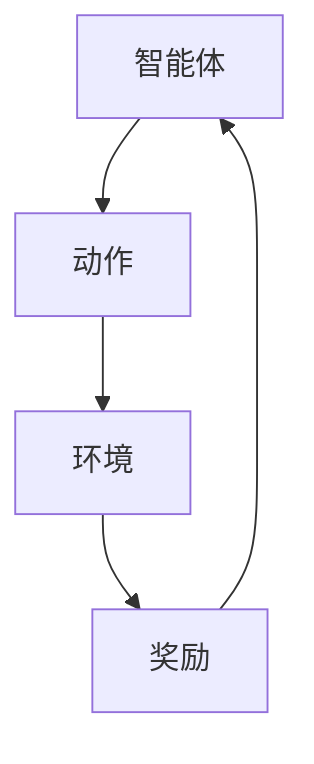
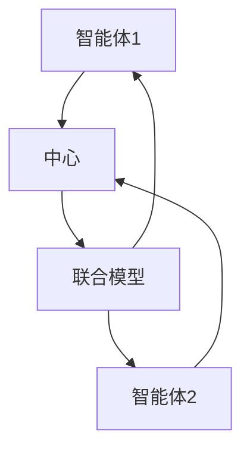
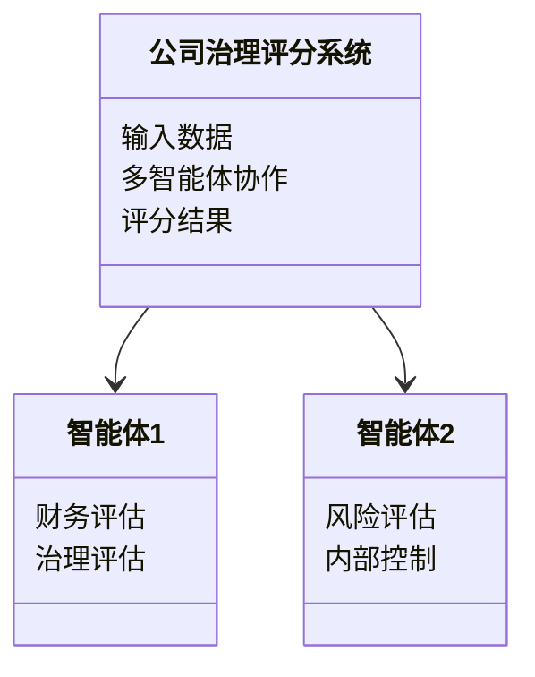
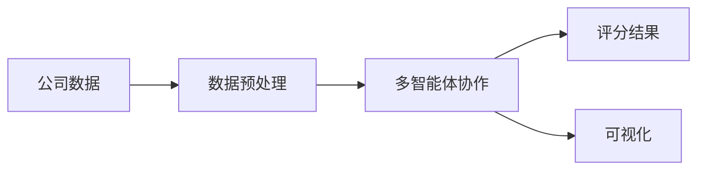
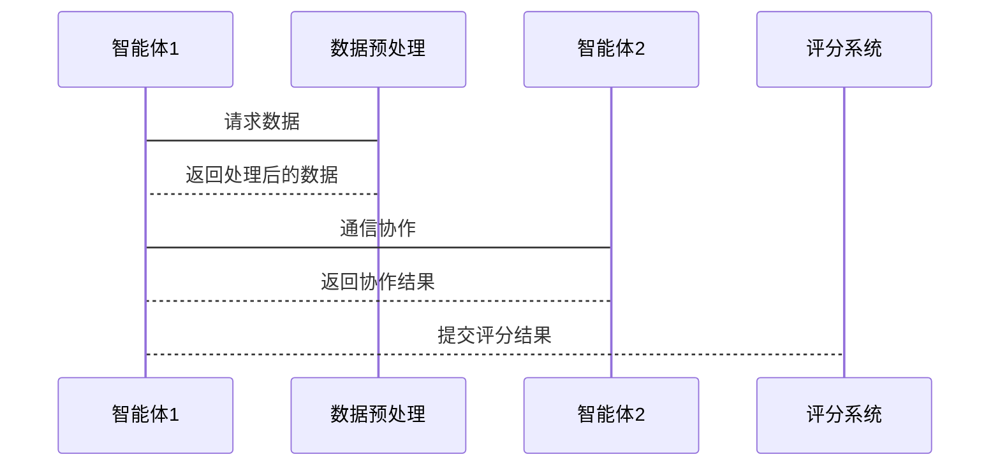

                 


# 智能化公司治理评分：多智能体AI在价值投资中的应用

> 关键词：公司治理评分，多智能体AI，价值投资，智能化，投资决策

> 摘要：本文深入探讨了如何利用多智能体人工智能技术优化公司治理评分体系，并将其应用于价值投资领域。通过系统性的分析和设计，展示了多智能体AI在公司治理评分中的优势，并结合实际案例分析，为投资决策提供了新的思路和方法。

---

## 第1章: 智能化公司治理评分的背景与问题

### 1.1 公司治理评分的现状与挑战

#### 1.1.1 传统公司治理评分的局限性
传统的公司治理评分主要依赖于财务指标和简单的统计分析，难以全面反映公司的运营状况和潜在风险。例如，ROE（净资产收益率）和ROA（资产回报率）等指标只能部分反映公司的盈利能力，而忽略了公司治理结构、管理层决策能力和风险管理能力等关键因素。

#### 1.1.2 价值投资中的公司治理需求
在价值投资中，投资者不仅关注公司的财务表现，还关注公司治理结构的合理性、管理层的稳定性和透明度等。传统的评分方法难以量化这些因素，导致评分结果缺乏深度和准确性。

#### 1.1.3 多智能体AI的引入与意义
通过引入多智能体AI技术，可以将公司治理评分分解为多个智能体的协作任务，每个智能体负责不同的评估维度，如财务表现、治理结构、风险管理等。这种分布式计算方式能够更全面、更精准地评估公司治理状况。

### 1.2 多智能体AI的基本概念

#### 1.2.1 多智能体系统定义
多智能体系统（Multi-Agent System, MAS）是由多个相互作用的智能体组成的系统，每个智能体都有自己的目标和决策机制，能够通过通信和协作完成复杂的任务。

#### 1.2.2 多智能体AI的核心特点
- **分布式智能**：每个智能体独立决策，避免单点故障。
- **协作性**：智能体之间通过通信协作，共同完成任务。
- **动态性**：能够适应环境变化，实时调整策略。

#### 1.2.3 多智能体AI与传统AI的区别
| 特性       | 多智能体AI                     | 传统AI                       |
|------------|-------------------------------|------------------------------|
| 决策中心化  | 去中心化，多个智能体协作       | 中心化决策，单个模型控制     |
| 通信方式    | 智能体之间可以通信             | 不需要通信，独立运行         |
| 任务复杂度  | 处理复杂任务，适合分布式问题   | 处理简单任务，适合单点问题   |

### 1.3 价值投资中的公司治理评分

#### 1.3.1 价值投资的基本原理
价值投资强调以低于内在价值的价格购买优质资产。公司治理评分是评估公司价值的重要组成部分，直接影响投资者的决策。

#### 1.3.2 公司治理评分在价值投资中的作用
- 提供全面的公司评估，帮助投资者识别潜在风险。
- 通过评分筛选出具有长期投资价值的公司。

#### 1.3.3 多智能体AI在价值投资中的应用前景
多智能体AI能够从多个维度全面评估公司治理，为投资者提供更精准的评分，从而提升投资决策的准确性。

---

## 第2章: 多智能体AI的核心原理与技术

### 2.1 多智能体系统的组成与结构

#### 2.1.1 多智能体系统的组成要素
- **智能体**：独立决策的单元，负责特定任务。
- **环境**：智能体所处的外部环境，提供输入和反馈。
- **通信机制**：智能体之间交换信息的方式。
- **协作机制**：智能体如何共同完成任务。

#### 2.1.2 多智能体系统的核心结构
- **任务分配**：智能体根据自身能力和环境信息分配任务。
- **协作与竞争**：智能体之间可以协作或竞争，以优化整体目标。

#### 2.1.3 多智能体系统与公司治理评分的关系
公司治理评分可以分解为多个子任务，每个子任务由一个智能体负责，通过协作完成整体评分。

### 2.2 多智能体AI的关键算法

#### 2.2.1 强化学习算法
强化学习是一种通过试错学习的方法，智能体通过与环境交互，获得奖励或惩罚，逐步优化决策策略。



#### 2.2.2 联合学习算法
联合学习通过多个智能体的协作，共同优化模型参数，提升整体性能。



#### 2.2.3 协作与竞争机制
协作机制通过共享信息和资源，提升整体性能；竞争机制通过竞争优化个体表现。

### 2.3 多智能体AI的实现技术

#### 2.3.1 分布式计算技术
分布式计算通过将任务分解到多个节点，提高计算效率。

#### 2.3.2 通信协议与信息交换
智能体之间通过特定协议交换信息，确保高效协作。

#### 2.3.3 状态空间与动作空间设计
状态空间定义智能体的感知，动作空间定义可能的决策。

---

## 第3章: 公司治理评分的智能化模型设计

### 3.1 公司治理评分的指标体系

#### 3.1.1 财务指标
- 营业收入增长率
- 净利润增长率
- 资产负债率

#### 3.1.2 治理结构指标
- 董事会独立性
- 高管稳定性
- 股权结构

#### 3.1.3 风险管理指标
- 风险敞口
- 内部控制有效性
- 灾难恢复能力

### 3.2 多智能体AI模型的设计与实现

#### 3.2.1 模型输入与输出设计
- 输入：公司财务数据、治理结构数据、风险数据。
- 输出：公司治理评分。

#### 3.2.2 智能体之间的协作机制
通过通信协议，智能体共享信息，优化评分结果。

#### 3.2.3 模型训练与优化
使用强化学习算法，通过不断试错，优化评分模型。

### 3.3 智能化评分系统的功能架构

#### 3.3.1 数据采集与处理
- 数据来源：公司财报、公开信息。
- 数据清洗：处理缺失值和异常值。

#### 3.3.2 模型训练与部署
- 训练数据：历史公司数据。
- 部署环境：云平台。

#### 3.3.3 评分结果输出与可视化
- 可视化工具：图表展示评分结果。

---

## 第4章: 系统分析与架构设计方案

### 4.1 问题场景介绍
公司治理评分需要从多个维度综合评估，传统方法难以满足要求。

### 4.2 项目介绍
开发一个多智能体AI系统，实现公司治理评分的智能化。

### 4.3 系统功能设计

#### 4.3.1 领域模型


### 4.4 系统架构设计

#### 4.4.1 系统架构图


### 4.5 系统接口设计
- 输入接口：公司数据。
- 输出接口：评分结果。

### 4.6 系统交互流程

#### 4.6.1 系统交互图


---

## 第5章: 项目实战

### 5.1 环境安装
安装Python、TensorFlow、Keras等依赖库。

### 5.2 核心代码实现

#### 5.2.1 数据预处理代码
```python
import pandas as pd
import numpy as np

def preprocess_data(data):
    # 处理缺失值
    data = data.dropna()
    # 标准化处理
    from sklearn.preprocessing import StandardScaler
    scaler = StandardScaler()
    scaled_data = scaler.fit_transform(data)
    return scaled_data
```

#### 5.2.2 多智能体协作代码
```python
class Agent:
    def __init__(self, state_space, action_space):
        self.state_space = state_space
        self.action_space = action_space
        # 初始化策略网络
        self.policy = ...
    
    def act(self, state):
        # 根据状态选择动作
        action = self.policy.act(state)
        return action
```

### 5.3 案例分析
以某公司为例，展示评分过程和结果。

### 5.4 项目小结
总结项目实现的关键点和经验。

---

## 第6章: 案例分析与最佳实践

### 6.1 案例分析
通过具体案例展示多智能体AI在公司治理评分中的应用效果。

### 6.2 最佳实践
- 定期更新模型
- 优化通信机制
- 提高数据质量

### 6.3 经验总结
多智能体AI能够显著提升公司治理评分的准确性和全面性。

---

## 第7章: 总结与展望

### 7.1 总结
多智能体AI在公司治理评分中的应用前景广阔，能够为价值投资提供有力支持。

### 7.2 展望
未来，随着AI技术的发展，公司治理评分将更加智能化和精准化。

---

通过以上章节的详细讲解，我们可以看到，多智能体AI在公司治理评分中的应用不仅能够提高评分的准确性，还能为投资者提供更有力的决策支持。希望本文能够为相关领域的研究和实践提供有价值的参考。

