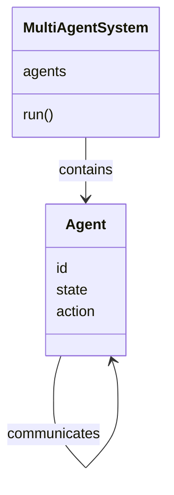

                 


# 智能化公司间比较分析：多智能体AI的价值投资应用

## 关键词：智能化公司比较分析，多智能体AI，价值投资，投资决策，AI协同价值

## 摘要：  
随着人工智能技术的快速发展，多智能体AI在价值投资领域的应用日益广泛。本文通过分析多智能体AI的核心原理、协同机制及其在公司比较分析中的应用，探讨其在价值投资中的潜在价值与实际应用。文章结合实际案例，详细阐述了多智能体AI在投资决策中的优势，并提出了构建智能化投资决策系统的实践方案。

---

## 第1章: 智能化公司间比较分析的背景与概念

### 1.1 问题背景与挑战

#### 1.1.1 传统公司比较分析的局限性
传统的公司比较分析主要依赖人工分析，存在以下问题：
- 数据处理能力有限，难以应对海量数据。
- 分析结果主观性较强，缺乏客观量化标准。
- 单维度分析难以全面捕捉公司价值。

#### 1.1.2 智能化分析的需求与趋势
随着大数据和人工智能技术的普及，智能化分析的需求日益迫切：
- 需要快速处理海量数据，提升分析效率。
- 需要多维度、多视角的分析能力，全面评估公司价值。
- 需要智能化决策支持，优化投资组合。

#### 1.1.3 多智能体AI的应用潜力
多智能体AI在公司比较分析中的应用潜力主要体现在：
- 多维度数据协同分析，提升分析精度。
- 多智能体协同决策，优化投资策略。
- 实时动态分析，捕捉市场机会。

### 1.2 多智能体AI的核心概念

#### 1.2.1 多智能体AI的定义与特点
多智能体AI是指由多个具有独立决策能力的智能体组成的系统，具有以下特点：
- **分布式智能**：每个智能体独立决策，协同完成复杂任务。
- **协同性**：智能体之间通过信息共享和协作，提升整体性能。
- **动态适应性**：能够根据环境变化自适应调整策略。

#### 1.2.2 多智能体AI与单智能体AI的对比
| 特性                | 单智能体AI          | 多智能体AI          |
|---------------------|--------------------|---------------------|
| 决策中心化          | 是                | 否                |
| 资源分配            | 单一资源          | 分布式资源          |
| 处理能力            | 有限              | 更强               |
| 适应复杂场景        | 较差              | 更好               |

#### 1.2.3 多智能体AI在价值投资中的应用场景
- **公司财务数据智能分析**：多智能体协同分析公司财务报表，识别潜在投资机会。
- **行业趋势预测**：通过多维度数据协同分析，预测行业发展趋势。
- **投资组合优化**：多智能体协同决策，优化投资组合配置。

### 1.3 价值投资的基本理论

#### 1.3.1 价值投资的定义与核心理念
价值投资是一种投资策略，旨在通过分析公司的基本面，寻找被市场低估的投资标的。其核心理念包括：
- **安全边际**：投资价格低于内在价值。
- **长期视角**：关注公司长期价值，而非短期波动。

#### 1.3.2 基本面分析的关键指标
基本面分析的关键指标包括：
- **市盈率（P/E）**：评估公司股价是否合理。
- **市净率（P/B）**：衡量股价与资产净值的比例。
- **ROE（净资产收益率）**：评估公司盈利能力。

#### 1.3.3 传统投资分析的局限性
传统投资分析的局限性主要体现在：
- 数据分析能力有限，难以处理海量数据。
- 分析结果主观性强，缺乏量化支持。
- 缺乏动态调整能力，难以应对市场变化。

### 1.4 本章小结
本章介绍了智能化公司比较分析的背景与概念，阐述了多智能体AI的核心概念及其在价值投资中的应用场景。通过对比单智能体AI和多智能体AI的特点，明确了多智能体AI在投资分析中的优势。

---

## 第2章: 多智能体AI的基本原理

### 2.1 多智能体系统的定义与组成

#### 2.1.1 多智能体系统的概念
多智能体系统（Multi-Agent System, MAS）是由多个智能体组成的分布式系统，每个智能体具有以下特征：
- **自主性**：能够自主决策。
- **反应性**：能够感知环境并做出反应。
- **协作性**：能够与其他智能体协同工作。

#### 2.1.2 多智能体系统的组成部分
多智能体系统的组成部分包括：
- **智能体**：独立决策的个体。
- **环境**：智能体所处的外部环境。
- **通信机制**：智能体之间的信息交互机制。
- **协调机制**：智能体协同工作的规则。

#### 2.1.3 多智能体系统与单智能体系统的对比
| 特性                | 单智能体系统        | 多智能体系统        |
|---------------------|--------------------|---------------------|
| 决策中心化          | 是                | 否                |
| 系统复杂度          | 较低              | 较高               |
| 处理能力            | 有限              | 更强               |
| 适应复杂场景        | 较差              | 更好               |

### 2.2 多智能体AI的工作原理

#### 2.2.1 多智能体AI的基本流程
多智能体AI的工作流程可以分为以下几个步骤：
1. **数据采集**：从多个来源获取数据。
2. **数据处理**：对数据进行清洗、转换和分析。
3. **协同分析**：多个智能体协同分析数据，得出结论。
4. **决策优化**：根据分析结果优化决策。

#### 2.2.2 多智能体AI的核心算法
多智能体AI的核心算法包括：
- **分布式强化学习（DRL）**：通过强化学习实现多智能体协同。
- **多智能体协同算法**：如基于通信的多智能体算法。

#### 2.2.3 多智能体AI的协同机制
多智能体AI的协同机制包括：
- **信息共享机制**：智能体之间共享信息。
- **任务分配机制**：根据任务特点分配智能体。
- **决策协调机制**：协调多个智能体的决策。

### 2.3 多智能体AI的协同价值

#### 2.3.1 协同优势的定义
协同优势是指多个智能体协同工作所带来的额外价值。

#### 2.3.2 协同价值的实现方式
协同价值的实现方式包括：
- **数据共享**：智能体之间共享数据，提升分析能力。
- **任务协同**：智能体协同完成复杂任务。
- **决策优化**：通过协同决策优化投资组合。

#### 2.3.3 协同价值在投资中的应用
协同价值在投资中的应用包括：
- **多维度分析**：从多个维度分析公司价值。
- **动态调整**：根据市场变化动态调整投资策略。
- **风险分散**：通过协同决策分散投资风险。

### 2.4 本章小结
本章详细介绍了多智能体AI的基本原理，包括多智能体系统的定义、组成、工作流程和核心算法。通过分析多智能体AI的协同机制，明确了其在投资中的协同价值。

---

## 第3章: 多智能体AI在价值投资中的应用

### 3.1 价值投资的基本理论

#### 3.1.1 价值投资的定义与核心理念
价值投资是一种长期投资策略，旨在通过分析公司的基本面，寻找被市场低估的投资标的。

#### 3.1.2 基本面分析的关键指标
基本面分析的关键指标包括：
- **市盈率（P/E）**：评估公司股价是否合理。
- **市净率（P/B）**：衡量股价与资产净值的比例。
- **ROE（净资产收益率）**：评估公司盈利能力。

#### 3.1.3 传统投资分析的局限性
传统投资分析的局限性主要体现在：
- 数据分析能力有限，难以处理海量数据。
- 分析结果主观性强，缺乏量化支持。
- 缺乏动态调整能力，难以应对市场变化。

### 3.2 多智能体AI在价值投资中的优势

#### 3.2.1 数据处理能力的提升
多智能体AI能够快速处理海量数据，提升分析效率。

#### 3.2.2 智能化决策的优势
多智能体AI能够根据数据自动优化决策，提升投资收益。

#### 3.2.3 多维度分析的能力
多智能体AI能够从多个维度分析公司价值，提升分析精度。

### 3.3 多智能体AI在投资决策中的具体应用

#### 3.3.1 公司财务数据的智能分析
多智能体AI能够协同分析公司财务数据，识别潜在投资机会。

#### 3.3.2 行业趋势的智能预测
多智能体AI能够协同分析行业趋势，预测市场变化。

#### 3.3.3 投资组合的智能优化
多智能体AI能够协同优化投资组合，分散投资风险。

### 3.4 本章小结
本章分析了多智能体AI在价值投资中的优势，包括数据处理能力的提升、智能化决策的优势和多维度分析的能力。通过具体应用案例，展示了多智能体AI在投资决策中的实际价值。

---

## 第4章: 多智能体AI的协同价值实现

### 4.1 多智能体协同的基本原理

#### 4.1.1 协同机制的定义
协同机制是指智能体之间协同工作的规则和流程。

#### 4.1.2 协同价值的实现方式
协同价值的实现方式包括：
- **信息共享机制**：智能体之间共享信息，提升分析能力。
- **任务分配机制**：根据任务特点分配智能体。
- **决策协调机制**：协调多个智能体的决策。

#### 4.1.3 协同价值的衡量标准
协同价值的衡量标准包括：
- **分析精度**：协同分析的准确性和全面性。
- **决策效率**：协同决策的速度和效果。
- **系统稳定性**：协同系统的稳定性和可靠性。

### 4.2 多智能体AI在投资中的协同应用

#### 4.2.1 多维度数据的协同分析
多智能体AI能够协同分析多维度数据，提升分析精度。

#### 4.2.2 投资决策的协同优化
多智能体AI能够协同优化投资决策，提升投资收益。

#### 4.2.3 风险分散的协同机制
多智能体AI能够协同分散投资风险，降低投资损失。

### 4.3 本章小结
本章分析了多智能体AI的协同价值实现方式，包括协同机制的定义、协同价值的实现方式和协同价值的衡量标准。通过具体应用案例，展示了多智能体AI在投资中的协同优势。

---

## 附录

### 附录A: 多智能体AI的核心算法实现

```python
class Agent:
    def __init__(self, id):
        self.id = id
        self.state = None
        self.action = None

    def receive_message(self, message):
        self.state = message
        self.decide_action()

    def decide_action(self):
        # 根据状态决定动作
        pass

class MultiAgentSystem:
    def __init__(self, agents):
        self.agents = agents

    def run(self):
        for agent in self.agents:
            message = agent.state
            # 传递消息到其他智能体
            for other_agent in self.agents:
                if other_agent.id != agent.id:
                    other_agent.receive_message(message)
```

### 附录B: 多智能体协同价值的数学模型

$$
\text{协同价值} = \sum_{i=1}^{n} v_i
$$

其中，$v_i$ 表示第 $i$ 个智能体的贡献价值。

### 附录C: 系统架构设计



---

## 本章小结
本章分析了多智能体AI的协同价值实现方式，包括协同机制的定义、协同价值的实现方式和协同价值的衡量标准。通过具体应用案例，展示了多智能体AI在投资中的协同优势。

