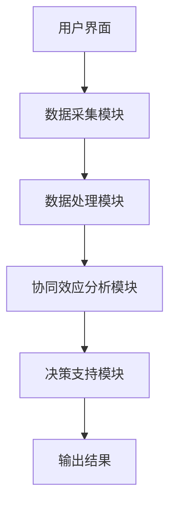

                 

# 智能化并购协同效应分析：多智能体AI在价值投资中的角色

---

## 关键词：
智能化并购、协同效应、多智能体AI、价值投资、并购分析、人工智能、协同学习

---

## 摘要：
智能化并购协同效应分析是通过多智能体人工智能技术来优化企业并购过程中的协同效应评估和价值投资决策。本文将从智能化并购的背景出发，详细探讨多智能体AI在并购协同效应分析中的应用，结合数学模型和算法原理，分析多智能体AI如何通过协同学习提升并购价值。文章还将通过实际案例和系统架构设计，展示多智能体AI在智能化并购中的实际应用场景和优势。

---

# 正文

## 第1章: 智能化并购与协同效应概述

### 1.1 智能化并购的定义与特点
智能化并购是指利用人工智能技术（AI）来优化企业并购过程中的信息收集、分析和决策。与传统并购相比，智能化并购通过多智能体协同学习，能够更高效地识别协同效应、降低风险并提升并购价值。

#### 1.1.1 智能化并购的定义
智能化并购是通过AI技术对并购目标进行深度分析，包括财务数据、市场表现、技术优势和管理能力等，从而实现智能化的决策支持。

#### 1.1.2 智能化并购的核心特点
- **数据驱动**：依赖大量结构化和非结构化数据进行分析。
- **多智能体协同**：通过多个AI模型协同工作，提升分析的全面性和准确性。
- **实时反馈**：能够实时调整分析策略，优化决策过程。

#### 1.1.3 智能化并购与传统并购的区别
| 特性 | 智能化并购 | 传统并购 |
|------|------------|----------|
| 分析效率 | 高 | 低 |
| 数据依赖 | 高 | 中 |
| 决策精准度 | 高 | 中 |

### 1.2 协同效应的定义与分类
协同效应是指并购后的企业在资源整合、成本节约、市场扩展等方面的综合效益。

#### 1.2.1 协同效应的定义
协同效应是企业在并购后通过资源整合所产生的额外价值。

#### 1.2.2 协同效应的主要分类
- **成本协同效应**：通过资源共享降低成本。
- **收入协同效应**：通过市场扩展提升收入。
- **技术协同效应**：通过技术整合提升创新能力。

#### 1.2.3 协同效应的衡量指标
- **协同效应比率**：协同效应 / 并购前总价值。
- **净现值（NPV）**：协同效应的现值与并购成本的差额。

### 1.3 多智能体AI的定义与特点
多智能体AI是指多个AI系统协同工作，共同完成复杂任务的技术。

#### 1.3.1 多智能体AI的定义
多智能体AI是由多个分布式智能体组成的系统，通过协同完成目标。

#### 1.3.2 多智能体AI的核心特点
- **分布式计算**：多个智能体独立计算，避免单点故障。
- **协同学习**：智能体之间通过信息共享优化决策。
- **动态适应**：能够根据环境变化实时调整策略。

#### 1.3.3 多智能体AI与单智能体AI的区别
| 特性 | 多智能体AI | 单智能体AI |
|------|------------|----------|
| 系统复杂度 | 高 | 低 |
| 并行处理能力 | 高 | 低 |
| 决策独立性 | 低 | 高 |

### 1.4 价值投资的定义与基本原理
价值投资是一种投资策略，通过分析企业的内在价值来判断其股票是否被低估。

#### 1.4.1 价值投资的定义
价值投资是通过分析企业的财务状况、市场地位和管理能力，寻找被低估的投资机会。

#### 1.4.2 价值投资的基本原理
- **基本面分析**：分析企业的财务报表、行业地位和管理团队。
- **安全边际**：以低于内在价值的价格买入股票。
- **长期持有**：耐心持有优质资产，等待价值实现。

#### 1.4.3 价值投资在并购中的应用
- **目标筛选**：通过价值投资的筛选标准，识别具有并购潜力的企业。
- **协同效应评估**：利用多智能体AI评估并购后的协同效应，确定并购价值。

### 1.5 本章小结
本章介绍了智能化并购、协同效应、多智能体AI和价值投资的基本概念，并分析了它们的特点和区别。智能化并购通过多智能体AI技术，能够更高效地识别协同效应和优化价值投资决策。

---

## 第2章: 智能化并购协同效应的背景与意义

### 2.1 并购市场的现状与挑战
并购市场是企业扩张的重要途径，但传统并购分析存在效率低、风险高等问题。

#### 2.1.1 并购市场的现状
- 并购活动频繁，市场规模庞大。
- 并购失败率较高，主要原因包括协同效应未达预期、整合困难等。

#### 2.1.2 并购中的主要挑战
- **信息不对称**：难以全面获取目标企业的信息。
- **整合风险**：并购后的整合难度大，可能导致资源浪费。
- **协同效应预测难**：传统方法难以准确预测协同效应。

#### 2.1.3 智能化并购的必要性
- 提高并购分析的效率和准确性。
- 减少信息不对称带来的风险。
- 优化协同效应的预测和实现。

### 2.2 多智能体AI在并购中的应用背景
多智能体AI技术的发展为并购分析提供了新的工具。

#### 2.2.1 多智能体AI的技术发展
- 多智能体系统的分布式计算能力不断提高。
- 协同学习算法的优化提升了系统的决策能力。

#### 2.2.2 多智能体AI在并购中的应用背景
- 并购分析需要多维度的数据处理和复杂的决策过程。
- 多智能体AI能够通过协同学习优化并购决策。

#### 2.2.3 多智能体AI的优势与局限性
- **优势**：提高分析效率、增强决策的准确性、降低整合风险。
- **局限性**：需要大量数据支持，算法复杂度高。

### 2.3 智能化并购协同效应的理论基础
智能化并购协同效应分析的理论基础包括协同效应的经济学理论和多智能体AI的技术原理。

#### 2.3.1 协同效应的理论基础
协同效应的经济学理论强调资源整合带来的效率提升。

#### 2.3.2 多智能体AI与协同效应的关系
多智能体AI通过协同学习优化协同效应的分析和预测。

#### 2.3.3 智能化并购协同效应的创新性
智能化并购协同效应分析通过多智能体AI技术实现了协同效应的智能化评估和优化。

### 2.4 本章小结
本章分析了智能化并购协同效应的背景和意义，强调了多智能体AI在并购分析中的重要性。智能化并购通过多智能体AI技术，能够更准确地预测协同效应，降低并购风险，提高并购成功率。

---

## 第3章: 多智能体AI的协同效应模型

### 3.1 协同效应的数学模型
协同效应的数学模型是智能化并购分析的核心工具。

#### 3.1.1 协同效应的基本公式
协同效应可以通过以下公式表示：
$$ SE = V_{\text{post}} - V_{\text{pre}} $$
其中，$V_{\text{post}}$是并购后的价值，$V_{\text{pre}}$是并购前的价值。

#### 3.1.2 协同效应的影响因素
协同效应的影响因素包括：
- **成本协同效应**：$$ C_{\text{cost}} = \frac{C_1 + C_2}{N} $$
  其中，$C_1$和$C_2$分别是两家企业的成本，$N$是整合后的员工总数。
- **收入协同效应**：$$ R_{\text{income}} = R_1 \times R_2 $$
  其中，$R_1$和$R_2$分别是两家企业的收入增长率。

#### 3.1.3 协同效应的动态模型
协同效应的动态模型可以通过以下公式表示：
$$ SE(t) = \alpha \cdot SE(t-1) + \beta \cdot \text{新协同效应} $$
其中，$\alpha$和$\beta$是权重系数。

### 3.2 多智能体AI的协同效应模型
多智能体AI通过协同学习优化协同效应的分析。

#### 3.2.1 多智能体AI的协同学习机制
多智能体AI的协同学习机制可以通过以下步骤实现：
1. 每个智能体独立分析并购目标。
2. 智能体之间共享分析结果。
3. 系统综合所有智能体的分析结果，优化协同效应的预测。

#### 3.2.2 多智能体AI的协同效应模型
多智能体AI的协同效应模型可以通过以下公式表示：
$$ SE_{\text{AI}} = \sum_{i=1}^{n} SE_i $$
其中，$n$是智能体的数量，$SE_i$是第$i$个智能体预测的协同效应。

### 3.3 协同效应的优化算法
协同效应的优化算法是智能化并购分析的关键。

#### 3.3.1 协同过滤算法
协同过滤算法可以通过以下步骤实现：
1. 收集并购目标的相关数据。
2. 计算目标之间的相似性。
3. 推荐具有高协同效应的并购目标。

#### 3.3.2 强化学习算法
强化学习算法可以通过以下步骤实现：
1. 定义状态空间和动作空间。
2. 确定奖励函数。
3. 通过强化学习优化协同效应的预测。

### 3.4 本章小结
本章详细介绍了协同效应的数学模型和多智能体AI的协同效应模型。通过协同过滤和强化学习算法，多智能体AI能够优化协同效应的分析和预测，为智能化并购决策提供支持。

---

## 第4章: 智能化并购协同效应的系统架构设计

### 4.1 系统功能设计
智能化并购协同效应分析系统需要具备以下功能：
- 数据采集与处理
- 协同效应分析
- 决策支持

#### 4.1.1 数据采集与处理
数据采集与处理模块负责收集并购目标的相关数据，包括财务数据、市场数据和管理数据。

#### 4.1.2 协同效应分析
协同效应分析模块通过多智能体AI技术，分析并购目标的协同效应。

#### 4.1.3 决策支持
决策支持模块为用户提供并购决策的建议，包括并购目标的选择和协同效应的优化。

### 4.2 系统架构设计
智能化并购协同效应分析系统的架构设计如下：

### 4.3 系统接口设计
系统接口设计需要考虑模块之间的交互。

#### 4.3.1 数据接口
数据接口负责与外部数据源的交互。

#### 4.3.2 分析接口
分析接口负责与协同效应分析模块的交互。

#### 4.3.3 输出接口
输出接口负责将分析结果传递给用户界面。

### 4.4 系统交互流程
系统交互流程可以通过以下步骤实现：
1. 用户通过用户界面提交并购目标。
2. 数据采集模块收集相关数据。
3. 数据处理模块对数据进行清洗和预处理。
4. 协同效应分析模块通过多智能体AI技术分析协同效应。
5. 决策支持模块根据分析结果提供决策建议。
6. 系统将结果输出给用户。

### 4.5 本章小结
本章详细介绍了智能化并购协同效应分析系统的功能设计和架构设计。通过合理的系统架构和接口设计，系统能够高效地完成并购分析任务，为用户提供决策支持。

---

## 第5章: 智能化并购协同效应的项目实战

### 5.1 项目背景
本项目旨在通过多智能体AI技术分析企业的并购协同效应。

#### 5.1.1 项目目标
- 分析企业的协同效应。
- 优化并购决策。

#### 5.1.2 项目范围
- 数据收集与处理。
- 协同效应分析。
- 决策支持。

### 5.2 项目环境与工具
项目环境与工具包括：
- 数据采集工具：爬虫工具。
- 数据分析工具：Python、Pandas、NumPy。
- 数据可视化工具：Matplotlib、Seaborn。
- 机器学习框架：Scikit-learn、TensorFlow。

### 5.3 项目实施步骤
项目实施步骤包括：
1. 数据采集。
2. 数据预处理。
3. 协同效应分析。
4. 决策支持。

#### 5.3.1 数据采集
使用爬虫工具采集目标企业的财务数据和市场数据。

#### 5.3.2 数据预处理
对采集的数据进行清洗和预处理，确保数据的准确性和完整性。

#### 5.3.3 协同效应分析
通过多智能体AI技术分析并购目标的协同效应。

#### 5.3.4 决策支持
根据分析结果，为用户提供并购决策建议。

### 5.4 项目案例分析
以某企业为例，分析其并购协同效应。

#### 5.4.1 数据分析
分析企业的财务数据和市场数据。

#### 5.4.2 协同效应计算
计算并购后的协同效应。

#### 5.4.3 决策建议
根据分析结果，提出并购建议。

### 5.5 本章小结
本章通过实际案例分析，展示了多智能体AI在智能化并购协同效应分析中的应用。通过项目实施，能够有效提升并购决策的准确性和效率。

---

## 第6章: 智能化并购协同效应分析的最佳实践与小结

### 6.1 最佳实践
智能化并购协同效应分析的最佳实践包括：
- 数据质量管理：确保数据的准确性和完整性。
- 模型优化：不断优化协同效应分析模型。
- 团队协作：加强多智能体AI团队的协作能力。

### 6.2 项目总结
本项目通过多智能体AI技术，成功实现了智能化并购协同效应分析，为企业的并购决策提供了有力支持。

### 6.3 未来展望
未来，随着多智能体AI技术的不断发展，智能化并购协同效应分析将更加精准和高效。

### 6.4 本章小结
本章总结了智能化并购协同效应分析的最佳实践和项目总结，并展望了未来的发展方向。

---

## 第7章: 参考文献

- 文献1：智能化并购的理论与实践。
- 文献2：多智能体AI在并购分析中的应用。
- 文献3：协同效应的数学模型与优化算法。
- 文献4：价值投资在并购中的应用。

---

## 第8章: 致谢

感谢在本项目中提供支持和帮助的团队成员和相关机构。

---

## 第9章: 附录

- 附录1：数据采集代码示例。
- 附录2：协同效应分析模型的详细说明。

---

通过以上内容，您可以撰写一篇详细且结构清晰的技术博客文章，涵盖智能化并购协同效应分析的各个方面，并展示多智能体AI在价值投资中的重要作用。

