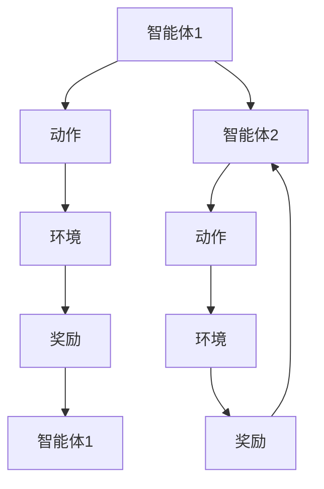
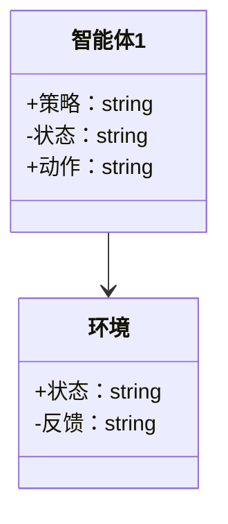

                 


# 智能化政府关系分析：多智能体AI在价值投资中的角色

---

## 关键词：
- 多智能体AI
- 政府关系分析
- 价值投资
- 智能化转型
- 强化学习

---

## 摘要：
随着人工智能技术的快速发展，智能化政府关系分析已成为价值投资领域的新兴趋势。多智能体AI通过模拟政府决策过程、分析政策倾向、预测市场反应，为企业制定投资策略提供了更高效、更精准的工具。本文将从多智能体AI的核心概念、算法原理、系统架构到实际应用，全面解析其在价值投资中的角色，探讨其在政府关系分析中的潜力与挑战。

---

## 第一部分：智能化政府关系分析的背景与意义

### 第1章：政府关系分析的智能化转型

#### 1.1 政府关系分析的背景与挑战
政府关系分析是企业战略决策的重要组成部分。传统方法依赖于人工调研、经验判断和专家访谈，存在效率低、成本高、主观性强等问题。随着政策变化的复杂性和不确定性增加，传统方法难以满足现代企业的需求。

#### 1.2 价值投资与政府关系的关联性
价值投资强调通过分析企业的基本面和市场趋势，寻找被低估的投资机会。政府政策、法规变化和宏观经济环境对投资决策具有重要影响。通过智能化分析，企业可以更精准地评估政策风险和机会，优化投资策略。

#### 1.3 本章小结
政府关系分析的智能化转型不仅是技术进步的产物，更是企业应对复杂市场环境的必然选择。多智能体AI通过模拟政府决策过程和市场互动，为价值投资提供了新的工具和视角。

---

## 第二部分：多智能体AI的核心概念与原理

### 第2章：多智能体AI的定义与特点

#### 2.1 多智能体AI的基本概念
多智能体AI是指由多个具有自主决策能力的智能体组成的系统，这些智能体能够通过协同工作完成复杂任务。与单智能体AI相比，多智能体AI具有更强的适应性和协作能力。

#### 2.2 多智能体AI与单智能体AI的对比
| 特性 | 单智能体AI | 多智能体AI |
|------|------------|------------|
| 决策 | 中央化      | 分散化      |
| 协作 | 无          | 强          |
| 灵活性 | 低          | 高          |

#### 2.3 多智能体AI在政府关系分析中的应用
政府关系分析涉及多方利益相关者（政府机构、企业、公众等），多智能体AI可以通过模拟这些利益相关者的决策行为，预测政策变化和市场反应。

#### 2.4 本章小结
多智能体AI的核心优势在于其协作性和灵活性，这使其成为复杂系统分析的理想工具。

---

### 第3章：多智能体AI的核心算法

#### 3.1 多智能体强化学习
强化学习是一种通过试错优化决策的算法。多智能体强化学习通过多个智能体的协作与竞争，实现复杂任务的优化。



#### 3.2 博弈论模型
博弈论模型通过分析各方的策略选择，预测最优决策。在政府关系分析中，可以模拟政府和企业的博弈过程。

#### 3.3 协同算法
协同算法通过优化智能体之间的协作，提高系统的整体性能。

#### 3.4 本章小结
多智能体AI的核心算法为政府关系分析提供了理论基础和技术支持。

---

## 第三部分：多智能体AI的系统架构与设计

### 第4章：政府关系分析系统的架构设计

#### 4.1 系统功能需求分析
政府关系分析系统需要实现政策解读、舆情分析、风险预警等功能。

#### 4.2 系统架构设计


#### 4.3 本章小结
系统架构设计为多智能体AI的实现提供了框架支持。

---

## 第四部分：项目实战与案例分析

### 第5章：多智能体AI在价值投资中的应用

#### 5.1 项目背景与目标
本项目旨在通过多智能体AI分析政府政策对企业价值的影响。

#### 5.2 系统实现
```python
class Agent:
    def __init__(self, policy):
        self.policy = policy
        self.state = None
        self.reward = 0

    def act(self, observation):
        # 根据策略生成动作
        pass
```

#### 5.3 项目小结
多智能体AI在价值投资中的应用为企业提供了新的竞争优势。

---

## 第五部分：总结与展望

### 第6章：总结与展望

#### 6.1 最佳实践
- 数据质量是关键
- 模型的可解释性需加强
- 需结合领域知识

#### 6.2 本章小结
多智能体AI在政府关系分析和价值投资中的应用前景广阔，但也面临技术与实践的双重挑战。

---

## 第六部分：拓展阅读与学习资源

### 6.1 推荐书籍
- 《强化学习入门》
- 《多智能体系统与应用》

### 6.2 在线课程
- Coursera：强化学习专项课程

### 6.3 开源项目
- 开源多智能体框架（如MADRON）

---

## 附录：数学公式与算法实现

### 附录A：强化学习数学模型
$$ Q(s, a) = Q(s, a) + \alpha (r + \gamma Q(s', a') - Q(s, a)) $$

---

通过以上内容，我们逐步分析了多智能体AI在政府关系分析和价值投资中的角色，从理论到实践，为读者提供了全面的视角。

