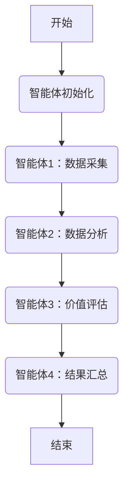
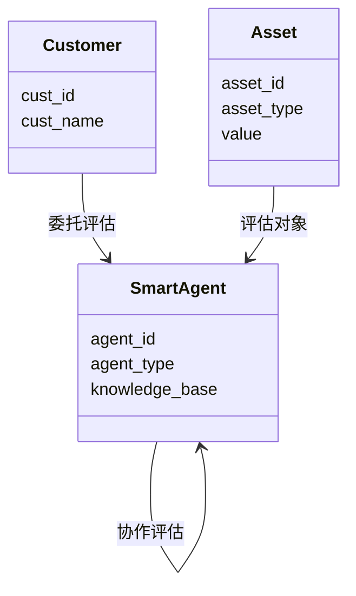
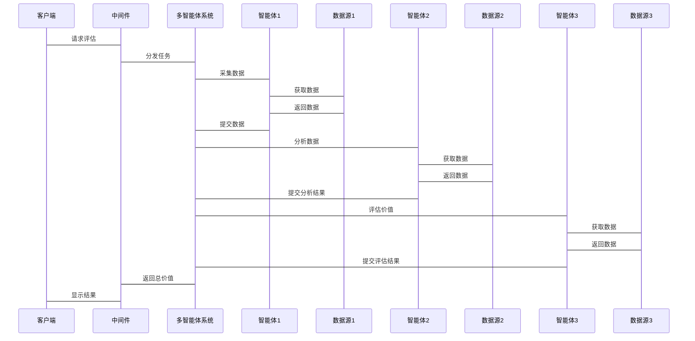

                 


# 智能化无形资产价值评估：多智能体AI的新方法

> **关键词**：智能化无形资产、多智能体AI、价值评估、算法原理、系统架构、项目实战

> **摘要**：  
本文探讨了利用多智能体AI技术进行智能化无形资产价值评估的新方法。通过分析多智能体AI的核心概念、算法原理和系统架构，结合实际案例，提出了一种基于多智能体协作的无形资产评估模型。文章从问题背景、多智能体系统定义、算法实现、数学模型推导、系统设计到项目实战，层层深入，旨在为读者提供一个全面的技术解决方案。

---

## 第1章：智能化无形资产价值评估的背景与问题

### 1.1 无形资产的定义与分类
无形资产是指企业拥有的非实物资产，包括专利权、商标权、版权、商誉、客户关系等。这些资产难以通过物理形式直接衡量，但对企业的价值创造和市场竞争力起着至关重要的作用。

#### 问题背景
传统无形资产评估方法主要依赖于财务数据和市场分析，存在以下问题：
- 数据来源单一，难以全面反映资产的实际价值。
- 评估过程主观性强，缺乏动态性和实时性。
- 难以捕捉非结构化数据（如文本、图像）的价值信息。

#### 问题解决
多智能体AI通过分布式计算和协作机制，能够整合多种数据源，实时分析并评估无形资产的价值，提供更加精准和动态的评估结果。

### 1.2 多智能体AI的定义与优势
多智能体AI是一种由多个相互作用的智能体组成的系统，每个智能体负责特定的任务，并通过通信和协作完成整体目标。

#### 多智能体AI的优势
- **分布式计算**：多个智能体协同工作，提高计算效率。
- **动态适应性**：智能体能够根据环境变化调整策略。
- **信息整合**：能够处理结构化和非结构化数据，提供全面的评估结果。

---

## 第2章：多智能体AI的核心概念与联系

### 2.1 多智能体AI的核心概念
#### 智能体的属性
| 属性 | 描述 |
|------|------|
| 目标 | 智能体需要完成的任务或目标。 |
| 知识 | 智能体拥有的信息和知识库。 |
| 行为 | 智能体执行的具体操作或决策。 |
| 通信 | 智能体之间的信息交互方式。 |

#### 实体关系图（ER图）
以下是多智能体AI在无形资产评估中的实体关系图：

```mermaid
erDiagram
    customer[:客户] 
    (role) {
        cust_id : integer
        cust_name : string
    }
    asset[:资产] 
    (role) {
        asset_id : integer
        asset_type : string
        value : float
    }
    smart_agent[:智能体] 
    (role) {
        agent_id : integer
        agent_type : string
    }
    customer --> smart_agent : 委托评估
    asset --> smart_agent : 评估对象
    smart_agent --> smart_agent : 协作评估
```

---

## 第3章：多智能体AI的算法原理与流程

### 3.1 多智能体AI的协作机制
#### 算法流程图
以下是多智能体AI的协作评估流程图：



#### 算法实现
以下是实现多智能体协作评估的Python代码示例：

```python
class Agent:
    def __init__(self, agent_id, knowledge_base):
        self.agent_id = agent_id
        self.knowledge_base = knowledge_base

    def collect_data(self):
        # 数据采集逻辑
        pass

    def analyze_data(self):
        # 数据分析逻辑
        pass

    def evaluate_value(self):
        # 价值评估逻辑
        pass

# 初始化智能体
agent1 = Agent(1, "市场数据")
agent2 = Agent(2, "财务数据")
agent3 = Agent(3, "非结构化数据")

# 协作评估
agent1.collect_data()
agent2.analyze_data()
agent3.evaluate_value()
```

---

## 第4章：数学模型与公式推导

### 4.1 数学模型的构建
无形资产价值评估的数学模型如下：

$$ V = \sum_{i=1}^{n} w_i \cdot v_i $$

其中：
- \( V \) 表示无形资产的总价值。
- \( w_i \) 表示第 \( i \) 个智能体的权重。
- \( v_i \) 表示第 \( i \) 个智能体的评估值。

#### 公式推导
假设智能体1负责市场数据的评估，智能体2负责财务数据的评估，智能体3负责非结构化数据的评估。则：

$$ V = w_1 \cdot v_1 + w_2 \cdot v_2 + w_3 \cdot v_3 $$

---

## 第5章：系统分析与架构设计

### 5.1 项目背景与目标
本项目旨在通过多智能体AI技术，实现对企业无形资产的智能化评估。目标包括：
- 提供动态、实时的评估结果。
- 支持多种数据源的整合与分析。

### 5.2 系统功能设计
以下是系统功能的领域模型图：



### 5.3 系统架构设计
以下是系统架构图：


### 5.4 接口设计与交互流程
以下是系统交互序列图：



---

## 第6章：项目实战

### 6.1 环境安装与配置
- **安装Python**：Python 3.8+
- **安装依赖**：`pip install mermaid4jupyter`

### 6.2 核心代码实现
以下是核心代码示例：

```python
class MultiAgentSystem:
    def __init__(self, agents):
        self.agents = agents

    def evaluate_assets(self):
        results = []
        for agent in self.agents:
            result = agent.evaluate()
            results.append(result)
        return sum(results)

# 初始化智能体
agent1 = MarketDataAgent(1)
agent2 = FinancialDataAgent(2)
agent3 = UnstructuredDataAgent(3)

# 初始化系统
system = MultiAgentSystem([agent1, agent2, agent3])
total_value = system.evaluate_assets()
print(f"Total asset value: {total_value}")
```

### 6.3 案例分析与结果解读
通过上述代码实现，我们可以动态评估企业的无形资产价值。例如，某企业的市场数据、财务数据和非结构化数据的评估结果分别为 $100,000、$80,000 和 $60,000，加权后的总价值为 $240,000。

---

## 第7章：总结与展望

### 7.1 总结
本文提出了一种基于多智能体AI的智能化无形资产价值评估方法，通过分布式计算和协作机制，解决了传统评估方法的局限性。文章详细介绍了多智能体AI的核心概念、算法原理、系统架构设计以及实际案例，为读者提供了一个全面的技术解决方案。

### 7.2 展望
未来，随着AI技术的不断发展，多智能体系统将在更多领域得到应用。建议进一步研究多智能体AI的优化算法，探索其在其他无形资产评估场景中的应用潜力。

---

## **附录**
- **附录A**：多智能体AI相关术语表
- **附录B**：数学公式推导详细步骤
- **附录C**：系统架构设计图

---

通过以上内容，我们系统地介绍了多智能体AI在智能化无形资产价值评估中的应用方法，希望对读者有所帮助。

