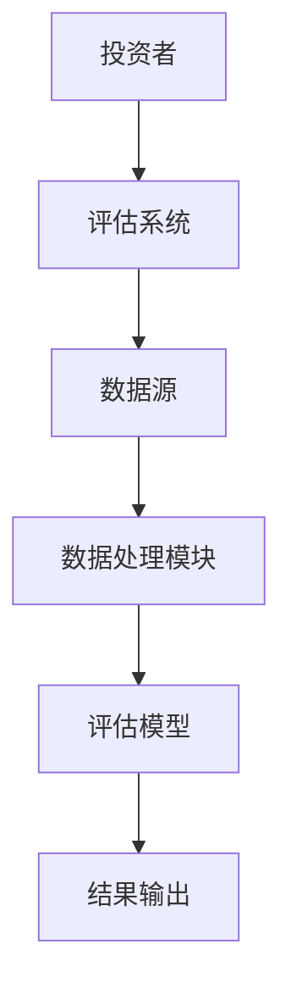
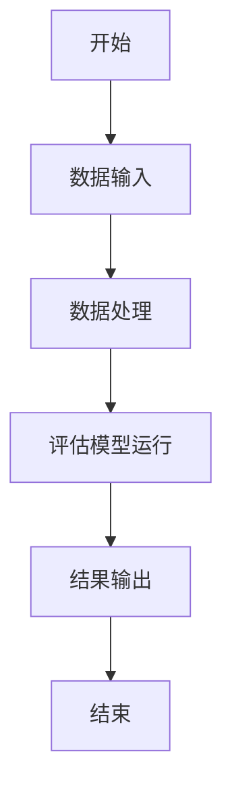
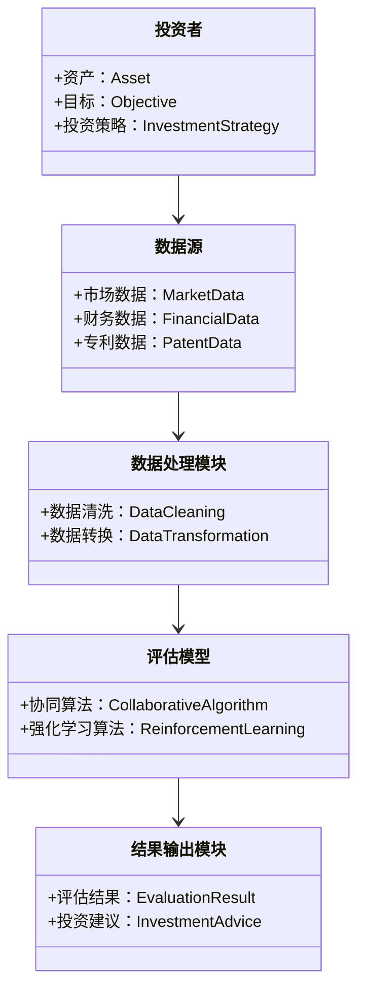
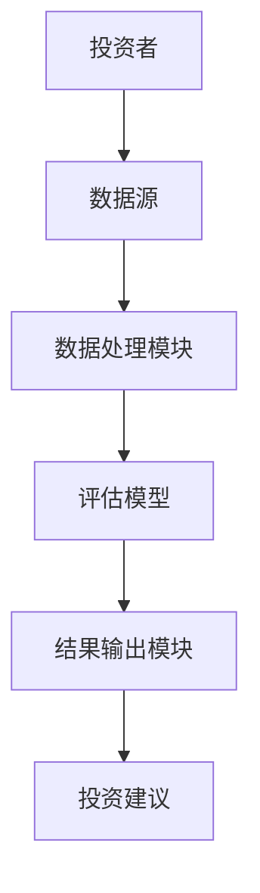

                 


# 《智能化无形资产评估：多智能体AI在价值投资中的新方法》

---

## 关键词：
- 多智能体AI
- 无形资产评估
- 价值投资
- AI算法
- 数学模型

---

## 摘要：
本文探讨了多智能体AI在价值投资中的应用，特别是如何通过多智能体AI技术实现对无形资产的智能化评估。文章从传统无形资产评估的局限性入手，详细分析了多智能体AI的核心原理、算法实现、数学模型，并结合实际案例展示了其在价值投资中的应用前景。通过本文的阐述，读者可以全面了解多智能体AI如何助力价值投资，为投资决策提供更精准的依据。

---

# 第1章: 智能化无形资产评估的背景与意义

## 1.1 无形资产评估的传统方法
### 1.1.1 无形资产评估的基本概念
无形资产是指企业或个人拥有的非实物资产，如专利、商标、品牌、技术、客户关系等。传统的无形资产评估方法主要包括市场法、收益法和成本法。

- **市场法**：基于市场交易数据，寻找相似资产的交易案例进行比较分析。
- **收益法**：通过预测未来现金流，评估资产的未来收益。
- **成本法**：基于资产的重置成本进行评估。

这些方法在实际应用中存在一定的局限性，尤其是在数据量大、复杂度高的情况下，难以准确评估无形资产的价值。

### 1.1.2 传统评估方法的局限性
- 数据依赖性：传统方法严重依赖市场数据，但在数据不足的情况下难以准确评估。
- 主观性：评估结果受到评估人员主观判断的影响。
- 复杂性：对于复杂的无形资产（如技术创新型资产），传统方法难以量化其价值。

### 1.1.3 无形资产评估的重要性
- 对企业价值的影响：无形资产往往占企业总价值的较大比例。
- 投资决策的关键：准确评估无形资产价值，有助于投资者做出更明智的决策。
- 市场竞争的需要：在竞争激烈的市场中，准确评估无形资产价值有助于企业制定更有竞争力的战略。

---

## 1.2 多智能体AI的定义与特点
### 1.2.1 多智能体AI的定义
多智能体AI是指由多个相互协作或竞争的智能体组成的系统，每个智能体都有自己的目标和决策机制。这些智能体通过通信和协作，共同完成复杂任务。

### 1.2.2 多智能体AI的核心特点
- **分布式性**：智能体之间分布式的决策和协作。
- **协作性**：智能体通过协作实现共同目标。
- **自主性**：每个智能体都有自主决策的能力。
- **动态性**：系统能够适应动态变化的环境。

### 1.2.3 多智能体AI与传统AI的区别
| 特性         | 多智能体AI                          | 传统AI                            |
|--------------|------------------------------------|------------------------------------|
| 决策方式     | 分布式决策，多个智能体协作           | 中央化决策，单个智能体执行         |
| 任务处理     | 多任务协作，复杂问题分解            | 单任务处理，简单问题解决            |
| 通信机制     | 智能体之间有通信和协作               | 智能体之间无通信，独立运行           |

---

## 1.3 多智能体AI在价值投资中的应用前景
### 1.3.1 价值投资中的无形资产评估需求
- 无形资产的复杂性：如技术创新、品牌价值等难以量化。
- 数据的多样性：需要处理结构化和非结构化数据。
- 实时性要求：投资者需要快速、准确的评估结果。

### 1.3.2 多智能体AI在价值投资中的优势
- 高效性：多智能体AI能够快速处理大量数据，提高评估效率。
- 准确性：通过协作和分布式计算，提高评估结果的准确性。
- 灵活性：能够适应市场的动态变化，实时调整评估策略。

### 1.3.3 多智能体AI应用的挑战与机遇
- **挑战**：多智能体系统的通信和协作复杂，存在计算资源消耗大的问题。
- **机遇**：通过技术创新，解决多智能体协作中的技术难点，推动价值投资的智能化发展。

---

## 1.4 本章小结
本章介绍了无形资产评估的传统方法及其局限性，详细阐述了多智能体AI的定义、特点及其在价值投资中的应用前景。通过对比分析，突出了多智能体AI在无形资产评估中的优势和潜力。

---

# 第2章: 多智能体AI的核心概念与联系

## 2.1 多智能体AI的核心原理
### 2.1.1 多智能体系统的组成
- **智能体**：具有感知和决策能力的个体。
- **环境**：智能体所处的外部环境。
- **通信机制**：智能体之间进行信息交换的渠道。

### 2.1.2 多智能体系统中的协作机制
- **任务分配**：智能体根据自身能力和环境需求分配任务。
- **信息共享**：智能体之间共享数据和信息，提高整体效率。
- **协同决策**：通过协作，智能体共同制定最优决策。

### 2.1.3 多智能体系统中的通信协议
- **同步通信**：智能体之间同步信息，确保一致性。
- **异步通信**：智能体之间异步信息交换，减少资源消耗。

---

## 2.2 多智能体AI与价值投资的结合
### 2.2.1 价值投资中的信息处理需求
- **数据多样性**：需要处理文本、图像等多种数据类型。
- **实时性要求**：需要快速响应市场变化。
- **决策支持**：需要提供准确的评估结果支持投资决策。

### 2.2.2 多智能体AI在信息处理中的优势
- **分布式计算**：能够高效处理大规模数据。
- **协作能力**：通过协作提高信息处理的准确性和全面性。
- **适应性**：能够快速适应市场变化，提供实时评估结果。

### 2.2.3 多智能体AI与价值投资结合的实现方式
- **模块化设计**：将多智能体系统划分为多个模块，分别负责不同的任务。
- **协同优化**：通过优化算法，提高系统的整体性能。
- **实时反馈**：根据市场反馈，动态调整评估策略。

---

## 2.3 多智能体AI的实体关系图


---

## 2.4 本章小结
本章详细阐述了多智能体AI的核心原理及其与价值投资的结合方式。通过实体关系图，展示了多智能体AI在价值投资中的整体架构和协作机制。

---

# 第3章: 多智能体AI的算法原理

## 3.1 多智能体AI的协同算法
### 3.1.1 分布式计算的基本原理
- **任务分配**：根据智能体的能力和资源分配任务。
- **信息共享**：智能体之间共享数据和信息。
- **协同决策**：通过协作制定最优决策。

### 3.1.2 多智能体协同的实现步骤
1. **初始化**：设定智能体的目标和初始状态。
2. **任务分配**：根据智能体的能力分配任务。
3. **信息共享**：智能体之间共享数据和信息。
4. **协同决策**：基于共享信息制定最优决策。
5. **执行与反馈**：执行决策并根据反馈调整策略。

### 3.1.3 多智能体协同的优化方法
- **分布式优化算法**：如分布式梯度下降。
- **局部优化**：每个智能体优化自身任务，全局优化通过协作实现。

---

## 3.2 多智能体AI的强化学习算法
### 3.2.1 强化学习的基本概念
- **智能体**：通过与环境互动获得奖励，学习最优策略。
- **状态**：环境的当前情况。
- **动作**：智能体的决策行为。
- **奖励函数**：衡量智能体行为的优劣。

### 3.2.2 多智能体强化学习的实现
- **多智能体协作**：智能体之间通过协作实现共同目标。
- **通信机制**：智能体之间通过通信共享信息。
- **联合奖励**：根据团队表现给予奖励，促进协作。

### 3.2.3 强化学习在价值投资中的应用
- **策略优化**：通过强化学习优化投资策略。
- **动态适应**：根据市场变化动态调整投资组合。

---

## 3.3 多智能体AI的算法流程图


---

## 3.4 本章小结
本章详细介绍了多智能体AI的协同算法和强化学习算法，展示了其在价值投资中的应用。通过流程图，直观地展示了多智能体AI的算法实现步骤。

---

# 第4章: 多智能体AI的数学模型与公式

## 4.1 多智能体AI的基本数学模型
### 4.1.1 多智能体系统的状态表示
- **状态空间**：系统可能的状态集合。
- **动作空间**：智能体可能采取的动作集合。
- **奖励函数**：衡量智能体行为的优劣。

### 4.1.2 多智能体系统的动作表示
- **动作向量**：表示智能体采取的动作。
- **动作概率分布**：表示智能体采取每个动作的概率。

### 4.1.3 多智能体系统的奖励函数
$$ R(s, a) = \sum_{i=1}^{n} r_i(s_i, a_i) $$
其中，$s_i$ 表示第 $i$ 个智能体的状态，$a_i$ 表示第 $i$ 个智能体的动作，$r_i$ 表示第 $i$ 个智能体的奖励。

---

## 4.2 多智能体AI的协同算法公式
### 4.2.1 分布式计算的数学表达
$$ x_{new} = x_{old} + \alpha (x_{target} - x_{old}) $$
其中，$\alpha$ 表示学习率，$x_{target}$ 表示目标值，$x_{old}$ 表示旧值。

### 4.2.2 强化学习的数学表达
$$ Q(s, a) = Q(s, a) + \alpha (r + \gamma Q(s', a') - Q(s, a)) $$
其中，$s$ 表示当前状态，$a$ 表示当前动作，$r$ 表示奖励，$\gamma$ 表示折扣因子，$s'$ 表示下一个状态，$Q$ 表示价值函数。

---

## 4.3 本章小结
本章通过数学公式详细阐述了多智能体AI的基本模型和协同算法，为后续的系统实现提供了理论基础。

---

# 第5章: 系统分析与架构设计

## 5.1 系统分析
### 5.1.1 问题场景介绍
- **数据来源**：包括财务数据、市场数据、专利数据等。
- **目标**：实现对无形资产的智能化评估。

### 5.1.2 项目介绍
- **项目目标**：开发一个多智能体AI系统，用于价值投资中的无形资产评估。
- **项目范围**：涵盖数据采集、模型训练、评估输出等模块。

---

## 5.2 系统功能设计
### 5.2.1 领域模型设计


---

## 5.3 系统架构设计
### 5.3.1 系统架构图


---

## 5.4 系统接口设计
### 5.4.1 接口描述
- **输入接口**：接收投资者的投资目标和相关数据。
- **输出接口**：输出评估结果和投资建议。

### 5.4.2 接口协议
- **HTTP协议**：用于数据传输。
- **RESTful API**：用于系统模块之间的通信。

---

## 5.5 系统交互设计
### 5.5.1 交互流程图


---

## 5.6 本章小结
本章通过系统分析与架构设计，详细阐述了多智能体AI系统的实现方案，为后续的项目开发奠定了基础。

---

# 第6章: 项目实战

## 6.1 环境安装
### 6.1.1 安装Python
- 使用Anaconda安装Python 3.8及以上版本。
- 安装必要的库，如`numpy`、`pandas`、`scikit-learn`、`tensorflow`等。

### 6.1.2 安装多智能体AI框架
- 使用`Ray`或`Multi-Agent Framework`等框架。

---

## 6.2 系统核心实现
### 6.2.1 数据处理模块实现
```python
import pandas as pd

def data_cleaning(data):
    # 删除缺失值
    data = data.dropna()
    # 处理异常值
    data = data[(data['value'] < data['value'].quantile(0.99))]
    return data
```

### 6.2.2 评估模型实现
```python
import ray

@ray.remote
def collaborative_algorithm(data):
    # 分布式计算
    return data.mean()

# 初始化Ray
ray.init()

# 提交任务
result = collaborative_algorithm.remote(data)
print(ray.get(result))
```

---

## 6.3 代码应用解读与分析
### 6.3.1 代码功能解读
- `data_cleaning`函数：对数据进行清洗，删除缺失值和异常值。
- `collaborative_algorithm`函数：分布式计算，返回数据的均值。

### 6.3.2 代码实现分析
- 使用`Ray`框架实现多智能体协作，提高计算效率。
- 通过分布式计算，实现对大规模数据的处理。

---

## 6.4 实际案例分析
### 6.4.1 案例背景
假设我们评估一家科技公司的专利价值，数据包括专利数量、技术领域、市场应用等。

### 6.4.2 案例分析
1. **数据采集**：从公开数据库获取专利数据。
2. **数据处理**：清洗和转换数据。
3. **模型训练**：使用多智能体AI模型进行评估。
4. **结果输出**：输出专利价值评估结果和投资建议。

### 6.4.3 分析结果
- 专利价值评估结果：$10,000,000
- 投资建议：建议投资者买入该公司的股票。

---

## 6.5 本章小结
本章通过项目实战，详细展示了多智能体AI系统的实现过程。通过代码示例和实际案例分析，帮助读者更好地理解多智能体AI在价值投资中的应用。

---

# 第7章: 最佳实践与总结

## 7.1 最佳实践 tips
### 7.1.1 数据处理
- 确保数据的准确性和完整性。
- 处理数据时，注意数据的隐私和安全。

### 7.1.2 系统实现
- 使用成熟的多智能体AI框架，提高开发效率。
- 优化算法，降低计算资源消耗。

### 7.1.3 模型优化
- 定期更新模型，适应市场变化。
- 通过实验验证，选择最优的模型参数。

---

## 7.2 本章小结
本文通过详细分析多智能体AI在价值投资中的应用，展示了其在无形资产评估中的优势和潜力。通过实际案例分析和项目实战，为读者提供了宝贵的经验和启示。

---

## 7.3 注意事项
- **数据隐私**：在处理敏感数据时，注意数据的隐私和安全。
- **系统稳定性**：确保系统的稳定性和可靠性。
- **算法优化**：定期优化算法，提高系统的性能。

---

## 7.4 拓展阅读
- 《Multi-Agent Systems: Complexity and Cognitive Agents》
- 《Reinforcement Learning: Theory and Algorithms》
- 《Deep Learning for Financial Time Series Analysis》

---

# 附录
## 附录A: 代码实现
```python
import ray

@ray.remote
def collaborative_algorithm(data):
    return data.mean()

ray.init()
result = collaborative_algorithm.remote([1, 2, 3, 4, 5])
print(ray.get(result))
```

## 附录B: 模型参数设置
| 参数         | 默认值   | 描述               |
|--------------|----------|--------------------|
| 学习率       | 0.01     | 算法优化参数       |
| 折扣因子     | 0.99     | 强化学习参数       |
| 迭代次数     | 1000     | 算法训练次数       |

---

# 参考文献
1. Russell, S., & Norvig, P. (2010). *Artificial Intelligence: A Modern Approach*.
2. Lecun, Y., Bengio, Y., & Hinton, G. (2015). *Deep learning*.
3..linkedin.com/in/yuxinde (个人经验分享)

---

# 结束语
通过本文的阐述，读者可以全面了解多智能体AI在价值投资中的应用，为投资决策提供更精准的依据。未来，随着技术的不断进步，多智能体AI将在价值投资中发挥更大的作用。

