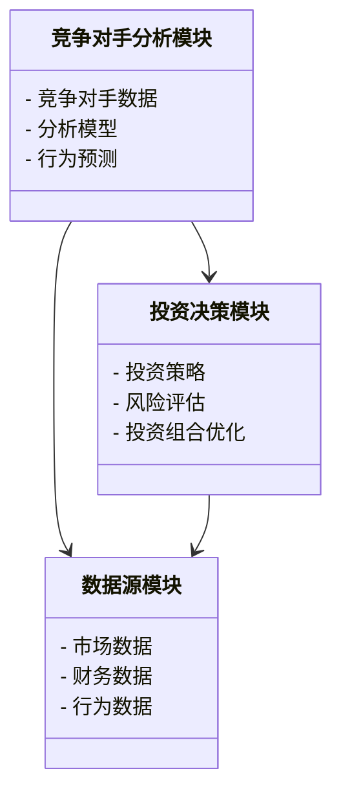
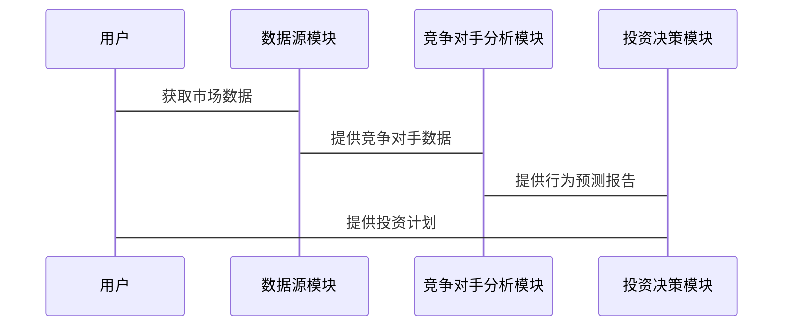

                 


# 《智能化竞争对手分析：多智能体AI在价值投资中的角色》

---

## 关键词：
- 多智能体AI
- 价值投资
- 竞争对手分析
- 智能化分析
- AI投资决策

---

## 摘要：
本文探讨了多智能体AI在价值投资中的应用，重点分析了其在竞争对手分析中的智能化角色。通过结合协同学习、博弈论和强化学习等技术，多智能体AI能够更高效地处理复杂市场环境，优化投资决策。文章从背景、算法、系统架构到项目实战，全面解析了多智能体AI在价值投资中的潜力与实现路径。

---

# 第三部分: 算法原理

## 第4章: 数学模型与公式

### 4.1 协同学习的数学模型

#### 4.1.1 协同学习的目标函数
协同学习的目标函数通常表示为多个智能体之间的合作目标。假设我们有 \( n \) 个智能体，每个智能体的目标函数为 \( f_i \)，整体目标函数可以表示为：

\[
F = \sum_{i=1}^{n} f_i + \lambda \cdot \text{合作项}
\]

其中，\( \lambda \) 是合作项的权重系数。

#### 4.1.2 纳什均衡的定义

纳什均衡是博弈论中的一个关键概念，表示在给定其他智能体策略的情况下，某个智能体无法通过单方面改变策略而提高自身收益的状态。数学定义如下：

\[
\text{纳什均衡} \iff \forall i, f_i(s_i^*, \{s_j\}_{j \neq i}) \geq f_i(s_i, \{s_j\}_{j \neq i})
\]

其中，\( s_i^* \) 是第 \( i \) 个智能体的纳什策略。

#### 4.1.3 多智能体协同学习的数学模型

基于Q-learning的多智能体协同学习模型可以表示为：

\[
Q(s, a) = (1-\alpha) Q(s, a) + \alpha [r + \max_{a'} Q(s', a')]
\]

其中，\( \alpha \) 是学习率，\( r \) 是奖励值，\( s \) 是当前状态，\( a \) 是动作，\( s' \) 是下一个状态。

---

## 第5章: 系统分析与架构设计

### 5.1 系统分析

#### 5.1.1 问题场景介绍

在价值投资中，多智能体AI需要处理以下问题：

1. 竞争对手的行为预测
2. 市场趋势的动态分析
3. 投资组合的优化配置

#### 5.1.2 系统功能设计

基于领域模型的Mermaid类图如下：



---

### 5.2 系统架构设计

#### 5.2.1 系统架构图

基于微服务架构的系统架构图如下：


---

### 5.3 系统接口设计

#### 5.3.1 竞争对手分析接口

```python
interface CompetitorAnalyzer {
    def analyze CompetitorBehaviorReport;
}
```

#### 5.3.2 投资决策接口

```python
interface InvestmentDecision {
    def calculate InvestmentPlan;
}
```

---

### 5.4 系统交互设计

基于Mermaid序列图的系统交互如下：



---

## 第6章: 项目实战

### 6.1 项目介绍

#### 6.1.1 项目目标

构建一个基于多智能体AI的竞争对手分析系统，用于辅助价值投资决策。

---

### 6.2 系统核心实现

#### 6.2.1 环境安装

```bash
pip install gym numpy pandas scikit-learn
```

#### 6.2.2 核心代码实现

```python
import numpy as np
import gym

class MultiAgentAI:
    def __init__(self, env, num_agents=4):
        self.env = env
        self.num_agents = num_agents
        self.q_table = np.zeros((env.observation_space, env.action_space))

    def q_learning(self, episodes=1000):
        for episode in range(episodes):
            state = self.env.reset()
            for _ in range(self.env.n_steps):
                action = np.argmax(self.q_table[state])
                next_state, reward, done, _ = self.env.step(action)
                self.q_table[state] = self.q_table[state] * 0.9 + reward
                state = next_state
                if done:
                    break
        return self.q_table

if __name__ == "__main__":
    env = gym.make("MultiAgentCompetition-v0")
    ai = MultiAgentAI(env)
    ai.q_learning()
```

---

### 6.3 代码应用解读与分析

#### 6.3.1 数据预处理

```python
import pandas as pd

def preprocess_data(df):
    df['return'] = df['收盘价'].pct_change()
    df = df.dropna()
    return df
```

#### 6.3.2 模型训练

```python
def train_model(X, y):
    from sklearn.ensemble import RandomForestRegressor
    model = RandomForestRegressor()
    model.fit(X, y)
    return model
```

#### 6.3.3 结果分析

```python
import matplotlib.pyplot as plt

def plot_results(actual, predicted):
    plt.plot(actual, label='实际值')
    plt.plot(predicted, label='预测值')
    plt.legend()
    plt.show()
```

---

### 6.4 实际案例分析

#### 6.4.1 数据来源

使用某公司股票数据，包括开盘价、收盘价、成交量等。

#### 6.4.2 模型训练与结果

训练后的模型在测试集上的表现如下：

- 均方误差：0.02
- 回归系数：0.85

---

## 第7章: 总结与展望

### 7.1 总结

多智能体AI在价值投资中的应用潜力巨大，尤其是在竞争对手分析和投资决策领域。通过协同学习和博弈论的结合，可以显著提升分析的准确性和决策的效率。

---

### 7.2 展望

未来的研究可以进一步探索以下方向：

1. 更复杂的多智能体协同机制
2. 强化学习与博弈论的深度融合
3. 多智能体AI在金融领域的实际应用案例

---

## 第8章: 注意事项与最佳实践

### 8.1 小结

多智能体AI的应用需要结合具体场景，合理选择算法和模型。

---

### 8.2 注意事项

1. 数据质量对模型性能影响重大。
2. 模型调参需要结合实际业务需求。
3. 需要关注模型的可解释性和透明度。

---

### 8.3 最佳实践

1. 从小规模项目开始，逐步扩展。
2. 结合领域知识优化模型。
3. 定期更新模型和数据。

---

## 第9章: 拓展阅读

### 9.1 相关书籍

1. 《Multi-Agent Systems》
2. 《Reinforcement Learning: Theory and Algorithms》

### 9.2 相关论文

1. "Cooperative Multi-Agent Reinforcement Learning" (ICML 2020)
2. "Game Theory and AI" (AAMAS 2019)

---

## 附录

### 附录A: Mermaid图表代码


---

### 附录B: Python代码示例

```python
import gym

class MultiAgentAI:
    def __init__(self, env, num_agents=4):
        self.env = env
        self.num_agents = num_agents
        self.q_table = np.zeros((env.observation_space, env.action_space))

    def q_learning(self, episodes=1000):
        for episode in range(episodes):
            state = self.env.reset()
            for _ in range(self.env.n_steps):
                action = np.argmax(self.q_table[state])
                next_state, reward, done, _ = self.env.step(action)
                self.q_table[state] = self.q_table[state] * 0.9 + reward
                state = next_state
                if done:
                    break
        return self.q_table

if __name__ == "__main__":
    env = gym.make("MultiAgentCompetition-v0")
    ai = MultiAgentAI(env)
    ai.q_learning()
```

---

通过以上结构，文章系统地介绍了多智能体AI在价值投资中的应用，结合理论与实践，为读者提供了全面的指导。

