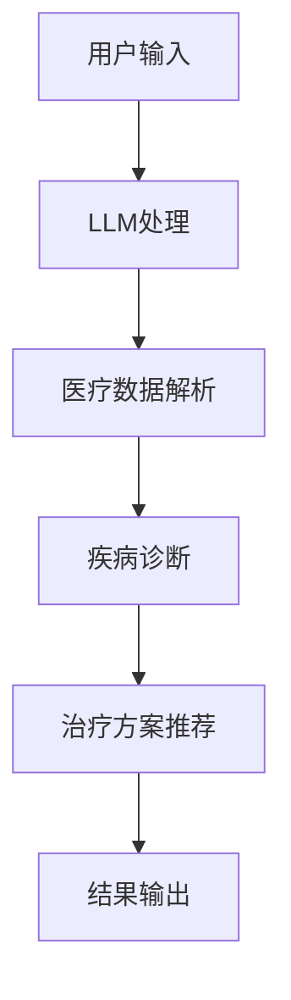
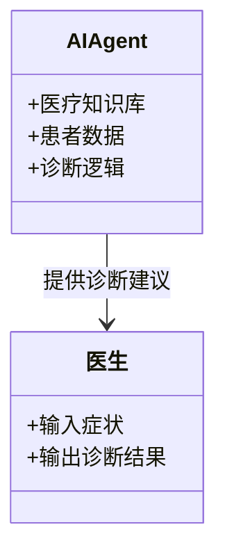
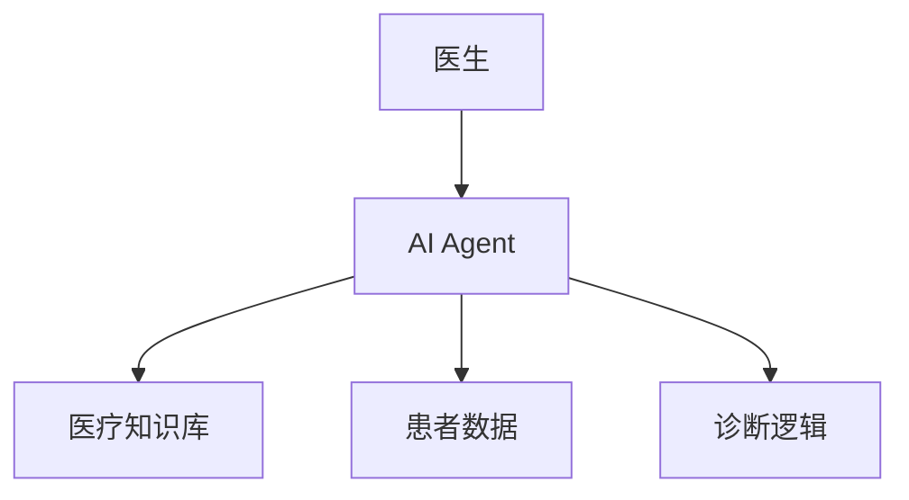
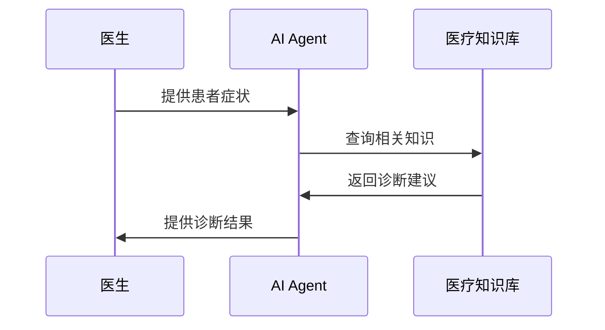

                 


# 智能医疗诊断AI Agent：LLM在临床决策支持中的应用

**关键词：** 大语言模型（LLM）、临床决策支持、智能医疗诊断、AI Agent、医疗数据、机器学习、自然语言处理

**摘要：**  
随着人工智能技术的飞速发展，大语言模型（LLM）在医疗领域的应用逐渐成为研究热点。本文详细探讨了智能医疗诊断AI Agent的核心概念、算法原理、系统架构以及实际应用场景。通过分析LLM在临床决策支持中的优势，结合具体案例，阐述了其在疾病诊断、治疗方案推荐和医疗数据处理中的潜力。本文还提供了系统的数学模型和公式解析，帮助读者深入理解LLM在医疗诊断中的技术细节，并通过项目实战部分展示了AI Agent的实际应用过程。

---

# 第一部分: 智能医疗诊断AI Agent的背景与概念

## 第1章: AI与医疗的结合：智能医疗诊断的背景与现状

### 1.1 智能医疗诊断的背景介绍

#### 1.1.1 医疗诊断的现状与挑战
现代医疗体系中，医生面临着海量的医疗数据、复杂的诊断逻辑以及有限的时间资源。传统的诊断方式依赖于医生的经验和知识，但在数据量爆炸的时代，这种方法效率低下且容易出错。医疗诊断的准确性直接影响患者的治疗效果和生命安全，因此，如何借助技术手段提高诊断效率和准确性成为亟待解决的问题。

#### 1.1.2 AI技术在医疗领域的应用潜力
人工智能（AI）技术的快速发展为医疗诊断带来了新的可能性。特别是大语言模型（LLM）的出现，其强大的自然语言处理能力和知识推理能力使其在医疗领域展现出巨大潜力。LLM可以通过分析病历、医学文献和患者症状，辅助医生快速诊断疾病、制定治疗方案。

#### 1.1.3 智能医疗诊断的定义与目标
智能医疗诊断AI Agent是一种结合了大语言模型和人工智能技术的医疗辅助工具。其目标是通过分析医疗数据，提供疾病诊断、治疗方案推荐和用药建议等支持，帮助医生提高诊断效率和准确性，同时优化患者的治疗体验。

---

## 第2章: 大语言模型（LLM）的核心原理与医疗应用

### 2.1 LLM的基本原理

#### 2.1.1 深度学习与自然语言处理的结合
大语言模型（LLM）基于深度学习技术，结合自然语言处理（NLP）模型，能够理解和生成人类语言。通过大量的医疗数据训练，LLM可以掌握医疗领域的专业术语和知识。

#### 2.1.2 Transformer模型的结构与特点
Transformer模型是当前NLP领域的主流架构，由编码器和解码器组成。编码器负责将输入的医疗数据转化为向量表示，解码器则根据编码结果生成输出。其自注意力机制使得模型能够捕捉到数据中的长距离依赖关系。

#### 2.1.3 LLM的训练方法与优化策略
LLM的训练采用大规模数据集，并通过自监督学习方法进行预训练。模型的优化目标是最小化预测错误，通常采用Adam优化器和学习率衰减策略。

---

## 第3章: LLM在医疗诊断中的应用场景

### 3.1 病历分析与疾病诊断
#### 3.1.1 病历文本的结构化处理
通过自然语言处理技术，LLM可以将非结构化的病历文本转化为结构化的数据，便于后续分析和诊断。

#### 3.1.2 疾病预测与诊断支持
基于病历数据和医学知识库，LLM可以辅助医生进行疾病预测和诊断。例如，通过分析患者的症状、病史和检查结果，模型可以提供可能的疾病列表和诊断建议。

### 3.2 医疗文献检索与知识推理
#### 3.2.1 医疗文献的自动检索
LLM可以通过关键词搜索和语义匹配，快速检索相关的医疗文献和研究论文，为医生提供最新的医学知识。

#### 3.2.2 知识图谱构建与推理
通过对医疗文献的分析，LLM可以构建知识图谱，支持医生进行复杂的知识推理和决策。

### 3.3 个性化治疗方案推荐
#### 3.3.1 治疗方案的生成
LLM可以根据患者的个体化特征（如基因信息、生活习惯）生成个性化的治疗方案。

#### 3.3.2 药物剂量优化
通过分析患者的病情和药物相互作用，LLM可以优化药物剂量，减少副作用。

---

## 第4章: 智能医疗诊断AI Agent的概念与边界

### 4.1 AI Agent的基本概念
AI Agent是一种智能体，能够感知环境并执行任务。在医疗领域，AI Agent可以作为医生的辅助工具，帮助其完成诊断、治疗和管理任务。

### 4.2 智能医疗诊断AI Agent的核心特征
- **知识库集成：** 集成医学知识库和临床指南。
- **实时分析：** 快速分析医疗数据并提供实时反馈。
- **动态推理：** 根据最新数据动态调整诊断建议。

### 4.3 临床决策支持系统的边界与外延
智能医疗诊断AI Agent的功能边界包括疾病诊断、治疗方案推荐和医疗数据管理。其外延则涉及患者教育、远程医疗和医疗资源优化。

---

# 第二部分: 智能医疗诊断AI Agent的算法原理与数学模型

## 第5章: LLM的算法原理与流程图

### 5.1 LLM的算法原理

#### 5.1.1 Transformer模型的结构解析
Transformer模型由编码器和解码器组成，编码器负责将输入数据转化为向量表示，解码器根据编码结果生成输出。

#### 5.1.2 自注意力机制的工作原理
自注意力机制通过计算输入序列中每个词与其他词的相关性，生成注意力权重矩阵。

#### 5.1.3 梯度下降与参数优化方法
模型的参数优化采用梯度下降方法，通常使用Adam优化器和学习率衰减策略。

### 5.2 LLM的训练流程

#### 5.2.1 数据预处理与特征提取
对医疗数据进行清洗、标注和特征提取，为模型训练提供高质量的数据。

#### 5.2.2 模型训练与损失函数
采用交叉熵损失函数衡量模型预测结果与真实标签的差异。

#### 5.2.3 模型评估与调优
通过验证集评估模型性能，调整超参数以优化模型效果。

### 5.3 LLM的医疗应用流程图


---

## 第6章: LLM的数学模型与公式解析

### 6.1 Transformer模型的数学基础

#### 6.1.1 自注意力机制的数学公式
$$
\text{Attention}(Q, K, V) = \text{softmax}\left(\frac{QK^T}{\sqrt{d_k}}\right)V
$$

其中：
- \( Q \) 是查询向量
- \( K \) 是键向量
- \( V \) 是值向量
- \( d_k \) 是向量的维度

#### 6.1.2 Transformer模型的损失函数
$$
\text{Loss} = -\sum_{i=1}^{n} \text{log}P(w_i | w_{i-1}, \ldots, w_1)
$$

其中：
- \( w_i \) 是输出序列中的第 \( i \) 个词
- \( P(w_i | w_{i-1}, \ldots, w_1) \) 是词 \( w_i \) 在给定前缀的条件概率

---

## 第7章: 智能医疗诊断AI Agent的系统分析与架构设计

### 7.1 系统功能设计

#### 7.1.1 领域模型设计


#### 7.1.2 系统架构设计


### 7.2 系统交互设计

#### 7.2.1 系统交互流程图


---

## 第8章: 项目实战与最佳实践

### 8.1 环境安装与配置
#### 8.1.1 安装Python环境
```
pip install python3.8
```

#### 8.1.2 安装LLM框架
```
pip install transformers
```

### 8.2 系统核心实现源代码

#### 8.2.1 医疗数据预处理
```python
import pandas as pd

# 读取病历数据
data = pd.read_csv('medical_data.csv')
# 清洗数据
data.dropna(inplace=True)
```

#### 8.2.2 LLM模型加载与推理
```python
from transformers import AutoTokenizer, AutoModelForCausalLM

# 加载模型
tokenizer = AutoTokenizer.from_pretrained('gpt2')
model = AutoModelForCausalLM.from_pretrained('gpt2')

# 推理
input_text = "症状：咳嗽、发热"
inputs = tokenizer(input_text, return_tensors='np')
outputs = model.generate(**inputs, max_length=100)
print(tokenizer.decode(outputs[0]))
```

### 8.3 实际案例分析与解读
#### 8.3.1 病例分析
患者症状：咳嗽、发热、胸痛  
模型诊断：肺炎  
治疗方案推荐：抗生素、抗病毒药物、休息

### 8.4 项目小结
通过项目实战，我们可以看到LLM在医疗诊断中的巨大潜力。然而，模型的准确性和可靠性仍需进一步优化。

---

## 第9章: 总结与展望

### 9.1 总结
智能医疗诊断AI Agent通过结合大语言模型和人工智能技术，为医疗诊断提供了新的解决方案。其在病历分析、疾病诊断和治疗方案推荐中的应用，显著提高了诊断效率和准确性。

### 9.2 未来展望
未来，随着LLM技术的不断进步，智能医疗诊断AI Agent将在更多医疗场景中得到应用。例如，远程医疗、个性化治疗和医疗数据管理等领域都将迎来新的发展机遇。

---

### 注意事项
1. 医疗数据的隐私和安全问题需要高度重视。
2. 模型的准确性和可靠性是临床应用的关键。
3. 在实际应用中，AI Agent应作为医生的辅助工具，而非替代医生。

---

通过以上分析，我们对智能医疗诊断AI Agent的背景、原理、系统架构和实际应用有了全面的了解。希望本文能够为相关领域的研究和实践提供有价值的参考。

