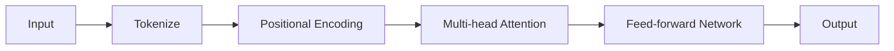
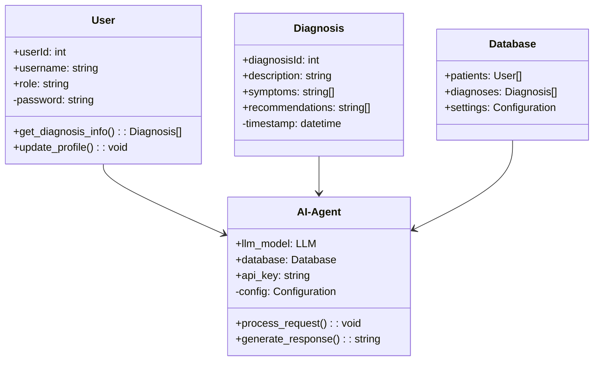
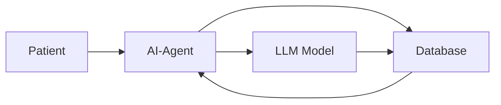
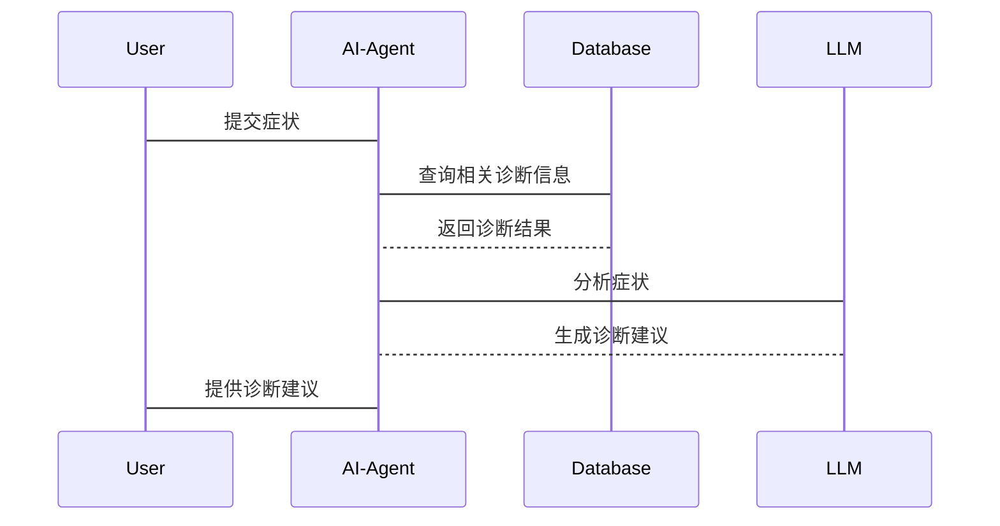

                 


# 智能医疗问诊 AI Agent：LLM 在远程医疗中的应用

## 关键词：人工智能，AI Agent，LLM，远程医疗，医疗问诊

## 摘要

随着人工智能技术的迅速发展，AI Agent和大型语言模型（LLM）在医疗领域的应用越来越广泛。本文探讨了AI Agent在智能医疗问诊中的作用，特别是LLM在远程医疗中的应用。文章详细介绍了LLM的基本原理、算法结构，以及AI Agent在医疗问诊中的具体应用场景。通过分析系统架构和项目实战，本文展示了如何利用AI Agent和LLM技术提升医疗问诊的效率和准确性，为远程医疗的发展提供了新的思路。

---

## 第1章：背景介绍

### 1.1 问题背景

在现代医疗体系中，医疗资源分布不均、患者数量激增以及医生工作压力大等问题日益突出。远程医疗作为一种解决方案，能够有效缓解这些问题，但传统的远程问诊方式效率较低，难以满足患者需求。

#### 1.1.1 医疗资源分配不均的问题
- 医疗资源在不同地区分布不均，导致患者难以获得及时有效的医疗服务。
- 医生数量有限，无法满足快速增长的患者需求。

#### 1.1.2 远程医疗的需求增长
- 随着互联网技术的发展，远程医疗的需求逐渐增加。
- 患者对便捷、高效的医疗服务有强烈需求。

#### 1.1.3 传统医疗问诊的局限性
- 传统问诊依赖医生的个人经验和时间，效率低下。
- 患者信息碎片化，难以全面分析。

### 1.2 问题描述

传统医疗问诊存在以下问题：

#### 1.2.1 患者问诊的低效性
- 患者需要多次往返医院，浪费时间和精力。
- 信息传递不准确，影响诊断结果。

#### 1.2.2 医生工作量的过大压力
- 医生需要处理大量患者，工作压力大，容易疲劳。
- 诊断过程中可能出现疏漏，影响准确性。

#### 1.2.3 医疗信息的碎片化问题
- 患者的病历、检查结果分散，难以整合分析。
- 医生需要花费大量时间整理信息。

### 1.3 问题解决：AI Agent的应用

AI Agent在医疗问诊中的应用可以有效解决上述问题：

#### 1.3.1 AI Agent在医疗问诊中的角色
- AI Agent作为患者和医生之间的桥梁，帮助整理和分析医疗信息。
- 提供个性化的医疗建议，辅助医生诊断。

#### 1.3.2 LLM如何提升问诊效率
- LLM能够快速分析患者的症状、病史和检查结果，提供准确的诊断建议。
- 自动生成结构化的病历，方便医生查阅。

#### 1.3.3 远程医疗中的智能化解决方案
- 通过AI Agent实现远程问诊的智能化，提高诊断效率和准确性。

### 1.4 边界与外延

#### 1.4.1 AI Agent的适用范围
- 主要适用于初步诊断和症状咨询，不替代专业医生的诊断。
- 适用于慢性病管理和健康咨询。

#### 1.4.2 与传统医疗问诊的区分
- AI Agent辅助诊断，不取代医生的决策。
- 适用于非紧急情况，对于急诊仍需传统医疗方式。

#### 1.4.3 技术的未来发展空间
- AI Agent将更加智能化，能够处理更多复杂的医疗场景。
- 结合物联网技术，实现更全面的医疗监测和管理。

### 1.5 核心要素组成

#### 1.5.1 数据采集与处理
- 收集患者的症状、病史、检查结果等信息。
- 对数据进行清洗、标注和结构化处理。

#### 1.5.2 模型训练与优化
- 使用大量医疗数据训练LLM模型，提升诊断准确性。
- 通过反馈机制不断优化模型性能。

#### 1.5.3 系统集成与部署
- 将AI Agent集成到医院的信息系统中，实现无缝对接。
- 提供用户友好的界面，方便患者和医生使用。

---

## 第2章：核心概念与联系

### 2.1 AI Agent的基本原理

AI Agent是一种智能体，能够感知环境并采取行动以实现目标。在医疗问诊中，AI Agent通过分析患者的症状和病史，提供诊断建议或引导患者进行进一步检查。

#### 2.1.1 定义与功能
- AI Agent在医疗领域的定义：能够处理医疗信息、提供诊断建议的智能体。
- 核心功能：信息收集、分析、诊断建议、患者管理。

#### 2.1.2 与传统AI的区别
| 特性 | AI Agent | 传统AI |
|------|-----------|---------|
| 目标 | 主动完成任务 | 处理特定问题 |
| 学习 | 具备自适应能力 | 预设规则 |

#### 2.1.3 应用潜力
- 提高诊断效率，减少医生工作负担。
- 为患者提供便捷的医疗服务。

### 2.2 LLM的基本原理

LLM是一种基于深度学习的自然语言处理模型，能够理解和生成人类语言。

#### 2.2.1 定义与特点
- 基于Transformer架构，具有强大的上下文理解能力。
- 可以处理大规模文本数据，生成准确的医疗诊断建议。

#### 2.2.2 常见模型及其优缺点
| 模型 | 优点 | 缺点 |
|------|-------|------|
| GPT-3 | 高准确性，强大的生成能力 | 需要大量计算资源 |
| BERT | 上下文理解能力强 | 生成能力较弱 |

#### 2.2.3 在自然语言处理中的优势
- 能够处理复杂句式，准确理解患者描述。
- 生成自然流畅的诊断建议。

### 2.3 AI Agent与LLM的关系

#### 2.3.1 功能上的协同作用
- AI Agent利用LLM进行自然语言处理，提升诊断效率。
- LLM为AI Agent提供强大的语言理解能力。

#### 2.3.2 技术上的互补性
- AI Agent负责任务管理和执行，LLM负责语言理解和生成。
- 两者结合，实现智能化的医疗问诊。

#### 2.3.3 在医疗问诊中的具体应用案例
- AI Agent通过LLM分析患者的症状描述，生成初步诊断建议。
- 根据诊断结果，引导患者进行进一步检查或治疗。

---

## 第3章：算法原理讲解

### 3.1 LLM的算法原理

#### 3.1.1 模型结构

以下是一个简单的Transformer模型结构图：



#### 3.1.2 损失函数与优化

使用交叉熵损失函数和Adam优化器：

$$\text{损失函数} = -\frac{1}{N}\sum_{i=1}^{N} y_i \log(p_i)$$

其中，$y_i$是真实标签，$p_i$是预测概率。

优化过程如下：

$$\theta = \theta - \eta \frac{\partial L}{\partial \theta}$$

其中，$\eta$是学习率。

#### 3.1.3 概率分布与生成过程

生成过程基于概率分布：

$$P(y|x) = \prod_{i=1}^{n} P(y_i|y_{<i}, x)$$

温度参数影响生成结果的多样性：

$$P(y|x) = \frac{\exp(\frac{-d(y,x)}{k})}{\sum \exp(\frac{-d(y,x)}{k})}$$

---

## 第4章：系统分析与架构设计方案

### 4.1 系统功能设计

#### 4.1.1 领域模型设计

以下是领域模型类图：



#### 4.1.2 系统架构设计

以下是系统架构图：



#### 4.1.3 接口设计与交互流程

以下是交互流程图：



---

## 第5章：项目实战

### 5.1 环境安装

安装Python和必要的库：

```bash
pip install python-mermaid jupyterlab transformers
```

### 5.2 核心代码实现

以下是核心代码：

```python
import transformers

# 加载预训练模型
model = transformers.AutoModelForCausalLM.from_pretrained("gpt2")
tokenizer = transformers.AutoTokenizer.from_pretrained("gpt2")

def generate_diagnosis(prompt):
    inputs = tokenizer(prompt, return_tensors="np")
    outputs = model.generate(inputs.input_ids, max_length=100)
    return tokenizer.decode(outputs[0], skip_special_tokens=True)

# 示例使用
prompt = "I have a headache and fever."
print(generate_diagnosis(prompt))
```

### 5.3 代码解读与分析

上述代码实现了一个简单的诊断生成功能，基于GPT-2模型。用户输入症状，模型生成诊断建议。

---

## 第6章：最佳实践与小结

### 6.1 小结

本文详细介绍了AI Agent和LLM在智能医疗问诊中的应用，探讨了其在远程医疗中的潜力和优势。通过系统架构设计和项目实战，展示了如何利用这些技术提升医疗问诊的效率和准确性。

### 6.2 注意事项

- 数据隐私和安全是医疗AI应用的重要考虑因素。
- AI Agent不能完全替代医生，仍需在医生指导下使用。
- 模型需要不断优化和更新，以提高诊断准确性。

### 6.3 拓展阅读

- 《Deep Learning》
- 《Transformers: A Neuron Perspective》
- 《Medical AI: Current and Future》

---

通过本文的学习，读者可以深入了解AI Agent和LLM在医疗领域的应用，掌握相关的技术原理和系统设计方法，为远程医疗的发展提供新的思路和方向。

