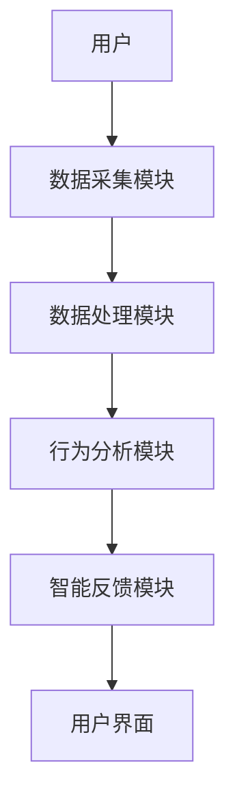

                 


# 智能卫生间：AI Agent的个人卫生习惯分析

> 关键词：智能卫生间，AI Agent，个人卫生习惯，数据挖掘，机器学习

> 摘要：本文探讨了AI Agent在智能卫生间中的应用，详细分析了个人卫生习惯的智能化分析方法，包括数据采集、算法选择、系统架构设计以及实际案例实现。文章通过理论与实践结合，展示了如何利用AI技术提升卫生间智能化水平。

---

# 第1章：智能卫生间与AI Agent的背景介绍

## 1.1 问题背景与应用背景

### 1.1.1 传统卫生间存在的问题
传统卫生间在日常使用中存在诸多痛点：
- **卫生习惯不佳**：个人卫生习惯可能不规范，导致细菌滋生。
- **数据难以采集**：缺乏智能化设备，无法获取用户的卫生习惯数据。
- **资源浪费**：水、电等资源的使用效率低下，缺乏智能化管理。

### 1.1.2 智能卫生间的概念与定义
智能卫生间通过集成传感器、物联网设备和AI技术，实现对卫生间环境和用户行为的智能化管理。其核心目标是通过数据采集、分析和反馈，优化用户的卫生习惯，提升卫生间的使用效率。

### 1.1.3 AI Agent在智能卫生间中的作用
AI Agent（智能代理）在智能卫生间中扮演关键角色：
- **数据采集与处理**：通过传感器收集用户的卫生行为数据。
- **行为分析**：利用机器学习算法分析用户的卫生习惯。
- **智能反馈**：根据分析结果，提供个性化的卫生习惯建议。

## 1.2 个人卫生习惯分析的核心要素

### 1.2.1 卫生习惯的定义与分类
个人卫生习惯可以分为以下几类：
- **手部清洁**：洗手频率、洗手时长、洗手时间点。
- **如厕习惯**：如厕频率、如厕时长、如厕时间点。
- **卫生用品使用**：厕纸使用量、洗手液使用量。

### 1.2.2 数据采集与分析的关键点
- **数据来源**：传感器数据（如红外传感器、压力传感器）、用户行为日志。
- **数据特征**：时间戳、行为频率、行为时长。
- **数据预处理**：去噪、归一化、特征提取。

### 1.2.3 AI Agent的分析逻辑与流程
AI Agent分析个人卫生习惯的流程：
1. 数据采集：通过传感器获取用户行为数据。
2. 数据预处理：清洗和特征提取。
3. 行为分析：使用机器学习模型识别异常行为。
4. 智能反馈：生成个性化建议，优化用户卫生习惯。

---

# 第2章：AI Agent与个人卫生习惯分析的核心概念

## 2.1 核心概念与原理

### 2.1.1 AI Agent的基本原理
AI Agent通过感知环境、分析数据、执行任务来实现智能化目标。在智能卫生间中，AI Agent主要负责数据采集、行为分析和智能反馈。

### 2.1.2 个人卫生习惯分析的数学模型
分析模型主要基于时间序列分析和分类算法。以下是常见的模型：

#### 时间序列分析
时间序列分析用于分析用户行为的时间规律。常用模型包括：
- ARIMA模型
- LSTM（长短期记忆网络）

#### 分类算法
分类算法用于识别用户的卫生习惯是否符合规范。常用算法包括：
- K-近邻算法（KNN）
- 支持向量机（SVM）
- 随机森林（Random Forest）

### 2.1.3 数据挖掘与机器学习在卫生习惯分析中的应用
数据挖掘和机器学习技术可以提取用户行为的特征，发现潜在的卫生习惯问题，并提供改进建议。

## 2.2 核心概念对比分析

### 2.2.1 不同AI Agent算法的对比
以下是几种常见AI Agent算法的对比：

| 算法类型 | 优点 | 缺点 |
|----------|------|------|
| KNN      | 简单，易于实现 | 对于大数据量效率低 |
| SVM      | 高精度 | 参数敏感 |
| Random Forest | 抗噪声能力强 | 对弱分类器依赖性高 |

### 2.2.2 数据采集方式的对比
数据采集方式直接影响分析结果的准确性。以下是几种数据采集方式的对比：

| 数据采集方式 | 优点 | 缺点 |
|--------------|------|------|
| 传感器采集 | 实时性高 | 成本高 |
| 日志采集 | 成本低 | 实时性差 |

### 2.2.3 分析结果的可视化方式对比
可视化方式影响用户对分析结果的理解。以下是几种可视化方式的对比：

| 可视化方式 | 优点 | 缺点 |
|------------|------|------|
| 折线图     | 显示趋势 | 信息量有限 |
| 饼图       | 显示比例 | 信息量有限 |
| 热力图     | 显示分布 | 需要特定数据 |

---

# 第3章：AI Agent的算法原理与数学模型

## 3.1 算法原理

### 3.1.1 数据预处理与特征提取
数据预处理是确保分析结果准确性的关键步骤。以下是数据预处理的主要步骤：

1. **数据清洗**：去除噪声数据和异常值。
2. **特征提取**：从原始数据中提取有用特征，如时间戳、行为频率。

### 3.1.2 机器学习模型的选择与训练
选择合适的机器学习模型是分析成功的关键。以下是常见的模型选择策略：

1. **模型选择**：根据数据类型和分析目标选择模型。
2. **模型训练**：使用训练数据对模型进行训练。
3. **模型评估**：通过交叉验证评估模型性能。

### 3.1.3 模型优化与调参
模型优化是提升分析精度的重要步骤。以下是常见的优化方法：

1. **参数调优**：通过网格搜索或随机搜索找到最优参数。
2. **特征工程**：通过特征选择或特征变换提升模型性能。

## 3.2 数学模型与公式

### 3.2.1 数据特征提取的数学公式
特征提取可以通过主成分分析（PCA）实现：

$$
\text{PCA} = \text{数据矩阵} \times \text{特征向量}
$$

### 3.2.2 机器学习模型的数学推导
以随机森林为例，模型的数学推导如下：

$$
y = \sum_{i=1}^{n} w_i x_i + b
$$

其中，$w_i$ 是权重，$x_i$ 是特征，$b$ 是偏置。

---

# 第4章：智能卫生间的系统架构与设计

## 4.1 系统架构设计

### 4.1.1 系统整体架构图
以下是智能卫生间的系统架构图：



### 4.1.2 数据流与信息交互流程
数据流从传感器流向数据处理模块，经过特征提取和模型训练后，生成分析结果并反馈给用户。

### 4.1.3 系统模块划分与功能分配
系统模块划分如下：

| 模块 | 功能 |
|------|------|
| 数据采集模块 | 采集用户行为数据 |
| 数据处理模块 | 对数据进行预处理和特征提取 |
| 行为分析模块 | 使用机器学习模型分析用户行为 |
| 智能反馈模块 | 根据分析结果生成反馈建议 |
| 用户界面 | 显示反馈结果并提供交互界面 |

## 4.2 系统接口设计

### 4.2.1 数据采集接口的设计
数据采集接口负责与传感器通信，获取用户行为数据。

### 4.2.2 AI Agent与硬件设备的接口
AI Agent通过API与硬件设备交互，实现数据的实时采集和反馈。

### 4.2.3 用户交互界面的接口设计
用户界面通过API与智能反馈模块交互，显示分析结果并提供用户输入接口。

---

# 第5章：AI Agent的项目实战与实现

## 5.1 环境搭建与工具安装

### 5.1.1 开发环境的选择与安装
推荐使用Python作为开发语言，安装以下工具：
- **Python**：3.8+
- **机器学习库**：scikit-learn、TensorFlow
- **数据可视化库**：Matplotlib、Seaborn
- **传感器驱动**：适用于具体传感器的驱动程序

### 5.1.2 数据采集工具的安装与配置
安装并配置传感器驱动，确保数据采集模块能够正常工作。

### 5.1.3 AI Agent框架的安装与部署
安装并部署AI Agent框架，如Rasa或 Dialogflow。

## 5.2 核心代码实现

### 5.2.1 数据预处理与特征提取的代码
以下是数据预处理的代码示例：

```python
import pandas as pd
from sklearn.decomposition import PCA

# 读取数据
data = pd.read_csv('data.csv')

# 删除异常值
data_clean = data.drop(data[data['value'] > 100].index)

# 特征提取
pca = PCA(n_components=2)
principal_components = pca.fit_transform(data_clean)
```

### 5.2.2 机器学习模型的训练与优化
以下是随机森林模型的训练代码示例：

```python
from sklearn.ensemble import RandomForestClassifier
from sklearn.metrics import accuracy_score

# 训练模型
model = RandomForestClassifier(n_estimators=100)
model.fit(X_train, y_train)

# 模型评估
y_pred = model.predict(X_test)
print("准确率：", accuracy_score(y_test, y_pred))
```

### 5.2.3 系统接口的开发与测试
以下是AI Agent与硬件设备的接口代码示例：

```python
import serial

# 连接传感器
ser = serial.Serial('COM3', 9600)

# 读取数据
data = ser.readline().decode().strip()
```

---

# 第6章：系统优化与实际案例分析

## 6.1 系统优化策略

### 6.1.1 数据采集效率的优化
通过增加传感器节点和优化数据传输协议，提升数据采集效率。

### 6.1.2 算法模型的优化与改进
通过超参数调优和模型融合，提升模型的准确率和鲁棒性。

### 6.1.3 系统性能的提升与维护
通过优化系统架构和增加缓存机制，提升系统的响应速度和稳定性。

## 6.2 实际案例分析

### 6.2.1 案例背景与数据
假设我们有一个智能卫生间项目，目标是优化用户的洗手习惯。以下是案例数据：

| 时间戳 | 洗手频率 | 洗手时长 | 是否异常 |
|--------|----------|----------|----------|
| 10:00  | 5次/天    | 20秒/次  | 否       |
| 11:00  | 3次/天    | 30秒/次  | 是       |

### 6.2.2 数据分析与结果
通过分析数据，发现用户的洗手频率和时长存在异常，AI Agent会生成以下反馈建议：

1. **增加洗手频率**：建议用户每天洗手6次。
2. **延长洗手时长**：每次洗手建议延长至25秒。
3. **提供反馈**：通过用户界面显示优化建议。

---

# 第7章：总结与展望

## 7.1 系统总结
本文详细介绍了AI Agent在智能卫生间中的应用，从数据采集到模型训练，再到系统实现，展示了如何利用AI技术优化用户的卫生习惯。

## 7.2 未来展望
随着AI技术的不断发展，智能卫生间将更加智能化和个性化。未来的优化方向包括：
- **更精准的分析模型**：引入深度学习技术，提升分析精度。
- **更便捷的交互方式**：通过语音控制和手势识别，提升用户体验。
- **更高效的资源管理**：优化水、电等资源的使用效率，推动可持续发展。

---

# 关键词：智能卫生间，AI Agent，个人卫生习惯，数据挖掘，机器学习

# 摘要：本文探讨了AI Agent在智能卫生间中的应用，详细分析了个人卫生习惯的智能化分析方法，包括数据采集、算法选择、系统架构设计以及实际案例实现。文章通过理论与实践结合，展示了如何利用AI技术提升卫生间智能化水平。

