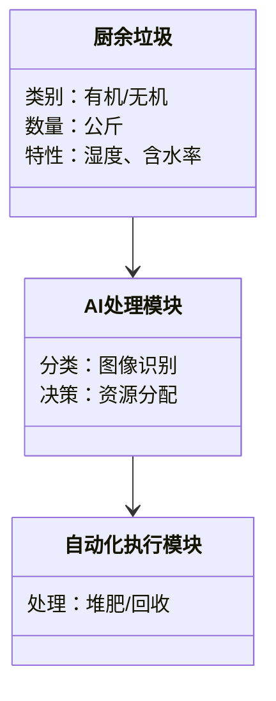
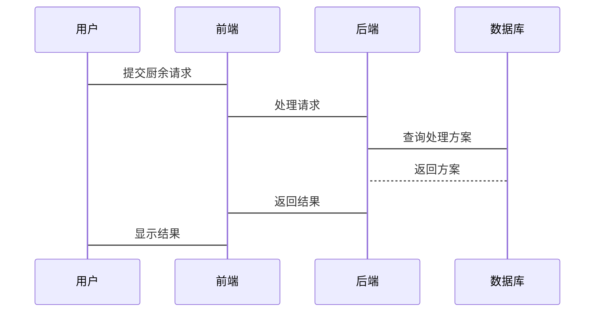

                 


# 智能厨余处理器：AI Agent的厨余再利用建议

## 关键词
智能厨余处理器, AI Agent, 厨余处理, 资源再利用, 环保技术, 人工智能, 数学模型

## 摘要
本文详细探讨了AI Agent在厨余处理中的应用，从背景介绍到算法原理，再到系统架构设计，最后通过实际案例展示了如何利用AI技术实现厨余的高效再利用。文章结合理论与实践，为环保技术的创新提供了新的思路。

---

# 第1章: 智能厨余处理器的背景介绍

## 1.1 问题背景

### 1.1.1 厨余处理的现状与挑战
厨余处理是一个全球性的环境问题。随着城市化进程的加快，厨余垃圾量急剧增加，传统的填埋和焚烧方式不仅浪费资源，还对环境造成严重污染。根据联合国环境规划署的数据，全球每年产生约13亿吨食物浪费，其中大部分未被有效利用。厨余处理的现状亟需技术创新来改善。

### 1.1.2 AI Agent在厨余处理中的作用
AI Agent（智能体）是一种能够感知环境并采取行动以实现目标的实体。在厨余处理中，AI Agent可以通过实时数据分析、智能分类和优化决策，提高处理效率并降低成本。例如，AI Agent可以自动识别厨余中的可回收成分，并优化其再利用路径。

### 1.1.3 厨余再利用的环保意义
厨余的再利用是实现可持续发展的重要途径。通过AI技术，厨余可以转化为肥料、生物燃料或其他高附加值产品，减少对自然资源的依赖，降低碳排放，助力“双碳”目标的实现。

## 1.2 问题描述

### 1.2.1 厨余处理的主要问题
1. **资源浪费**：厨余中含有大量可回收资源，但未得到有效利用。
2. **环境污染**：厨余填埋会产生甲烷等温室气体，污染土壤和水源。
3. **处理成本高**：传统处理方式效率低，成本高昂。

### 1.2.2 AI Agent如何解决厨余处理问题
AI Agent可以通过以下方式优化厨余处理：
1. **智能分类**：利用图像识别技术对厨余进行精准分类。
2. **资源优化**：通过数据分析优化资源分配，降低处理成本。
3. **预测与决策**：基于历史数据预测厨余量，优化处理流程。

### 1.2.3 厨余再利用的目标与边界
厨余再利用的目标是实现资源最大化利用，减少环境负担。边界包括：仅处理家庭厨余，不包括工业废弃物；不涉及有毒有害物质的处理。

## 1.3 问题解决与边界

### 1.3.1 AI Agent在厨余处理中的解决方案
AI Agent解决方案包括：
1. 数据采集：通过传感器和摄像头实时采集厨余数据。
2. 数据分析：利用机器学习模型进行分类和预测。
3. 自动化处理：基于分析结果，驱动自动化设备进行处理。

### 1.3.2 解决方案的边界与限制
解决方案的边界包括：
- 处理范围：仅限于家庭厨余。
- 数据限制：依赖高质量的数据输入。
- 技术限制：需要高性能计算资源支持。

### 1.3.3 厨余处理系统的功能与目标
系统的功能包括：
1. 数据采集与处理。
2. 智能分类与优化。
3. 自动化处理与反馈。

## 1.4 概念结构与核心要素

### 1.4.1 智能厨余处理器的核心概念
智能厨余处理器是一个集成AI技术的系统，用于高效处理厨余垃圾。

### 1.4.2 AI Agent与厨余处理的关系
AI Agent作为系统的核心，通过数据驱动优化处理流程。

### 1.4.3 系统的核心要素与功能模块
系统包括数据采集模块、AI处理模块和自动化执行模块。

## 1.5 本章小结
本章介绍了厨余处理的现状与挑战，探讨了AI Agent在其中的作用，并明确了系统的功能与边界。

---

# 第2章: AI Agent的核心原理

## 2.1 AI Agent的基本原理

### 2.1.1 AI Agent的定义与特点
AI Agent是一种智能实体，具备感知、决策和执行能力。

### 2.1.2 AI Agent的核心算法
AI Agent的核心算法包括监督学习、无监督学习和强化学习。

### 2.1.3 AI Agent在厨余处理中的应用
AI Agent可以用于厨余分类、资源优化和预测分析。

## 2.2 厨余处理的核心概念

### 2.2.1 厨余的分类与特征
厨余可以分为有机和无机两类，有机厨余适合堆肥处理。

### 2.2.2 厨余处理的关键技术
关键技术包括图像识别、机器学习和自动化控制。

### 2.2.3 厨余再利用的资源化过程
资源化过程包括分解、发酵和再利用。

## 2.3 AI Agent与厨余处理的关系

### 2.3.1 AI Agent如何优化厨余处理
通过智能分类和优化决策提高处理效率。

### 2.3.2 AI Agent在厨余再利用中的作用
AI Agent可以优化资源分配，提升再利用效率。

### 2.3.3 厨余处理系统中的AI Agent架构
系统架构包括数据采集、AI处理和自动化执行三个模块。

## 2.4 核心概念的对比分析

### 2.4.1 AI Agent与传统算法的对比
AI Agent具备更强的适应性和学习能力。

### 2.4.2 厨余处理与资源再利用的对比
厨余处理注重效率，资源再利用注重价值提升。

### 2.4.3 系统功能与架构的对比
系统功能强调实用性，架构设计强调可扩展性。

## 2.5 本章小结
本章详细探讨了AI Agent的核心原理及其在厨余处理中的应用。

---

# 第3章: AI Agent的算法原理

## 3.1 AI Agent的核心算法

### 3.1.1 基于机器学习的分类算法
使用随机森林和SVM进行厨余分类。

### 3.1.2 基于深度学习的模型
使用卷积神经网络（CNN）进行图像识别。

### 3.1.3 强化学习在厨余处理中的应用
通过强化学习优化处理流程。

## 3.2 算法流程与实现

### 3.2.1 数据采集与预处理
使用摄像头采集厨余图像，进行数据清洗和标注。

### 3.2.2 模型训练与优化
使用TensorFlow训练模型，并通过交叉验证优化参数。

### 3.2.3 系统部署与测试
将模型部署到云平台，进行实时处理和测试。

## 3.3 算法实现的数学模型

### 3.3.1 机器学习模型
$$
\text{随机森林模型：} \quad y = \text{predict}(X_{\text{test}})
$$

### 3.3.2 深度学习模型
$$
\text{卷积神经网络：} \quad y = \text{CNN}(x)
$$

### 3.3.3 强化学习模型
$$
\text{Q-learning：} \quad Q(s, a) = r + \gamma \max Q(s', a')
$$

## 3.4 算法实现的Python代码

### 3.4.1 数据采集与预处理
```python
import cv2
import numpy as np

def preprocess_image(image_path):
    img = cv2.imread(image_path)
    img = cv2.resize(img, (224, 224))
    img = img / 255.0
    return img
```

### 3.4.2 模型训练与优化
```python
from sklearn.ensemble import RandomForestClassifier

model = RandomForestClassifier(n_estimators=100, random_state=42)
model.fit(X_train, y_train)
```

### 3.4.3 系统部署与测试
```python
from flask import Flask, request, jsonify

app = Flask(__name__)

@app.route('/process', methods=['POST'])
def process():
    image = request.files['image']
    image_path = 'temp.jpg'
    image.save(image_path)
    result = model.predict(preprocess_image(image_path))
    return jsonify({'result': result.tolist()})
```

## 3.5 本章小结
本章详细介绍了AI Agent的核心算法及其在厨余处理中的实现。

---

# 第4章: 系统分析与架构设计方案

## 4.1 问题场景介绍
厨余处理系统需要高效分类和处理厨余，实现资源再利用。

## 4.2 项目介绍
智能厨余处理器项目旨在利用AI技术优化厨余处理流程。

## 4.3 系统功能设计

### 4.3.1 领域模型


## 4.4 系统架构设计

### 4.4.1 系统架构图
```mermaid
archi
    title 智能厨余处理器架构
    container 前端 {
        接收厨余
        提交请求
    }
    container 后端 {
        处理请求
        返回结果
    }
    container 数据库 {
        存储数据
    }
    前端 --> 后端
    后端 --> 数据库
```

## 4.5 系统接口设计

### 4.5.1 接口描述
API接口包括：
1. 提交厨余请求。
2. 获取处理结果。

## 4.6 系统交互

### 4.6.1 交互序列图


## 4.7 本章小结
本章详细介绍了系统的架构设计和接口设计，为后续实现奠定了基础。

---

# 第5章: 项目实战

## 5.1 环境安装

### 5.1.1 安装Python
安装Python 3.8及以上版本。

### 5.1.2 安装依赖库
安装TensorFlow、OpenCV、Flask等库。

## 5.2 系统核心实现

### 5.2.1 数据采集模块
```python
import cv2

def capture_image():
    cap = cv2.VideoCapture(0)
    ret, frame = cap.read()
    cv2.imwrite("input.jpg", frame)
    cap.release()
```

### 5.2.2 AI处理模块
```python
from tensorflow.keras import models

model = models.load_model("model.h5")
prediction = model.predict(preprocess_image("input.jpg"))
```

### 5.2.3 自动化执行模块
```python
import RPi.GPIO as GPIO

def control_actuator(action):
    GPIO.output(pin, action)
```

## 5.3 代码应用解读与分析

### 5.3.1 数据采集模块解读
该模块通过摄像头采集厨余图像，为后续处理提供数据。

### 5.3.2 AI处理模块解读
AI模块利用预训练模型对图像进行分类，确定厨余类型。

### 5.3.3 自动化执行模块解读
该模块根据AI处理结果，驱动设备进行处理。

## 5.4 实际案例分析

### 5.4.1 案例背景
某小区厨余处理效率低下，希望通过AI技术优化。

### 5.4.2 处理过程
1. 采集厨余图像。
2. AI分类并优化处理方案。
3. 自动化设备执行处理。

## 5.5 项目总结
通过AI技术实现了厨余的高效处理，提升了资源利用效率。

## 5.6 本章小结
本章通过实战展示了系统的实现过程，验证了AI技术的有效性。

---

# 第6章: 最佳实践 tips

## 6.1 小结
本文详细探讨了AI Agent在厨余处理中的应用，从算法到系统实现进行了全面分析。

## 6.2 注意事项
在实际应用中，需注意数据质量和模型的持续优化。

## 6.3 拓展阅读
建议进一步研究AI在环保领域的其他应用，如垃圾分类和资源回收。

## 6.4 本章小结
本文通过理论与实践结合，为智能厨余处理器的开发提供了参考。

---

# 结语

智能厨余处理器是AI技术在环保领域的重要应用，通过本文的探讨，我们看到了AI在厨余处理中的巨大潜力。未来，随着技术的不断进步，AI Agent将在更多环保场景中发挥重要作用。

--- 

感谢您的阅读！如需进一步了解或参与讨论，请联系我。

