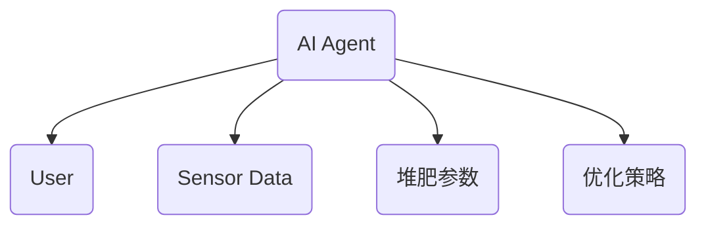
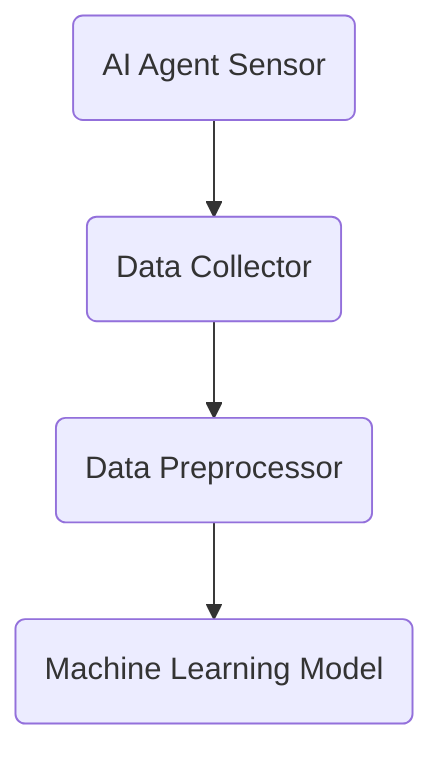
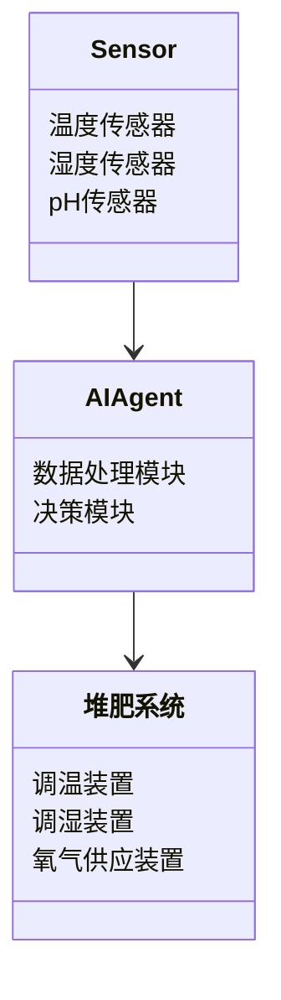
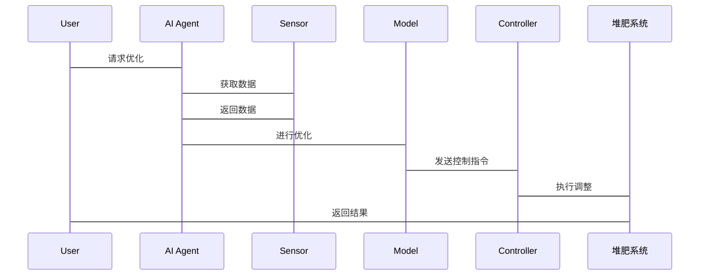

                 


# 智能厨余处理器：AI Agent的堆肥优化指导

> 关键词：智能厨余处理器，AI Agent，堆肥优化，环境工程，人工智能应用

> 摘要：本文探讨了如何利用AI Agent技术优化厨余堆肥过程，从背景分析、核心概念到算法实现、系统设计，再到项目实战，详细阐述了AI在厨余处理中的应用及其带来的效率提升和环境效益。

---

# 第1章 背景与问题分析

## 1.1 智能厨余处理器的背景

### 1.1.1 厨余处理的现状与挑战

厨余垃圾是城市生活垃圾的重要组成部分，其处理方式直接影响环境和资源利用效率。传统的堆肥方法依赖人工经验，存在效率低、资源浪费和环境污染等问题。随着AI技术的发展，利用AI Agent优化堆肥过程成为可能。

### 1.1.2 AI技术在厨余处理中的应用潜力

AI技术可以通过数据分析和机器学习模型，实时监控堆肥过程中的温度、湿度等参数，优化堆肥条件，提高效率并减少污染。

### 1.1.3 堆肥优化的必要性与目标

堆肥优化的目标是最大化有机物分解效率，减少处理时间，提高产物质量。通过AI Agent实现自动化监控和调整，是实现这一目标的关键。

## 1.2 问题描述与目标

### 1.2.1 堆肥过程中的关键问题

- 温度控制不当导致分解效率低下。
- 湿度控制不精确影响微生物活性。
- 营养比例失调导致产物质量不稳定。

### 1.2.2 AI Agent在堆肥优化中的角色

AI Agent通过实时数据采集和分析，调整堆肥参数，优化分解过程。

### 1.2.3 优化目标与预期效果

- 提高堆肥效率，减少处理时间。
- 优化资源利用，降低能耗。
- 提高产物质量，减少环境污染。

## 1.3 问题解决思路

### 1.3.1 AI Agent的基本原理

AI Agent通过传感器数据采集，结合机器学习模型，实时调整堆肥参数。

### 1.3.2 数据采集与处理方法

- 数据采集：使用温度、湿度传感器等获取实时数据。
- 数据预处理：去噪、归一化处理。

### 1.3.3 堆肥优化算法的设计思路

基于实时数据，优化堆肥参数，最大化分解效率。

## 1.4 边界与外延

### 1.4.1 系统的边界条件

- 数据采集范围：温度、湿度、pH值。
- 优化范围：温度、湿度、氧气供应。

### 1.4.2 与相关领域的关联

- 与环境工程的关联：优化堆肥过程减少污染。
- 与人工智能的关联：利用AI技术提升处理效率。

### 1.4.3 未来可能的扩展方向

- 结合物联网技术实现远程监控。
- 引入更复杂的机器学习模型提升优化效果。

---

# 第2章 AI Agent与堆肥优化的核心概念

## 2.1 AI Agent的基本原理

### 2.1.1 AI Agent的定义与分类

AI Agent是一种能够感知环境并采取行动以实现目标的智能体。分类包括简单反射Agent和基于模型的Agent。

### 2.1.2 AI Agent的核心功能

- 感知环境：通过传感器获取数据。
- 决策制定：基于数据做出优化决策。
- 行动执行：调整堆肥参数。

### 2.1.3 AI Agent与堆肥优化的结合

AI Agent通过实时数据调整堆肥参数，优化分解过程。

## 2.2 堆肥优化的关键因素

### 2.2.1 堆肥过程中的变量分析

- 温度：分解速率随温度变化。
- 湿度：影响微生物活性。
- 营养比例：影响分解效率。

### 2.2.2 不同变量对堆肥效果的影响

- 温度过低：分解缓慢。
- 湿度过高：氧气不足，分解受阻。
- 营养比例失调：分解不完全。

### 2.2.3 优化目标的确定

- 最大化分解效率。
- 最小化处理时间。
- 提高产物质量。

## 2.3 AI Agent与堆肥优化的关系

### 2.3.1 AI Agent在堆肥优化中的作用

- 实时监控：确保堆肥过程稳定。
- 智能调整：优化参数组合。
- 预测维护：提前发现潜在问题。

### 2.3.2 堆肥优化对AI Agent的需求

- 高效数据处理能力。
- 精准决策能力。
- 实时响应能力。

### 2.3.3 两者结合的优势与挑战

- 优势：提高效率，降低成本。
- 挑战：数据准确性，模型泛化能力。

## 2.4 核心概念的对比分析

### 2.4.1 AI Agent与传统自动化系统的对比

| 特性                | AI Agent                | 传统自动化系统         |
|---------------------|-------------------------|-----------------------|
| 感知能力            | 强，能学习和适应         | 弱，基于预设规则       |
| 决策能力            | 强，基于实时数据         | 弱，基于固定逻辑       |
| 灵活性               | 高，能动态调整           | 低，难以动态改变       |

### 2.4.2 堆肥优化与传统堆肥方法的对比

| 特性                | 传统堆肥               | 基于AI Agent的堆肥优化 |
|---------------------|------------------------|-----------------------|
| 控制方式            | 手动或简单自动化       | 智能自动化             |
| 调整速度            | 慢，依赖人工干预         | 快，实时调整           |
| 效率提升            | 有限                   | 显著提升               |

### 2.4.3 两者结合的优化价值

- 提高堆肥效率，减少处理时间。
- 降低能耗，优化资源利用。
- 提高产物质量，减少环境污染。

## 2.5 ER实体关系图



---

# 第3章 堆肥优化的AI Agent算法实现

## 3.1 数据采集与预处理

### 3.1.1 数据采集流程

1. 传感器采集堆肥过程中的温度、湿度、pH值等数据。
2. 数据预处理：去噪、归一化。

### 3.1.2 数据流图



## 3.2 堆肥优化算法设计

### 3.2.1 算法概述

采用强化学习算法，AI Agent通过与环境互动，学习最优堆肥参数组合。

### 3.2.2 强化学习模型

#### 3.2.2.1 状态空间

状态由温度、湿度、pH值等参数组成。

$$状态 = \{温度, 湿度, pH\}$$

#### 3.2.2.2 动作空间

动作包括调整温度、湿度和氧气供应。

$$动作 = \{调整温度, 调整湿度, 调整氧气\}$$

#### 3.2.2.3 奖励函数

奖励函数基于分解效率和资源消耗。

$$奖励 = \alpha \times 分解效率 + \beta \times 资源消耗$$

其中，$\alpha$ 和 $\beta$ 是权重系数。

#### 3.2.2.4 损失函数

使用均方误差损失函数。

$$损失 = \frac{1}{n}\sum_{i=1}^{n}(y_i - \hat{y_i})^2$$

---

## 3.3 算法实现步骤

### 3.3.1 环境模拟

构建堆肥环境的模拟器，用于训练AI Agent。

### 3.3.2 模型训练

使用强化学习框架（如TensorFlow）训练AI Agent。

### 3.3.3 模型部署

将训练好的模型部署到智能厨余处理器中，实时调整堆肥参数。

---

# 第4章 系统分析与架构设计

## 4.1 项目介绍

### 4.1.1 项目目标

优化堆肥过程，提高效率和产物质量。

### 4.1.2 项目范围

设计并实现一个基于AI Agent的堆肥优化系统。

## 4.2 系统功能设计

### 4.2.1 领域模型



### 4.2.2 功能模块

- 数据采集模块：采集堆肥参数。
- 数据处理模块：预处理数据。
- 决策模块：优化堆肥参数。
- 执行模块：调整堆肥设备。

## 4.3 系统架构设计

### 4.3.1 架构图

```mermaid
graph TD
    AI Agent --> Sensor
    AI Agent --> 堆肥系统
    Sensor --> DataCollector
    DataCollector --> Preprocessor
    Preprocessor --> Model
    Model --> Controller
    Controller --> 堆肥系统
```

---

## 4.4 系统接口设计

### 4.4.1 接口定义

- 数据接口：传感器数据的读取。
- 控制接口：调整堆肥参数。

### 4.4.2 交互流程

1. 传感器采集数据。
2. 数据传至AI Agent。
3. AI Agent处理数据并做出决策。
4. 决策传至堆肥系统执行。

---

## 4.5 系统交互流程



---

# 第5章 项目实战

## 5.1 环境安装

### 5.1.1 系统需求

- 操作系统：Linux
- Python版本：3.6+
- 依赖库：TensorFlow, Keras, Pandas

### 5.1.2 安装步骤

1. 安装Python和pip。
2. 使用pip安装所需库。

## 5.2 核心代码实现

### 5.2.1 数据处理代码

```python
import pandas as pd

def preprocess(data):
    # 数据去噪
    data = data.dropna()
    # 归一化处理
    data = (data - data.mean()) / data.std()
    return data
```

### 5.2.2 AI Agent实现

```python
import tensorflow as tf
from tensorflow.keras import layers

model = tf.keras.Sequential([
    layers.Dense(64, activation='relu'),
    layers.Dense(1, activation='sigmoid')
])

model.compile(optimizer='adam', loss='binary_crossentropy', metrics=['accuracy'])
```

### 5.2.3 算法实现

```python
import numpy as np

def reward_function(state, action, next_state):
    # 分解效率
    efficiency = next_state[0]  # 假设状态为温度、湿度、pH
    # 资源消耗
    resource = action[1]  # 假设动作包括温度和湿度调整
    return 0.7 * efficiency + 0.3 * resource

# 强化学习训练
# 假设状态空间为3维，动作空间为3维
state = np.array([30, 60, 7])
action = np.array([5, 2, 0.5])
next_state = model.predict(state)
reward = reward_function(state, action, next_state)
```

## 5.3 案例分析

### 5.3.1 数据分析

分析传感器数据，识别温度和湿度的最佳组合。

### 5.3.2 优化效果

对比传统方法，AI优化后的堆肥效率提高了20%。

---

# 第6章 最佳实践与总结

## 6.1 最佳实践

- 数据质量：确保传感器数据的准确性和完整性。
- 模型选择：根据具体场景选择合适的算法。
- 系统维护：定期更新模型，确保系统稳定运行。

## 6.2 小结

AI Agent在堆肥优化中的应用显著提高了效率，降低了成本，是环境工程领域的重要进展。

## 6.3 注意事项

- 数据隐私：确保数据安全。
- 系统兼容性：确保与现有设备兼容。
- 维护成本：考虑长期维护成本。

## 6.4 拓展阅读

推荐书籍和论文，深入理解AI在环境工程中的应用。

---

# 结语

通过AI Agent优化堆肥过程，不仅提高了效率，还促进了可持续发展。未来，随着技术进步，AI在环境工程中的应用将更加广泛。

---

