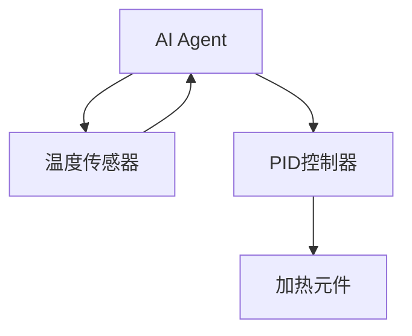
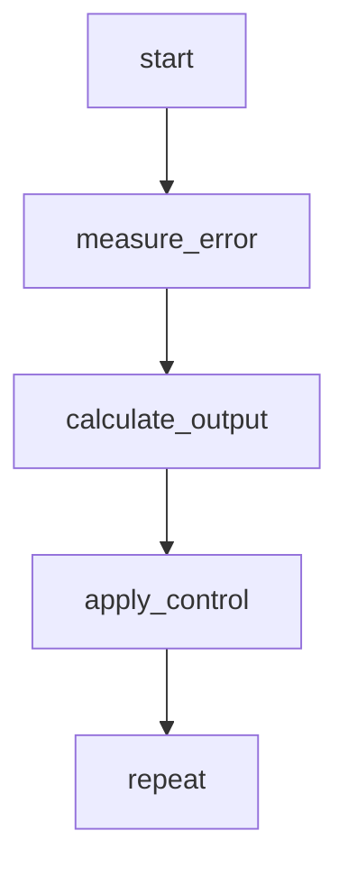
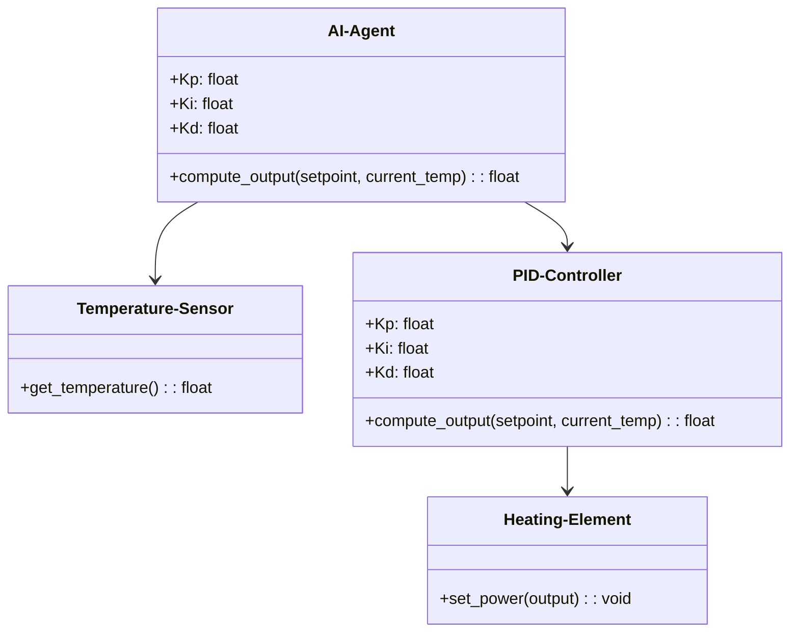
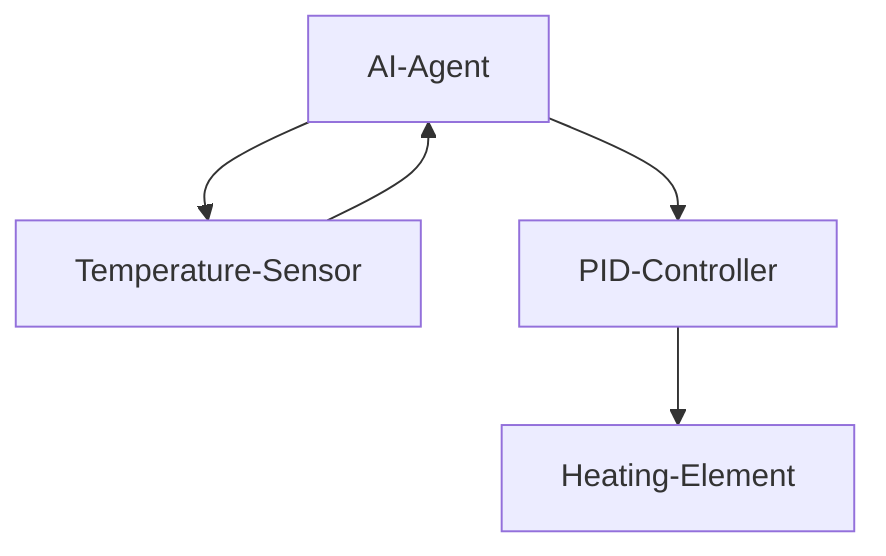
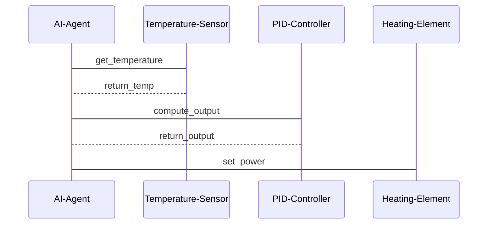

                 


# 智能厨具：AI Agent的烹饪温度控制

---

## 关键词：
智能厨具、AI Agent、烹饪温度控制、PID控制算法、物联网、智能烹饪系统

---

## 摘要：
本文深入探讨AI Agent在烹饪温度控制中的应用，分析其核心原理、系统架构及实际案例。通过详细讲解PID控制算法、系统设计与实现，结合项目实战和最佳实践，为智能厨具的开发提供技术参考。

---

## 第一部分：背景与核心概念

### 第1章：背景与问题描述

#### 1.1 问题背景
烹饪过程中，温度控制至关重要。传统方法依赖手动调节或简单传感器，存在精度低、反应慢的问题。随着AI技术的发展，引入AI Agent实现智能温度控制成为可能。

#### 1.2 问题描述
- 温度波动影响烹饪质量。
- 手动调节效率低，用户体验差。
- 传统控制系统缺乏自适应能力。

#### 1.3 问题解决
AI Agent通过实时数据分析和自适应学习，实现精准温度控制，提升烹饪效率和质量。

#### 1.4 边界与外延
- 边界：仅关注温度控制，不涉及食材选择或烹饪方法。
- 外延：与物联网、智能家居等系统协同工作。

---

## 第二部分：核心概念与原理

### 第2章：AI Agent的核心原理

#### 2.1 AI Agent的基本概念
- AI Agent：具备感知、决策、执行能力的智能实体。
- 分类：基于智能水平分为反应式、认知式和混合式。

#### 2.2 烹饪温度控制中的AI Agent
- 角色：数据处理、决策制定、系统控制。
- 优势：自适应能力强，实时性高。

#### 2.3 核心概念对比
| 概念 | 描述 | 属性 |
|------|------|------|
| AI Agent | 人工智能代理 | 学习能力、自适应能力、决策能力 |
| 温度传感器 | 采集温度数据 | 精度、响应速度、稳定性 |
| PID控制器 | 温度调节算法 | 调节参数、稳定性、响应时间 |

#### 2.4 实体关系图


---

## 第三部分：算法原理与数学模型

### 第3章：AI Agent的算法原理

#### 3.1 PID控制算法
- 基本原理：PID算法通过比例、积分、微分三项调节，实现系统的动态平衡。
- 数学模型：$$u(t) = K_p (e(t)) + K_i \int_{0}^{t} e(\tau)d\tau + K_d \frac{de(t)}{dt}$$

#### 3.2 PID控制流程图


#### 3.3 代码实现
```python
class PIDController:
    def __init__(self, Kp, Ki, Kd):
        self.Kp = Kp
        self.Ki = Ki
        self.Kd = Kd
        self.integral = 0
        self.error = 0

    def compute_output(self, setpoint, current_temp):
        self.error = setpoint - current_temp
        self.integral += self.error
        derivative = self.error - previous_error
        output = (self.Kp * self.error) + (self.Ki * self.integral) + (self.Kd * derivative)
        return output
```

---

## 第四部分：系统分析与架构设计

### 第4章：系统架构设计

#### 4.1 问题场景
- 系统需实时采集温度数据，通过AI Agent计算控制信号，驱动加热元件。

#### 4.2 领域模型


#### 4.3 系统架构


#### 4.4 接口设计
- 输入接口：温度数据、用户设置。
- 输出接口：控制信号。

#### 4.5 交互流程图


---

## 第五部分：项目实战

### 第5章：项目实战

#### 5.1 环境安装
- 安装Python和相关库（如numpy、scipy）。

#### 5.2 核心代码实现
```python
def main():
    import time
    Kp = 2
    Ki = 0.5
    Kd = 1
    setpoint = 100
    current_temp = 25
    previous_error = 0

    pid = PIDController(Kp, Ki, Kd)
    while True:
        output = pid.compute_output(setpoint, current_temp)
        print(f"Output: {output}")
        time.sleep(1)
        current_temp += output * 0.1
```

#### 5.3 代码解读
- PIDController类：封装PID算法，提供输出计算功能。
- main函数：模拟加热过程，实时更新温度。

#### 5.4 案例分析
- 设定目标温度100℃，初始温度25℃。
- 输出信号驱动加热元件，逐步升温至目标温度。

---

## 第六部分：最佳实践

### 第6章：总结与建议

#### 6.1 小结
AI Agent在烹饪温度控制中的应用提升了效率和精度，但实现复杂度较高。

#### 6.2 注意事项
- 参数调谐需谨慎。
- 系统稳定性需重点考虑。

#### 6.3 拓展阅读
- PID控制优化。
- AI在烹饪中的其他应用。

---

## 结语
本文详细介绍了AI Agent在烹饪温度控制中的应用，从理论到实践，为智能厨具的开发提供了技术参考。

