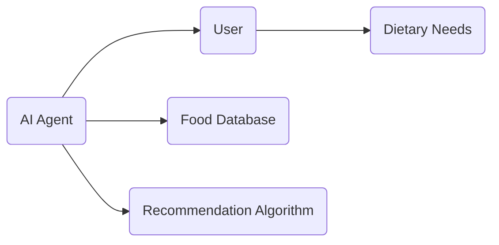
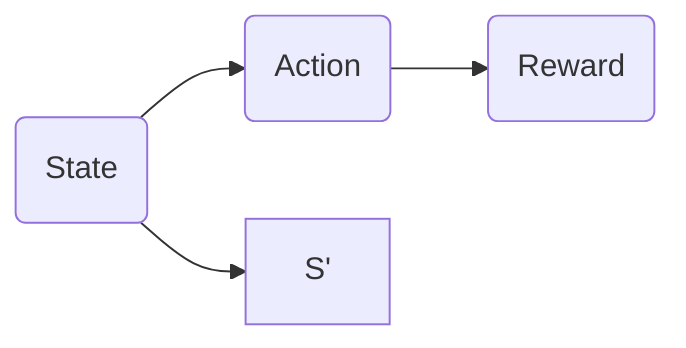
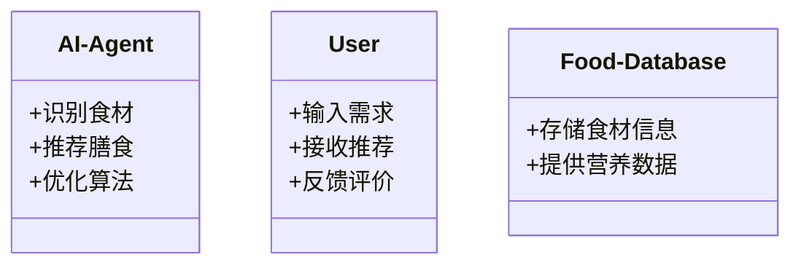
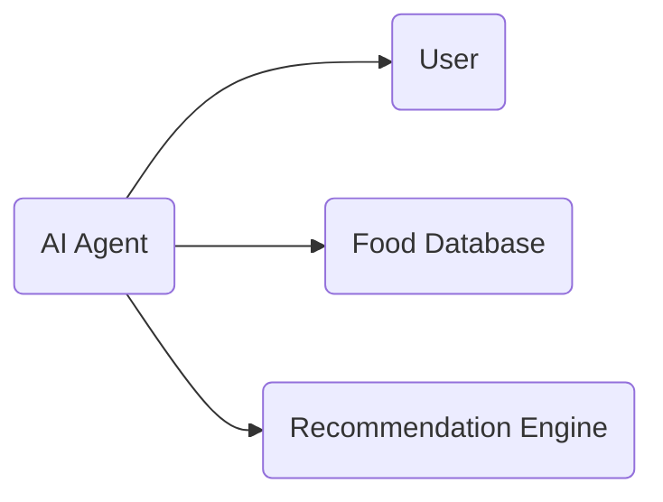
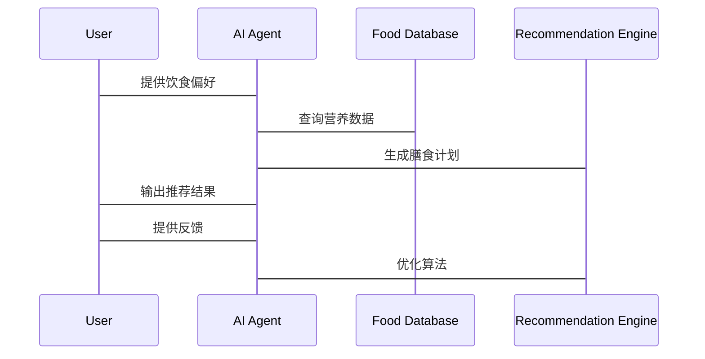

                 


# 智能厨房助手：AI Agent的营养均衡膳食规划

> 关键词：AI Agent, 营养均衡, 膳食规划, 智能厨房, 人工智能

> 摘要：本文探讨了AI Agent在智能厨房中的应用，重点分析其如何通过营养均衡膳食规划帮助用户实现健康饮食。从核心概念到算法原理，再到系统架构与项目实战，全面解析智能厨房助手的实现过程。

---

# 第一部分: 智能厨房助手的背景与核心概念

## 第1章: 智能厨房助手与AI Agent概述

### 1.1 AI Agent的基本概念

#### 1.1.1 AI Agent的定义
AI Agent（人工智能代理）是指能够感知环境、自主决策并执行任务的智能实体。它通过传感器获取信息，利用算法进行推理，并通过执行器与环境交互。

#### 1.1.2 AI Agent的核心特征
AI Agent具有以下核心特征：
1. **自主性**：无需外部干预，自主完成任务。
2. **反应性**：能实时感知环境并做出反应。
3. **目标导向**：基于目标驱动行为。
4. **学习能力**：通过数据不断优化性能。

#### 1.1.3 AI Agent在智能厨房中的应用
在智能厨房中，AI Agent可以用于食材识别、膳食推荐、烹饪指导等功能，帮助用户实现便捷、健康的饮食体验。

### 1.2 营养均衡膳食规划的重要性

#### 1.2.1 营养均衡的基本概念
营养均衡是指通过合理搭配食物，确保摄入的营养素满足人体需求，避免营养过剩或不足。

#### 1.2.2 现代人膳食不均衡的问题
现代人由于生活方式的变化，普遍存在膳食不均衡的问题，如营养摄入不均、热量摄入过多等。

#### 1.2.3 AI在膳食规划中的优势
AI通过大数据分析和机器学习算法，能够根据用户需求快速生成个性化膳食计划，提高效率和准确性。

### 1.3 智能厨房助手的定义与功能

#### 1.3.1 智能厨房助手的定义
智能厨房助手是一种基于AI技术的厨房设备，能够通过用户需求和厨房环境数据，提供个性化的食材推荐、菜谱建议等服务。

#### 1.3.2 智能厨房助手的核心功能
1. **食材识别与管理**：通过摄像头或传感器识别食材，自动更新库存。
2. **膳食推荐**：根据用户需求生成营养均衡的膳食计划。
3. **烹饪指导**：提供菜谱建议和烹饪步骤。

#### 1.3.3 智能厨房助手的边界与外延
智能厨房助手的功能不仅限于膳食规划，还包括与智能家居的联动，如与冰箱、智能灶具等设备协同工作。

---

## 第2章: AI Agent与营养均衡膳食规划的关系

### 2.1 AI Agent在膳食规划中的作用

#### 2.1.1 数据收集与处理
AI Agent通过收集用户的饮食习惯、健康状况等数据，进行分析和处理。

#### 2.1.2 膳食推荐算法
AI Agent利用机器学习算法，根据用户需求生成膳食推荐。

#### 2.1.3 用户反馈与优化
通过用户的反馈，AI Agent不断优化推荐算法，提高推荐准确性。

### 2.2 营养均衡膳食规划的数学模型

#### 2.2.1 营养需求的数学表达
$$ \text{营养需求} = \sum_{i=1}^{n} w_i x_i $$
其中，$w_i$为营养素权重，$x_i$为食物中的营养素含量。

#### 2.2.2 食物种类与营养成分的关系
通过建立食物种类与营养成分的映射关系，AI Agent可以为用户推荐多种营养均衡的食物组合。

### 2.3 AI Agent与膳食规划的实体关系图



---

## 第3章: AI Agent的算法原理

### 3.1 强化学习在AI Agent中的应用

#### 3.1.1 强化学习的基本原理
强化学习是一种通过试错机制优化决策模型的算法。AI Agent通过与环境交互，不断优化自身的决策策略。

#### 3.1.2 Q-learning算法
Q-learning算法是一种常用的强化学习算法，通过状态-动作-奖励机制优化决策。

#### 3.1.3 算法流程图



### 3.2 机器学习模型的实现

#### 3.2.1 数据预处理
对收集到的用户数据进行清洗、归一化等预处理，确保数据质量。

#### 3.2.2 模型训练
使用训练数据训练机器学习模型，如随机森林、支持向量机等。

### 3.3 算法实现的Python代码示例

```python
import numpy as np
from sklearn import svm

# 数据预处理
def preprocess(data):
    # 数据归一化
    normalized_data = (data - data.min()) / (data.max() - data.min())
    return normalized_data

# 模型训练
def train_model(X, y):
    model = svm.SVC()
    model.fit(X, y)
    return model

# 预测
def predict(model, X_test):
    return model.predict(X_test)
```

---

## 第4章: 系统分析与架构设计方案

### 4.1 问题场景介绍

#### 4.1.1 智能厨房助手的功能需求
- 食材识别与管理
- 膳食推荐
- 烹饪指导

#### 4.1.2 系统功能设计



### 4.2 系统架构设计

#### 4.2.1 架构图



#### 4.2.2 接口设计
- 用户接口：接收用户输入，输出推荐结果。
- 数据接口：与食材数据库交互，获取营养数据。

### 4.3 交互流程

#### 4.3.1 交互流程图



---

## 第5章: 项目实战

### 5.1 环境安装

#### 5.1.1 安装Python
```bash
python --version
pip install numpy scikit-learn
```

### 5.2 系统核心实现

#### 5.2.1 实现膳食推荐算法

```python
def recommend_dietary(user_input):
    # 数据预处理
    data = preprocess(user_input)
    # 模型训练
    model = train_model(data, labels)
    # 推荐结果
    return predict(model, data)
```

### 5.3 实际案例分析

#### 5.3.1 案例分析
假设用户输入为“糖尿病患者”，AI Agent会推荐低糖、高纤维的食物组合。

### 5.4 项目总结
通过实际案例分析，验证系统的有效性，并总结经验教训，为后续优化提供依据。

---

## 第6章: 最佳实践

### 6.1 小结
本文详细介绍了AI Agent在智能厨房中的应用，从核心概念到算法实现，再到系统架构和项目实战，全面解析了智能厨房助手的实现过程。

### 6.2 注意事项
- 数据隐私保护
- 算法优化的持续性
- 系统的可扩展性

### 6.3 拓展阅读
- 《机器学习实战》
- 《人工智能导论》

---

通过以上内容，我们可以看到，AI Agent在智能厨房中的应用前景广阔，能够为用户带来便捷、健康的生活体验。未来，随着技术的不断进步，智能厨房助手将变得更加智能化、个性化，更好地服务于用户。

