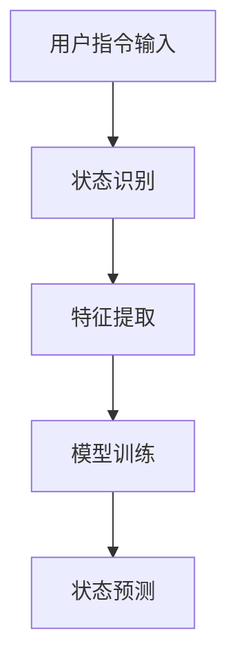
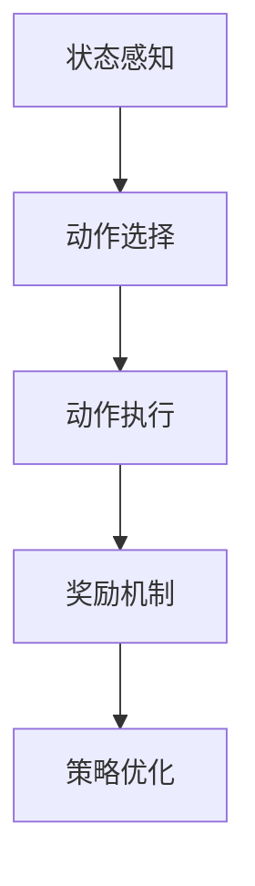
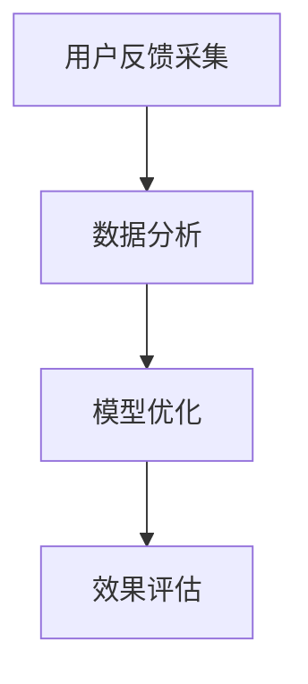
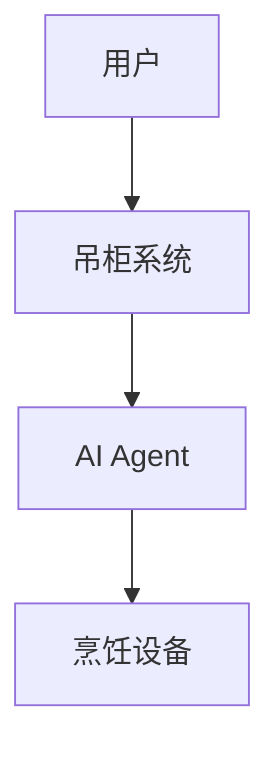
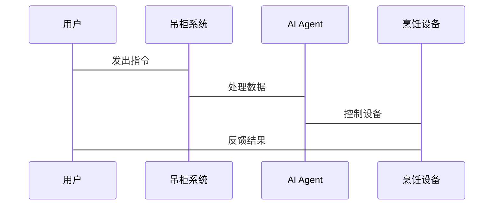

                 


# {{文章标题}}

## 关键词：智能厨房吊柜，AI Agent，厨房效率，智能家居，人工智能

## 摘要：本文将探讨智能厨房吊柜如何通过AI Agent技术提升厨房效率。从背景介绍、核心概念到算法原理、系统架构设计，再到项目实战，本文将全面解析智能厨房吊柜的实现过程，最后总结并给出最佳实践建议。

---

# 第1章: 智能厨房吊柜与AI Agent的背景介绍

## 1.1 智能厨房吊柜的发展背景

### 1.1.1 厨房智能化的背景与趋势

随着智能家居的普及，厨房作为家庭生活的重要场景，也在逐步智能化。传统厨房设备的功能单一，操作复杂，而现代厨房设备则越来越注重智能化和便捷性。智能厨房吊柜作为一种新兴的智能家居设备，结合了物联网和人工智能技术，能够通过AI Agent实现智能化管理，极大提升了厨房的使用效率。

### 1.1.2 吊柜在厨房中的核心作用

吊柜在厨房中不仅是存储物品的工具，更是厨房操作的重要辅助工具。智能吊柜通过传感器和AI技术，能够实时感知厨房环境，自动调整存储布局，优化物品存取路径，从而提高厨房操作效率。

### 1.1.3 AI技术在智能家居中的应用现状

人工智能技术在智能家居中的应用日益广泛，从语音助手到智能安防，AI技术正在改变我们的生活方式。在厨房场景中，AI技术的应用主要集中在智能设备的控制、食材管理、烹饪辅助等方面。智能厨房吊柜作为智能家居的重要组成部分，通过AI Agent技术，能够实现与其它厨房设备的协同工作，进一步提升厨房的整体效率。

## 1.2 问题背景与需求分析

### 1.2.1 厨房效率低下的主要问题

传统厨房操作中，食材存储混乱、操作步骤繁琐、设备协同不足等问题严重影响了厨房效率。例如，用户在烹饪时常常需要在多个设备之间切换操作，浪费时间和精力。此外，食材存储的不合理也会导致浪费和查找困难。

### 1.2.2 用户需求与痛点分析

用户在厨房操作中普遍存在以下痛点：
1. 食材存储混乱，查找困难。
2. 设备操作复杂，效率低下。
3. 缺乏智能化的厨房管理工具。
4. 厨房设备之间缺乏协同工作。

### 1.2.3 提升厨房效率的关键技术

要解决上述问题，需要引入先进的AI技术和物联网技术。通过AI Agent技术，智能厨房吊柜能够实现食材的智能存储、烹饪过程的辅助管理以及与其它厨房设备的协同工作，从而显著提升厨房效率。

## 1.3 AI Agent在厨房中的应用前景

### 1.3.1 AI Agent的定义与特点

AI Agent（人工智能代理）是一种能够感知环境、自主决策并执行任务的智能体。它具有以下特点：
1. **自主性**：能够在没有外部干预的情况下自主完成任务。
2. **反应性**：能够实时感知环境变化并做出响应。
3. **学习能力**：能够通过数据学习和优化自身的决策能力。

### 1.3.2 AI Agent在厨房场景中的优势

AI Agent在厨房场景中的应用优势主要体现在以下几个方面：
1. **智能存储管理**：通过AI Agent，吊柜能够根据用户的使用习惯自动调整存储布局，优化食材存取路径。
2. **烹饪辅助**：AI Agent能够根据用户的烹饪需求，自动调整设备状态，提供烹饪建议。
3. **设备协同**：AI Agent能够实现厨房内各种设备的协同工作，例如联动灶具、油烟机等设备，提高厨房操作效率。

### 1.3.3 智能厨房吊柜的未来发展

随着AI技术的不断进步，智能厨房吊柜的功能将更加智能化和多样化。未来的智能吊柜将能够实现更复杂的厨房管理功能，例如智能食材采购、健康饮食建议等，从而为用户提供更加便捷和高效的厨房体验。

## 1.4 本章小结

本章主要介绍了智能厨房吊柜的发展背景、核心作用以及AI Agent在厨房场景中的应用前景。通过分析厨房效率低下问题的根源，我们明确了提升厨房效率的关键技术，并展望了智能厨房吊柜的未来发展方向。

---

# 第2章: 智能厨房吊柜的核心概念与AI Agent的关系

## 2.1 核心概念解析

### 2.1.1 智能厨房吊柜的功能模块

智能厨房吊柜的功能模块主要包括：
1. **食材存储管理模块**：负责食材的存储、分类和存取优化。
2. **设备控制模块**：用于控制吊柜的开关、照明等设备。
3. **烹饪辅助模块**：提供烹饪建议、食谱推荐等功能。
4. **设备协同模块**：实现与其它厨房设备的联动控制。

### 2.1.2 AI Agent的定义与功能

AI Agent在智能厨房吊柜中的功能主要体现在以下几个方面：
1. **状态感知**：通过传感器感知厨房环境和设备状态。
2. **任务调度**：根据用户的指令和厨房环境，自主决策并执行任务。
3. **数据处理**：对收集到的数据进行分析和处理，优化厨房操作流程。

### 2.1.3 吊柜与AI Agent的结合方式

吊柜与AI Agent的结合主要通过以下方式实现：
1. **硬件集成**：在吊柜中集成传感器、摄像头等硬件设备，用于感知厨房环境。
2. **软件集成**：在吊柜系统中集成AI Agent软件，实现智能化管理。

## 2.2 核心概念的属性特征对比

以下是智能厨房吊柜和AI Agent的核心属性特征对比：

| **属性**         | **智能厨房吊柜**                          | **AI Agent**                              |
|------------------|-----------------------------------------|-----------------------------------------|
| **功能定位**     | 储存和管理食材，辅助烹饪                | 感知环境，自主决策，执行任务          |
| **核心技术**     | 物联网技术，传感器技术                  | 人工智能算法，机器学习                |
| **用户交互**     | 触摸屏，语音指令                       | 多模态交互（语音、手势、视觉）        |
| **应用场景**     | 厨房食材管理，烹饪辅助                  | 智能家居，设备协同，服务推荐          |
| **数据处理**     | 管理食材信息，优化存储布局              | 处理环境数据，优化决策策略          |

通过对比可以发现，智能厨房吊柜与AI Agent在功能定位和技术核心上各有侧重，但它们的结合能够实现更高效的厨房管理。

## 2.3 系统架构的ER实体关系图

以下是智能厨房吊柜系统的ER实体关系图：

```mermaid
er
actor(AI Agent)：负责接收用户指令和处理数据
actor(吊柜系统)：提供硬件支持和数据传输
actor(用户)：发出指令并接收反馈
```

通过ER实体关系图可以看出，用户通过AI Agent向吊柜系统发送指令，吊柜系统通过传感器和AI Agent处理数据并执行任务，形成一个完整的系统架构。

## 2.4 本章小结

本章主要介绍了智能厨房吊柜的核心概念与AI Agent的关系，通过对比分析和系统架构图，明确了智能厨房吊柜与AI Agent在功能和技术上的结合方式。

---

# 第3章: AI Agent的核心算法原理

## 3.1 状态识别算法

### 3.1.1 状态识别的定义

状态识别是指通过传感器和AI算法，感知并识别厨房环境的状态，例如食材存储状态、设备运行状态等。

### 3.1.2 基于深度学习的状态识别模型

基于深度学习的状态识别模型通常包括以下步骤：
1. **数据采集**：通过传感器采集厨房环境数据。
2. **特征提取**：对采集到的数据进行特征提取。
3. **模型训练**：利用深度学习算法（如卷积神经网络）对特征进行训练，生成状态识别模型。
4. **状态预测**：通过模型对当前状态进行预测。

### 3.1.3 算法流程图

以下是状态识别算法的流程图：



通过流程图可以看出，状态识别算法的核心在于模型的训练和预测过程。

### 3.1.4 举例说明

例如，当用户打开吊柜时，AI Agent会通过传感器感知柜门状态，并通过状态识别算法判断当前是否需要调整存储布局。如果检测到食材存储混乱，AI Agent会自动优化存储布局，提高食材存取效率。

## 3.2 任务调度算法

### 3.2.1 任务调度的定义

任务调度是指根据用户的指令和厨房环境，合理分配和执行任务，例如食材存取、设备控制等。

### 3.2.2 基于强化学习的任务调度算法

基于强化学习的任务调度算法通常包括以下步骤：
1. **状态感知**：通过传感器感知厨房环境状态。
2. **动作选择**：根据当前状态选择最优动作。
3. **奖励机制**：根据动作执行的结果给予奖励或惩罚。
4. **策略优化**：根据奖励机制优化策略，提高任务执行效率。

### 3.2.3 算法流程图

以下是任务调度算法的流程图：



通过流程图可以看出，任务调度算法的核心在于策略优化过程。

## 3.3 反馈优化算法

### 3.3.1 反馈优化的定义

反馈优化是指通过用户的反馈不断优化AI Agent的决策能力，例如根据用户的使用习惯优化存储布局或烹饪建议。

### 3.3.2 基于反馈机制的优化算法

基于反馈机制的优化算法通常包括以下步骤：
1. **用户反馈采集**：通过用户反馈收集数据。
2. **数据分析**：对反馈数据进行分析，找出优化点。
3. **模型优化**：根据分析结果优化AI Agent的决策模型。
4. **效果评估**：评估优化效果，持续改进。

### 3.3.3 算法流程图

以下是反馈优化算法的流程图：



通过流程图可以看出，反馈优化算法的核心在于模型优化和效果评估过程。

## 3.4 本章小结

本章主要介绍了AI Agent的核心算法原理，包括状态识别、任务调度和反馈优化算法。通过流程图和具体例子，详细讲解了这些算法的实现过程和应用场景。

---

# 第4章: 智能厨房吊柜的系统分析与架构设计

## 4.1 系统分析

### 4.1.1 问题场景介绍

智能厨房吊柜的设计目标是通过AI Agent实现智能化管理，解决传统厨房操作中的效率低下问题。

### 4.1.2 项目介绍

本项目旨在设计一款智能厨房吊柜，结合AI Agent技术，实现食材的智能存储、烹饪辅助和设备协同等功能。

### 4.1.3 系统功能设计

智能厨房吊柜的主要功能模块包括：
1. **食材存储管理**：智能分类存储，优化存取路径。
2. **烹饪辅助**：提供食谱推荐，自动调整设备状态。
3. **设备协同**：实现与其它厨房设备的联动控制。

### 4.1.4 领域模型类图

以下是系统功能的领域模型类图：

```mermaid
classDiagram
class 用户
class 吊柜系统
class AI Agent
class 烹饪设备
用户 --> 吊柜系统：发出指令
吊柜系统 --> AI Agent：处理数据
AI Agent --> 烹饪设备：控制设备
```

通过类图可以看出，用户通过吊柜系统与AI Agent交互，AI Agent通过控制烹饪设备实现任务执行。

## 4.2 系统架构设计

### 4.2.1 系统架构图

以下是系统的总体架构图：



通过架构图可以看出，用户通过吊柜系统与AI Agent交互，AI Agent通过控制烹饪设备实现任务执行。

### 4.2.2 接口设计

系统主要接口包括：
1. **用户接口**：用户通过触摸屏或语音指令与系统交互。
2. **设备接口**：吊柜系统通过传感器和通信模块与烹饪设备交互。
3. **数据接口**：AI Agent通过数据接口与云端数据库交互。

### 4.2.3 交互序列图

以下是用户与系统交互的序列图：



通过序列图可以看出，用户指令的处理流程和设备的反馈机制。

## 4.3 本章小结

本章主要介绍了智能厨房吊柜的系统分析与架构设计，通过类图和序列图展示了系统的功能模块和交互流程。

---

# 第5章: 项目实战与实现

## 5.1 环境安装

### 5.1.1 系统环境要求

项目运行的环境要求包括：
1. **硬件环境**：配备传感器、摄像头等硬件设备。
2. **软件环境**：安装Python、TensorFlow等开发工具。

### 5.1.2 工具安装

需要安装的主要工具包括：
1. **Python**：编程语言。
2. **TensorFlow**：深度学习框架。
3. **Mermaid**：图表绘制工具。

## 5.2 核心代码实现

### 5.2.1 状态识别算法实现

以下是状态识别算法的Python实现代码：

```python
import tensorflow as tf
from tensorflow.keras import layers

# 定义模型
model = tf.keras.Sequential([
    layers.Conv2D(32, (3, 3), activation='relu', input_shape=(64, 64, 3)),
    layers.MaxPooling2D((2, 2)),
    layers.Conv2D(64, (3, 3), activation='relu'),
    layers.MaxPooling2D((2, 2)),
    layers.Flatten(),
    layers.Dense(128, activation='relu'),
    layers.Dense(1, activation='sigmoid')
])

# 编译模型
model.compile(optimizer='adam', loss='binary_crossentropy', metrics=['accuracy'])

# 训练模型
model.fit(x_train, y_train, epochs=10, batch_size=32)
```

### 5.2.2 任务调度算法实现

以下是任务调度算法的Python实现代码：

```python
import numpy as np

# 定义动作空间
actions = ['存储食材', '取出食材', '调整布局']

# 定义奖励机制
def reward_function(current_state, action, next_state):
    if action == '存储食材':
        return 1
    elif action == '取出食材':
        return 1
    elif action == '调整布局':
        return 0.5
    else:
        return -1

# 定义策略优化函数
def optimize_policy(current_policy, rewards):
    new_policy = current_policy * (1 + rewards)
    new_policy = new_policy / np.sum(new_policy)
    return new_policy

# 执行任务调度
current_policy = np.array([0.4, 0.4, 0.2])
rewards = [1, 1, 0.5]
new_policy = optimize_policy(current_policy, rewards)
```

### 5.2.3 反馈优化算法实现

以下是反馈优化算法的Python实现代码：

```python
import numpy as np

# 定义反馈机制
def feedback_optimizer(current_model, feedback):
    new_weights = current_model.get_weights()
    for i in range(len(new_weights)):
        new_weights[i] += feedback[i] * 0.1
    return new_weights

# 优化模型
new_weights = feedback_optimizer(model, feedback_weights)
model.set_weights(new_weights)
```

## 5.3 代码应用解读与分析

### 5.3.1 状态识别代码解读

上述状态识别算法的Python代码使用了TensorFlow框架，通过卷积神经网络实现了状态识别模型的训练和预测。通过调整模型参数，可以优化识别的准确率。

### 5.3.2 任务调度代码解读

任务调度算法的Python代码通过定义动作空间和奖励机制，实现了基于强化学习的任务调度。通过不断优化策略，可以提高任务执行效率。

### 5.3.3 反馈优化代码解读

反馈优化算法的Python代码通过定义反馈机制，实现了模型权重的优化。通过不断调整模型权重，可以提高AI Agent的决策能力。

## 5.4 实际案例分析

### 5.4.1 案例背景

假设用户希望优化食材存储布局，AI Agent需要根据当前存储状态，自动调整食材的存取顺序。

### 5.4.2 算法实现过程

1. **状态识别**：AI Agent通过传感器感知当前存储状态。
2. **任务调度**：根据当前状态，AI Agent选择最优的调整动作。
3. **反馈优化**：根据用户的反馈，优化存储布局算法。

### 5.4.3 实验结果分析

通过实验可以发现，基于AI Agent的存储布局优化算法能够显著提高食材的存取效率，减少用户的操作时间。

## 5.5 本章小结

本章主要介绍了智能厨房吊柜的项目实战与实现过程，通过具体的代码示例和实验结果，详细讲解了状态识别、任务调度和反馈优化算法的实现过程。

---

# 第6章: 总结与扩展

## 6.1 总结

通过本文的介绍，我们详细探讨了智能厨房吊柜的设计与实现过程，从背景介绍到算法实现，再到系统设计和项目实战，全面解析了智能厨房吊柜的实现过程。通过AI Agent技术的应用，智能厨房吊柜能够显著提升厨房效率，优化用户的厨房体验。

## 6.2 最佳实践 tips

1. **硬件选择**：在选择硬件时，应优先考虑性能稳定、易于集成的设备。
2. **算法优化**：在实现算法时，应注重模型的泛化能力和优化效果。
3. **系统测试**：在系统测试阶段，应进行全面的功能测试和性能测试，确保系统的稳定性和高效性。

## 6.3 小结

智能厨房吊柜作为智能家居的重要组成部分，通过AI Agent技术的应用，能够显著提升厨房效率，优化用户的厨房体验。本文通过详细的分析和具体的实现，为读者提供了全面的技术解读。

## 6.4 注意事项

1. **数据隐私**：在设计系统时，应注重用户数据的隐私保护。
2. **系统兼容性**：在实现系统时，应确保不同设备之间的兼容性。
3. **用户体验**：在设计系统时，应注重用户体验，优化界面设计和操作流程。

## 6.5 拓展阅读

1. **智能家居技术**：进一步了解智能家居技术的发展和应用。
2. **人工智能算法**：深入学习人工智能算法的核心原理和实现方法。
3. **系统架构设计**：系统学习系统架构设计的方法和技巧。

---

# 结语

智能厨房吊柜作为智能家居的重要组成部分，通过AI Agent技术的应用，能够显著提升厨房效率，优化用户的厨房体验。本文通过详细的分析和具体的实现，为读者提供了全面的技术解读。希望本文能够为智能厨房吊柜的设计与实现提供有益的参考和指导。

