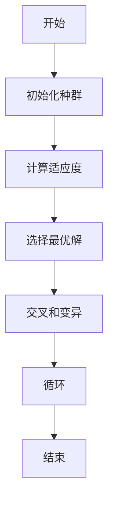
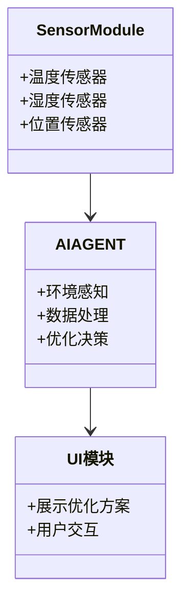
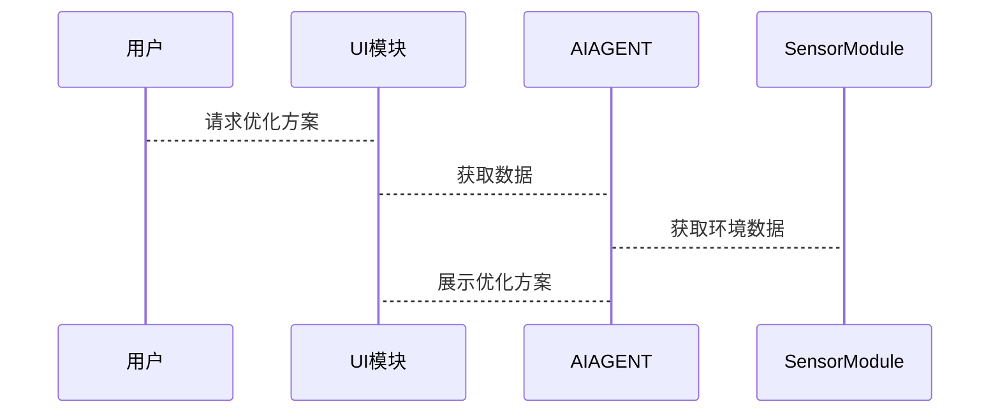

                 


# 智能厨房吊柜：AI Agent的厨房空间利用建议

> 关键词：智能厨房吊柜、AI Agent、厨房空间优化、智能家居、空间利用、算法优化

> 摘要：随着智能家居的普及，厨房空间的高效利用成为一个重要课题。本文通过分析AI Agent在厨房空间优化中的应用，提出了智能厨房吊柜的设计方案，结合优化算法和系统架构，详细阐述了其实现过程及实际案例，为智能家居的发展提供了新的思路。

---

## 第一部分: 智能厨房吊柜的背景与概念

### 第1章: 智能厨房吊柜的发展背景

#### 1.1 智能家居的发展趋势
智能家居的概念起源于20世纪90年代，随着物联网、人工智能等技术的发展，智能家居逐步从概念走向现实。如今，智能家居已经渗透到家庭生活的方方面面，包括灯光控制、安防系统、家电控制等。厨房作为家庭生活中重要的功能区域，智能化改造的需求日益迫切。

智能家居的发展趋势主要体现在以下几个方面：
- **智能化集成**：通过物联网技术将家中设备互联互通，实现远程控制和自动化管理。
- **人工智能应用**：AI技术的应用使得智能家居设备能够学习用户习惯，提供个性化服务。
- **节能环保**：智能家居通过优化能源使用，降低能耗，符合绿色发展的趋势。

#### 1.2 厨房智能化的必要性
厨房是家庭中使用频率较高的空间，但由于空间有限、功能复杂，往往存在以下问题：
- **空间利用率低**：厨房物品摆放杂乱，缺乏系统性规划，导致空间浪费。
- **操作不便**：传统厨房设备操作繁琐，缺乏智能化支持，影响使用体验。
- **安全性问题**：厨房环境中存在火源、水源等安全隐患，需要智能化监控。

通过智能化改造，厨房可以实现以下目标：
- **提高空间利用率**：通过智能规划和动态调整，最大化利用厨房空间。
- **提升使用体验**：通过智能化设备和AI技术，简化操作流程，提供便捷服务。
- **增强安全性**：通过智能监控和预警系统，降低安全隐患。

#### 1.3 AI Agent在智能家居中的应用
AI Agent（智能代理）是一种能够感知环境、自主决策并执行任务的智能实体。在智能家居中，AI Agent可以作为家庭设备的管理者，通过感知用户需求和环境变化，优化设备运行策略，提升用户体验。

AI Agent的核心技术包括：
- **感知技术**：通过传感器、摄像头等设备感知环境信息。
- **决策技术**：基于感知信息，利用机器学习算法进行决策。
- **执行技术**：通过控制接口执行决策结果。

AI Agent在厨房中的应用主要体现在：
- **空间优化**：通过分析厨房布局和物品使用频率，动态调整物品存储位置。
- **设备控制**：根据用户习惯和环境变化，智能控制厨房设备的运行状态。
- **安全监控**：实时监控厨房环境，发现异常情况及时预警。

---

### 第2章: 智能厨房吊柜的空间利用问题背景

#### 2.1 厨房空间利用的现状
厨房空间利用效率低的问题主要体现在以下方面：
- **物品摆放混乱**：厨房物品种类繁多，缺乏系统性规划，导致空间浪费。
- **功能分区不合理**：厨房功能分区不明确，影响使用效率。
- **缺乏动态调整**：厨房空间利用缺乏灵活性，无法根据用户需求实时调整。

#### 2.2 AI Agent在厨房空间优化中的应用前景
AI Agent通过感知厨房环境和用户需求，能够实现厨房空间的动态优化。其主要优势包括：
- **智能化规划**：通过分析用户行为和物品使用频率，优化物品存储位置。
- **实时调整**：根据厨房环境变化，动态调整空间利用方案。
- **个性化服务**：基于用户习惯和偏好，提供定制化空间利用建议。

---

### 第3章: 智能厨房吊柜的空间利用优化原理

#### 3.1 空间利用优化的基本原理
空间利用优化的目标是通过科学规划和动态调整，最大化利用厨房空间。其基本原理包括：
- **空间分析**：分析厨房空间的可用区域和物品摆放需求。
- **优化算法**：利用数学模型和优化算法，找到最优的空间利用方案。
- **效果评估**：通过评价指标，评估空间利用方案的优劣。

#### 3.2 AI Agent在空间优化中的核心作用
AI Agent通过感知厨房环境和用户需求，能够实现以下优化：
- **空间感知**：通过传感器感知厨房空间的可用区域和物品摆放位置。
- **优化算法**：利用遗传算法、模拟退火等优化算法，找到最优的空间利用方案。
- **效果评估**：通过评价指标，评估空间利用方案的优劣。

---

### 第4章: 空间优化算法的设计与实现

#### 4.1 空间优化算法的设计
空间优化算法的设计目标是找到最优的物品摆放位置，最大化利用厨房空间。常见的空间优化算法包括：
- **遗传算法**：通过模拟自然选择和遗传变异，逐步优化解。
- **模拟退火算法**：通过模拟金属退火过程，逐步优化解。

#### 4.2 空间优化算法的实现
以下是一个简单的空间优化算法实现示例：

```python
def space_optimization(items, space):
    # 初始化种群
    population = initialize_population(items, space)
    best_solution = None
    
    while not population.empty():
        # 计算种群适应度
        fitness = compute_fitness(population, space)
        # 选择最优解
        best_solution = select_best(fitness)
        # 交叉和变异
        population = mutate_population(best_solution)
    
    return best_solution
```

#### 4.3 空间优化算法的数学模型
空间优化问题可以表示为一个数学模型：

$$
\text{目标函数：} \max \sum_{i=1}^{n} x_i
$$

$$
\text{约束条件：} 
$$
$$
x_i \leq \text{可用空间}
$$
$$
x_i \geq 0
$$

---

### 第5章: 系统架构与实现方案

#### 5.1 系统架构设计
系统架构设计包括以下模块：
- **传感器模块**：用于感知厨房环境和物品位置。
- **AI Agent模块**：用于分析数据并生成优化方案。
- **用户界面模块**：用于展示优化结果和用户交互。

#### 5.2 系统实现方案
系统实现方案包括以下步骤：
1. **环境感知**：通过传感器获取厨房环境数据。
2. **数据分析**：AI Agent分析数据并生成优化方案。
3. **方案展示**：通过用户界面展示优化方案。
4. **实时调整**：根据环境变化动态调整优化方案。

---

### 第6章: 项目实战与优化建议

#### 6.1 项目环境配置
项目环境配置包括以下内容：
- **硬件设备**：安装传感器、摄像头等设备。
- **软件平台**：选择合适的AI框架（如TensorFlow）。
- **网络环境**：确保网络连接稳定。

#### 6.2 系统核心实现
系统核心实现包括以下部分：
- **数据采集**：通过传感器采集厨房环境数据。
- **数据处理**：对数据进行清洗和预处理。
- **模型训练**：基于历史数据训练AI Agent。
- **优化决策**：AI Agent生成优化方案。

---

### 第7章: 最佳实践与注意事项

#### 7.1 最佳实践
最佳实践包括以下内容：
- **定期维护**：定期检查传感器和设备，确保系统正常运行。
- **数据隐私**：保护用户数据隐私，避免数据泄露。
- **系统更新**：定期更新系统和模型，提升优化效果。

#### 7.2 注意事项
注意事项包括以下内容：
- **设备兼容性**：确保设备之间的兼容性。
- **数据准确性**：保证数据采集的准确性。
- **系统稳定性**：确保系统运行稳定，避免故障。

---

### 第8章: 总结与展望

#### 8.1 总结
本文详细介绍了AI Agent在厨房空间优化中的应用，提出了智能厨房吊柜的设计方案。通过优化算法和系统架构设计，实现了厨房空间的高效利用。

#### 8.2 展望
未来，随着AI技术的不断发展，厨房空间优化将更加智能化和个性化。AI Agent将更加智能化，能够根据用户需求实时调整空间利用方案，为用户提供更加便捷的服务。

---

### 图表说明

#### 图表1: 空间优化算法流程图


#### 图表2: 系统架构类图


#### 图表3: 系统交互序列图


---

通过以上内容，本文全面阐述了AI Agent在厨房空间优化中的应用，为智能家居的发展提供了新的思路。

