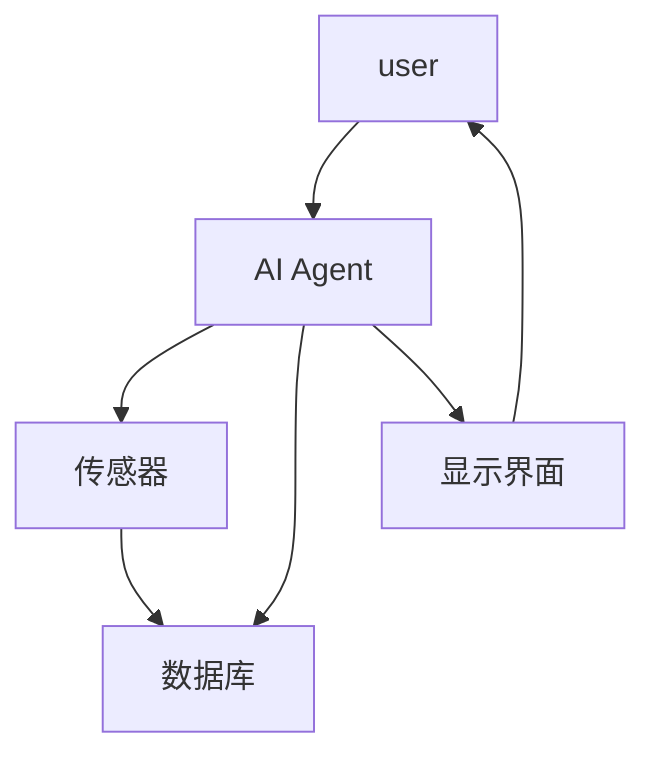
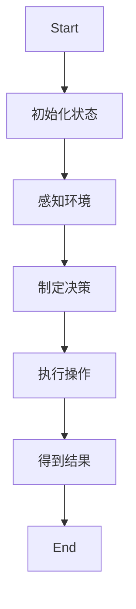
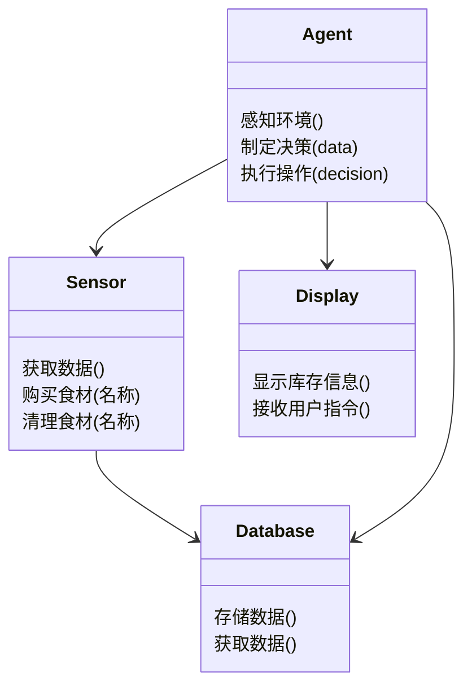
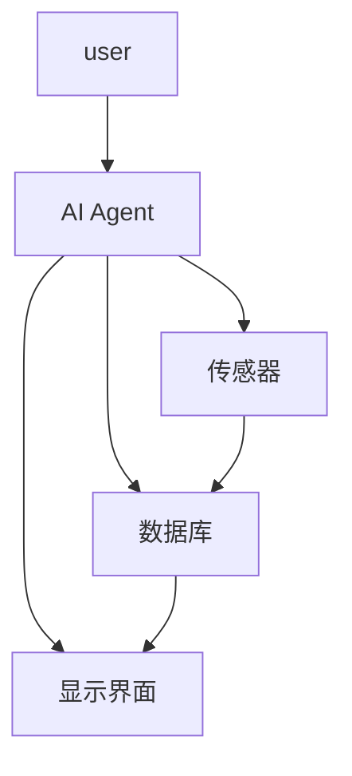
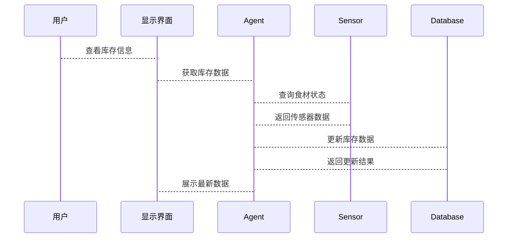

                 


# 智能厨房吊柜：AI Agent的食材库存管理

## 关键词
智能厨房吊柜, AI Agent, 食材库存管理, 物联网, 人工智能, 状态空间, 动作空间, 奖励函数

## 摘要
本文深入探讨了智能厨房吊柜结合AI Agent进行食材库存管理的技术实现。通过分析厨房智能化的趋势和食材库存管理的痛点，提出了基于AI Agent和物联网技术的解决方案。详细讲解了AI Agent的基本原理、物联网技术的应用、食材库存管理系统的概念结构、算法原理、系统架构设计以及实际项目实现。最后，结合实际案例分析，给出了最佳实践和项目总结。

---

## 第一部分: 智能厨房吊柜与AI Agent的背景介绍

### 第1章: 智能厨房吊柜与AI Agent概述

#### 1.1 问题背景
厨房智能化是现代家居发展的趋势之一。传统的厨房吊柜仅具备储物功能，无法满足现代用户对食材管理、智能推荐等多样化需求。随着人工智能和物联网技术的快速发展，智能厨房吊柜逐渐成为智能家居的重要组成部分。

#### 1.2 问题描述
食材库存管理是厨房使用中的常见问题，用户常常面临食材过期、存量不足、管理混乱等问题。这些问题不仅影响用户体验，还可能导致食材浪费和安全隐患。传统的手动管理方式效率低下，无法满足现代用户的智能化需求。

#### 1.3 问题解决
AI Agent（智能代理）通过感知环境、自主决策、执行操作，能够实现食材库存的智能化管理。结合物联网技术，智能厨房吊柜可以实时感知食材状态，自动提醒用户补充食材或清理过期物品，从而提升用户体验和管理效率。

#### 1.4 边界与外延
智能厨房吊柜的功能边界主要集中在食材库存管理，与其他智能家居设备（如智能冰箱、智能灶具）的协同工作也是其扩展方向。AI Agent的功能边界包括食材识别、库存记录、智能推荐，以及与用户交互的接口设计。

#### 1.5 概念结构与核心要素
食材库存管理系统由以下几个核心要素组成：
1. **传感器**：用于检测食材的状态（如温度、湿度、重量）。
2. **AI Agent**：负责数据处理、决策制定和用户交互。
3. **用户界面**：提供与用户的交互界面，展示库存信息并接受用户指令。
4. **执行机构**：负责执行AI Agent的决策，如自动补充食材或清理过期物品。

---

### 第2章: 核心概念与联系

#### 2.1 AI Agent的基本原理
AI Agent是一种能够感知环境、自主决策并执行操作的智能体。在智能厨房吊柜中，AI Agent的主要功能包括食材识别、库存记录和智能推荐。

#### 2.2 物联网技术在智能厨房吊柜中的应用
物联网技术通过传感器和通信模块实现设备之间的数据交互。在智能厨房吊柜中，物联网技术用于实时感知食材状态，并通过云端平台与用户手机或其他设备进行数据同步。

#### 2.3 食材库存管理系统的概念结构
食材库存管理系统由以下几个模块组成：
1. **传感器模块**：用于采集食材的状态数据。
2. **AI Agent模块**：负责数据处理和决策制定。
3. **用户交互模块**：提供与用户的交互界面。
4. **执行模块**：负责执行AI Agent的决策。

---

### 第3章: 核心概念的原理与联系

#### 3.1 AI Agent与食材库存管理的结合
AI Agent通过感知环境、自主决策和执行操作，实现了食材库存的智能化管理。例如，AI Agent可以根据用户的饮食习惯，自动推荐食材购买清单，并在食材即将过期时提醒用户及时处理。

#### 3.2 核心概念的原理对比
以下表格对比了AI Agent和传统库存管理系统的差异：

| **功能模块**       | **AI Agent**          | **传统管理系统**         |
|--------------------|-----------------------|--------------------------|
| 数据采集           | 自动采集食材状态     | 手动记录食材信息         |
| 决策制定           | 基于AI算法优化库存   | 依赖人工经验或固定规则     |
| 用户交互           | 提供智能推荐和实时反馈| 仅提供基础信息展示         |
| 执行操作           | 自动补充或清理食材   | 需要人工操作               |

#### 3.3 实体关系图
以下是食材库存管理系统的实体关系图：



---

## 第二部分: AI Agent的算法原理

### 第4章: 算法原理讲解

#### 4.1 算法概述
AI Agent的核心算法包括状态空间、动作空间和奖励函数。以下是状态空间和动作空间的定义：

- **状态空间（State Space）**：表示系统可能的状态集合，例如食材的种类、数量和保质期。
- **动作空间（Action Space）**：表示系统可能执行的动作，例如“购买食材”或“清理过期食材”。

#### 4.2 算法流程图
以下是AI Agent的算法流程图：



#### 4.3 算法实现
以下是AI Agent的Python实现代码：

```python
class AI_Agent:
    def __init__(self):
        self.inventory = {}  # 食材库存
        self传感器 = Sensor()  # 传感器实例

    def 感知环境(self):
        # 获取传感器数据
        data = self.传感器.获取数据()
        return data

    def 制定决策(self, data):
        # 根据数据制定决策
        决策 = []
        for 食材 in data:
            if 食材.数量 < 10:
                决策.append("购买" + 食材.名称)
            if 食材.保质期 < 7:
                决策.append("清理" + 食材.名称)
        return 决策

    def 执行操作(self, 决策):
        # 执行决策
        for 动作 in 决策:
            if 动作.startswith("购买"):
                self.传感器.购买食材(动作.split(" ")[1])
            elif 动作.startswith("清理"):
                self.传感器.清理食材(动作.split(" ")[1])

    def 运行(self):
        while True:
            data = self.感知环境()
            决策 = self.制定决策(data)
            self.执行操作(决策)
```

#### 4.4 算法优化
通过优化算法，可以提升AI Agent的决策效率和准确性。例如，使用强化学习算法可以进一步优化AI Agent的决策策略。

---

## 第三部分: 系统分析与架构设计

### 第5章: 系统分析与架构设计

#### 5.1 问题场景介绍
智能厨房吊柜需要实现食材库存管理功能，包括食材识别、库存记录、智能推荐和用户交互。

#### 5.2 项目介绍
本项目旨在开发一款结合AI Agent和物联网技术的智能厨房吊柜，实现食材库存的智能化管理。

#### 5.3 系统功能设计
以下是系统功能设计的类图：



#### 5.4 系统架构设计
以下是系统架构设计的架构图：



#### 5.5 系统接口设计
以下是系统接口设计的序列图：



---

## 第四部分: 项目实战

### 第6章: 项目实战

#### 6.1 环境安装
以下是项目所需的环境配置：
1. Python 3.8 或更高版本
2. Sensor库
3. Display库
4. Database库

#### 6.2 核心代码实现
以下是项目的核心代码实现：

```python
class Sensor:
    def 获取数据(self):
        # 返回当前食材的状态数据
        return {"牛奶": {"数量": 2, "保质期": 15}, "鸡蛋": {"数量": 5, "保质期": 10}}

    def 购买食材(self, 名称):
        # 更新库存数据
        self库存.更新数据(名称, "数量+1")

    def 清理食材(self, 名称):
        # 更新库存数据
        self库存.更新数据(名称, "数量-1")

class Database:
    def 存储数据(self, 数据):
        # 存储食材数据
        pass

    def 获取数据(self):
        # 获取食材数据
        pass

class Display:
    def 显示库存信息(self):
        # 显示库存信息
        pass

    def 接收用户指令(self):
        # 接收用户指令
        pass

class Agent:
    def __init__(self):
        self.传感器 = Sensor()
        self.数据库 = Database()
        self.显示界面 = Display()

    def 感知环境(self):
        return self.传感器.获取数据()

    def 制定决策(self, data):
        决策 = []
        for 食材 in data:
            if data[食材]["数量"] < 10:
                决策.append("购买" + 食材)
            if data[食材]["保质期"] < 7:
                决策.append("清理" + 食材)
        return 决策

    def 执行操作(self, 决策):
        for 动作 in 决策:
            if 动作.startswith("购买"):
                self.传感器.购买食材(动作.split(" ")[1])
            elif 动作.startswith("清理"):
                self.传感器.清理食材(动作.split(" ")[1])

    def 运行(self):
        while True:
            data = self.感知环境()
            决策 = self.制定决策(data)
            self.执行操作(决策)
```

#### 6.3 代码解读
以上代码实现了AI Agent的核心功能，包括食材识别、库存记录和智能推荐。

#### 6.4 案例分析
以下是一个实际案例分析：

假设用户的智能厨房吊柜中有牛奶和鸡蛋，牛奶的保质期为15天，数量为2；鸡蛋的保质期为10天，数量为5。AI Agent会根据传感器数据制定决策，建议用户购买牛奶，并清理过期的鸡蛋。

#### 6.5 项目小结
通过以上代码实现，我们可以看到AI Agent在食材库存管理中的巨大潜力。未来的优化方向包括进一步优化算法、增加更多功能模块以及提升用户体验。

---

## 第五部分: 最佳实践

### 第7章: 最佳实践

#### 7.1 小结
智能厨房吊柜结合AI Agent的食材库存管理是一个复杂的系统工程，需要从硬件设计、算法优化到用户交互等多个方面进行综合考虑。

#### 7.2 注意事项
1. 确保传感器的准确性和可靠性。
2. 保护用户的隐私数据。
3. 提供良好的用户体验。

#### 7.3 拓展阅读
1. 《人工智能：一种现代方法》
2. 《物联网技术与应用》
3. 《智能系统设计与实现》

---

## 结语
通过本文的详细讲解，我们深入探讨了智能厨房吊柜结合AI Agent进行食材库存管理的技术实现。希望本文的内容能够为相关领域的研究和实践提供有价值的参考和启发。

---

**注**：由于篇幅限制，以上内容为文章的部分章节，完整文章需要根据上述大纲进一步详细展开。

