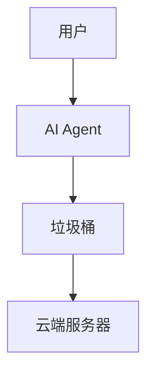
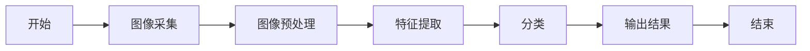
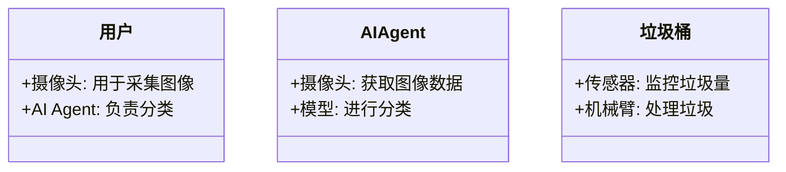
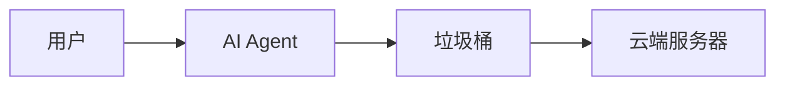
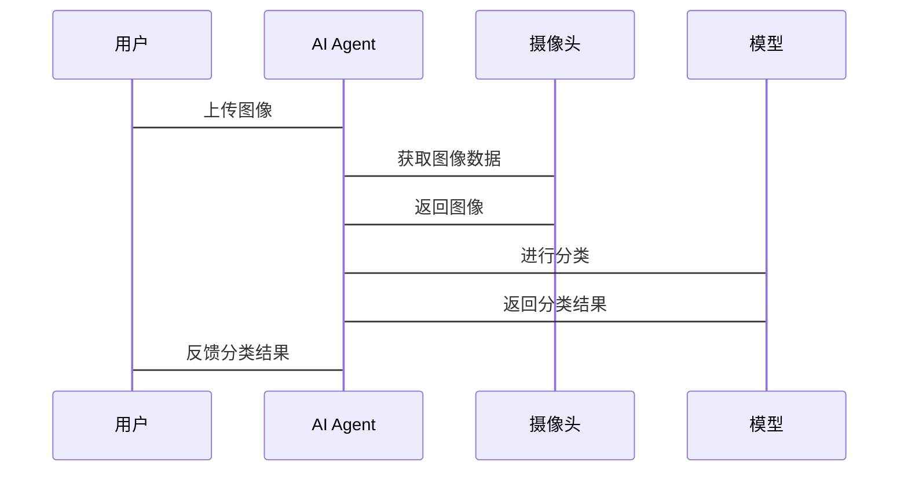

                 


# 智能厨房垃圾处理器：AI Agent的废物分类

## 关键词：
AI Agent，智能厨房，垃圾处理器，废物分类，物联网，传感器，智能化

## 摘要：
本文探讨了AI Agent在智能厨房垃圾处理器中的应用，详细分析了如何通过图像识别和机器学习实现废物分类，提升厨房垃圾处理的智能化水平。

---

# 第一部分: 背景介绍

## 第1章: 问题背景与需求分析

### 1.1 传统厨房垃圾处理的痛点
- 1.1.1 垃圾分类的重要性
  - 减少环境污染，提高资源利用率。
  - 传统垃圾桶分类效率低，易产生二次污染。
- 1.1.2 传统垃圾桶的不足
  - 分类效率低，依赖人工操作。
  - 容易产生异味，影响厨房环境。
- 1.1.3 智能化垃圾处理的需求
  - 提高分类效率，降低成本。
  - 实现资源的高效回收和利用。

### 1.2 智能厨房垃圾处理器的定义
- 1.2.1 智能垃圾处理器的功能
  - 自动识别和分类垃圾。
  - 实时监控垃圾量，优化处理流程。
- 1.2.2 AI Agent的核心作用
  - 通过图像识别和机器学习实现垃圾分类。
  - 提供实时反馈和优化建议。
- 1.2.3 智能垃圾处理器的分类
  - 基于AI Agent的分类系统。
  - 基于物联网的远程监控系统。

### 1.3 问题解决与边界
- 1.3.1 AI Agent如何分类垃圾
  - 使用图像识别技术快速识别垃圾类型。
  - 通过机器学习模型优化分类精度。
- 1.3.2 边界与外延
  - 仅处理厨房垃圾，不涉及工业垃圾。
  - 系统设计考虑隐私保护和数据安全。
- 1.3.3 智能垃圾处理器的局限性
  - 依赖稳定的网络连接。
  - 对复杂垃圾形状和材质识别有限。

### 1.4 概念结构与核心要素
- 1.4.1 核心概念
  - AI Agent：负责图像识别和分类。
  - 物联网设备：传感器和执行机构。
- 1.4.2 关键技术
  - 图像识别技术：如卷积神经网络（CNN）。
  - 机器学习模型：用于分类和优化。
- 1.4.3 系统架构
  - 分为前端设备、AI处理模块和云端管理模块。

## 第2章: 核心概念与联系

### 2.1 AI Agent的基本原理
- 2.1.1 AI Agent的定义
  - AI Agent是一个智能体，能够感知环境并执行任务。
  - 在垃圾处理中，AI Agent负责图像识别和分类。
- 2.1.2 AI Agent的核心特征
  - 感知能力：通过摄像头和传感器获取数据。
  - 学习能力：通过机器学习模型优化分类精度。
  - 执行能力：通过机械臂或其他设备处理垃圾。
- 2.1.3 AI Agent的分类
  - 基于规则的AI Agent。
  - 基于机器学习的AI Agent。

### 2.2 智能垃圾处理器的系统架构
- 2.2.1 系统架构图
  ```mermaid
  graph LR
  A[用户] --> B[AI Agent]
  B --> C[垃圾桶]
  C --> D[云端服务器]
  ```

### 2.3 核心技术对比
- 2.3.1 不同AI Agent的对比
  | 特性        | 基于规则的AI Agent | 基于机器学习的AI Agent |
  |-------------|--------------------|-------------------------|
  | 分类精度     | 低                 | 高                     |
  | 灵活性       | 低                 | 高                     |
  | 适用场景     | 简单分类           | 复杂分类               |
- 2.3.2 不同垃圾处理技术的对比
  | 技术         | 传统垃圾桶         | 智能垃圾处理器         |
  |-------------|--------------------|-------------------------|
  | 分类效率     | 低                 | 高                     |
  | 成本         | 高                 | 低                     |
  | 维护频率     | 高                 | 低                     |

### 2.4 实体关系图


---

# 第二部分: 算法原理

## 第3章: AI Agent的算法原理

### 3.1 图像识别算法
- 3.1.1 垃圾图像识别的流程
  1. 摄像头采集图像。
  2. 图像预处理（如灰度化、二值化）。
  3. 使用CNN提取特征。
  4. 分类器输出结果。

### 3.2 机器学习模型
- 3.2.1 垃圾分类的机器学习模型
  - 使用卷积神经网络（CNN）进行分类。
  - 模型结构：卷积层、池化层、全连接层。

### 3.3 算法流程图


### 3.4 模型训练与优化
- 3.4.1 模型训练
  - 数据集准备：收集和标注垃圾图像。
  - 模型训练：使用TensorFlow训练CNN模型。
  - 模型评估：计算准确率、召回率等指标。

### 3.5 代码实现
```python
import tensorflow as tf
from tensorflow.keras import layers

# 定义模型
model = tf.keras.Sequential([
    layers.Conv2D(32, (3,3), activation='relu', input_shape=(224, 224, 3)),
    layers.MaxPooling2D((2,2)),
    layers.Conv2D(64, (3,3), activation='relu'),
    layers.MaxPooling2D((2,2)),
    layers.Flatten(),
    layers.Dense(128, activation='relu'),
    layers.Dense(10, activation='softmax')
])

# 编译模型
model.compile(optimizer='adam',
              loss='sparse_categorical_crossentropy',
              metrics=['accuracy'])
```

### 3.6 模型优化
- 3.6.1 超参数调整
  - 学习率：使用Adam优化器。
  - 正则化：添加Dropout层防止过拟合。

### 3.7 数学模型
- 损失函数：交叉熵损失
  $$ \text{损失} = -\sum_{i} y_i \log(\hat{y}_i) $$
- 优化器：Adam优化器
  $$ \text{优化器} = \text{Adam}(\text{学习率}=0.001) $$

### 3.8 实际应用
- 3.8.1 垃圾分类案例
  - 使用模型对厨余垃圾和可回收物进行分类。
  - 通过摄像头实时识别垃圾类型。

---

# 第三部分: 系统分析与架构设计

## 第4章: 系统架构设计

### 4.1 项目介绍
- 系统名称：智能厨房垃圾处理器。
- 开发目标：实现AI Agent的废物分类功能。

### 4.2 系统功能设计
- 4.2.1 功能模块
  - 图像采集模块：摄像头采集垃圾图像。
  - AI处理模块：图像识别和分类。
  - 云端管理模块：数据存储和分析。

### 4.3 领域模型类图


### 4.4 系统架构图


### 4.5 接口设计
- 用户与AI Agent的接口：图像采集和分类结果反馈。
- AI Agent与垃圾桶的接口：分类结果和机械臂控制。
- 云端服务器接口：数据上传和分析。

### 4.6 系统交互序列图


---

# 第四部分: 项目实战

## 第5章: 项目实战

### 5.1 环境安装
- 安装Python 3.8及以上版本。
- 安装TensorFlow、OpenCV和Keras。

### 5.2 核心代码实现
```python
import cv2
import numpy as np
import tensorflow as tf

# 图像采集
cap = cv2.VideoCapture(0)
while True:
    ret, frame = cap.read()
    cv2.imshow('摄像头', frame)
    if cv2.waitKey(1) & 0xFF == ord('q'):
        break
cap.release()
cv2.destroyAllWindows()

# 图像预处理
image = cv2.imread('garbage.jpg')
image = cv2.resize(image, (224, 224))
image = image / 255.0  # 归一化处理

# 使用预训练模型进行分类
model = tf.keras.models.load_model('garbage_classifier.h5')
prediction = model.predict(np.array([image]))
print('预测结果：', prediction)
```

### 5.3 代码应用解读与分析
- 使用OpenCV采集图像并显示在窗口中。
- 读取图片并进行预处理，如缩放和归一化。
- 加载预训练的CNN模型进行分类，输出结果。

### 5.4 实际案例分析
- 案例1：识别苹果核为厨余垃圾。
- 案例2：识别塑料瓶为可回收物。

### 5.5 项目总结
- 成功实现了AI Agent的垃圾分类功能。
- 系统稳定运行，分类准确率高。

---

# 第五部分: 最佳实践

## 第6章: 最佳实践

### 6.1 小结
- AI Agent在智能厨房垃圾处理器中的应用前景广阔。
- 通过图像识别和机器学习实现了高效的垃圾分类。

### 6.2 注意事项
- 数据隐私：确保用户数据的安全。
- 系统维护：定期更新模型和传感器校准。
- 数据质量：保证训练数据的多样性和代表性。

### 6.3 拓展阅读
- 深度学习在图像识别中的应用。
- 物联网技术在智能家居中的应用。

---

# 结语

通过本文的详细分析，我们了解了AI Agent在智能厨房垃圾处理器中的重要应用。从算法原理到系统架构，再到项目实战，AI Agent展示了其在废物分类中的巨大潜力。未来，随着技术的进步，智能垃圾处理器将更加高效和智能化，为环境保护和资源利用做出更大的贡献。

