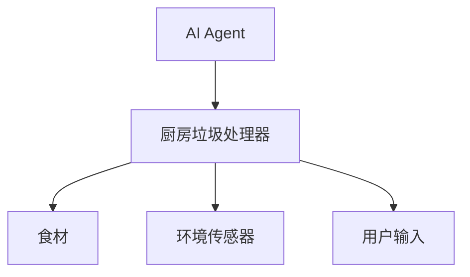
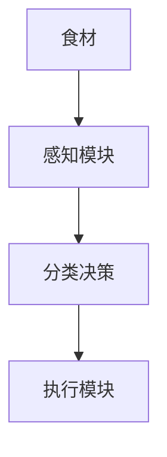
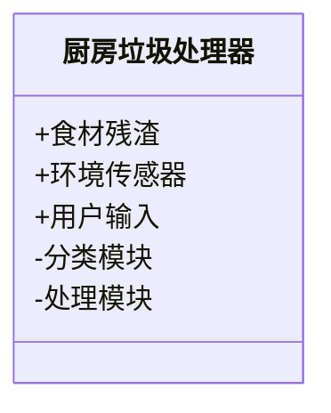
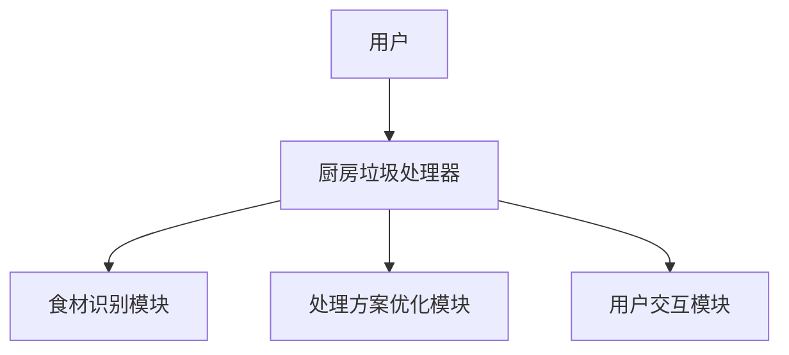
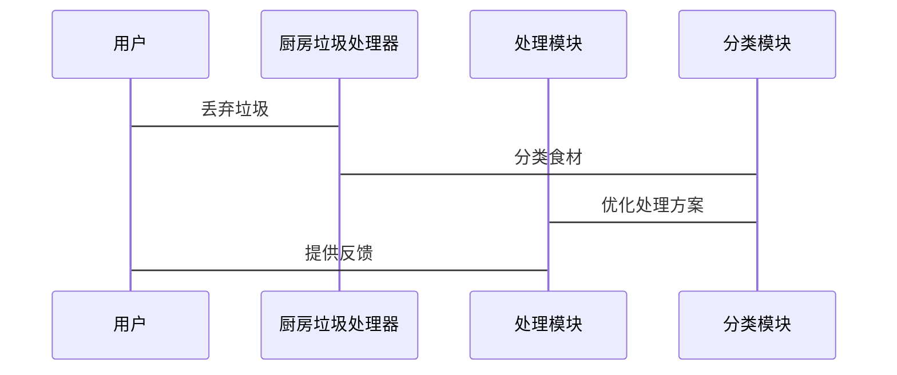

                 


# 智能厨房垃圾处理器：AI Agent的食材利用建议

## 关键词：智能厨房垃圾处理器，AI Agent，食材利用，环境优化，资源回收，可持续发展

## 摘要：  
智能厨房垃圾处理器通过AI Agent技术，将厨房垃圾中的食材残渣进行智能分类、处理和再利用，最大化资源回收和环境优化。本文将深入探讨AI Agent在厨房垃圾处理器中的工作原理、算法实现、系统架构以及实际应用，为读者提供全面的技术解析。

---

## 第1章 智能厨房垃圾处理器的背景介绍

### 1.1 问题背景与描述  
厨房垃圾处理是一个全球性的环保难题。传统垃圾处理方式存在效率低、资源浪费和环境污染等问题。随着人工智能技术的发展，利用AI Agent优化厨房垃圾处理成为可能。  

### 1.2 问题解决思路  
通过AI Agent实现厨房垃圾的智能化分类、处理和再利用，减少资源浪费，降低环境负担。  

### 1.3 概念结构与核心要素  
- **核心要素**：AI Agent、食材分类、环境传感器、用户交互  
- **系统目标**：最大化资源回收，减少环境污染  

---

## 第2章 AI Agent的基本概念与原理

### 2.1 AI Agent的定义与特点  
AI Agent是一种能够感知环境、自主决策并执行任务的智能实体，具有以下特点：  
- **自主性**：无需外部干预  
- **反应性**：实时感知并调整行为  
- **目标导向**：基于目标进行决策  

#### AI Agent与传统自动化的区别  
| 属性       | AI Agent                | 传统自动化        |  
|------------|-------------------------|------------------|  
| 决策能力   | 高                     | 低               |  
| 灵活性     | 高                     | 低               |  

### 2.2 AI Agent的实体关系分析  


---

## 第3章 AI Agent的感知与分类算法

### 3.1 食材分类算法  
AI Agent通过感知模块对食材进行分类，以下是核心算法流程：  

#### 3.1.1 分类算法的数学模型  
$$f(x) = w^T x + b$$  
其中，$x$是食材特征向量，$w$是权重向量，$b$是偏置项。  

#### 3.1.2 分类算法的实现步骤  


#### 3.1.3 分类算法的代码实现  
```python
import tensorflow as tf
import numpy as np

# 定义模型
model = tf.keras.Sequential([
    tf.keras.layers.Dense(64, activation='relu'),
    tf.keras.layers.Dense(10, activation='softmax')
])

# 编译模型
model.compile(optimizer='adam',
              loss='sparse_categorical_crossentropy',
              metrics=['accuracy'])

# 训练模型
model.fit(x_train, y_train, epochs=10, batch_size=32)
```

---

## 第4章 智能厨房垃圾处理器的系统架构设计

### 4.1 问题场景介绍  
系统需处理以下场景：  
- 用户丢弃厨房垃圾  
- AI Agent识别并分类食材残渣  
- 执行相应的处理操作  

### 4.2 系统功能设计  
- **食材识别模块**：使用图像识别技术识别食材类型  
- **处理方案优化模块**：基于分类结果制定处理方案  
- **用户交互模块**：提供操作界面和反馈  

#### 4.2.1 领域模型设计  


#### 4.2.2 系统架构设计  


#### 4.2.3 系统接口设计  
- **输入接口**：接收用户丢弃的食材残渣  
- **输出接口**：输出处理结果和反馈信息  

#### 4.2.4 系统交互设计  


---

## 第5章 项目实战

### 5.1 环境安装  
- **安装Python**：版本3.6及以上  
- **安装TensorFlow**：用于深度学习模型训练  
- **安装OpenCV**：用于图像处理  

### 5.2 系统核心实现  
以下是食材分类模块的核心代码：  
```python
import cv2
import numpy as np
from tensorflow.keras.models import load_model

# 加载预训练模型
model = load_model('food_classifier.h5')

# 图像预处理
def preprocess_image(image_path):
    image = cv2.imread(image_path)
    image = cv2.resize(image, (224, 224))
    image = image / 255.0  # 归一化
    return image

# 分类预测
def classify_food(image_path):
    image = preprocess_image(image_path)
    prediction = model.predict(np.array([image]))
    return np.argmax(prediction[0])

# 示例使用
classify_food('apple.jpg')
```

### 5.3 实际案例分析  
- **案例1**：用户丢弃苹果皮  
- **处理过程**：AI Agent识别苹果皮，分类为可堆肥垃圾，执行堆肥操作  
- **结果**：苹果皮被转化为肥料，减少垃圾量  

---

## 第6章 最佳实践

### 6.1 小结  
通过AI Agent实现厨房垃圾的智能化处理，能够显著提高资源利用效率，减少环境污染。  

### 6.2 注意事项  
- 数据质量：确保训练数据的多样性和代表性  
- 系统维护：定期更新模型和优化算法  

### 6.3 拓展阅读  
- 《深度学习实战》  
- 《AI系统设计与实现》  

---

## 结语  
智能厨房垃圾处理器结合AI Agent技术，为厨房垃圾的智能化处理提供了新的解决方案。通过本文的分析与实践，读者可以深入了解该系统的实现细节，并将其应用于实际场景中，为环保事业贡献力量。

