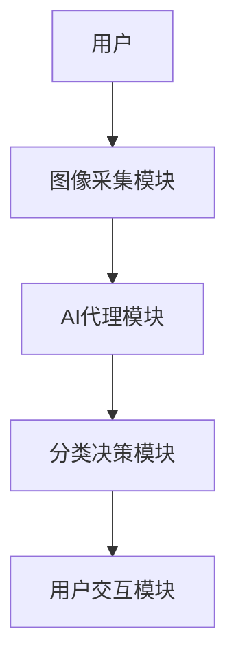
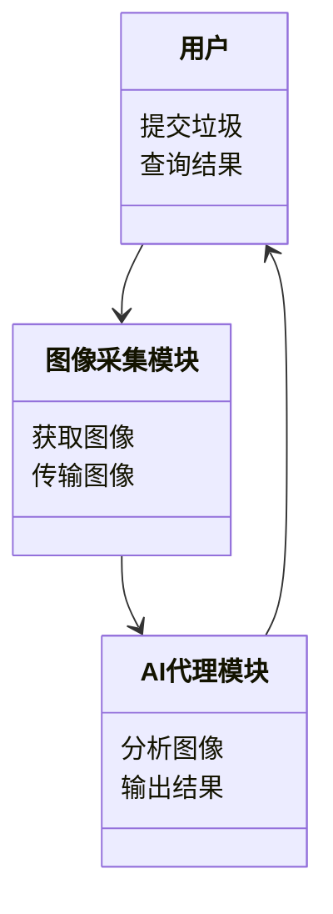
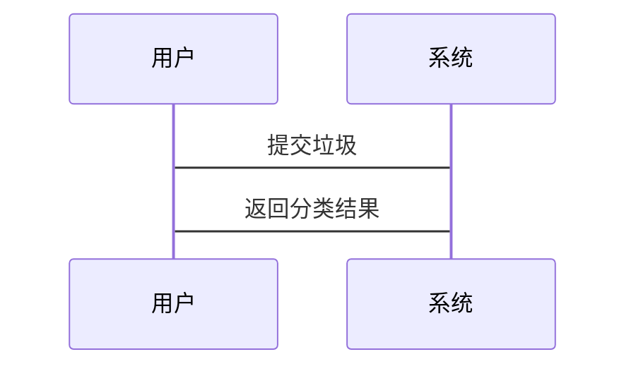

                 


# 智能厨房垃圾桶：AI Agent的厨余分类指导

> 关键词：智能垃圾桶，AI Agent，厨余分类，图像识别，垃圾分类，智能系统

> 摘要：本文深入探讨了智能厨房垃圾桶的设计与实现，重点介绍了AI代理在厨余分类中的应用。通过分析厨余分类的核心问题，结合算法原理和系统架构设计，详细阐述了基于卷积神经网络的分类算法、系统功能模块设计及实际项目实现。最后，通过最佳实践和项目小结，为读者提供了宝贵的实施经验。

---

# 第一部分: 智能厨房垃圾桶的背景与概念

## 第1章: 智能厨房垃圾桶的背景与问题描述

### 1.1 智能厨房垃圾桶的发展背景

#### 1.1.1 厨房垃圾处理的现状与挑战
现代家庭中，厨余垃圾的处理已成为一个不容忽视的问题。传统垃圾桶无法区分不同类型的垃圾，导致分类效率低下，环境污染加剧。随着人工智能技术的快速发展，智能垃圾桶应运而生，为厨余分类提供了新的解决方案。

#### 1.1.2 智能化垃圾分类的必要性
厨余垃圾的不当处理不仅浪费资源，还可能对环境造成严重污染。通过AI代理实现智能化分类，可以显著提高分类效率，减少环境污染，同时为后续垃圾处理提供便利。

#### 1.1.3 智能垃圾桶的市场前景
随着环保意识的增强和智能家居的普及，智能垃圾桶市场需求量逐年增长。AI代理的引入进一步提升了垃圾桶的功能，使其成为智能家居的重要组成部分。

### 1.2 AI Agent在厨余分类中的应用

#### 1.2.1 AI Agent的基本概念
AI Agent是一种智能代理，能够感知环境、做出决策并执行任务。在厨余分类中，AI Agent通过图像识别技术，自动识别垃圾种类并指导分类。

#### 1.2.2 AI Agent在厨余分类中的作用
AI Agent能够实时识别厨余垃圾的种类，指导用户正确分类，同时记录分类数据，为后续处理提供依据。

#### 1.2.3 智能垃圾桶的用户需求分析
用户需求主要集中在分类准确性、操作便捷性和数据隐私保护方面。AI Agent需要具备高效的分类能力，同时确保数据的安全性。

### 1.3 厨余分类的核心问题与边界

#### 1.3.1 厨余分类的核心问题
厨余分类的核心问题是准确识别垃圾种类，并指导分类。这需要AI Agent具备高效的图像识别能力和决策能力。

#### 1.3.2 分类的边界与外延
厨余分类的边界包括垃圾种类的范围、分类精度和分类速度。外延则涉及数据采集、存储和处理等环节。

#### 1.3.3 系统的核心要素与组成
系统的核心要素包括图像采集模块、AI代理模块、分类决策模块和用户交互模块。这些模块共同实现厨余分类的功能。

---

## 第2章: 智能厨房垃圾桶的核心概念与联系

### 2.1 AI Agent的原理与特性

#### 2.1.1 AI Agent的基本原理
AI Agent通过感知环境、分析数据、做出决策并执行任务。在厨余分类中，AI Agent利用图像识别技术识别垃圾种类，指导用户分类。

#### 2.1.2 AI Agent的核心特性对比
| 特性 | 传统垃圾桶 | 智能垃圾桶 |
|------|-------------|-------------|
| 分类能力 | 无 | 自动分类 |
| 操作方式 | 手动 | 自动识别 |
| 数据处理 | 无 | 实时处理 |

#### 2.1.3 AI Agent的实体关系图（ER图）
```mermaid
erDiagram
    actor 用户
    actor 系统
    actor 数据库
    用户 --> 系统 : 提交垃圾
    系统 --> 数据库 : 存储分类数据
    用户 --> 数据库 : 查询分类结果
```

### 2.2 厨余分类的算法原理

#### 2.2.1 基于图像识别的分类算法
图像识别是厨余分类的核心技术，常用算法包括卷积神经网络（CNN）和图像分割技术。

#### 2.2.2 基于规则的分类算法
规则分类算法通过预设规则实现分类，适用于简单场景，但分类精度较低。

#### 2.2.3 分类算法的优缺点对比
| 算法类型 | 优点 | 缺点 |
|----------|------|------|
| CNN | 分类精度高 | 计算资源消耗大 |
| 规则分类 | 实现简单 | 分类精度低 |

### 2.3 系统架构与模块化设计

#### 2.3.1 系统整体架构
系统采用分层架构，包括数据采集层、数据处理层和用户交互层。

#### 2.3.2 模块化设计的核心思想
模块化设计强调各模块独立性，便于维护和扩展。

#### 2.3.3 模块间的交互关系


---

## 第3章: 厨余分类的算法原理与实现

### 3.1 基于卷积神经网络的分类算法

#### 3.1.1 算法流程
1. 数据预处理：图像归一化、数据增强。
2. 模型训练：构建CNN模型，训练分类器。
3. 模型推理：接收图像输入，输出分类结果。

#### 3.1.2 算法实现
```python
import tensorflow as tf
from tensorflow.keras import layers

model = tf.keras.Sequential([
    layers.Conv2D(32, (3,3), activation='relu', input_shape=(224, 224, 3)),
    layers.MaxPooling2D((2,2)),
    layers.Conv2D(64, (3,3), activation='relu'),
    layers.MaxPooling2D((2,2)),
    layers.Flatten(),
    layers.Dense(128, activation='relu'),
    layers.Dense(num_classes, activation='softmax')
])
```

#### 3.1.3 算法的数学模型
CNN模型的核心是卷积层和池化层，数学模型如下：
$$
y = \sigma(Wx + b)
$$
其中，$\sigma$为激活函数，$W$为权重矩阵，$b$为偏置。

### 3.2 算法的优化与调优

#### 3.2.1 数据增强技术
通过旋转、翻转和缩放等技术，增加训练数据量，提升模型泛化能力。

#### 3.2.2 模型调优策略
调整学习率、批量大小和网络结构，优化模型性能。

---

## 第4章: 系统分析与架构设计方案

### 4.1 问题场景介绍

#### 4.1.1 应用场景
智能垃圾桶适用于家庭、办公室和公共场所。

#### 4.1.2 目标用户
目标用户包括普通家庭用户和垃圾分类机构。

### 4.2 系统功能设计

#### 4.2.1 领域模型


#### 4.2.2 系统架构设计


### 4.3 系统接口设计

#### 4.3.1 RESTful API
```http
POST /api/classify
Content-Type: multipart/form-data

{
    "image": "base64图像数据"
}
```

#### 4.3.2 接口设计文档
详细描述接口功能、输入输出格式和错误处理机制。

### 4.4 系统交互设计

#### 4.4.1 交互流程


---

## 第5章: 项目实战

### 5.1 项目环境搭建

#### 5.1.1 环境要求
安装Python、TensorFlow和OpenCV库。

#### 5.1.2 开发工具
推荐使用Jupyter Notebook和PyCharm进行开发。

### 5.2 核心代码实现

#### 5.2.1 图像预处理代码
```python
import cv2

def preprocess_image(image_path):
    image = cv2.imread(image_path)
    image = cv2.resize(image, (224, 224))
    image = image / 255.0
    return image
```

#### 5.2.2 模型加载与预测
```python
import numpy as np

def predict_image(model, image):
    prediction = model.predict(np.array([image]))
    class_index = np.argmax(prediction)
    return class_index
```

### 5.3 实际案例分析

#### 5.3.1 案例背景
分析一个典型的厨余垃圾图像，测试模型的分类能力。

#### 5.3.2 案例分析
图像预处理后，通过模型预测分类结果，展示分类过程和结果。

### 5.4 项目小结

#### 5.4.1 成果总结
详细总结项目成果，包括分类准确率和系统稳定性。

#### 5.4.2 经验与教训
分享开发过程中的经验教训，优化建议。

---

## 第6章: 最佳实践与总结

### 6.1 最佳实践 tips

#### 6.1.1 数据质量的重要性
高质量的数据是模型性能的关键。

#### 6.1.2 模型调优的技巧
合理调整超参数，优化模型性能。

#### 6.1.3 系统维护的建议
定期更新模型，确保系统稳定运行。

### 6.2 小结

#### 6.2.1 全文总结
回顾全文，总结智能垃圾桶的核心技术和实现方法。

#### 6.2.2 未来展望
展望AI代理在垃圾分类领域的未来发展，提出新的研究方向。

### 6.3 注意事项

#### 6.3.1 数据隐私
确保用户数据的安全性和隐私性。

#### 6.3.2 系统兼容性
确保系统与不同设备和平台的兼容性。

### 6.4 拓展阅读

#### 6.4.1 推荐书籍
推荐《深度学习入门：基于Python和Keras》等书籍。

#### 6.4.2 在线资源
推荐相关技术博客和开源项目。

---

通过以上结构，我们可以系统地介绍智能厨房垃圾桶的设计与实现，帮助读者深入了解AI代理在厨余分类中的应用。

