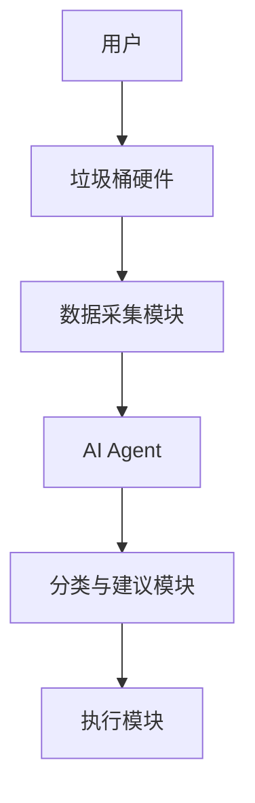

                 

# {{智能厨房垃圾桶：AI Agent的厨余处理建议}}

> 关键词：智能厨房垃圾桶、AI Agent、厨余处理、图像识别、自然语言处理、物联网

> 摘要：随着智能家居的普及，智能厨房垃圾桶逐渐成为家庭生活中不可或缺的一部分。本文深入探讨了AI Agent在厨余处理中的应用，从系统架构到算法实现，再到实际项目案例，全面解析了智能厨房垃圾桶的设计与实现。

---

# {{智能厨房垃圾桶：AI Agent的厨余处理建议}}

## 第一章: 智能厨房垃圾桶的发展背景

### 1.1 厨房垃圾桶的智能化趋势
- 1.1.1 厨房垃圾处理的现状与问题
  - 手动分类的低效性
  - 环境污染与资源浪费
  - 智能化处理的迫切需求
- 1.1.2 智能化垃圾桶的市场需求
  - 智能家居生态的兴起
  - 用户对便捷生活的追求
  - 政府对环保的要求
- 1.1.3 AI Agent在厨余处理中的应用潜力
  - 自动分类与建议
  - 用户行为分析
  - 数据驱动的优化

### 1.2 AI Agent的基本概念与特点
- 1.2.1 AI Agent的定义与核心功能
  - 自动化处理
  - 交互式反馈
  - 数据分析
- 1.2.2 AI Agent在智能垃圾桶中的角色
  - 数据采集与分析
  - 分类与建议生成
  - 用户交互与反馈
- 1.2.3 AI Agent与传统垃圾桶的区别
  - 智能化与自动化
  - 数据驱动的优化
  - 用户交互能力

### 1.3 智能厨房垃圾桶的核心价值
- 1.3.1 提高厨余处理效率
  - 自动分类减少错误率
  - 提高垃圾处理速度
- 1.3.2 优化厨房环境
  - 减少异味
  - 提高空间利用率
- 1.3.3 推动智能家居生态发展
  - 数据共享与联动
  - 智能家居一体化

### 1.4 本章小结
- 通过分析智能厨房垃圾桶的发展背景，明确了AI Agent在厨余处理中的重要性，以及智能化垃圾桶的核心价值和市场潜力。

---

## 第二章: AI Agent与厨余处理的结合

### 2.1 AI Agent在厨余处理中的应用场景
- 2.1.1 垃圾分类与识别
  - 图像识别技术
  - 数据采集与处理
- 2.1.2 垃圾处理建议与优化
  - 自然语言处理
  - 数据驱动的优化算法
- 2.1.3 用户行为分析与反馈
  - 用户习惯分析
  - 个性化建议生成

### 2.2 AI Agent的核心算法与技术
- 2.2.1 图像识别技术
  - 基于深度学习的垃圾分类
  - 图像识别模型的训练与优化
- 2.2.2 自然语言处理
  - 用户指令解析
  - 垃圾处理建议生成
- 2.2.3 数据分析与优化算法
  - 数据收集与分析
  - 优化建议生成

### 2.3 AI Agent与智能垃圾桶的交互流程
- 2.3.1 用户输入与数据采集
  - 数据采集模块设计
  - 数据预处理
- 2.3.2 AI Agent的处理逻辑
  - 图像识别与分类
  - 自然语言处理与建议生成
- 2.3.3 系统反馈与执行
  - 用户反馈
  - 系统执行

### 2.4 本章小结
- 详细分析了AI Agent在厨余处理中的应用场景，介绍了核心算法与技术，并设计了交互流程。

---

## 第三章: 智能厨房垃圾桶的系统架构

### 3.1 系统整体架构设计
- 3.1.1 系统功能模块划分
  - 数据采集模块
  - AI Agent模块
  - 用户交互模块
- 3.1.2 系统组件之间的关系
  - 数据流与功能划分
  - 模块间通信设计
- 3.1.3 系统架构的可扩展性
  - 模块化设计
  - 灵活性与可扩展性

### 3.2 系统功能设计
- 3.2.1 垃圾分类与识别功能
  - 功能模块设计
  - 实现逻辑分析
- 3.2.2 AI Agent的处理建议功能
  - 功能模块设计
  - 实现逻辑分析
- 3.2.3 用户交互界面设计
  - UI设计
  - 用户体验优化

### 3.3 系统接口设计
- 3.3.1 数据采集接口
  - 接口设计
  - 交互流程
- 3.3.2 AI Agent接口
  - 接口设计
  - 交互流程
- 3.3.3 用户反馈接口
  - 接口设计
  - 交互流程

### 3.4 系统架构图（Mermaid）

### 3.5 本章小结
- 通过系统架构设计，明确了智能厨房垃圾桶的模块划分、接口设计和系统架构。

---

## 第四章: AI Agent的核心算法实现

### 4.1 图像识别算法
- 4.1.1 基于深度学习的图像识别
  - 神经网络模型选择
  - 模型训练与优化
- 4.1.2 垃圾分类的常用算法
  - CNN网络设计
  - 模型训练与评估
- 4.1.3 图像识别模型的训练与优化
  - 数据增强
  - 模型调优

### 4.2 自然语言处理算法
- 4.2.1 基于NLP的用户指令解析
  - 词袋模型与TF-IDF
  - 基于深度学习的NLP模型
- 4.2.2 垃圾处理建议的生成逻辑
  - 生成模型设计
  - 建模与优化
- 4.2.3 对话系统的设计与实现
  - 对话树设计
  - 对话系统实现

### 4.3 数据分析与优化算法
- 4.3.1 垃圾处理数据的收集与分
  - 数据清洗
  - 数据预处理
- 4.3.2 数据分析与优化算法
  - 数据分析方法
  - 优化算法设计
- 4.3.3 数据驱动的优化建议
  - 数据分析结果
  - 优化建议生成

### 4.4 本章小结
- 详细介绍了AI Agent的核心算法实现，包括图像识别、自然语言处理和数据分析优化。

---

## 第五章: 智能厨房垃圾桶的项目实战

### 5.1 环境安装与配置
- 5.1.1 系统环境要求
  - 操作系统
  - 开发工具
  - 依赖库安装
- 5.1.2 硬件设备配置
  - 摄像头
  - 传感器
  - 网络接口
- 5.1.3 软件环境配置
  - Python版本
  - 深度学习框架
  - 依赖库安装

### 5.2 系统核心实现
- 5.2.1 数据采集模块实现
  - 代码实现
  - 功能测试
- 5.2.2 AI Agent模块实现
  - 代码实现
  - 功能测试
- 5.2.3 用户交互界面实现
  - 代码实现
  - 功能测试

### 5.3 代码应用解读与分析
- 5.3.1 数据采集模块代码解读
  - 代码结构
  - 功能分析
- 5.3.2 AI Agent模块代码解读
  - 代码结构
  - 功能分析
- 5.3.3 用户交互界面代码解读
  - 代码结构
  - 功能分析

### 5.4 实际案例分析
- 5.4.1 案例背景介绍
  - 案例场景
  - 需求分析
- 5.4.2 系统实现与分析
  - 实现过程
  - 系统性能分析
- 5.4.3 案例总结与优化建议
  - 成功经验
  - 改进方向

### 5.5 本章小结
- 通过项目实战，详细介绍了智能厨房垃圾桶的环境配置、系统实现和实际案例分析。

---

## 第六章: 总结与展望

### 6.1 本章总结
- 总结全文内容
- 强调AI Agent在厨余处理中的重要性
- 总结系统架构与算法实现的核心要点

### 6.2 未来展望
- 智能厨房垃圾桶的发展趋势
- AI Agent技术的进一步优化
- 智能家居生态的未来发展

### 6.3 最佳实践 tips
- 系统设计中的注意事项
- 开发中的常见问题与解决方案
- 使用中的注意事项

### 6.4 本章小结
- 总结全文，展望未来发展方向，提供实用的建议。

---

## 参考文献
- 列出相关技术文献、学术论文和参考资料。

---

## 致谢
- 感谢参与项目开发的团队成员。
- 感谢读者的支持与关注。

---

