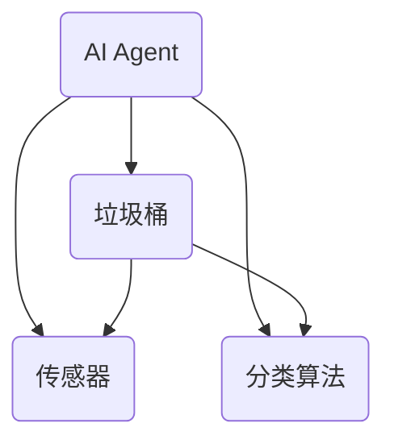
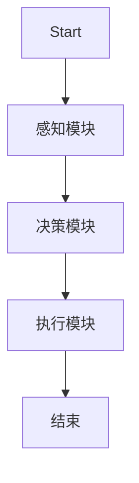
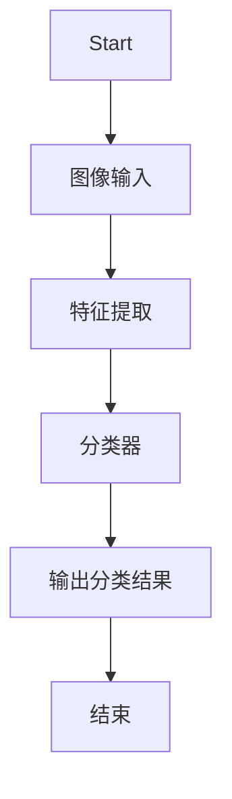
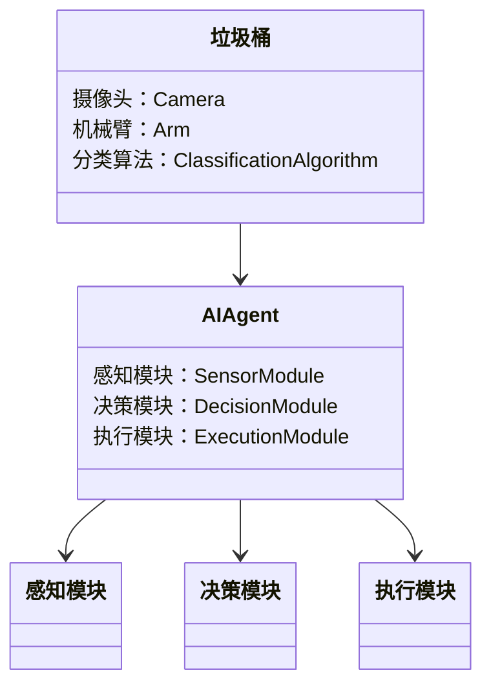
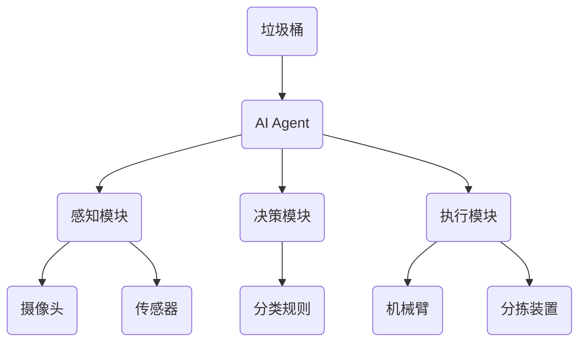
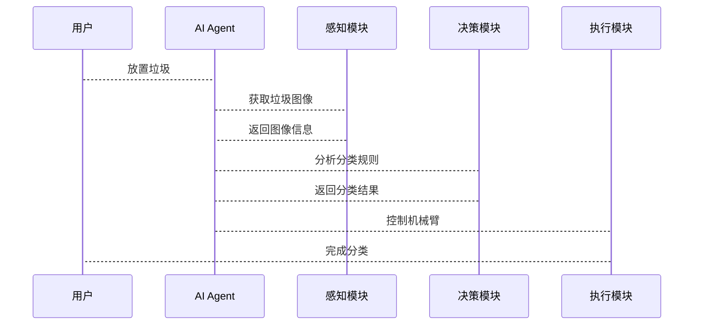

                 


# 智能厨房垃圾桶：AI Agent的废物回收建议

## 关键词：智能垃圾桶, AI Agent, 垃圾分类, 图像识别, 人工智能, 废物回收

## 摘要：  
智能厨房垃圾桶是一种结合了人工智能技术的创新设备，旨在通过AI Agent实现智能化的废物分类与回收管理。本文从问题背景、核心概念、算法原理、系统架构到项目实战，全面解析智能厨房垃圾桶的设计与实现。通过AI技术的应用，智能垃圾桶能够有效提升垃圾分类效率，减少环境污染，为用户打造更智能、更环保的厨房环境。

---

# 第一部分: 智能厨房垃圾桶的背景与概念

## 第1章: 智能厨房垃圾桶的背景介绍

### 1.1 问题背景  
#### 1.1.1 当前厨房垃圾处理的痛点  
在现代家庭中，厨房垃圾的处理是一个常见但容易被忽视的问题。由于垃圾分类的复杂性，许多用户在日常生活中难以准确分类垃圾，导致资源浪费和环境污染。传统垃圾桶的功能单一，无法提供实时反馈或优化建议。因此，如何通过技术手段提升垃圾分类的效率和准确性，成为亟待解决的问题。  

#### 1.1.2 垃圾分类的重要性  
垃圾分类是实现可持续发展的重要环节。通过合理分类，可回收物、厨余垃圾和其他垃圾可以得到有效的处理和再利用，减少对环境的污染。然而，用户的分类习惯和知识水平参差不齐，导致分类效率低下。  

#### 1.1.3 智能化垃圾桶的必要性  
智能化垃圾桶可以通过AI技术实现自动分类、实时反馈和优化建议，帮助用户养成良好的垃圾分类习惯。这种设备不仅提升了垃圾处理的效率，还能减少环境污染，为绿色生活贡献力量。  

### 1.2 问题描述  
#### 1.2.1 垃圾分类的复杂性  
不同地区的垃圾分类标准可能有所不同，用户需要了解各类垃圾的属性和处理方式，这对普通用户来说是一项挑战。  

#### 1.2.2 用户需求与垃圾桶功能的结合  
用户希望垃圾桶能够提供便捷的操作、实时的反馈以及个性化的建议。然而，传统垃圾桶无法满足这些需求。  

#### 1.2.3 智能垃圾桶的边界与外延  
智能垃圾桶的功能不仅限于分类，还包括数据收集、用户反馈和远程管理等。其外延可能延伸至家庭垃圾分类习惯的培养和社区垃圾管理的优化。  

### 1.3 问题解决  
#### 1.3.1 AI Agent在垃圾处理中的作用  
AI Agent（智能代理）可以实时感知垃圾桶的状态，分析用户的操作，并提供相应的建议。例如，当用户将垃圾投入垃圾桶时，AI Agent可以通过图像识别技术判断垃圾类型，并指导用户正确分类。  

#### 1.3.2 智能垃圾桶的核心功能  
- **图像识别**：通过摄像头捕捉垃圾图像，识别其类型。  
- **语音交互**：通过语音助手提供分类建议和操作指导。  
- **数据记录**：记录用户的分类行为，分析习惯并提供建议。  

#### 1.3.3 技术实现的可行性分析  
结合当前AI技术的发展水平，智能垃圾桶的实现是可行的。图像识别技术（如CNN）和语音交互技术（如自然语言处理）都已经较为成熟，可以应用于垃圾桶的设计中。  

### 1.4 概念结构与核心要素  
#### 1.4.1 智能垃圾桶的核心要素  
- **感知模块**：包括摄像头和传感器，用于获取垃圾信息。  
- **决策模块**：基于AI算法，判断垃圾类型并提供分类建议。  
- **执行模块**：通过机械结构（如分拣装置）实现垃圾分类。  

#### 1.4.2 AI Agent与垃圾桶的实体关系图  


#### 1.4.3 感知、决策、执行的流程图  


### 1.5 本章小结  
本章详细介绍了智能厨房垃圾桶的背景、问题背景、核心功能和系统架构。通过AI Agent的应用，智能垃圾桶能够实现智能化的垃圾分类和管理，为用户和环境带来双重收益。

---

## 第2章: AI Agent与智能垃圾桶的核心概念

### 2.1 AI Agent的基本原理  
#### 2.1.1 AI Agent的定义与特点  
AI Agent是一种能够感知环境、自主决策并执行任务的智能实体。它具有主动性、反应性和社会性等特点，能够根据环境变化调整自身行为。  

#### 2.1.2 AI Agent的核心功能  
- **感知**：通过传感器或摄像头获取环境信息。  
- **决策**：基于感知信息，利用算法进行分析和判断。  
- **执行**：根据决策结果，执行相应的操作。  

#### 2.1.3 AI Agent与智能垃圾桶的结合  
AI Agent可以作为智能垃圾桶的核心控制器，负责协调垃圾桶的各个模块，实现垃圾分类和管理功能。  

### 2.2 智能垃圾桶的系统构成  
#### 2.2.1 感知模块  
感知模块是智能垃圾桶的眼睛和耳朵，负责获取垃圾的图像和声音信息。  
- **图像传感器**：用于识别垃圾的类型和形状。  
- **语音传感器**：用于与用户的语音交互。  

#### 2.2.2 决策模块  
决策模块是智能垃圾桶的大脑，负责分析感知信息并制定分类策略。  
- **图像识别算法**：基于CNN的垃圾分类模型。  
- **分类规则**：根据用户所在地区的垃圾分类标准，制定分类规则。  

#### 2.2.3 执行模块  
执行模块是智能垃圾桶的手，负责将垃圾分拣到相应的收集容器中。  
- **机械臂**：用于精确分拣垃圾。  
- **分拣装置**：根据分类结果，将垃圾导向不同的收集容器。  

### 2.3 核心概念的联系  
#### 2.3.1 AI Agent与垃圾桶的实体关系图  


#### 2.3.2 感知、决策、执行的流程图  


### 2.4 本章小结  
本章详细介绍了AI Agent的基本原理及其在智能垃圾桶中的应用。通过感知、决策和执行三个模块的协同工作，智能垃圾桶能够实现智能化的垃圾分类和管理。

---

## 第3章: AI Agent的算法原理

### 3.1 算法概述  
#### 3.1.1 垃圾分类的算法选择  
在智能垃圾桶中，图像识别是垃圾分类的核心技术。常用的算法包括卷积神经网络（CNN）和循环神经网络（RNN）。其中，CNN在图像分类任务中表现尤为出色。  

#### 3.1.2 基于图像识别的分类算法  
图像识别算法的主要步骤包括：  
1. **图像采集**：通过摄像头获取垃圾图像。  
2. **图像预处理**：对图像进行灰度化、去噪和归一化处理。  
3. **特征提取**：利用CNN提取图像的深层特征。  
4. **分类器训练**：基于提取的特征训练分类器，实现垃圾类型的分类。  

#### 3.1.3 基于语音交互的用户指导  
语音交互算法用于为用户提供实时的分类建议。通过自然语言处理技术，AI Agent可以理解用户的意图，并通过语音反馈指导用户完成分类操作。  

### 3.2 图像识别算法的实现  
#### 3.2.1 垃圾图像的特征提取  
特征提取是图像识别的关键步骤。CNN通过多层卷积操作，能够自动提取垃圾图像的深层特征，如颜色、形状和纹理等。  

#### 3.2.2 使用卷积神经网络（CNN）进行分类  
CNN的结构包括卷积层、池化层和全连接层。通过这些层的组合，CNN能够有效地提取图像特征并进行分类。  

#### 3.2.3 算法流程图  


#### 3.2.4 算法实现的Python代码示例  
```python
import tensorflow as tf
from tensorflow.keras import layers

# 定义模型
model = tf.keras.Sequential([
    layers.Conv2D(32, (3,3), activation='relu', input_shape=(224, 224, 3)),
    layers.MaxPooling2D((2,2)),
    layers.Conv2D(64, (3,3), activation='relu'),
    layers.MaxPooling2D((2,2)),
    layers.Flatten(),
    layers.Dense(128, activation='relu'),
    layers.Dense(10, activation='softmax')
])

# 编译模型
model.compile(optimizer='adam',
              loss='sparse_categorical_crossentropy',
              metrics=['accuracy'])

# 训练模型
model.fit(x_train, y_train, epochs=10, batch_size=32)
```

#### 3.2.5 数学模型与公式  
图像识别算法的核心是CNN，其卷积操作可以表示为：  
$$ f(x) = \sum_{i=1}^{n} w_i \cdot x_i + b $$  
其中，\( w_i \) 是权重，\( x_i \) 是输入，\( b \) 是偏置。

### 3.3 本章小结  
本章详细介绍了AI Agent的算法原理，重点讲解了图像识别算法的实现和语音交互算法的应用。通过这些算法，智能垃圾桶能够实现垃圾的自动分类和用户的实时指导。

---

## 第4章: 智能垃圾桶的系统分析与架构设计

### 4.1 系统分析  
#### 4.1.1 项目场景介绍  
智能垃圾桶的设计目标是为用户提供便捷、智能的垃圾分类服务。其应用场景包括家庭、办公室和公共场所。  

#### 4.1.2 系统功能设计  
- **图像识别**：通过摄像头实现垃圾类型识别。  
- **语音交互**：通过语音助手提供分类建议。  
- **数据记录**：记录用户的分类行为，分析习惯并提供建议。  

#### 4.1.3 领域模型类图  


### 4.2 系统架构设计  
#### 4.2.1 系统架构图  


#### 4.2.2 接口设计  
- **感知模块接口**：提供摄像头和传感器的数据接口。  
- **决策模块接口**：提供分类算法和规则的调用接口。  
- **执行模块接口**：提供机械臂和分拣装置的控制接口。  

#### 4.2.3 交互设计  


### 4.3 本章小结  
本章详细分析了智能垃圾桶的系统架构和功能设计，为后续的项目实现奠定了基础。

---

## 第5章: 智能垃圾桶的项目实战

### 5.1 环境安装与配置  
#### 5.1.1 开发环境  
- **硬件**：Raspberry Pi、摄像头、机械臂等。  
- **软件**：Python、TensorFlow、OpenCV。  

#### 5.1.2 系统依赖安装  
```bash
pip install tensorflow keras numpyopencv-python
```

### 5.2 系统核心功能实现  
#### 5.2.1 图像识别功能实现  
```python
import cv2
import numpy as np

def preprocess_image(image):
    # 调整图像大小
    resized = cv2.resize(image, (224, 224))
    # 转换为张量
    x = np.expand_dims(resized, axis=0)
    return x

# 加载预训练模型
model = tf.keras.models.load_model('garbage_classifier.h5')

# 实时图像识别
while True:
    image = cv2.imread('input.jpg')
    preprocessed = preprocess_image(image)
    prediction = model.predict(preprocessed)
    print('分类结果:', prediction)
```

#### 5.2.2 语音交互功能实现  
```python
import speech_recognition as sr

def recognize_speech():
    r = sr.Recognizer()
    with sr.Microphone() as source:
        print("请开始说话...")
        audio = r.listen(source)
        try:
            text = r.recognize_google(audio)
            print("识别结果:", text)
            return text
        except Exception as e:
            print("识别失败:", str(e))
            return None

recognize_speech()
```

#### 5.2.3 数据记录与分析  
```python
import sqlite3

# 数据库连接
conn = sqlite3.connect('garbage.db')
cursor = conn.cursor()

# 插入数据
cursor.execute('''
    INSERT INTO garbage_record(user_id, garbage_type, timestamp)
    VALUES(?, ?, ?)
''', (1, '可回收物', '2023-10-01 12:34:56'))

conn.commit()
conn.close()
```

### 5.3 项目实战案例分析  
#### 5.3.1 实际场景模拟  
假设用户将一个塑料瓶放入垃圾桶，AI Agent通过图像识别确定其类型，并指导用户将其放入可回收物收集容器中。  

#### 5.3.2 系统运行流程  
```mermaid
graph TD
    用户 --> 放置垃圾
    放置垃圾 --> AI Agent
    AI Agent --> 图像识别
    图像识别 --> 分类结果
    分类结果 --> 机械臂
    机械臂 --> 执行分类
    执行分类 --> 用户反馈
```

### 5.4 本章小结  
本章通过实际案例分析和代码实现，详细介绍了智能垃圾桶的项目实战过程。从环境配置到功能实现，读者可以跟随步骤逐步搭建和运行系统。

---

## 第6章: 智能垃圾桶的最佳实践与注意事项

### 6.1 最佳实践  
#### 6.1.1 系统优化建议  
- 定期更新分类模型，提升识别准确率。  
- 优化语音交互算法，提升用户体验。  

#### 6.1.2 用户操作指南  
- 确保摄像头和传感器的清洁，避免干扰。  
- 按照AI Agent的指导进行垃圾分类，养成良好的习惯。  

### 6.2 小结  
智能垃圾桶的实现不仅提升了垃圾分类的效率，还为用户提供了便捷的服务。通过AI技术的应用，垃圾桶能够实现智能化的管理，为绿色生活贡献力量。

### 6.3 注意事项  
- **数据隐私**：垃圾桶可能收集用户的语音和图像数据，需注意隐私保护。  
- **系统稳定性**：确保系统的稳定运行，避免因故障导致垃圾分类错误。  
- **环境适应性**：垃圾桶的设计需考虑不同环境的适应性，如光照变化和噪声干扰。  

### 6.4 拓展阅读  
- 探索更多AI技术在垃圾分类中的应用，如深度学习模型的优化和边缘计算的结合。  
- 关注智能垃圾桶的商业化和社区化应用，推动垃圾分类的普及。

---

## 第7章: 总结与展望

### 7.1 本项目总结  
智能厨房垃圾桶通过AI Agent的应用，实现了智能化的垃圾分类和管理。其核心功能包括图像识别、语音交互和数据记录，为用户提供了便捷、高效的服务。  

### 7.2 项目展望  
未来，智能垃圾桶可以进一步优化算法，提升分类准确率。同时，可以通过物联网技术实现与社区垃圾管理系统的连接，推动垃圾分类的智能化和普及化。  

---

## 参考文献  
1. LeCun, Y., Bengio, Y., & Hinton, G. (2015). Deep learning. Nature, 521(7555), 436-444.  
2. Krizhevsky, A., Sutskever, I., & Hinton, G. E. (2012). ImageNet classification with deep convolutional neural networks. Communications of the ACM, 55(22), 70-79.  
3. Abadi, M., Agarwal, A., & others. (2015). TensorFlow: Large-scale machine learning on heterogeneous distributed systems. arXiv preprint arXiv:1603.04737.  

---

通过以上内容，我们详细介绍了智能厨房垃圾桶的设计与实现过程，从背景分析到项目实战，为读者提供了一套完整的解决方案。希望本文能为智能垃圾桶的设计和应用提供有益的参考和启发。

