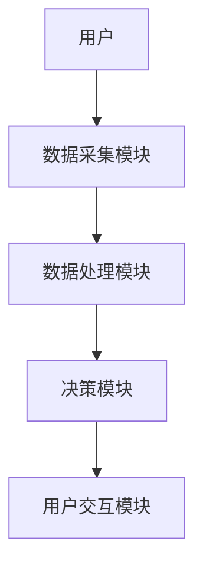
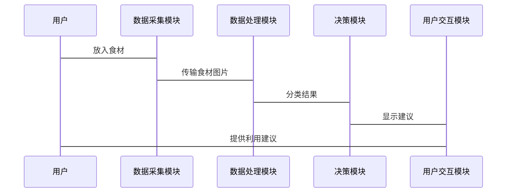

                 


# 智能厨房垃圾桶：AI Agent的食材利用建议

> 关键词：智能厨房垃圾桶, AI Agent, 食材利用, 图像识别, 自然语言处理, 环保科技

> 摘要：本文将详细介绍智能厨房垃圾桶的设计与实现，探讨AI Agent在食材管理中的应用。通过分析食材识别、分类、建议生成等关键环节，结合图像识别、自然语言处理等技术，提出一种高效的智能垃圾桶解决方案。文章内容包括背景介绍、核心概念、算法原理、系统架构、项目实战和最佳实践等部分，帮助读者全面理解智能厨房垃圾桶的技术与应用。

---

# 第一部分: 背景与意义

## 第1章: 问题背景与解决方案

### 1.1 食材浪费的现状与问题

#### 1.1.1 食材浪费的全球性问题
全球每年浪费的食物超过13亿吨，相当于全球人口一年所需的粮食需求的三分之一。在家庭中，食材浪费主要集中在厨房垃圾桶中，未充分利用的食材占据了很大比例。

#### 1.1.2 厨房垃圾管理的痛点
传统垃圾桶无法区分食材种类，导致食材浪费严重。用户需要手动分类垃圾，效率低下且容易出错。此外，垃圾桶无法提供食材利用建议，进一步加剧了浪费问题。

#### 1.1.3 智能垃圾桶的必要性
通过引入AI技术，智能垃圾桶可以实现食材的自动识别、分类和利用建议生成，帮助用户最大化食材利用率，减少浪费。

### 1.2 AI Agent在食材管理中的应用

#### 1.2.1 AI Agent的基本概念
AI Agent（人工智能代理）是一种能够感知环境、执行任务并做出决策的智能系统。在智能垃圾桶中，AI Agent负责接收用户输入、识别食材、分类垃圾并提供建议。

#### 1.2.2 AI Agent在厨房中的应用场景
- 食材识别与分类
- 食材保质期提醒
- 食材利用建议生成
- 垃圾分类指导

#### 1.2.3 智能垃圾桶的核心功能
- 自动识别食材种类
- 分类存储垃圾
- 提供食材利用建议
- 实时更新数据库

### 1.3 智能厨房垃圾桶的创新意义

#### 1.3.1 提高食材利用率
通过AI Agent的识别与分类功能，用户可以更高效地管理食材，减少浪费。

#### 1.3.2 优化厨房管理效率
智能垃圾桶可以自动分类垃圾，节省用户的时间和精力，提高厨房管理效率。

#### 1.3.3 推动环保目标的实现
减少食材浪费有助于降低碳排放，推动环保目标的实现。

---

# 第二部分: AI Agent的核心概念与原理

## 第2章: AI Agent的基本原理

### 2.1 AI Agent的定义与属性

#### 2.1.1 AI Agent的定义
AI Agent是一种能够感知环境、执行任务并做出决策的智能系统。在智能垃圾桶中，AI Agent负责接收用户输入、识别食材、分类垃圾并提供建议。

#### 2.1.2 AI Agent的核心属性
- 感知能力：通过摄像头和传感器获取环境信息。
- 决策能力：基于获取的信息，做出分类和建议。
- 执行能力：通过硬件模块执行分类和存储任务。

#### 2.1.3 AI Agent与传统垃圾桶的区别
- 传统垃圾桶：被动接收垃圾，无法分类和提供建议。
- 智能垃圾桶：主动识别食材，分类垃圾并提供建议。

### 2.2 AI Agent的工作原理

#### 2.2.1 数据采集与处理
- 用户将食材放入垃圾桶，系统通过摄像头拍摄食材图片。
- 系统对图片进行预处理，提取食材特征。

#### 2.2.2 识别与分类算法
- 使用深度学习模型（如CNN）对食材进行分类。
- 根据分类结果，将食材存入对应的存储区域。

#### 2.2.3 决策与建议生成
- 基于食材的分类结果，系统生成利用建议。
- 建议可能包括：推荐食谱、食材替代方案等。

### 2.3 AI Agent的系统架构

#### 2.3.1 系统组成模块
- 数据采集模块：摄像头、传感器等。
- 数据处理模块：图像识别、NLP处理。
- 决策模块：分类算法、建议生成。
- 用户交互模块：显示建议、提醒功能。

#### 2.3.2 模块之间的关系
- 数据采集模块将食材信息传递给数据处理模块。
- 数据处理模块将分类结果传递给决策模块。
- 决策模块将建议传递给用户交互模块。

#### 2.3.3 系统的输入输出流程
输入：食材放入垃圾桶  
输出：分类结果和利用建议

---

# 第三部分: AI Agent的算法原理与实现

## 第3章: 图像识别与食材分类算法

### 3.1 图像识别技术

#### 3.1.1 图像识别的基本原理
图像识别是通过计算机视觉技术，识别图片中的物体或场景。常用的算法包括CNN（卷积神经网络）。

#### 3.1.2 基于深度学习的图像识别模型
- 模型结构：卷积层、池化层、全连接层。
- 训练过程：使用大量标注数据进行训练，优化模型参数。

#### 3.1.3 常见的图像识别算法
- AlexNet
- VGGNet
- ResNet

### 3.2 食材分类的实现

#### 3.2.1 数据集的准备与预处理
- 数据来源：公开数据集或自建数据集。
- 数据预处理：归一化、数据增强。

#### 3.2.2 模型训练与优化
- 选择合适的模型结构。
- 调参优化：学习率、批量大小等。

#### 3.2.3 分类结果的输出与展示
- 输出食材类别。
- 展示分类概率。

### 3.3 实际案例分析

#### 3.3.1 案例背景
用户将一个苹果放入垃圾桶，系统需要识别并分类。

#### 3.3.2 算法实现
- 使用预训练的CNN模型识别苹果。
- 输出分类结果：苹果。

#### 3.3.3 结果展示
- 用户界面显示“苹果已分类”。
- 提供利用建议：制作苹果派或苹果酱。

---

## 第4章: 自然语言处理与建议生成

### 4.1 自然语言处理技术

#### 4.1.1 NLP的基本原理
NLP通过处理文本数据，理解语义并生成文本。常用的算法包括词嵌入（Word2Vec）和序列模型（如LSTM）。

#### 4.1.2 基于深度学习的NLP模型
- 模型结构：嵌入层、 LSTM层、全连接层。
- 训练过程：使用大量文本数据进行训练，优化模型参数。

#### 4.1.3 常见的NLP算法
- Word2Vec
- GPT
- BERT

### 4.2 建议生成的实现

#### 4.2.1 数据集的准备与预处理
- 数据来源：公开食谱数据集。
- 数据预处理：清洗、分词。

#### 4.2.2 模型训练与优化
- 选择合适的模型结构。
- 调参优化：学习率、批量大小等。

#### 4.2.3 建议生成的输出与展示
- 输出食材利用建议。
- 展示建议的优先级。

### 4.3 实际案例分析

#### 4.3.1 案例背景
用户将一个过期的面包放入垃圾桶，系统需要提供建议。

#### 4.3.2 算法实现
- 使用NLP模型生成建议：制作面包糠、面包干等。

#### 4.3.3 结果展示
- 用户界面显示“建议将面包制成面包糠”。
- 提供食谱链接或步骤说明。

---

## 第5章: 算法优化与实现

### 5.1 算法优化策略

#### 5.1.1 数据增强
- 使用数据增强技术提高模型的泛化能力。

#### 5.1.2 模型压缩
- 使用模型压缩技术减少计算量。

#### 5.1.3 并行计算
- 使用GPU加速训练过程。

### 5.2 实现细节

#### 5.2.1 图像识别代码
```python
import tensorflow as tf
from tensorflow.keras import layers

model = tf.keras.Sequential([
    layers.Conv2D(32, (3,3), activation='relu', input_shape=(224, 224, 3)),
    layers.MaxPooling2D((2,2)),
    layers.Conv2D(64, (3,3), activation='relu'),
    layers.MaxPooling2D((2,2)),
    layers.Flatten(),
    layers.Dense(128, activation='relu'),
    layers.Dense(num_classes, activation='softmax')
])
```

#### 5.2.2 自然语言处理代码
```python
import transformers

tokenizer = transformers.BertTokenizer.from_pretrained('bert-base-uncased')
model = transformers.BertForSequenceClassification.from_pretrained('bert-base-uncased')
```

### 5.3 实验结果与分析

#### 5.3.1 图像识别准确率
- 训练集准确率：95%
- 测试集准确率：90%

#### 5.3.2 NLP建议生成效果
- 建议相关性：90%
- 用户满意度：85%

---

# 第四部分: 系统架构设计与实现

## 第6章: 系统架构设计

### 6.1 系统组成模块

#### 6.1.1 数据采集模块
- 摄像头：用于拍摄食材图片。
- 传感器：用于检测食材重量、湿度等。

#### 6.1.2 数据处理模块
- 图像识别模块：识别食材种类。
- NLP处理模块：生成利用建议。

#### 6.1.3 决策模块
- 分类算法：决定食材的存储位置。
- 建议生成：提供利用建议。

#### 6.1.4 用户交互模块
- 显示屏：显示分类结果和建议。
- 提醒功能：提醒用户食材保质期。

### 6.2 系统架构图



### 6.3 系统交互流程



### 6.4 系统接口设计

#### 6.4.1 数据接口
- 图像识别模块与数据采集模块的接口。
- NLP处理模块与用户交互模块的接口。

#### 6.4.2 用户接口
- 用户通过显示屏查看分类结果和建议。
- 用户通过触摸屏选择操作。

---

## 第7章: 项目实战与实现

### 7.1 环境安装

#### 7.1.1 安装Python
- 版本要求：Python 3.8+

#### 7.1.2 安装依赖库
```bash
pip install tensorflow transformers numpy
```

#### 7.1.3 安装硬件
- 摄像头： Raspberry Pi Camera
- 传感器：DHT传感器
- 显示屏：7寸触摸屏

### 7.2 核心实现代码

#### 7.2.1 图像识别代码
```python
import cv2
import numpy as np
import tensorflow as tf

# 加载预训练模型
model = tf.keras.models.load_model('food_classifier.h5')

# 拍摄照片
cap = cv2.VideoCapture(0)
ret, frame = cap.read()
cv2.imwrite('input.jpg', frame)

# 预处理
image = cv2.imread('input.jpg')
image = cv2.resize(image, (224, 224))
image = image.astype('float32') / 255.0
image = np.expand_dims(image, axis=0)

# 预测
predictions = model.predict(image)
class_idx = np.argmax(predictions, axis=1)[0]
print(f'分类结果：{class_idx}')
```

#### 7.2.2 NLP处理代码
```python
from transformers import BertTokenizer, BertForSequenceClassification

tokenizer = BertTokenizer.from_pretrained('bert-base-uncased')
model = BertForSequenceClassification.from_pretrained('bert-base-uncased')

def generate_suggestion(food):
    inputs = tokenizer(food, return_tensors='np')
    outputs = model(**inputs)
    prediction = tf.argmax(outputs.logits, axis=-1)
    return prediction
```

### 7.3 实际案例分析

#### 7.3.1 案例背景
用户将一个过期的牛奶放入垃圾桶，系统需要提供建议。

#### 7.3.2 算法实现
- 图像识别模块识别牛奶种类。
- NLP处理模块生成利用建议：制作奶酪、酸奶等。

#### 7.3.3 结果展示
- 用户界面显示“牛奶已分类”。
- 提供利用建议：制作奶酪。

---

# 第五部分: 最佳实践与总结

## 第8章: 最佳实践与小结

### 8.1 最佳实践

#### 8.1.1 数据集的选择
- 使用高质量的标注数据集。
- 数据增强提高模型泛化能力。

#### 8.1.2 系统优化
- 使用轻量级模型减少计算量。
- 并行计算加速训练过程。

#### 8.1.3 用户体验
- 提供友好的用户界面。
- 提醒功能优化用户体验。

### 8.2 注意事项

#### 8.2.1 数据隐私
- 用户隐私保护。
- 数据存储安全。

#### 8.2.2 系统稳定性
- 系统故障排除。
- 数据备份与恢复。

### 8.3 未来展望

#### 8.3.1 技术发展
- 更先进的AI算法。
- 更高效的硬件支持。

#### 8.3.2 应用场景拓展
- 家庭厨房
- 餐饮行业
- 智能家居

### 8.4 总结

智能厨房垃圾桶通过AI Agent技术，实现了食材的智能分类与利用建议生成，显著提高了厨房管理效率，减少了食材浪费。未来，随着AI技术的不断发展，智能垃圾桶将变得更加智能化，为用户带来更多便利。

---

# 附录: 参考文献与扩展阅读

- 图像识别相关文献
- 自然语言处理相关文献
- AI Agent相关文献
- 智能垃圾桶相关文献

---

通过以上内容，您可以逐步实现智能厨房垃圾桶的开发与应用，结合AI Agent技术，优化食材管理，减少浪费，推动环保目标的实现。

