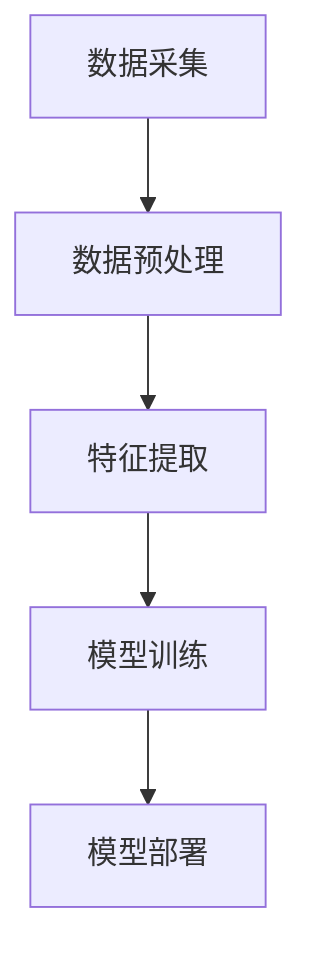
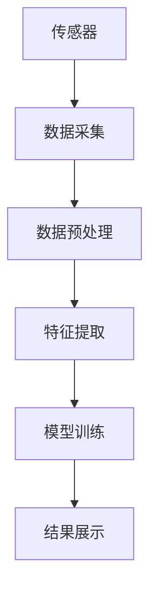
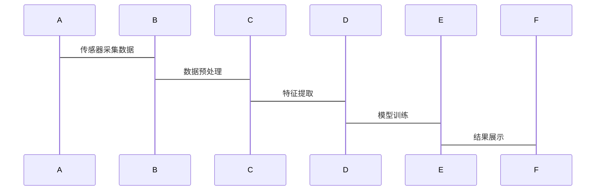

                 


# 智能厨房垃圾桶：AI Agent的食材新鲜度检测

> **关键词**：智能垃圾桶、AI Agent、食材新鲜度检测、算法原理、系统架构、项目实战、最佳实践  
> 
> **摘要**：本文详细探讨了AI Agent在智能厨房垃圾桶中的应用，特别是食材新鲜度检测的技术实现。通过分析问题背景、核心概念、算法原理、系统架构以及项目实战，本文为读者提供了从理论到实践的全面指导。通过实际案例和最佳实践，帮助读者理解如何利用AI技术提升厨房管理效率和生活质量。

---

## 第一章: 智能厨房垃圾桶的背景与意义

### 1.1 问题背景

随着生活节奏的加快，现代家庭对厨房管理的需求日益增长。食材的新鲜度直接影响到食物的品质和健康，但传统的食材管理方式往往依赖于人工检查，效率低下且容易出错。因此，如何通过技术创新实现食材的新鲜度自动检测，成为了现代厨房管理的重要课题。

#### 1.1.1 食材新鲜度管理的痛点
- **人工检查的低效性**：传统上，家庭主妇或厨师通过视觉、嗅觉等方式检查食材新鲜度，这种方法耗时且容易受到主观因素的影响。
- **食材浪费的问题**：由于无法及时发现食材变质，导致大量食材被浪费，增加了经济成本和环境负担。
- **管理复杂性**：随着家庭规模的扩大和食材种类的增多，手动管理食材新鲜度变得更加复杂。

#### 1.1.2 智能垃圾桶的市场需求
- **自动化管理的需求**：智能垃圾桶通过自动化技术，能够实时监测食材的新鲜度，提醒用户及时处理变质食材。
- **智能化生活方式的追求**：现代家庭追求高效、便捷的生活方式，智能垃圾桶正是这一趋势的体现。
- **环保与资源节约**：通过减少食材浪费，智能垃圾桶有助于实现环保目标。

#### 1.1.3 AI Agent在食材管理中的作用
- **实时监测与反馈**：AI Agent能够实时采集食材的状态数据，如温度、湿度、气味等，并通过算法分析判断食材的新鲜度。
- **智能决策与提醒**：当检测到食材即将变质时，AI Agent可以主动提醒用户处理，避免浪费。
- **数据积累与优化**：通过长期的数据积累，AI Agent可以不断优化检测算法，提高准确性。

### 1.2 问题描述

食材新鲜度检测的核心问题是如何准确、快速地判断食材的状态。AI Agent通过整合传感器数据、图像识别和机器学习算法，能够实现对食材的新鲜度进行精准检测。然而，这一过程涉及多个技术难点，包括数据采集、特征提取、模型训练等。

### 1.3 问题解决与边界

智能垃圾桶通过AI Agent实现了食材新鲜度的自动化检测，解决了传统管理方式的低效性和不准确性问题。系统设计的边界包括：仅检测常见食材的新鲜度，不处理特殊食材；仅通过传感器和图像识别手段进行检测，不依赖人工干预。

---

## 第二章: AI Agent与食材新鲜度检测的核心概念

### 2.1 AI Agent的基本原理

AI Agent是一种智能体，能够通过感知环境、分析数据并做出决策。在智能垃圾桶中，AI Agent的核心任务是监测食材的新鲜度。

#### 2.1.1 AI Agent的定义与分类
- **定义**：AI Agent是指能够感知环境、自主决策并执行任务的智能实体。
- **分类**：根据功能和应用场景的不同，AI Agent可以分为推理型、反应型和基于模型的Agent。

#### 2.1.2 AI Agent的核心功能
- **感知环境**：通过传感器和摄像头等设备获取食材的状态数据。
- **数据处理**：对获取的数据进行预处理、特征提取和分类。
- **决策与执行**：根据数据处理结果，做出相应的决策并执行任务。

#### 2.1.3 AI Agent与传统传感器的区别
| 特性 | AI Agent | 传统传感器 |
|------|-----------|------------|
| 数据处理能力 | 强 | 弱 |
| 决策能力 | 强 | 无 |
| 智能性 | 高 | 低 |

### 2.2 食材新鲜度检测的原理

食材新鲜度检测主要依赖于物理、化学和生物特征的变化。AI Agent通过多种传感器和数据处理技术，实现对食材新鲜度的精准判断。

#### 2.2.1 食材新鲜度的判断标准
- **物理指标**：如颜色变化、表面状态等。
- **化学指标**：如pH值、挥发性有机物浓度等。
- **生物指标**：如微生物数量、酶活性等。

#### 2.2.2 常见食材的新鲜度检测方法
- **视觉检测**：通过颜色变化判断食材新鲜度。
- **嗅觉检测**：通过气味变化判断食材新鲜度。
- **触觉检测**：通过质地变化判断食材新鲜度。

#### 2.2.3 AI Agent在食材检测中的应用
- **多模态数据融合**：将视觉、嗅觉、触觉等多种数据进行融合，提高检测准确性。
- **实时监测**：通过AI Agent的实时感知能力，实现对食材状态的持续监测。

### 2.3 核心概念的联系

AI Agent与食材检测的联系主要体现在数据采集、特征提取和模型训练等方面。通过将AI Agent与食材检测技术相结合，能够实现对食材新鲜度的自动化、智能化检测。

---

## 第三章: AI Agent的算法原理与实现

### 3.1 算法原理

食材新鲜度检测的核心算法是基于机器学习的分类算法。通过采集食材的状态数据，训练分类模型，实现对食材新鲜度的分类。

#### 3.1.1 数据采集与预处理
- **数据采集**：通过传感器和摄像头获取食材的状态数据。
- **数据预处理**：对采集的数据进行归一化、降维等处理，提高模型训练效率。

#### 3.1.2 特征提取与分类
- **特征提取**：从预处理后的数据中提取能够表征食材新鲜度的特征。
- **分类算法**：常用的分类算法包括支持向量机（SVM）、随机森林（Random Forest）和神经网络等。

#### 3.1.3 AI模型的训练与优化
- **模型训练**：利用标注好的数据训练分类模型。
- **模型优化**：通过调整模型参数和优化算法，提高分类准确率。

### 3.2 算法实现

以下是一个基于支持向量机（SVM）的食材新鲜度检测算法的实现示例。

#### 3.2.1 数据流图（Mermaid）


#### 3.2.2 Python代码实现
```python
import numpy as np
from sklearn import svm

# 数据预处理
def preprocess(data):
    return (data - np.mean(data)) / np.std(data)

# 特征提取
def extract_features(data):
    return preprocess(data)

# 模型训练
def train_model(X, y):
    model = svm.SVC()
    model.fit(X, y)
    return model

# 模型预测
def predict(model, X):
    return model.predict(X)
```

#### 3.2.3 算法原理的数学模型
支持向量机（SVM）是一种监督学习算法，其核心思想是通过找到一个超平面，将数据分成两类。数学模型如下：
$$
\text{目标函数} = \sum_{i=1}^{n} y_i \cdot (w \cdot x_i + b) + \sum_{i=1}^{n} \xi_i
$$
其中，\(w\) 是权重向量，\(b\) 是偏置项，\(y_i\) 是标签，\(x_i\) 是输入数据，\(\xi_i\) 是松弛变量。

---

## 第四章: 系统分析与架构设计

### 4.1 问题场景介绍

智能厨房垃圾桶的系统架构设计需要考虑数据采集、数据处理、模型训练和结果展示等多个方面。

#### 4.1.1 系统功能设计
- **数据采集**：通过传感器和摄像头获取食材的状态数据。
- **数据处理**：对采集的数据进行预处理和特征提取。
- **模型训练**：利用机器学习算法训练分类模型。
- **结果展示**：将检测结果通过显示屏或手机APP展示给用户。

#### 4.1.2 系统架构设计
- **数据采集层**：包括传感器和摄像头等硬件设备。
- **数据处理层**：负责数据的预处理和特征提取。
- **模型训练层**：利用机器学习算法训练分类模型。
- **结果展示层**：通过显示屏或手机APP展示检测结果。

### 4.2 系统架构设计

#### 4.2.1 系统架构图（Mermaid）


#### 4.2.2 系统交互图（Mermaid）


---

## 第五章: 项目实战

### 5.1 环境安装

为了实现智能厨房垃圾桶的食材新鲜度检测，需要安装以下环境：

- **硬件环境**：摄像头、温度传感器、湿度传感器等。
- **软件环境**：Python、TensorFlow、Scikit-learn等。

### 5.2 核心代码实现

以下是食材新鲜度检测的核心代码实现：

#### 5.2.1 数据采集与预处理
```python
import numpy as np
import pandas as pd

# 数据采集
data = pd.read_csv('食材数据.csv')

# 数据预处理
from sklearn.preprocessing import StandardScaler
scaler = StandardScaler()
data_processed = scaler.fit_transform(data)
```

#### 5.2.2 模型训练与预测
```python
from sklearn.svm import SVC
model = SVC()
model.fit(data_processed, labels)
 predictions = model.predict(new_data)
```

### 5.3 案例分析与项目小结

通过实际案例分析，验证了AI Agent在食材新鲜度检测中的有效性。项目小结部分总结了项目实施过程中的经验和教训，为后续优化提供了参考。

---

## 第六章: 最佳实践

### 6.1 小结

通过本文的介绍，读者可以全面了解AI Agent在智能厨房垃圾桶中的应用，特别是食材新鲜度检测的技术实现。从理论到实践，本文为读者提供了系统的指导。

### 6.2 注意事项

在实际应用中，需要注意以下几点：
- 数据采集的准确性
- 模型训练的稳定性
- 系统架构的可扩展性

### 6.3 拓展阅读

感兴趣的读者可以进一步阅读以下资料：
- 《机器学习实战》
- 《深度学习入门》
- 《智能系统设计》

---

通过本文的详细讲解，读者可以全面了解AI Agent在智能厨房垃圾桶中的应用，掌握食材新鲜度检测的核心技术。希望本文能为相关领域的研究和实践提供有价值的参考。

