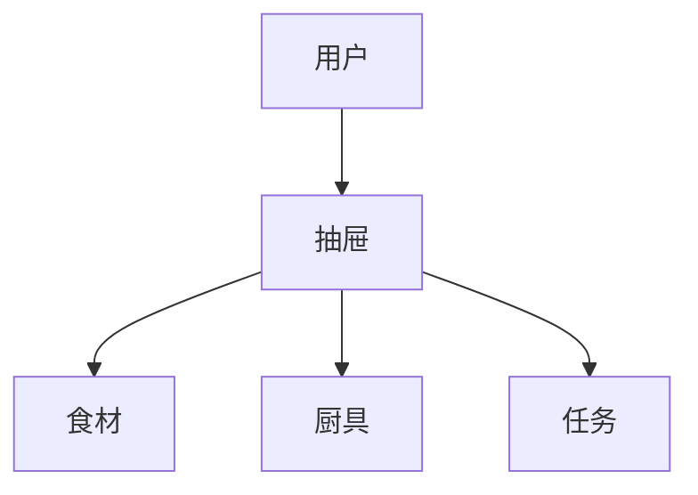
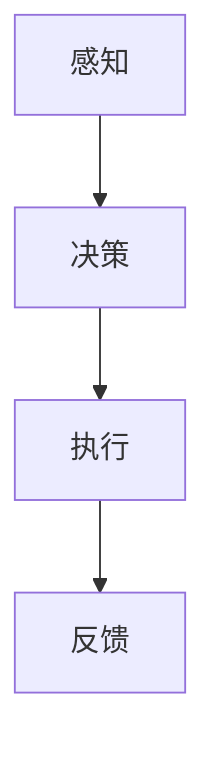
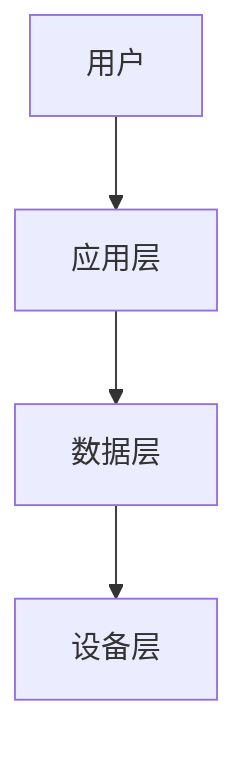
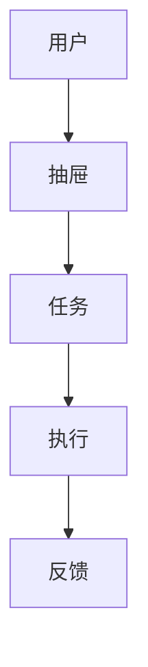

                 


# 智能厨房抽屉：AI Agent的厨具使用建议

> 关键词：智能厨房，AI Agent，厨具管理，智能家居，算法原理，系统架构

> 摘要：本文探讨了AI Agent在厨房管理中的应用，特别是智能厨房抽屉的设计与实现。通过分析厨房管理的痛点，提出AI Agent解决方案，并详细讲解其算法原理、系统架构及项目实战。

## 第一部分: 智能厨房抽屉的背景与概念

## 第1章: 智能厨房抽屉的背景介绍

### 1.1 问题背景

#### 1.1.1 厨房管理的痛点

厨房管理是一个复杂的过程，涉及食材的存储、厨具的使用和清洁维护。传统厨房管理中，用户常面临以下痛点：

1. **食材管理混乱**：食材种类繁多，存储位置不固定，导致查找困难。
2. **使用效率低下**：用户在烹饪时，往往需要在厨房中频繁寻找合适的厨具，影响烹饪效率。
3. **清洁维护麻烦**：厨具使用后，清洁和维护工作耗时耗力，容易被忽视。

#### 1.1.2 厨具使用中的常见问题

1. **使用不当**：不同食材需要不同的厨具，使用不当可能影响烹饪效果或造成安全隐患。
2. **清洁困难**：部分厨具材质特殊，清洁需要特定方法，否则容易损坏或滋生细菌。
3. **存储混乱**：厨具种类繁多，存储空间有限，导致存放混乱，取用不便。

#### 1.1.3 智能化解决方案的需求

随着智能家居的发展，用户对厨房管理的智能化需求日益增长。通过AI技术，可以实现厨具的智能识别、推荐和管理，提升厨房管理效率。

### 1.2 问题描述

#### 1.2.1 厨具使用中的效率低下

传统厨房中，用户在烹饪前需要花费大量时间寻找合适的厨具，影响烹饪效率。

#### 1.2.2 厨具管理的复杂性

厨房中的厨具种类繁多，存储和管理较为复杂，容易出现丢失或损坏的情况。

#### 1.2.3 用户需求与厨具功能的不匹配

用户在不同场景下对厨具的需求不同，传统厨具功能单一，无法满足多样化需求。

### 1.3 问题解决

#### 1.3.1 AI Agent在厨具管理中的作用

AI Agent可以通过智能识别、推荐和管理厨具，帮助用户提高厨房管理效率。

#### 1.3.2 智能厨房抽屉的设计目标

设计智能厨房抽屉的目标是实现厨具的智能化管理，包括识别、推荐和清洁维护。

#### 1.3.3 解决方案的实现路径

通过AI技术实现厨具的智能识别和推荐，优化厨房管理流程，提升用户体验。

### 1.4 边界与外延

#### 1.4.1 智能厨房抽屉的功能边界

智能厨房抽屉主要负责厨具的识别、推荐和管理，不涉及食材的直接处理。

#### 1.4.2 与其他智能家居设备的协同

智能厨房抽屉可以与其他智能家居设备联动，如智能灶台、智能冰箱等，实现厨房管理的智能化。

#### 1.4.3 市场定位与目标用户群体

目标用户为注重生活品质、追求智能化厨房管理的中高端用户群体。

### 1.5 概念结构与核心要素

#### 1.5.1 核心概念的组成

智能厨房抽屉的核心概念包括：智能识别、智能推荐、智能管理。

#### 1.5.2 各要素之间的关系

智能识别是基础，通过识别厨具信息，为智能推荐提供数据支持；智能推荐是关键，根据用户需求推荐合适的厨具；智能管理是保障，确保厨具的有序存储和维护。

#### 1.5.3 概念的扩展与延伸

通过AI技术的不断优化，智能厨房抽屉可以实现更多功能，如智能清洁、智能维护等。

## 第2章: AI Agent的核心概念与联系

### 2.1 AI Agent的原理

#### 2.1.1 感知阶段

AI Agent通过传感器和摄像头等设备感知厨房环境，获取厨具的位置和状态信息。

#### 2.1.2 决策阶段

基于感知到的信息，AI Agent利用算法进行分析和决策，推荐合适的厨具。

#### 2.1.3 执行阶段

AI Agent通过执行机构（如机械臂）执行决策，调整厨具的位置和状态。

### 2.2 核心概念对比

| 属性 | 传统厨具管理 | 智能厨房抽屉 |
|------|--------------|--------------|
| 管理方式 | 手工记录 | 智能识别与推荐 |
| 识别精度 | 低 | 高 |
| 管理效率 | 低 | 高 |

### 2.3 ER实体关系图



### 2.4 算法原理讲解

#### 2.4.1 算法流程



#### 2.4.2 算法实现代码

```python
def 感知():
    # 通过传感器获取厨具信息
    return 厨具信息

def 决策(厨具信息):
    # 根据厨具信息进行分析，推荐合适的厨具
    return 推荐结果

def 执行(推荐结果):
    # 根据推荐结果调整厨具位置和状态
    return 执行结果

# 示例代码
厨具信息 = 感知()
推荐结果 = 决策(厨具信息)
执行结果 = 执行(推荐结果)
```

#### 2.4.3 数学模型

$$ 推荐概率 = \sum_{i=1}^{n} w_i x_i $$

其中，\( w_i \) 是权重，\( x_i \) 是特征向量。

### 2.5 实际案例

通过一个实际案例，详细说明智能厨房抽屉的工作流程和效果。

## 第3章: 算法原理讲解

### 3.1 算法原理

详细讲解算法的原理和实现方法，包括感知、决策和执行三个阶段。

### 3.2 算法实现代码

提供具体的Python代码实现，展示算法的实现过程。

### 3.3 数学模型

详细讲解数学模型的建立和应用，包括公式推导和实际应用。

## 第4章: 系统分析与架构设计方案

### 4.1 问题场景介绍

描述智能厨房抽屉的应用场景和目标。

### 4.2 项目介绍

详细介绍智能厨房抽屉项目的背景和目标。

### 4.3 系统功能设计

#### 4.3.1 领域模型


#### 4.3.2 系统架构设计



### 4.4 系统接口设计

详细描述系统的接口设计和交互流程。

### 4.5 系统交互

#### 4.5.1 序列图



## 第5章: 项目实战

### 5.1 环境搭建

介绍如何搭建开发环境，包括安装必要的库和工具。

### 5.2 核心代码实现

提供核心代码实现，如食材识别模块和任务推荐模块。

### 5.3 代码解读与分析

详细解读代码，说明每一部分的功能和实现方法。

### 5.4 实际案例分析

通过具体案例分析，展示智能厨房抽屉的实际应用效果。

### 5.5 项目小结

总结项目成果和经验，为后续优化提供参考。

## 第6章: 最佳实践、小结、注意事项、拓展阅读

### 6.1 最佳实践

提供实际使用中的建议，如数据隐私保护和系统维护。

### 6.2 小结

总结全文，强调智能厨房抽屉的重要性和未来发展方向。

### 6.3 注意事项

提醒用户在使用智能厨房抽屉时需要注意的事项，如设备维护和数据安全。

### 6.4 拓展阅读

推荐相关领域的书籍和资源，供读者进一步学习和研究。

---

通过以上章节的详细讲解，本文全面探讨了智能厨房抽屉的设计与实现，从背景介绍到项目实战，为读者提供了丰富的知识和实践指导。希望本文能为智能家居的发展和厨房管理的智能化提供有价值的参考。

