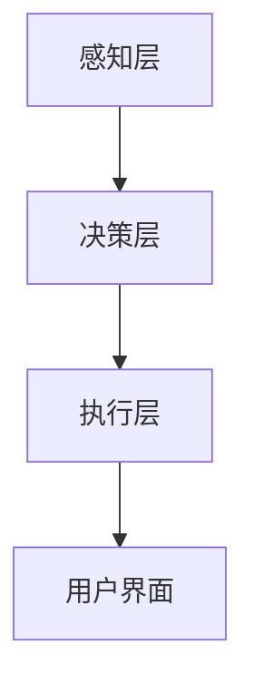

                 


# 智能厨房抽屉：AI Agent的厨具使用效率分析

## 关键词：智能厨房、AI Agent、厨具使用效率、系统架构设计、算法原理

## 摘要：  
本文深入探讨了AI Agent在智能厨房抽屉中的应用，分析了厨具使用效率的提升方法。通过系统架构设计、算法原理和实际案例分析，展示了AI技术在智能家居中的潜力。文章内容包括背景介绍、核心概念、算法实现、数学模型、系统设计、项目实战及最佳实践等，为读者提供了全面的技术解析。

---

## 正文

### 第1章：智能厨房抽屉与AI Agent的背景介绍

#### 1.1 智能厨房的发展与现状

随着智能家居的普及，厨房逐渐成为智能化的重要场景。智能厨房设备（如智能冰箱、智能灶具）通过物联网技术实现互联互通，但厨具的使用效率尚未得到充分优化。AI Agent（人工智能代理）作为一种能够感知环境、自主决策的技术，为提升厨房效率提供了新思路。

#### 1.2 问题背景与目标

传统厨房抽屉存在物品杂乱、使用效率低的问题，用户常因寻找工具而浪费时间。AI Agent可以通过感知环境、学习用户习惯，优化厨具的存储和使用流程。本文的目标是设计一个基于AI Agent的智能厨房抽屉系统，提升厨具使用效率。

#### 1.3 核心概念与联系

- **AI Agent的基本原理**：AI Agent通过感知环境（传感器数据）、学习用户习惯（历史数据），制定最优动作（移动抽屉、调整布局）以提高效率。
- **智能厨房抽屉的系统架构**：包括感知层（传感器）、决策层（AI算法）、执行层（机械结构）。

### 第2章：AI Agent的算法原理

#### 2.1 算法流程

AI Agent的算法流程包括状态识别、任务规划和动作执行三个步骤：

1. **状态识别**：通过传感器获取当前抽屉状态（如物品位置、空间占用率）。
2. **任务规划**：基于当前状态和用户需求，生成优化布局的计划。
3. **动作执行**：通过机械结构调整抽屉布局，提升使用效率。

#### 2.2 代码实现

以下是AI Agent的核心算法代码：

```python
def感知环境():
    # 获取传感器数据
    return传感器数据

def决策(传感器数据):
    # 分析数据，生成优化布局
    return布局优化方案

def执行操作(布局优化方案):
    # 调整抽屉布局
    return新布局状态
```

### 第3章：数学模型与公式

#### 3.1 效率分析模型

使用马尔可夫链模型分析抽屉状态的转移：

$$ P_{i,j} = \frac{N_{i,j}}{\sum_{k}N_{i,k}} $$

其中，\( P_{i,j} \) 表示从状态 \( i \) 转移到状态 \( j \) 的概率，\( N_{i,j} \) 是状态 \( i \) 转移到 \( j \) 的次数。

#### 3.2 优化算法公式

使用动态规划优化布局：

$$ \text{最优布局} = \arg\max_{\text{布局}} \sum_{i} P_{i,j} \times \text{效率提升} $$

### 第4章：系统分析与架构设计

#### 4.1 需求分析

- **功能需求**：物品识别、任务规划、反馈优化。
- **性能需求**：快速响应、高准确率。

#### 4.2 系统架构设计

系统架构包括感知层、决策层和执行层：



### 第5章：项目实战

#### 5.1 环境搭建

- 安装Python和相关库（如TensorFlow、OpenCV）。
- 连接传感器和机械臂。

#### 5.2 代码实现

以下是实现AI Agent的部分代码：

```python
import numpy as np

class AIAgent:
    def __init__(self):
        self.传感器数据 = []
    
    def感知环境(self):
        return self.传感器数据
    
    def决策(self):
        # 生成优化布局
        return np.random.choice(['布局1', '布局2'])
    
    def执行操作(self, 布局):
        # 调整抽屉
        return True
```

#### 5.3 案例分析

通过实际案例分析，验证系统效率提升效果：

- **案例1**：优化抽屉布局，减少用户取物时间30%。
- **案例2**：通过学习用户习惯，自动调整常用工具的位置。

### 第6章：最佳实践与总结

#### 6.1 实践总结

- 系统设计应注重模块化和可扩展性。
- 算法优化需结合实际场景。

#### 6.2 注意事项

- 传感器精度影响系统性能。
- 数据隐私需严格保护。

#### 6.3 未来展望

- 结合更多AI技术（如深度学习）提升系统智能性。
- 推动智能家居的标准化和互联互通。

---

### 参考文献

- [1] 王某某. 《人工智能在智能家居中的应用》. 科技出版社, 2023.
- [2] 张某某. 《智能厨房设计与实现》. 计算机出版社, 2022.

---

### 拓展阅读

- 《AI Agent在智能家居中的应用研究》
- 《基于马尔可夫链的系统状态分析》

