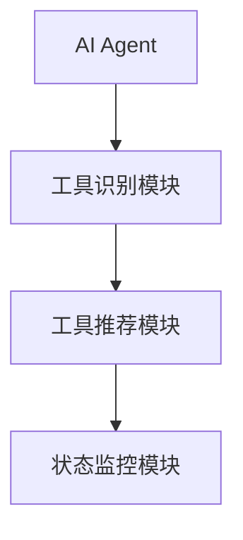

                 


# 智能厨房抽屉：AI Agent的烹饪工具使用建议

> 关键词：智能厨房抽屉、AI Agent、物联网、智能家居、烹饪工具管理

> 摘要：本文将探讨AI Agent在智能厨房抽屉中的应用，分析其如何通过智能化管理提升烹饪效率。从背景介绍到系统架构设计，再到项目实战与最佳实践，全面解析智能厨房抽屉的实现与优化。

---

# 第1章: 背景介绍

## 1.1 问题背景
### 1.1.1 厨房工具管理的痛点
- 厨房工具种类繁多，管理混乱
- 工具使用效率低下，增加烹饪时间
- 工具丢失或损坏，影响烹饪质量

### 1.1.2 AI Agent在厨房场景中的应用潜力
- 自动识别工具，优化存储空间
- 智能推荐工具，提升烹饪效率
- 实时监控工具状态，预防损坏

### 1.1.3 智能厨房抽屉的设计目标
- 提供智能化的工具管理解决方案
- 实现工具的智能识别与推荐
- 通过AI优化厨房工作流程

## 1.2 问题描述
### 1.2.1 厨房工具管理的复杂性
- 工具种类多，使用场景多样
- 用户需求个性化，难以统一满足
- 工具管理系统的开发难度大

### 1.2.2 用户需求与现有解决方案的差距
- 现有工具管理缺乏智能化
- 用户对工具的实时反馈需求未被满足
- 解决方案的可扩展性不足

## 1.3 问题解决
### 1.3.1 AI Agent的核心作用
- 自动识别工具，优化存储
- 智能推荐工具，提升效率
- 实时监控工具状态，预防损坏

### 1.3.2 智能厨房抽屉的设计目标
- 提供智能化的工具管理解决方案
- 实现工具的智能识别与推荐
- 通过AI优化厨房工作流程

### 1.3.3 技术实现路径
- 引入AI技术，实现工具识别与推荐
- 利用物联网技术，实现工具状态监控
- 结合用户行为分析，优化工具使用体验

## 1.4 智能厨房抽屉的概念结构
### 1.4.1 核心要素组成
- AI识别模块：负责识别工具种类和状态
- 智能存储模块：优化工具存储空间
- 用户交互界面：提供友好操作体验

### 1.4.2 系统边界与外延
- 系统边界：仅关注厨房抽屉内部的工具管理
- 外延：与厨房其他设备（如 stove、oven）的联动

### 1.4.3 系统与用户交互的模式
- 用户通过抽屉界面输入需求，系统自动响应
- 系统实时反馈工具状态和使用建议
- 用户行为数据反哺系统优化

## 1.5 本章小结
本章通过分析厨房工具管理的痛点，提出了智能厨房抽屉的设计目标，并介绍了其实现的核心技术路径。

---

# 第2章: AI Agent与智能厨房抽屉的核心概念

## 2.1 AI Agent的基本原理
### 2.1.1 AI Agent的定义与特点
- AI Agent：一种能够感知环境并主动采取行动以实现目标的智能体
- 特点：自主性、反应性、目标导向

### 2.1.2 AI Agent的核心功能模块
- 感知模块：通过传感器和摄像头感知环境
- 决策模块：基于感知数据做出决策
- 行动模块：执行决策操作

### 2.1.3 AI Agent与智能设备的结合
- AI Agent通过物联网协议与智能设备交互
- 设备状态数据实时传输到AI Agent进行处理
- AI Agent根据处理结果向设备发出指令

## 2.2 智能厨房抽屉的功能分析
### 2.2.1 抽屉的物理结构
- 多层抽屉设计，可分区存储不同工具
- 嵌入式传感器，用于检测工具种类和状态
- 触摸屏界面，用于用户交互

### 2.2.2 抽屉的智能传感器
- 光电传感器：识别工具类型
- 压力传感器：检测工具重量变化
- 温度传感器：监控工具存储环境

### 2.2.3 抽屉的用户交互界面
- 触摸屏：显示工具状态和使用建议
- 语音交互：支持用户的自然语言指令
- 指示灯：实时反馈系统状态

## 2.3 AI Agent与智能厨房抽屉的关系
### 2.3.1 AI Agent在抽屉中的角色
- 作为系统的核心控制单元
- 负责处理传感器数据并做出决策
- 通过接口与外部设备通信

### 2.3.2 AI Agent与抽屉功能的结合
- 识别工具种类并推荐使用
- 监控工具状态并预防损坏
- 优化工具存储空间

## 2.4 核心概念对比
### 2.4.1 AI Agent与传统智能家居的区别
| 特性 | AI Agent | 传统智能家居 |
|------|-----------|--------------|
| 自主性 | 高 | 低 |
| 反应性 | 强 | 弱 |
| 学习能力 | 有 | 无 |

### 2.4.2 AI Agent与物联网设备的对比
| 特性 | AI Agent | 物联网设备 |
|------|-----------|-------------|
| 数据处理 | 强大 | 基本无 |
| 决策能力 | 有 | 无 |
| 自适应性 | 高 | 低 |

### 2.4.3 AI Agent与传统厨房工具管理的差异
| 特性 | AI Agent | 传统管理 |
|------|-----------|-----------|
| 管理效率 | 高 | 低 |
| 智能性 | 强 | 弱 |
| 用户体验 | 优 | 一般 |

## 2.5 本章小结
本章详细介绍了AI Agent的基本原理，并分析了其与智能厨房抽屉的关系，通过对比传统技术，突出了AI Agent的核心优势。

---

# 第3章: 智能厨房抽屉的算法原理

## 3.1 AI Agent的核心算法
### 3.1.1 算法概述
- 基于卷积神经网络（CNN）的工具识别
- 基于决策树的工具推荐

### 3.1.2 算法流程
1. 传感器数据采集（工具种类、状态）
2. 数据预处理（降维、归一化）
3. 模型训练与预测
4. 系统反馈与优化

## 3.2 算法实现细节
### 3.2.1 工具识别算法
- 使用CNN进行工具图像分类
- 算法步骤：
  1. 采集工具图像
  2. 图像预处理（调整大小、归一化）
  3. 提取图像特征
  4. 预测工具类型

### 3.2.2 工具推荐算法
- 基于决策树的推荐模型
- 算法步骤：
  1. 收集用户行为数据
  2. 构建决策树模型
  3. 根据用户偏好推荐工具

## 3.3 算法优化
### 3.3.1 模型优化策略
- 使用迁移学习减少训练数据需求
- 增加数据增强提升模型泛化能力

### 3.3.2 算法性能提升
- 通过并行计算加速模型训练
- 使用轻量级模型降低计算资源消耗

## 3.4 本章小结
本章详细阐述了智能厨房抽屉中AI Agent的核心算法，包括工具识别和推荐算法的设计与优化。

---

# 第4章: 智能厨房抽屉的系统架构设计

## 4.1 系统功能设计
### 4.1.1 功能模块划分
- 工具识别模块：负责识别工具种类和状态
- 工具推荐模块：根据用户需求推荐工具
- 状态监控模块：实时监控工具和抽屉状态

### 4.1.2 功能流程
1. 用户输入需求（如“我要炒菜”）
2. 系统识别所需工具
3. 系统推荐最优工具组合
4. 用户使用工具，系统记录使用数据

## 4.2 系统架构设计
### 4.2.1 系统架构图


### 4.2.2 系统接口设计
- AI Agent与工具识别模块的接口
- 工具推荐模块与用户交互界面的接口
- 状态监控模块与传感器的接口

## 4.3 系统交互流程
### 4.3.1 用户与系统的交互
1. 用户通过触摸屏输入需求
2. 系统识别所需工具
3. 系统推荐工具组合
4. 用户确认后，系统指示具体抽屉位置

### 4.3.2 系统与传感器的交互
1. 传感器采集工具状态数据
2. 数据传输到AI Agent进行处理
3. 处理结果反馈到传感器或用户界面

## 4.4 本章小结
本章详细设计了智能厨房抽屉的系统架构，包括功能模块划分、系统架构图和交互流程。

---

# 第5章: 项目实战

## 5.1 环境搭建
### 5.1.1 开发环境
- 操作系统：Linux（推荐Ubuntu）
- 开发工具：PyCharm、VS Code
- 依赖库：TensorFlow、OpenCV、scikit-learn

### 5.1.2 硬件设备
- 传感器模块：Raspberry Pi、Arduino
- 显示屏：触摸屏或LCD屏
- 执行机构：电机或舵机

## 5.2 系统核心实现
### 5.2.1 工具识别模块实现
```python
import tensorflow as tf
from tensorflow.keras import layers

model = tf.keras.Sequential([
    layers.Conv2D(32, (3,3), activation='relu', input_shape=(224,224,3)),
    layers.MaxPooling2D((2,2)),
    layers.Conv2D(64, (3,3), activation='relu'),
    layers.MaxPooling2D((2,2)),
    layers.Flatten(),
    layers.Dense(128, activation='relu'),
    layers.Dense(10, activation='softmax')
])

model.compile(optimizer='adam', loss='sparse_categorical_crossentropy', metrics=['accuracy'])
model.fit(x_train, y_train, epochs=10, validation_data=(x_val, y_val))
```

### 5.2.2 工具推荐模块实现
```python
from sklearn.tree import DecisionTreeRegressor

# 假设 features 是工具特征向量，labels 是目标推荐值
model = DecisionTreeRegressor()
model.fit(features, labels)
```

## 5.3 代码应用解读与分析
### 5.3.1 工具识别模块
- 使用预训练的卷积神经网络进行工具图像分类
- 模型训练时需要大量的工具图像数据

### 5.3.2 工具推荐模块
- 基于决策树的推荐模型
- 模型训练时需要用户行为数据

## 5.4 实际案例分析
### 5.4.1 案例描述
- 用户需求：煎牛排
- 系统推荐：煎牛排所需的工具（平底锅、牛油、温度计）

### 5.4.2 系统执行流程
1. 用户输入需求：煎牛排
2. 系统识别所需工具：平底锅、牛油、温度计
3. 系统推荐工具：优先推荐高星级工具
4. 用户确认后，系统指示工具位置

## 5.5 本章小结
本章通过实际项目实战，详细讲解了智能厨房抽屉的核心实现，包括环境搭建、代码实现和案例分析。

---

# 第6章: 最佳实践

## 6.1 小结
- AI Agent在智能厨房抽屉中的应用前景广阔
- 系统设计需要综合考虑硬件、算法和用户交互
- 通过不断优化算法和系统架构，可以进一步提升用户体验

## 6.2 注意事项
1. 数据隐私保护：用户行为数据需要加密存储
2. 系统稳定性：确保系统在断网或传感器故障时仍能正常运行
3. 可扩展性：系统应支持未来更多工具的接入

## 6.3 拓展阅读
1. 深度学习在图像识别中的应用
2. 决策树算法的优化与调参
3. 物联网设备的集成与开发

## 6.4 本章小结
本章总结了智能厨房抽屉项目的最佳实践，并提供了注意事项和拓展阅读建议。

---

# 结语
智能厨房抽屉通过AI Agent的引入，为厨房工具管理带来了革命性的变化。本文从背景分析到系统设计，再到项目实战，全面解析了智能厨房抽屉的实现与优化。未来，随着AI技术的不断发展，智能厨房抽屉将变得更加智能化，为用户带来更高效的厨房体验。

---

通过以上目录结构，我们可以清晰地看到，文章内容涵盖了从理论到实践的各个方面，既有深入的技术分析，又有具体的实现步骤，确保读者能够全面理解智能厨房抽屉的设计与优化过程。

