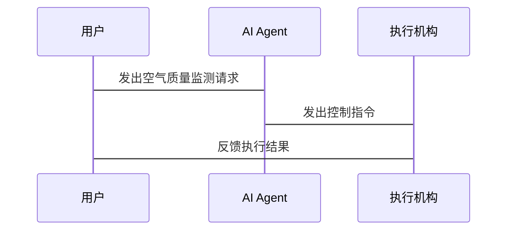

                 


# 智能厨房抽油烟机：AI Agent的空气质量控制

> **关键词**：智能厨房抽油烟机、AI Agent、空气质量控制、物联网、智能家居

> **摘要**：本文详细探讨了智能厨房抽油烟机在AI Agent技术下的空气质量控制应用。文章首先介绍了厨房空气质量问题的现状和需求，接着分析了AI Agent的基本原理及其在空气质量控制中的作用，详细讲解了系统的算法原理和架构设计，最后通过项目实战展示了AI Agent在智能抽油烟机中的具体实现，总结了最佳实践和未来发展方向。

---

# 第1章: 智能厨房抽油烟机的背景介绍

## 1.1 问题背景与需求分析

### 1.1.1 厨房空气质量问题的现状

厨房油烟是家庭健康的主要威胁之一。传统抽油烟机在使用过程中存在诸多问题，如油烟净化效率低、手动操作不便等。这些问题不仅影响厨房环境，还可能对家庭成员的健康造成潜在危害。

### 1.1.2 用户对厨房空气质量控制的核心需求

用户希望厨房空气质量得到实时监测和智能控制，同时希望设备操作简便，具备自动化功能。此外，用户还关注设备的节能性和长期维护成本。

### 1.1.3 当前解决方案的局限性与改进方向

传统抽油烟机多为机械式控制，缺乏智能化监测和自动调节功能。改进方向包括引入AI技术，实现智能监测和主动控制。

## 1.2 问题描述与目标设定

### 1.2.1 智能厨房抽油烟机的核心问题描述

如何通过AI技术实现厨房空气质量的实时监测和智能控制，提升油烟净化效率，优化用户体验。

### 1.2.2 设备需要实现的功能目标

实时监测空气质量，智能调节油烟净化模式，实现节能减排。

### 1.2.3 边界与外延：功能与非功能边界

功能边界包括空气质量监测、油烟净化控制，非功能边界包括用户隐私保护、系统稳定性等。

## 1.3 问题解决思路与技术选型

### 1.3.1 AI Agent在厨房空气质量控制中的作用

AI Agent负责接收传感器数据，分析油烟浓度，调整抽油烟机的工作模式。

### 1.3.2 智能抽油烟机的系统架构选型

采用分层架构，包括数据采集层、AI Agent层和执行机构层。

### 1.3.3 关键技术点与实现思路

传感器数据采集、AI算法模型构建、系统接口设计。

## 1.4 概念结构与核心要素

### 1.4.1 智能抽油烟机的系统组成

传感器、AI Agent、执行机构。

### 1.4.2 AI Agent的核心功能与属性

数据采集、分析、决策、执行。

### 1.4.3 系统核心要素之间的关系

传感器提供数据，AI Agent进行分析，执行机构做出响应。

## 1.5 本章小结

本章介绍了智能厨房抽油烟机的背景和需求，明确了系统架构和关键技术点，为后续章节奠定基础。

---

# 第2章: AI Agent的基本原理与实现机制

## 2.1 AI Agent的核心原理

### 2.1.1 AI Agent的定义与分类

AI Agent是能够感知环境并采取行动以实现目标的智能体。

### 2.1.2 基于AI Agent的空气质量监测机制

通过传感器数据，AI Agent分析空气质量，制定净化策略。

### 2.1.3 AI Agent的感知与决策模型

传感器数据输入、特征提取、模型训练、决策输出。

## 2.2 空气质量控制的实现机制

### 2.2.1 空气质量监测的传感器技术

使用CO和PM2.5传感器，实时监测油烟浓度。

### 2.2.2 数据采集与处理流程

数据采集、预处理、特征提取。

### 2.2.3 基于AI的空气质量预测模型

使用机器学习算法，训练空气质量预测模型。

## 2.3 AI Agent与智能抽油烟机的结合

### 2.3.1 AI Agent在抽油烟机中的应用场景

实时监测、智能调节、远程控制。

### 2.3.2 系统功能的实现逻辑

数据采集、AI分析、执行机构响应。

### 2.3.3 系统性能优化的关键点

算法优化、传感器校准、系统稳定性。

## 2.4 本章小结

本章详细讲解了AI Agent的基本原理及其在智能抽油烟机中的应用，为后续系统设计奠定基础。

---

# 第3章: 系统架构设计

## 3.1 系统功能模块划分

### 3.1.1 数据采集模块

负责采集厨房空气质量数据。

### 3.1.2 AI Agent模块

负责数据分析和决策。

### 3.1.3 执行机构控制模块

负责根据AI Agent的决策控制油烟机运行。

## 3.2 系统架构图

```mermaid
graph TD
    数据采集模块 --> AI Agent模块
    AI Agent模块 --> 执行机构控制模块
    执行机构控制模块 --> 油烟机
```

## 3.3 接口设计与交互流程

### 3.3.1 系统接口定义

传感器接口、AI Agent接口、执行机构接口。

### 3.3.2 系统交互流程图



## 3.4 本章小结

本章详细设计了系统的架构，明确了各模块的功能和交互流程。

---

# 第4章: 算法原理讲解

## 4.1 算法原理概述

AI Agent基于机器学习算法，通过传感器数据进行空气质量预测。

## 4.2 算法实现步骤

### 4.2.1 数据预处理

对传感器数据进行清洗和归一化处理。

### 4.2.2 特征提取

提取油烟浓度、颗粒物浓度等关键特征。

### 4.2.3 模型训练

使用随机森林或神经网络模型进行训练。

### 4.2.4 模型优化

通过交叉验证优化模型参数。

## 4.3 核心算法代码

```python
import pandas as pd
from sklearn.ensemble import RandomForestRegressor
from sklearn.metrics import mean_absolute_error

# 数据加载
data = pd.read_csv('油烟数据.csv')

# 特征与标签分离
X = data[['CO浓度', 'PM2.5浓度']]
y = data['空气质量指数']

# 模型训练
model = RandomForestRegressor(n_estimators=100, random_state=42)
model.fit(X, y)

# 模型预测
y_pred = model.predict(X)

# 模型评估
mae = mean_absolute_error(y, y_pred)
print(f"模型均绝对误差：{mae}")
```

## 4.4 算法优缺点分析

随机森林算法的优点是易于实现、计算效率高，缺点是模型解释性稍差。

## 4.5 本章小结

本章详细讲解了AI Agent的算法原理和实现步骤，为系统实现提供技术支持。

---

# 第5章: 项目实战

## 5.1 环境搭建与数据采集

### 5.1.1 环境搭建

安装必要的Python库和开发工具。

### 5.1.2 数据采集

通过传感器采集厨房空气质量数据。

## 5.2 系统核心实现

### 5.2.1 数据处理与特征提取

使用Python进行数据清洗和特征工程。

### 5.2.2 模型训练与优化

基于采集的数据训练空气质量预测模型。

### 5.2.3 系统集成与测试

将AI Agent与抽油烟机进行集成，测试系统功能。

## 5.3 实际案例分析

### 5.3.1 案例背景

某家庭厨房空气质量监测案例。

### 5.3.2 数据分析

空气质量指数随时间的变化趋势。

### 5.3.3 模型预测与实际结果对比

模型预测值与实际值的对比分析。

## 5.4 项目总结

通过项目实战，验证了AI Agent在智能抽油烟机中的有效性。

## 5.5 本章小结

本章通过实际案例展示了AI Agent在智能抽油烟机中的应用，验证了系统的可行性。

---

# 第6章: 最佳实践与总结

## 6.1 最佳实践

### 6.1.1 系统设计建议

采用模块化设计，便于后期维护和扩展。

### 6.1.2 算法优化建议

定期更新模型，提高预测精度。

## 6.2 小结

AI Agent在智能抽油烟机中的应用前景广阔，能够显著提升厨房空气质量控制的智能化水平。

## 6.3 注意事项

系统维护和数据安全需要注意，确保用户隐私。

## 6.4 拓展阅读

建议读者进一步学习AI在智能家居中的应用。

---

# 第7章: 总结

通过本文的详细讲解，读者可以深入了解AI Agent在智能厨房抽油烟机中的应用，掌握系统设计和实现的关键技术。未来，随着AI技术的不断发展，智能厨房设备将更加智能化，为用户带来更好的使用体验。

---

**结束**

