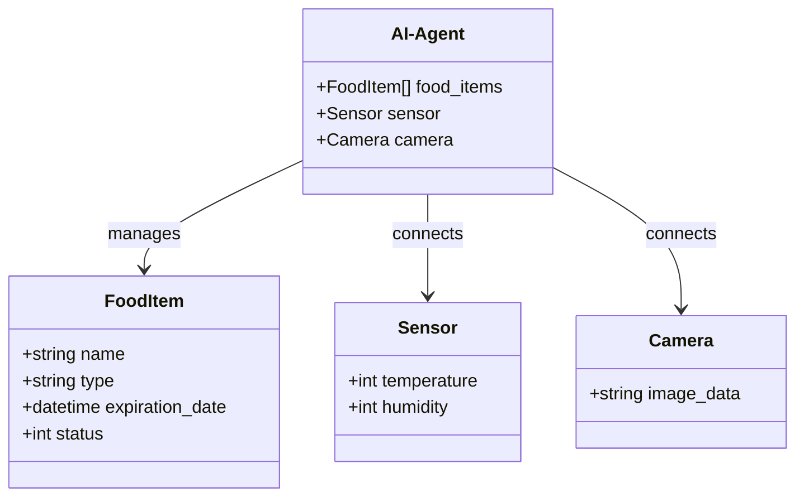
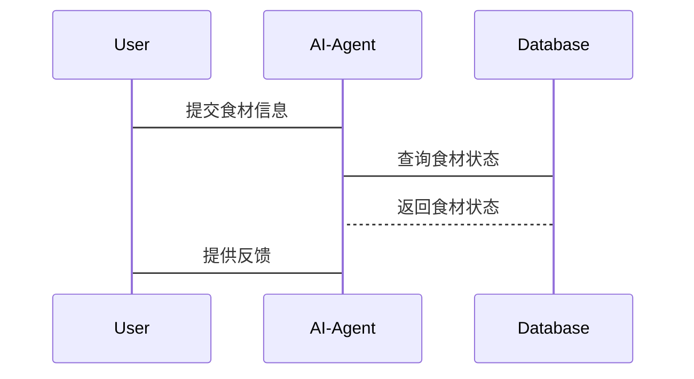

                 


接下来将按照目录大纲结构继续完成文章的撰写，以下是具体的文章内容：

---

# 第5章: 系统分析与架构设计

## 5.1 问题场景介绍

### 5.1.1 智能厨房案板的应用场景
- 餐饮行业的食品质量监控
- 家庭厨房的食材管理与安全
- 食品供应链中的质量控制

### 5.1.2 项目背景
- 项目目标：通过AI Agent实现对食材的实时监控，确保食品安全
- 项目范围：厨房案板的设计与实现
- 项目需求：食材识别、保质期提醒、异常检测

## 5.2 系统功能设计

### 5.2.1 功能模块划分
- 数据采集模块
- 数据分析模块
- 用户交互模块

### 5.2.2 功能描述
- 数据采集：通过传感器和摄像头获取食材信息
- 数据分析：利用AI算法识别食材状态
- 用户交互：提供实时反馈和操作建议

## 5.3 领域模型设计

### 5.3.1 领域模型类图


## 5.4 系统架构设计

### 5.4.1 系统架构图
```mermaid
server
    class Server {
        +FoodItem[] stored_items
        +Sensor[] connected_sensors
        +Camera[] connected_cameras
    }
    Server <---> AI-Agent
    Server <---> Database
```

## 5.5 系统接口与交互设计

### 5.5.1 系统接口设计
- 数据采集接口：REST API
- 用户交互接口：Web界面

### 5.5.2 系统交互流程图


---

# 第6章: 算法原理与实现

## 6.1 算法原理

### 6.1.1 AI Agent的工作流程
1. 数据采集：通过传感器和摄像头获取食材信息
2. 数据预处理：清洗和归一化数据
3. 特征提取：利用深度学习模型提取食材特征
4. 分类与预测：基于历史数据进行分类和预测

### 6.1.2 核心算法
- 基于卷积神经网络（CNN）的图像识别
- 基于循环神经网络（RNN）的时间序列分析

## 6.2 算法实现

### 6.2.1 Python代码实现
```python
import numpy as np
from tensorflow.keras import layers

# 数据预处理
def preprocess_data(data):
    # 数据归一化
    normalized_data = (data - np.mean(data)) / np.std(data)
    return normalized_data

# 模型构建
def build_model(input_shape):
    model = tf.keras.Sequential([
        layers.Conv2D(32, (3,3), activation='relu', input_shape=input_shape),
        layers.MaxPooling2D((2,2)),
        layers.Flatten(),
        layers.Dense(64, activation='relu'),
        layers.Dense(1, activation='sigmoid')
    ])
    model.compile(optimizer='adam', loss='binary_crossentropy', metrics=['accuracy'])
    return model

# 模型训练
def train_model(model, X_train, y_train, epochs=10):
    model.fit(X_train, y_train, epochs=epochs, validation_split=0.2)
```

### 6.2.2 算法数学模型
- 卷积神经网络模型：
  $$ L = \text{crossentropy}(y, \text{model}(x)) $$
- 损失函数：
  $$ L = -\frac{1}{N}\sum_{i=1}^{N} y_i \log(p_i) + (1 - y_i)\log(1 - p_i) $$

---

# 第7章: 项目实战

## 7.1 环境安装

### 7.1.1 安装依赖
```bash
pip install numpy tensorflow keras opencv-python
```

## 7.2 系统核心实现

### 7.2.1 核心代码实现
```python
import cv2
import numpy as np
from tensorflow.keras.models import load_model

def detect_food_quality(image_path):
    # 加载预训练模型
    model = load_model('food_quality_model.h5')
    # 读取图片
    image = cv2.imread(image_path)
    # 图片预处理
    image = cv2.resize(image, (224, 224))
    image = np.expand_dims(image, axis=0)
    # 预测
    prediction = model.predict(image)
    return prediction[0][0]  # 返回概率值
```

## 7.3 案例分析

### 7.3.1 案例1：新鲜蔬菜检测
- 输入：新鲜菠菜图片
- 输出：预测结果为“新鲜”

### 7.3.2 案例2：过期食品检测
- 输入：面包变质图片
- 输出：预测结果为“变质”

---

# 第8章: 最佳实践与总结

## 8.1 小结

### 8.1.1 核心要点回顾
- AI Agent在智能厨房案板中的应用
- 数据采集、处理与分析的关键步骤
- 系统架构设计与实现

## 8.2 注意事项

### 8.2.1 开发注意事项
- 数据隐私保护
- 系统稳定性与可靠性
- 用户体验优化

## 8.3 拓展阅读

### 8.3.1 推荐书目
- 《深度学习》
- 《Python机器学习实战》

### 8.3.2 在线资源
- TensorFlow官方文档
- Keras官方文档

---

# 第9章: 未来展望

## 9.1 技术发展趋势
- 更智能的AI算法
- 更高效的硬件支持
- 更广泛的应用场景

## 9.2 未来挑战
- 数据隐私与安全
- 技术标准化
- 用户接受度

---

# 关键词
- 智能厨房，AI Agent，食品安全，监控系统，物联网

# 摘要
本文详细探讨了AI Agent在智能厨房案板中的应用，重点分析了其在食品安全监控中的作用。通过介绍系统架构、算法原理和项目实战，展示了如何利用AI技术实现食材的实时监控与管理。文章还提供了最佳实践和未来展望，为读者提供了全面的技术视角。

