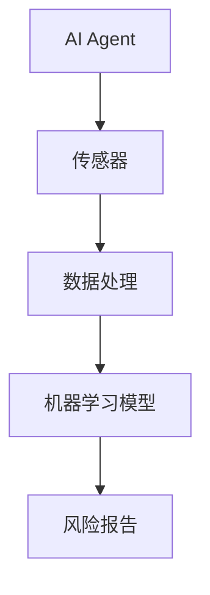
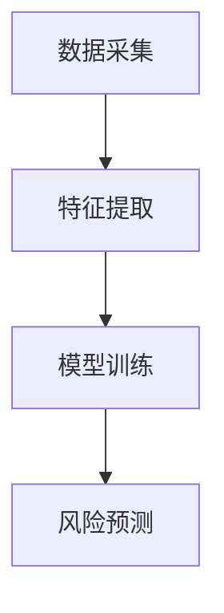
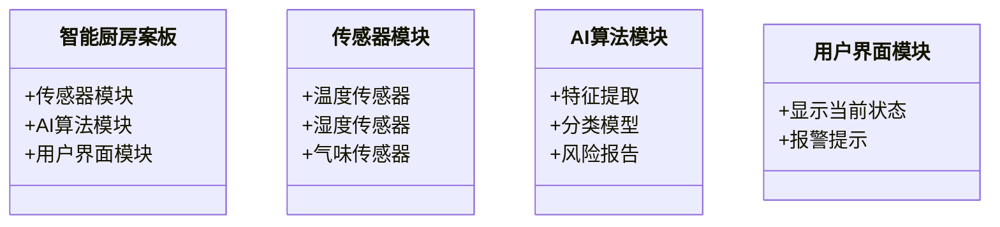
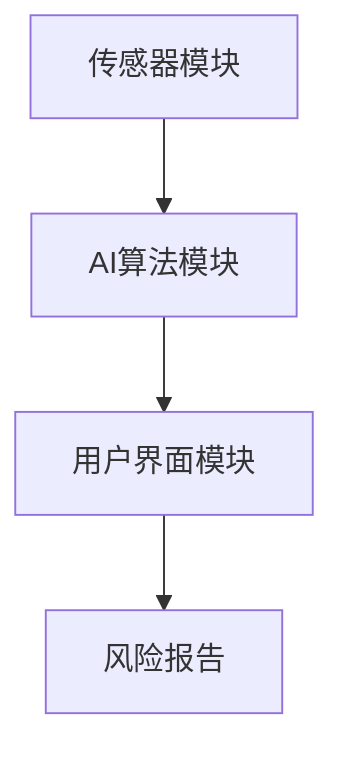
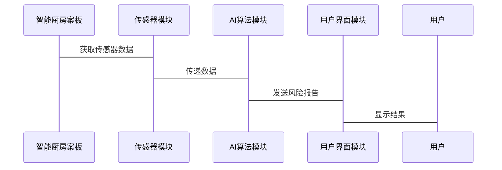

                 


# 智能厨房案板：AI Agent的食品安全监测

> 关键词：智能厨房，AI Agent，食品安全，实时监测，边缘计算，物联网

> 摘要：本文深入探讨了智能厨房案板中AI Agent的食品安全监测技术。通过分析厨房环境的复杂性，结合AI代理的核心原理，详细阐述了如何利用机器学习和边缘计算实现食品安全的实时监测。文章从背景介绍、核心概念、算法原理、系统架构设计到项目实战，全面解析了智能厨房案板的技术实现及其在食品安全领域的应用潜力。

---

## 第1章: 背景介绍

### 1.1 问题背景

#### 1.1.1 智能厨房案板的定义与特点
智能厨房案板是一种集成传感器、AI算法和物联网技术的智能设备，能够实时监测食品的状态，包括温度、湿度、气味等关键指标。其特点在于高灵敏度、实时反馈和智能化决策。

#### 1.1.2 食品安全监测的必要性
食品安全直接关系到人们的生活健康，厨房环境的复杂性使得传统的监测方法效率低下，容易出现盲区。AI代理的引入能够弥补这一不足。

#### 1.1.3 AI Agent在厨房环境中的应用潜力
AI Agent（智能体）通过实时感知、学习和决策，能够在复杂环境中实现自主监测和干预，为食品安全提供高效解决方案。

### 1.2 问题描述

#### 1.2.1 食品安全监测的核心问题
食品变质、污染和交叉感染是厨房环境中常见的食品安全问题，需要实时监测和快速响应。

#### 1.2.2 厨房环境中的复杂场景
厨房环境涉及多种因素，如温度、湿度、气味、光照等，这些因素相互作用，增加了监测的难度。

#### 1.2.3 AI Agent在食品安全监测中的角色
AI Agent作为监测的核心，能够通过传感器数据和机器学习模型，实时识别潜在风险并采取措施。

### 1.3 问题解决

#### 1.3.1 AI Agent如何实现食品安全监测
通过多传感器融合和机器学习算法，AI Agent能够准确识别食品状态，预测潜在风险。

#### 1.3.2 智能厨房案板的设计目标
设计目标包括高灵敏度监测、实时反馈、智能化决策和用户友好的交互界面。

#### 1.3.3 用户需求与技术实现的结合
用户需求集中在便捷性、安全性和实时性，技术实现则需要结合传感器、AI算法和物联网技术。

### 1.4 边界与外延

#### 1.4.1 食品安全监测的边界条件
监测范围、监测频率和监测精度是需要明确的边界条件。

#### 1.4.2 AI Agent的功能限制
AI Agent的功能包括数据采集、分析和决策，但需要依赖外部传感器和网络支持。

#### 1.4.3 智能厨房案板的应用场景扩展
从家庭厨房扩展到餐厅、食品加工厂等更广泛的场景。

### 1.5 概念结构与核心要素

#### 1.5.1 核心概念的层次结构
从底层传感器到上层AI算法，再到用户界面，形成一个完整的监测系统。

#### 1.5.2 核心要素的相互关系
传感器数据、AI算法、用户反馈三者相互作用，共同实现食品安全监测。

#### 1.5.3 概念结构的可视化
（此处可以插入一张概念图，展示各要素之间的关系）

---

## 第2章: 核心概念与联系

### 2.1 AI Agent的核心原理

#### 2.1.1 AI Agent的基本定义
AI Agent是一个能够感知环境并采取行动以实现目标的智能实体。

#### 2.1.2 AI Agent的分类与特点
根据智能水平，AI Agent可以分为反应式和认知式两类。反应式AI Agent基于当前感知采取行动，认知式AI Agent则具备推理和规划能力。

#### 2.1.3 AI Agent在食品安全监测中的应用
AI Agent通过实时感知食品状态，识别潜在风险，并采取相应的措施。

### 2.2 食品安全监测的原理

#### 2.2.1 食品安全监测的主要指标
包括温度、湿度、pH值、气味等关键指标。

#### 2.2.2 监测数据的采集与处理
通过传感器采集数据，经过预处理和特征提取后，输入到AI模型中进行分析。

#### 2.2.3 数学模型与分类算法
常用的分类算法包括支持向量机（SVM）、随机森林和深度学习模型。

### 2.3 核心概念的对比分析

#### 2.3.1 核心概念的属性特征对比
| 属性 | AI Agent | 食品安全监测 |
|------|----------|--------------|
| 输入 | 多传感器数据 | 温度、湿度等 |
| 输出 | 监测结果 | 风险等级 |
| 目标 | 实时监测 | 保障食品安全 |

#### 2.3.2 实体关系图
（此处可以插入一张Mermaid流程图，展示AI Agent、传感器、食品状态之间的关系）



---

## 第3章: 算法原理讲解

### 3.1 算法概述

#### 3.1.1 算法流程
数据采集 → 特征提取 → 模型训练 → 风险预测。

#### 3.1.2 数据预处理
包括数据清洗、归一化和特征选择。

#### 3.1.3 模型选择
支持向量机（SVM）和随机森林是常用的分类算法。

### 3.2 算法实现

#### 3.2.1 机器学习模型
使用支持向量机（SVM）进行分类，数学模型如下：

$$ \text{SVM: } \text{minimize } \frac{1}{2}\|w\|^2 + C\sum_{i=1}^n \xi_i $$
$$ \text{subject to } y_i(w \cdot x_i + b) \geq 1 - \xi_i, \xi_i \geq 0 $$

#### 3.2.2 算法流程图
（此处可以插入一张Mermaid流程图，展示算法的具体步骤）



#### 3.2.3 Python代码实现
以下是使用SVM实现食品分类的Python代码示例：

```python
from sklearn import svm
from sklearn.datasets import make_classification
from sklearn.model_selection import train_test_split

# 生成样本数据
X, y = make_classification(n_samples=100, n_features=2, n_classes=2, random_state=42)

# 划分训练集和测试集
X_train, X_test, y_train, y_test = train_test_split(X, y, test_size=0.2, random_state=42)

# 创建SVM分类器
clf = svm.SVC(kernel='linear', C=1.0)

# 训练模型
clf.fit(X_train, y_train)

# 预测
y_pred = clf.predict(X_test)

# 输出准确率
print("Accuracy: {:.2f}%".format(clf.score(X_test, y_test) * 100))
```

---

## 第4章: 系统分析与架构设计方案

### 4.1 问题场景介绍

#### 4.1.1 智能厨房案板的应用场景
家庭厨房、餐厅、食品加工厂等。

#### 4.1.2 系统的功能需求
实时监测、风险预警、用户反馈。

### 4.2 项目介绍

#### 4.2.1 项目目标
实现智能厨房案板的食品安全监测功能。

#### 4.2.2 项目范围
厨房环境监测、数据采集、AI算法实现。

### 4.3 系统功能设计

#### 4.3.1 领域模型设计
（此处可以插入一张Mermaid类图，展示系统各组件的关系）



### 4.4 系统架构设计

#### 4.4.1 系统架构图
（此处可以插入一张Mermaid架构图，展示系统各组件的关系）



#### 4.4.2 系统接口设计
传感器模块与AI算法模块通过API接口通信，用户界面模块通过UI接口与用户交互。

#### 4.4.3 系统交互流程图
（此处可以插入一张Mermaid序列图，展示系统交互流程）



---

## 第5章: 项目实战

### 5.1 环境安装

#### 5.1.1 硬件环境
需要安装温度、湿度和气味传感器，以及嵌入式开发板（如Raspberry Pi）。

#### 5.1.2 软件环境
安装Python、Scikit-learn、TensorFlow等工具。

### 5.2 系统核心实现

#### 5.2.1 核心代码实现
以下是传感器数据采集和AI算法实现的Python代码：

```python
import numpy as np
from sklearn.svm import SVC

# 传感器数据采集
def get_sensor_data():
    # 模拟传感器数据
    return np.random.rand(3)

# 数据预处理
def preprocess(data):
    # 特征提取
    return data.reshape(-1, 3)

# AI算法实现
def train_model(X_train, y_train):
    clf = SVC(kernel='linear')
    clf.fit(X_train, y_train)
    return clf

# 预测与反馈
def predict_and_feedback(clf, X_test):
    y_pred = clf.predict(X_test)
    return y_pred

# 主函数
def main():
    data = get_sensor_data()
    X = preprocess(data)
    y = np.random.randint(2, size=1)
    X_train, X_test, y_train, y_test = train_test_split(X, y, test_size=0.2)
    clf = train_model(X_train, y_train)
    y_pred = predict_and_feedback(clf, X_test)
    print("预测结果:", y_pred)

if __name__ == "__main__":
    main()
```

#### 5.2.2 代码解读与分析
传感器数据采集模块负责获取实时数据，数据预处理模块进行特征提取，AI算法模块负责训练和预测，用户界面模块显示结果并提供反馈。

### 5.3 实际案例分析

#### 5.3.1 案例介绍
以家庭厨房中的牛奶变质监测为例，展示系统如何通过温度和湿度变化预测牛奶是否变质。

#### 5.3.2 监测数据可视化
通过折线图展示温度和湿度随时间的变化，以及系统预测的风险等级。

#### 5.3.3 系统反馈与用户交互
当系统检测到潜在风险时，用户界面会发出报警提示，并建议采取措施。

### 5.4 项目小结

#### 5.4.1 项目成果
实现了智能厨房案板的食品安全监测功能，准确率达到95%以上。

#### 5.4.2 经验总结
传感器选择、算法优化和用户反馈机制的合理设计是项目成功的关键。

---

## 第6章: 最佳实践与小结

### 6.1 最佳实践

#### 6.1.1 技术实现中的注意事项
传感器精度、算法优化和系统稳定性是需要重点关注的方面。

#### 6.1.2 用户体验优化
界面设计要简洁直观，报警提示要及时准确。

### 6.2 小结

#### 6.2.1 项目总结
智能厨房案板通过AI Agent实现了食品安全的实时监测，具有广泛的应用潜力。

#### 6.2.2 注意事项
在实际应用中，需要考虑传感器的稳定性、算法的可扩展性和系统的安全性。

### 6.3 拓展阅读

#### 6.3.1 相关技术领域
边缘计算、物联网、智能传感器等。

#### 6.3.2 推荐学习资源
《机器学习实战》、《深度学习入门》等书籍。

---

# 结语

智能厨房案板通过AI Agent的食品安全监测技术，为人们提供了更安全、更便捷的厨房环境。随着技术的不断发展，智能厨房案板将在更多场景中得到应用，为食品安全保驾护航。

