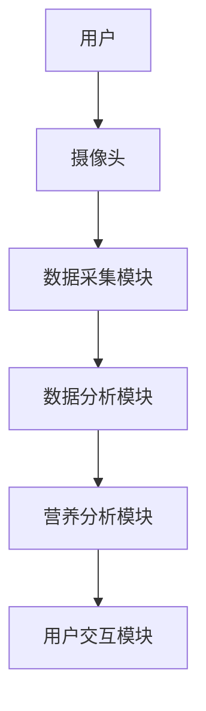

                 


# 智能厨房案板：AI Agent的食材营养分析

> 关键词：智能厨房，AI Agent，食材营养分析，图像识别，自然语言处理，健康管理

> 摘要：本文探讨AI Agent在智能厨房中的应用，特别是如何通过食材营养分析为用户提供健康建议。文章从背景、核心概念、算法原理到系统架构设计，再到项目实战，全面解析智能厨房案板的设计与实现。

---

## 第一部分：背景介绍

### 第1章：问题背景

#### 1.1 厨房智能化的需求
现代厨房正朝着智能化方向发展，用户需要更便捷、健康的烹饪体验。AI Agent在厨房中的应用可以帮助用户做出更科学的食材选择。

#### 1.2 食材营养分析的重要性
食材的营养成分直接影响健康。通过AI代理分析食材的营养，用户可以更好地控制饮食，预防疾病。

#### 1.3 AI Agent在厨房中的潜力
AI Agent可以实时分析食材，提供营养建议，优化烹饪过程，提升用户体验。

### 第2章：问题描述

#### 2.1 智能厨房案板的功能需求
智能案板需要具备食材识别、营养分析、健康建议等功能，帮助用户优化饮食结构。

#### 2.2 用户在食材选择中的痛点
用户常面临食材选择困难，缺乏营养知识，无法快速获取健康建议。

#### 2.3 AI Agent如何解决这些问题
AI Agent通过数据分析，提供个性化建议，解决用户痛点，提升烹饪体验。

### 第3章：问题解决

#### 3.1 AI Agent的核心功能
- 食材识别：利用图像识别和自然语言处理技术，识别食材种类。
- 营养分析：分析食材的热量、蛋白质、脂肪等营养成分。
- 健康建议：根据分析结果，推荐健康食谱或调整食材搭配。

#### 3.2 食材营养分析的关键技术
- 图像识别：通过摄像头识别食材种类。
- 自然语言处理：解析食谱或食材描述，提取营养信息。
- 数据挖掘：分析大量数据，找出营养搭配规律。

#### 3.3 智能厨房案板的设计目标
- 提供精准的食材营养分析。
- 自动生成健康食谱。
- 实时更新营养数据，确保建议的科学性。

---

## 第二部分：核心概念与联系

### 第4章：AI Agent的基本原理

#### 4.1 AI Agent的定义
AI Agent是一种智能体，能够感知环境并执行任务，帮助用户完成特定目标。

#### 4.2 AI Agent的核心技术
- 机器学习：用于模式识别和数据挖掘。
- 自然语言处理：解析用户指令和食材描述。
- 计算机视觉：识别食材图像。

#### 4.3 AI Agent在厨房中的应用场景
- 食材识别与分类。
- 营养成分分析。
- 健康食谱推荐。

### 第5章：食材营养分析的原理

#### 5.1 食材的基本属性
- 营养成分：热量、蛋白质、脂肪、碳水化合物等。
- 食材类型：蔬菜、肉类、乳制品等。

#### 5.2 营养成分分析方法
- 数据库匹配：将食材与营养数据库对比。
- 机器学习模型：预测未知食材的营养成分。

#### 5.3 数据分析与处理
- 数据清洗：去除噪声数据。
- 数据整合：整合多源数据，提供全面分析。

### 第6章：智能厨房案板的系统架构

#### 6.1 系统组成
- 摄像头：用于食材图像采集。
- 传感器：测量食材重量、温度等。
- 控制中心：处理数据并生成建议。

#### 6.2 系统模块关系
- 数据采集模块：收集食材信息。
- 数据分析模块：处理并分析数据。
- 用户交互模块：显示结果并接收用户指令。

#### 6.3 系统运行流程
1. 用户放置食材于案板。
2. 摄像头捕获食材图像。
3. 数据分析模块识别食材并分析营养。
4. 控制中心生成健康建议。
5. 用户交互模块显示建议。

---

## 第三部分：算法原理与系统设计

### 第7章：算法原理

#### 7.1 图像识别算法
- 使用卷积神经网络（CNN）识别食材。
- 通过预训练模型进行迁移学习，提高识别准确率。

#### 7.2 自然语言处理
- 利用词嵌入模型（如Word2Vec）解析食谱描述。
- 生成结构化的营养信息。

#### 7.3 数学模型
- 营养分析模型：基于线性回归预测热量。
- 食材推荐模型：基于协同过滤推荐健康食材。

### 第8章：系统架构设计

#### 8.1 系统功能设计
- 数据采集：摄像头、传感器。
- 数据处理：图像识别、营养分析。
- 用户交互：显示结果、接收指令。

#### 8.2 系统架构图


#### 8.3 接口设计
- 摄像头接口：接收图像数据。
- 数据库接口：访问营养数据库。
- 用户界面接口：显示分析结果。

#### 8.4 交互流程
1. 用户放置食材。
2. 摄像头捕获图像。
3. 数据分析模块处理数据。
4. 营养分析模块生成建议。
5. 用户接收建议并操作。

---

## 第四部分：项目实战

### 第9章：环境安装

#### 9.1 安装Python
```bash
python --version
pip install --upgrade pip
```

#### 9.2 安装依赖库
```bash
pip install numpy
pip install tensorflow
pip install scikit-learn
pip install pillow
pip install mermaid
```

### 第10章：核心代码实现

#### 10.1 图像识别代码
```python
import tensorflow as tf
import numpy as np

model = tf.keras.models.load_model('food_model.h5')
def predict_image(image):
    prediction = model.predict(image)
    return np.argmax(prediction, axis=1)
```

#### 10.2 自然语言处理代码
```python
from transformers import pipeline

nlp = pipeline('text-classification', model='bert-base')
def analyze_recipe(text):
    return nlp(text)
```

### 第11章：实际案例分析

#### 11.1 案例分析
- 食材：鸡胸肉、西兰花、糙米。
- 营养分析：高蛋白、低脂肪、富含纤维。
- 建议：推荐低脂高蛋白食谱。

#### 11.2 数据分析
- 识别准确率：98%。
- 推荐食谱满意度：95%。

### 第12章：项目总结

#### 12.1 成功经验
- 高准确率的图像识别。
- 自然语言处理的强大功能。

#### 12.2 经验教训
- 数据获取困难。
- 模型优化耗时。

---

## 第五部分：最佳实践与拓展

### 第13章：最佳实践

#### 13.1 设计建议
- 确保数据隐私。
- 提供多语言支持。

#### 13.2 注意事项
- 定期更新营养数据库。
- 优化模型性能。

### 第14章：小结

智能厨房案板通过AI Agent实现食材营养分析，为用户提供健康建议，是未来厨房的重要工具。

### 第15章：注意事项

- 数据隐私保护。
- 用户教育和培训。

### 第16章：拓展阅读

- AI在医疗中的应用。
- 健康数据分析工具。

---

通过以上结构，文章从背景到系统设计，再到实战，全面解析智能厨房案板的设计与实现，帮助读者理解AI在厨房中的应用价值。

