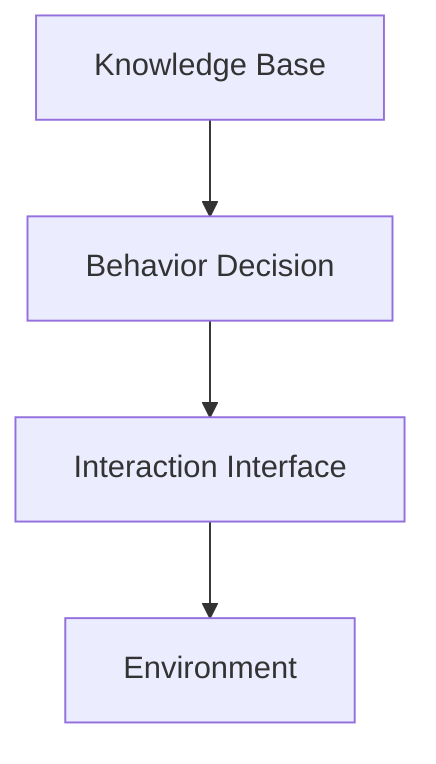
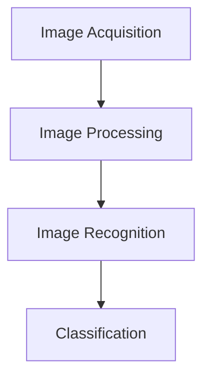
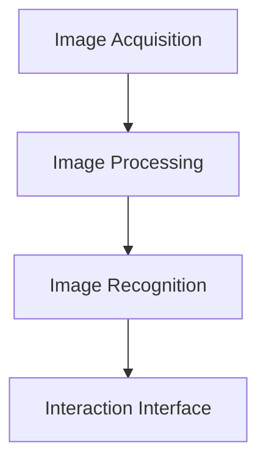
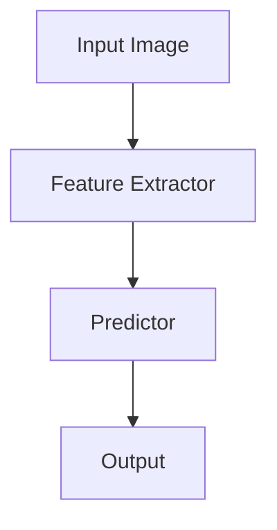
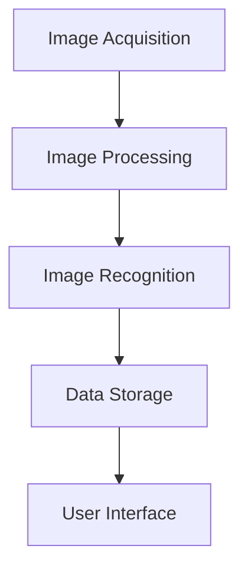

                 


# 智能厨房案板：AI Agent的食材识别系统

---

## 关键词
智能厨房案板, AI Agent, 食材识别, 图像识别, 深度学习, 机器学习, 目标检测

---

## 摘要
智能厨房案板是一种结合人工智能（AI）技术的创新厨房工具，能够通过AI Agent实现对食材的自动识别、分类和管理。本文详细探讨了智能厨房案板的核心概念、食材识别系统的算法原理、系统架构设计以及实际应用案例。通过分析AI Agent在食材识别中的应用，结合深度学习算法（如CNN、YOLO等），本文为读者提供了从理论到实践的全面解读。

---

# 第1章: 智能厨房案板的概念与背景

## 1.1 智能厨房案板的定义与应用场景
### 1.1.1 智能厨房案板的定义
智能厨房案板是一种集成AI技术的厨房工具，能够通过摄像头和传感器采集食材信息，并通过AI算法实现食材的自动识别、分类和管理。它通常与智能厨房设备（如冰箱、烤箱等）连接，提供智能化的食材管理解决方案。

### 1.1.2 智能厨房案板的主要应用场景
- 食材分类与管理
- 食谱推荐
- 食材用量智能调整
- 食材保质期提醒

### 1.1.3 智能厨房案板的用户需求分析
- 用户需求：便捷性、准确性、智能化
- 使用场景：家庭厨房、商用厨房

## 1.2 AI Agent的基本概念与特点
### 1.2.1 AI Agent的定义
AI Agent（智能体）是指能够感知环境、自主决策并执行任务的智能系统。它可以理解用户需求、主动提供服务，并通过与环境交互不断优化自身行为。

### 1.2.2 AI Agent的核心特点
- 自主性：能够自主决策
- 反应性：能够实时感知环境
- 持续性：能够持续执行任务
- 学习能力：能够通过数据优化自身性能

### 1.2.3 AI Agent在智能厨房中的应用潜力
- 食材识别与分类
- 食谱推荐
- 智能烹饪辅助

## 1.3 食材识别系统的重要性与挑战
### 1.3.1 食材识别系统的定义
食材识别系统是一种基于图像识别技术的系统，能够自动识别食材的种类、数量和状态。

### 1.3.2 食材识别系统的核心功能
- 食材分类
- 食材检测
- 食材属性分析

### 1.3.3 食材识别系统的主要挑战
- 数据获取难度
- 算法精度限制
- 环境干扰因素

## 1.4 本章小结
本章介绍了智能厨房案板的基本概念、应用场景以及AI Agent的核心特点。同时，分析了食材识别系统的重要性与挑战，为后续章节的深入探讨奠定了基础。

---

# 第2章: 智能厨房案板中的AI Agent架构

## 2.1 AI Agent的基本架构
### 2.1.1 知识表示
知识表示是AI Agent理解环境和任务的基础，通常采用符号逻辑或概率模型。

### 2.1.2 行为决策
行为决策是AI Agent的核心功能，基于感知信息和知识库进行决策。

### 2.1.3 交互界面
交互界面是AI Agent与用户或设备之间的桥梁，支持语音、视觉或触控等多种交互方式。



## 2.2 食材识别系统的核心模块
### 2.2.1 图像采集模块
图像采集模块负责获取食材的图像数据，通常使用摄像头或传感器。

### 2.2.2 图像处理模块
图像处理模块对采集到的图像进行预处理，包括去噪、增强和标准化。

### 2.2.3 图像识别模块
图像识别模块基于深度学习模型对图像进行分类和检测。



## 2.3 系统整体架构设计
### 2.3.1 系统功能模块划分
- 图像采集模块
- 图像处理模块
- 图像识别模块
- 交互界面模块

### 2.3.2 系统模块之间的关系


### 2.3.3 系统架构的优缺点分析
- 优点：模块化设计，易于扩展
- 缺点：部分模块依赖性强，可能影响性能

## 2.4 本章小结
本章详细介绍了AI Agent的基本架构以及食材识别系统的核心模块。通过模块化设计，智能厨房案板能够实现高效的食材识别与管理。

---

# 第3章: 食材识别系统的算法原理

## 3.1 图像识别算法概述
### 3.1.1 基于CNN的图像识别
- CNN（卷积神经网络）是图像识别的核心算法，通过卷积层和池化层提取图像特征。

### 3.1.2 基于目标检测的食材识别
- 目标检测算法（如YOLO、Faster R-CNN）能够定位食材的位置并识别其种类。

### 3.1.3 基于深度学习的图像分割
- 图像分割算法（如U-Net）能够精确定位食材的区域。

## 3.2 基于YOLO的目标检测算法
### 3.2.1 YOLO算法的基本原理
YOLO（You Only Look Once）是一种单阶段目标检测算法，通过回归预测边界框和类别概率。

### 3.2.2 YOLO的网络结构


### 3.2.3 YOLO在食材识别中的应用
- 示例：识别一块牛肉的种类和位置。

## 3.3 基于Faster R-CNN的目标检测算法
### 3.3.1 Faster R-CNN算法的基本原理
Faster R-CNN通过RPN（Region Proposal Network）生成候选区域，然后通过RoI Pooling提取特征进行分类和回归。

### 3.3.2 RPN网络的作用
- 生成候选区域，减少计算量。

### 3.3.3 ROI Pooling的作用
- 对候选区域进行特征提取。

## 3.4 算法的优缺点对比
### 3.4.1 YOLO与Faster R-CNN的对比
| 特性     | YOLO                | Faster R-CNN            |
|----------|---------------------|--------------------------|
| 速度     | 快                   | 较慢                     |
| 准确率     | 较低                 | 较高                     |
| 复杂度     | 低                   | 高                      |

### 3.4.2 其他目标检测算法的对比
- 比较YOLO、Faster R-CNN、SSD等算法的优缺点。

## 3.5 本章小结
本章详细介绍了食材识别系统中常用的深度学习算法，包括CNN、YOLO和Faster R-CNN，并分析了它们的优缺点。

---

# 第4章: 食材识别系统的系统设计

## 4.1 系统功能需求分析
### 4.1.1 用户需求分析
- 用户希望通过智能厨房案板实现食材的自动识别和分类。
- 用户需要系统能够提供食谱推荐和食材用量调整。

### 4.1.2 系统功能需求
- 食材识别功能
- 食材管理功能
- 食谱推荐功能

### 4.1.3 系统性能需求
- 响应时间：≤1秒
- 识别准确率：≥95%

## 4.2 系统架构设计
### 4.2.1 系统模块划分
- 图像采集模块
- 图像处理模块
- 图像识别模块
- 数据存储模块
- 用户界面模块

### 4.2.2 系统模块之间的关系


### 4.2.3 系统架构的优缺点分析
- 优点：模块化设计，易于扩展
- 缺点：部分模块依赖性强，可能影响性能

## 4.3 系统接口设计
### 4.3.1 系统内部接口设计
- 图像处理模块与图像识别模块之间的接口

### 4.3.2 系统外部接口设计
- 用户界面与数据存储模块之间的接口

### 4.3.3 接口设计的注意事项
- 接口设计需要考虑数据格式和通信协议。

## 4.4 系统实现的步骤
### 4.4.1 环境搭建
- 安装Python、TensorFlow、OpenCV等开发工具。

### 4.4.2 数据采集
- 使用摄像头采集食材图像。

### 4.4.3 算法实现
- 实现YOLO或Faster R-CNN算法进行食材识别。

### 4.4.4 系统集成
- 将各个模块集成到一个完整的系统中。

## 4.5 本章小结
本章详细介绍了食材识别系统的功能需求、架构设计和实现步骤，为后续的系统实现奠定了基础。

---

# 第5章: 项目实战——智能厨房案板的实现

## 5.1 项目概述
### 5.1.1 项目目标
- 实现食材的自动识别和分类。

### 5.1.2 项目团队
- 开发团队：AI工程师、前端开发人员、后端开发人员。

### 5.1.3 项目周期
- 开发周期：3个月

## 5.2 环境搭建
### 5.2.1 开发工具安装
- 安装Python、TensorFlow、OpenCV等开发工具。

### 5.2.2 依赖管理
- 使用虚拟环境管理依赖。

## 5.3 核心代码实现
### 5.3.1 图像采集模块
```python
import cv2

def capture_image():
    cap = cv2.VideoCapture(0)
    ret, frame = cap.read()
    if ret:
        cv2.imwrite("食材.jpg", frame)
    cap.release()
```

### 5.3.2 图像处理模块
```python
import cv2

def preprocess_image(image_path):
    image = cv2.imread(image_path)
    # 图像预处理代码
    return processed_image
```

### 5.3.3 图像识别模块
```python
import tensorflow as tf
from tensorflow.keras import models

def recognize_image(image_path):
    model = models.load_model("食材识别模型.h5")
    # 预测代码
    return prediction
```

## 5.4 系统集成与测试
### 5.4.1 系统集成
- 将各个模块集成到一个完整的系统中。

### 5.4.2 系统测试
- 测试食材识别的准确率和响应时间。

## 5.5 项目小结
本章通过实际案例展示了智能厨房案板的实现过程，包括环境搭建、核心代码实现和系统测试。

---

# 第6章: 总结与展望

## 6.1 最佳实践 tips
- 数据预处理是关键，确保数据质量。
- 选择合适的算法，权衡速度和准确率。

## 6.2 小结
智能厨房案板结合了AI Agent和食材识别系统，能够为用户提供智能化的食材管理解决方案。

## 6.3 注意事项
- 数据隐私问题需要重视。
- 系统稳定性需要优化。

## 6.4 拓展阅读
- 推荐阅读《深度学习入门》、《YOLO目标检测算法详解》等书籍。

---

通过以上章节的详细讲解，本文为读者提供了从理论到实践的全面解读，帮助读者理解智能厨房案板的核心技术与实现方法。

