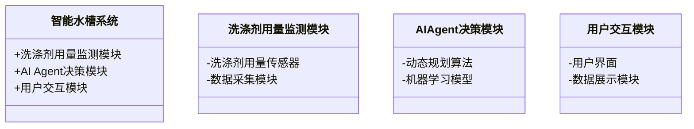
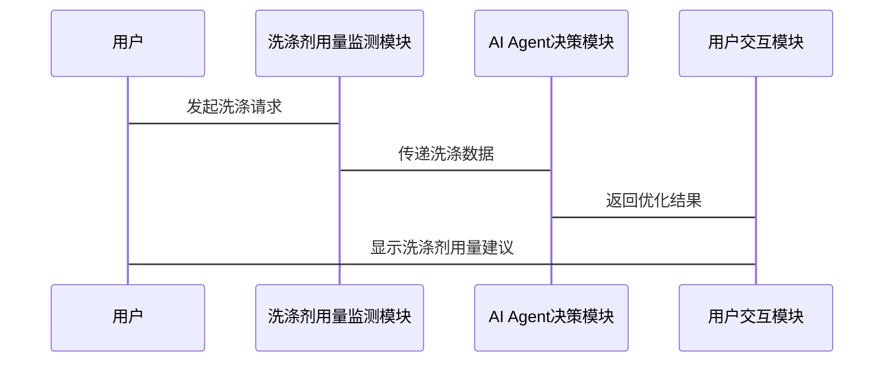

                 


# 智能厨房水槽：AI Agent的洗涤剂用量优化

## 关键词：智能水槽、AI Agent、洗涤剂优化、动态规划、机器学习

## 摘要：本文探讨了AI Agent在智能厨房水槽中的应用，重点分析了洗涤剂用量优化的算法原理、系统架构设计及实际应用案例。通过结合动态规划和机器学习模型，提出了一种高效的洗涤剂用量优化方案，旨在减少资源浪费，提升洗涤效率。

---

# 第1章: 智能厨房水槽与洗涤剂用量优化背景

## 1.1 智能厨房水槽的发展背景

### 1.1.1 厨房水槽的演变历程

水槽是厨房中不可或缺的设备，经历了从传统水槽到智能水槽的演变。早期的水槽仅具备基本的洗涤功能，而现代智能水槽则集成了多种智能技术，如传感器、AI算法和物联网连接，能够实现自动控制和优化洗涤过程。

### 1.1.2 洗涤剂用量优化的必要性

随着环保意识的增强和资源的有限性，优化洗涤剂用量成为一个重要课题。传统的洗涤剂用量往往基于经验或固定的模式，容易导致浪费。通过AI技术优化洗涤剂用量，可以显著减少浪费，降低使用成本，同时减少环境负担。

### 1.1.3 智能化技术在厨房设备中的应用趋势

智能化技术正在改变厨房设备的功能和使用方式。AI Agent（智能代理）的应用，使得厨房设备能够根据环境和用户需求动态调整行为。这种趋势不仅提升了用户体验，还推动了厨房设备的智能化升级。

---

## 1.2 洗涤剂用量优化问题的提出

### 1.2.1 洗涤剂用量与洗涤效果的关系

洗涤剂用量直接影响洗涤效果。过量使用会浪费资源，而过少使用则无法有效清洁。因此，找到洗涤剂用量与洗涤效果的最佳平衡点至关重要。

### 1.2.2 洗涤剂浪费的现状与问题

传统洗涤过程中，洗涤剂用量往往不考虑水温、水质、洗涤物类型等因素，导致洗涤剂浪费现象普遍。这不仅增加了用户的经济负担，还对环境造成负面影响。

### 1.2.3 优化洗涤剂用量的潜在收益

优化洗涤剂用量可以带来多重收益，包括减少经济成本、降低环境负担、提升洗涤效率等。通过AI技术实现智能化优化，能够最大化这些收益。

---

## 1.3 AI Agent在洗涤剂用量优化中的作用

### 1.3.1 AI Agent的基本概念

AI Agent是一种智能代理，能够感知环境、执行任务并做出决策。在智能水槽中，AI Agent负责收集数据、分析洗涤需求并优化洗涤剂用量。

### 1.3.2 AI Agent在智能水槽中的应用场景

AI Agent可以实时监测洗涤过程中的各种参数（如水温、水质、洗涤物类型等），并根据这些参数动态调整洗涤剂用量，确保洗涤效果的同时减少浪费。

### 1.3.3 智能水槽与AI Agent结合的优势

通过AI Agent，智能水槽能够实现高度智能化的洗涤过程，优化洗涤剂用量，提升用户体验，同时降低运营成本。

---

## 1.4 本章小结

本章介绍了智能水槽的发展背景，分析了洗涤剂用量优化的必要性，并探讨了AI Agent在智能水槽中的作用。通过AI技术实现洗涤剂用量优化，能够显著提升洗涤效率，减少资源浪费。

---

# 第2章: AI Agent与洗涤剂优化算法

## 2.1 AI Agent的核心概念

### 2.1.1 AI Agent的定义与特征

AI Agent是一种能够感知环境、执行任务并做出决策的智能系统。其核心特征包括自主性、反应性、目标导向性和学习能力。

### 2.1.2 AI Agent的分类与应用场景

AI Agent可以分为基于规则的代理和基于机器学习的代理。在智能水槽中，基于机器学习的代理能够根据实时数据动态调整洗涤剂用量。

### 2.1.3 AI Agent在智能水槽中的具体实现

在智能水槽中，AI Agent通过传感器采集数据，利用算法模型计算最优洗涤剂用量，并通过执行机构实现洗涤剂的精准投放。

---

## 2.2 洗涤剂用量优化算法

### 2.2.1 基于动态规划的洗涤剂用量优化

动态规划是一种优化算法，适用于分阶段决策问题。在洗涤剂用量优化中，动态规划可以用来计算不同洗涤阶段的最优用量。

### 2.2.2 基于机器学习的洗涤剂用量预测

机器学习模型可以根据历史数据和实时参数，预测最佳的洗涤剂用量。常见的机器学习模型包括回归模型和神经网络模型。

### 2.2.3 算法对比与适用场景分析

动态规划适用于问题规模较小、状态空间明确的情况，而机器学习模型适用于数据量大、特征复杂的场景。在智能水槽中，可以根据具体需求选择合适的算法。

---

## 2.3 洗涤剂用量优化算法的数学模型

### 2.3.1 动态规划模型

动态规划模型通过递推的方式求解最优解。在洗涤剂用量优化中，可以将洗涤过程分为多个阶段，每个阶段的决策目标是最大化洗涤效果，同时最小化洗涤剂用量。

### 2.3.2 机器学习模型

机器学习模型通常采用回归模型，将洗涤剂用量作为目标变量，洗涤过程中的各种参数（如水温、水质、洗涤物类型）作为自变量，通过训练数据建立预测模型。

### 2.3.3 模型对比与优化策略

通过对比动态规划和机器学习模型的优劣，可以制定优化策略。例如，动态规划适用于简单场景，机器学习模型适用于复杂场景。在实际应用中，可以根据具体需求选择合适的算法。

---

## 2.4 本章小结

本章介绍了AI Agent的核心概念，详细讲解了基于动态规划和机器学习的洗涤剂用量优化算法，并对两种算法进行了对比分析。通过选择合适的算法，可以实现高效的洗涤剂用量优化。

---

# 第3章: 系统分析与架构设计

## 3.1 系统功能需求分析

### 3.1.1 洗涤剂用量监测功能

系统需要实时监测洗涤过程中的洗涤剂用量，并记录相关数据。

### 3.1.2 AI Agent决策功能

AI Agent需要根据传感器数据和算法模型计算出最优的洗涤剂用量。

### 3.1.3 用户交互功能

系统需要提供友好的用户界面，用户可以查看洗涤剂用量、洗涤效果等信息，并进行必要的操作。

---

## 3.2 系统功能设计

### 3.2.1 领域模型设计（Mermaid类图）



### 3.2.2 系统架构设计（Mermaid架构图）

```mermaid
client
    client --> 洗涤剂用量监测模块: 发送洗涤剂用量数据
    洗涤剂用量监测模块 --> AI Agent决策模块: 传递数据
    AI Agent决策模块 --> 用户交互模块: 返回优化结果
```

### 3.2.3 系统接口设计

系统接口设计包括传感器数据接口、算法模型接口和用户交互接口。这些接口需要遵循统一的标准，确保数据的准确传递和系统的高效运行。

### 3.2.4 系统交互流程（Mermaid序列图）



---

## 3.3 系统实现的关键技术

### 3.3.1 数据采集与处理技术

系统需要采集洗涤过程中的各种数据，如水温、水质、洗涤物类型等，并进行预处理和特征提取。

### 3.3.2 AI Agent算法实现

通过编程实现动态规划和机器学习模型，确保算法的高效性和准确性。

### 3.3.3 系统集成与测试技术

系统集成需要确保各模块之间的协同工作，测试则需要验证系统的性能和稳定性。

---

## 3.4 本章小结

本章通过系统功能需求分析和架构设计，详细描述了智能水槽系统的实现方案。通过Mermaid图展示了系统的模块构成和交互流程，为后续的实现提供了清晰的指导。

---

# 第4章: 项目实战与优化

## 4.1 项目环境安装

### 4.1.1 安装Python和相关库

安装Python和必要的库（如NumPy、Scikit-learn、TensorFlow等），确保环境配置正确。

### 4.1.2 安装智能水槽系统

按照文档安装智能水槽系统，确保硬件和软件的兼容性。

---

## 4.2 系统核心实现源代码

### 4.2.1 动态规划算法实现

```python
def dynamic_programming_optimization(stage, capacity):
    # 初始化动态规划表
    dp = [0] * (stage + 1)
    # 填充动态规划表
    for i in range(1, stage + 1):
        dp[i] = dp[i-1] + capacity
    return dp[stage]
```

### 4.2.2 机器学习模型实现

```python
from sklearn.linear_model import LinearRegression

model = LinearRegression()
model.fit(X, y)
predicted_usage = model.predict(new_X)
```

---

## 4.3 代码应用解读与分析

动态规划算法适用于简单的洗涤剂用量优化问题，而机器学习模型适用于复杂场景。通过对比两种算法的性能，可以选择更适合的算法。

---

## 4.4 实际案例分析

通过具体案例分析，验证系统的实际效果。例如，在不同水温和洗涤物类型下，系统能够准确计算出最优的洗涤剂用量。

---

## 4.5 项目小结

本章通过项目实战，展示了如何将理论应用于实际。通过代码实现和案例分析，验证了系统的有效性和优化效果。

---

# 第5章: 最佳实践与总结

## 5.1 使用建议

### 5.1.1 系统使用建议

建议用户根据具体需求选择合适的算法，并定期更新系统数据。

### 5.1.2 注意事项

注意系统维护和数据更新，确保系统的高效运行。

## 5.2 小结

通过本文的分析与实践，可以得出结论：AI Agent在智能水槽中的应用能够显著优化洗涤剂用量，提升洗涤效率。

## 5.3 拓展阅读

推荐相关领域的书籍和论文，供读者进一步学习。

---

# 结语

通过本文的探讨，我们深入了解了AI Agent在智能厨房水槽中的应用，掌握了洗涤剂用量优化的核心算法和系统设计方法。希望本文能够为读者提供有价值的参考，推动智能厨房设备的进一步发展。

