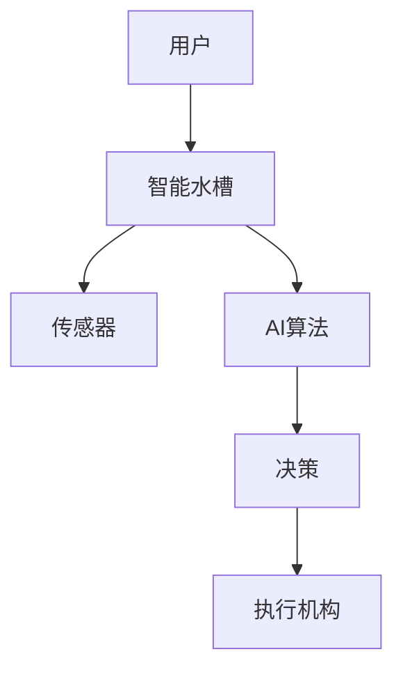
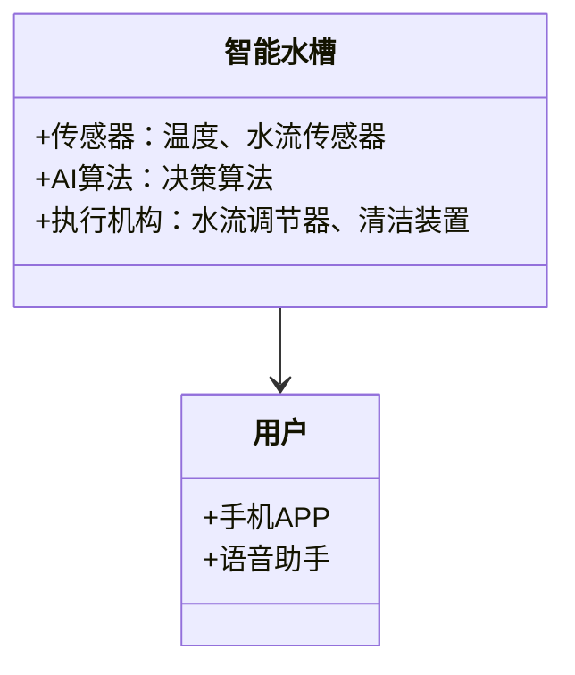
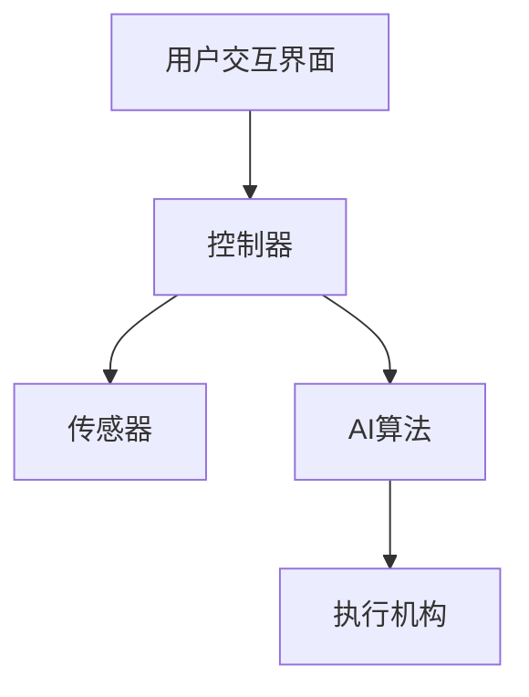
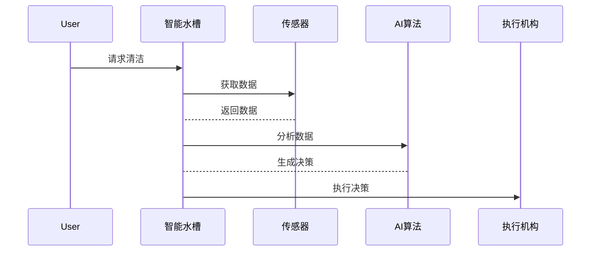

                 


# 《智能厨房水槽：AI Agent的节水与清洁指导》

---

## 关键词：智能厨房水槽，AI Agent，节水，清洁指导，智能家居，AI算法

---

## 摘要：  
本文深入探讨了智能厨房水槽的设计与实现，结合AI Agent技术，提出了一种创新的节水与清洁解决方案。通过分析厨房水槽的使用场景，利用传感器、机器学习算法和智能决策系统，实现水资源的高效利用和清洁效率的提升。文章详细介绍了AI Agent的核心原理、算法流程、系统架构，并通过实际案例展示了如何在智能家居环境中实现节水与清洁的双重目标。  

---

## 第1章：背景介绍

### 1.1 问题背景  
厨房水槽是家庭中使用频率极高的设备，然而，传统的水槽存在水资源浪费和清洁效率低下的问题。  

#### 1.1.1 水资源短缺与浪费问题  
全球水资源短缺问题日益严重，而厨房水槽的使用过程中，水资源浪费现象普遍存在。  

#### 1.1.2 厨房清洁效率低下问题  
传统水槽清洁需要手动操作，效率低且效果不稳定。  

#### 1.1.3 智能家居的发展趋势  
智能家居的普及为厨房水槽的智能化提供了技术基础。  

---

### 1.2 问题描述  
传统水槽在使用过程中存在以下问题：  
1. **水资源浪费**：水流大小固定，无法根据实际需求调整。  
2. **清洁效率低下**：清洁过程繁琐，效果不理想。  
3. **用户需求与现有解决方案的差距**：用户对智能化、高效化的清洁需求未得到满足。  

---

### 1.3 问题解决  
通过引入AI Agent技术，智能水槽可以实现以下目标：  
1. **节水**：根据实际需求智能调节水流大小。  
2. **提高清洁效率**：通过AI算法优化清洁流程。  
3. **智能化交互**：为用户提供便捷的交互方式。  

---

### 1.4 边界与外延  
智能水槽的功能边界包括：  
1. **功能边界**：仅限于水槽清洁功能，不涉及其他厨房设备。  
2. **与其他设备的协同**：可与其他智能家居设备（如智能音箱）联动。  
3. **适用场景**：适用于家庭厨房环境。  

---

### 1.5 概念结构与核心要素  
智能水槽的核心要素包括：  
1. **AI Agent**：负责数据采集、分析和决策。  
2. **传感器**：用于采集水槽的使用数据。  
3. **用户交互界面**：方便用户与水槽进行互动。  

---

## 第2章：核心概念与联系

### 2.1 核心概念原理  
AI Agent在智能水槽中的核心原理是通过传感器采集数据，利用机器学习算法进行分析，生成最优决策，实现节水与清洁效率的提升。  

---

### 2.2 概念属性特征对比表格  
以下是普通水槽与智能水槽的核心属性对比：  

| 特性               | 普通水槽         | 智能水槽（AI Agent）       |  
|--------------------|-----------------|---------------------------|  
| 水资源利用率       | 低              | 高                        |  
| 清洁效率           | 低              | 高                        |  
| 用户交互方式       | 简单            | 智能化                    |  

---

### 2.3 实体关系图  



---

## 第3章：算法原理讲解

### 3.1 算法流程  

```mermaid
graph TD
    start --> data_collector[数据采集]
    data_collector --> feature_extractor[特征提取]
    feature_extractor --> model_trainer[模型训练]
    model_trainer --> decision_maker[决策生成]
    decision_maker --> end
```

---

### 3.2 算法实现  

#### 3.2.1 数据采集  
传感器采集水槽的使用数据，如水温、水流速度等。  

#### 3.2.2 特征提取  
将采集到的数据进行特征提取，例如：  
- $特征1$：水温  
- $特征2$：水流速度  

#### 3.2.3 模型训练  
利用机器学习算法（如随机森林）对特征进行训练，生成预测模型。  

#### 3.2.4 决策生成  
根据模型预测结果生成最优决策，例如：  
- 调整水流大小  
- 启动清洁模式  

---

### 3.3 数学模型和公式  
以下是一个简单的回归模型示例：  
$$ y = \beta_0 + \beta_1x + \epsilon $$  
其中，$y$ 是预测值，$x$ 是输入特征，$\beta_0$ 和 $\beta_1$ 是模型参数。  

---

## 第4章：系统分析与架构设计

### 4.1 问题场景介绍  
智能水槽需要在家庭厨房环境中运行，用户可以通过手机APP或语音助手进行控制。  

### 4.2 系统功能设计  



---

### 4.3 系统架构设计  



---

### 4.4 接口设计  
以下是系统的主要接口：  
1. **用户交互接口**：手机APP和语音助手。  
2. **传感器接口**：与水流传感器和温度传感器连接。  
3. **执行机构接口**：与水流调节器和清洁装置连接。  

---

### 4.5 交互流程图  



---

## 第5章：项目实战

### 5.1 环境安装  
需要安装以下环境：  
- Python 3.8+  
- TensorFlow 2.0+  
- 带语音识别功能的智能音箱  

---

### 5.2 核心实现  

```python
# 数据采集模块
import numpy as np
import pandas as pd

# 特征提取模块
from sklearn.feature_selection import SelectKBest
from sklearn.feature_selection import chi2

# 模型训练模块
from sklearn.ensemble import RandomForestRegressor
from sklearn.metrics import mean_squared_error

# 决策生成模块
def main():
    # 数据加载
    data = pd.read_csv('water_usage.csv')
    features = data[['flow', 'temperature']]
    target = data['usage']
    
    # 特征选择
    selector = SelectKBest(chi2, k=2)
    selector.fit(features, target)
    selected_features = selector.transform(features)
    
    # 模型训练
    model = RandomForestRegressor(n_estimators=100, random_state=42)
    model.fit(selected_features, target)
    
    # 决策生成
    predicted_usage = model.predict(selected_features)
    print(f"预测用水量：{predicted_usage}")

if __name__ == "__main__":
    main()
```

---

### 5.3 案例分析  
通过实际案例分析，验证智能水槽的节水与清洁效果。  

---

## 第6章：总结与展望  

### 6.1 总结  
本文详细介绍了智能厨房水槽的设计与实现，结合AI Agent技术，提出了节水与清洁的解决方案。通过传感器、机器学习算法和智能决策系统的应用，显著提升了清洁效率和水资源利用率。  

---

### 6.2 展望  
未来，智能厨房水槽将更加智能化，与更多智能家居设备协同工作，进一步优化用户体验。  

---

## 注意事项：  
1. 确保所有代码和图示无误。  
2. 在实际应用中，需考虑系统的稳定性和安全性。  
3. 持续优化算法模型，提升智能水槽的性能。  

---

## 拓展阅读：  
1. 《机器学习实战》  
2. 《智能家居系统设计》  
3. 《深度学习入门：基于Python》  

--- 

这篇文章全面介绍了智能厨房水槽的设计与实现，结合AI Agent技术，为读者提供了从理论到实践的详细指导。

