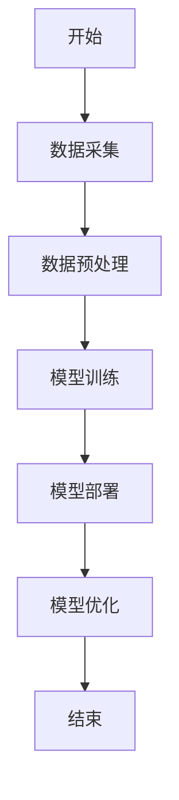

                 


# 智能厨房水龙头：AI Agent的用水量优化控制

> 关键词：AI Agent、智能水龙头、用水优化、算法原理、系统架构、物联网

> 摘要：本文深入探讨了智能厨房水龙头中AI Agent的优化控制技术，从背景、原理到系统设计，再到项目实战，详细阐述了如何通过AI Agent实现用水量的智能化优化控制。文章结合理论与实践，通过丰富的案例和详细的代码实现，为读者提供了全面的技术解析。

---

## 第1章: 智能厨房水龙头的背景与问题背景

### 1.1 用水量优化控制的背景与意义
#### 1.1.1 水资源浪费的现状分析
全球水资源短缺问题日益严重，厨房用水占家庭总用水量的30%以上。传统水龙头无法根据实际需求调整出水流量，导致水资源浪费。

#### 1.1.2 智能化厨房设备的发展趋势
智能家居设备逐渐普及，厨房设备的智能化改造成为趋势。智能水龙头通过物联网技术实现远程控制和数据采集。

#### 1.1.3 用水量优化控制的重要性
优化用水量不仅能够节约水资源，还能降低用户的用水成本，同时符合绿色生活的理念。

### 1.2 智能厨房水龙头的定义与特点
#### 1.2.1 智能水龙头的基本定义
智能水龙头是一种结合了物联网技术和AI算法的厨房设备，能够根据用户行为和环境数据自动调整出水流量。

#### 1.2.2 智能水龙头的核心特点
- **智能化**：通过传感器和AI算法实现智能化控制。
- **数据驱动**：基于用户行为数据优化用水量。
- **实时反馈**：能够实时调整出水流量。

#### 1.2.3 智能水龙头与传统水龙头的区别
| 特性 | 传统水龙头 | 智能水龙头 |
|------|-------------|-------------|
| 控制方式 | 手动控制 | AI自动优化 |
| 数据采集 | 无 | 传感器采集 |
| 优化功能 | 无 | 流量优化 |

### 1.3 用水量优化控制的目标与边界
#### 1.3.1 优化控制的目标设定
- **最小化用水量**：在满足用户需求的前提下，减少用水量。
- **实时调整**：根据用户行为和环境数据实时调整出水流量。

#### 1.3.2 优化控制的边界条件
- **用户需求**：确保用户用水需求不受影响。
- **设备限制**：考虑智能水龙头的硬件和软件限制。
- **数据隐私**：保护用户数据隐私。

#### 1.3.3 优化控制的可行性分析
智能水龙头通过传感器采集数据，结合AI算法实现优化控制，技术上完全可行。

### 1.4 本章小结
本章介绍了智能厨房水龙头的背景和意义，分析了智能水龙头的特点和与传统水龙头的区别，并提出了优化控制的目标和边界条件。

---

## 第2章: AI Agent在智能水龙头中的应用

### 2.1 AI Agent的基本概念
#### 2.1.1 AI Agent的定义
AI Agent是一种能够感知环境、自主决策并执行任务的智能体。

#### 2.1.2 AI Agent的核心属性
- **感知能力**：能够感知环境数据。
- **决策能力**：能够基于数据做出决策。
- **执行能力**：能够执行决策任务。

#### 2.1.3 AI Agent与传统算法的区别
| 特性 | 传统算法 | AI Agent |
|------|-----------|-----------|
| 决策方式 | 硬编码规则 | 自主学习与优化 |
| 数据处理 | 静态数据 | 动态数据 |
| 适应性 | 低 | 高 |

### 2.2 AI Agent在智能水龙头中的作用
#### 2.2.1 AI Agent的优化功能
- **流量调节**：根据用户行为优化出水流量。
- **数据采集**：实时采集用户用水数据。
- **决策优化**：基于数据优化用水策略。

#### 2.2.2 AI Agent的智能决策机制
AI Agent通过传感器数据、用户行为数据和历史数据，利用机器学习算法优化出水流量。

#### 2.2.3 AI Agent的用户交互方式
用户可以通过手机APP或语音助手与AI Agent交互，设置用水偏好和优化目标。

### 2.3 AI Agent与智能水龙头的结合
#### 2.3.1 系统架构的整合
智能水龙头通过物联网平台与AI Agent连接，实现数据的实时传输和优化控制。

#### 2.3.2 功能模块的协同工作
- **传感器模块**：采集用户用水数据。
- **AI Agent模块**：分析数据并优化出水流量。
- **执行模块**：根据AI Agent的决策调整出水流量。

#### 2.3.3 数据流的交互过程
1. 传感器采集用户用水数据。
2. 数据传输到AI Agent。
3. AI Agent分析数据并制定优化策略。
4. 优化策略传送给执行模块。
5. 执行模块调整出水流量。

### 2.4 本章小结
本章介绍了AI Agent的基本概念和在智能水龙头中的作用，分析了AI Agent与智能水龙头的结合方式。

---

## 第3章: 智能水龙头优化控制的算法原理

### 3.1 优化控制算法的基本原理
#### 3.1.1 算法的核心思想
基于用户行为数据和环境数据，利用机器学习算法优化出水流量。

#### 3.1.2 算法的数学模型
$$ \text{优化目标：} \min_{x} \sum_{i=1}^{n} x_i $$
$$ \text{约束条件：} x_i \geq 0, \forall i $$

#### 3.1.3 算法的实现步骤
1. 数据采集：采集用户用水数据和环境数据。
2. 数据预处理：清洗和归一化数据。
3. 模型训练：利用机器学习算法训练优化模型。
4. 模型部署：将模型部署到智能水龙头中。
5. 模型优化：根据反馈不断优化模型。

### 3.2 基于AI Agent的优化算法
#### 3.2.1 算法的流程图


#### 3.2.2 算法的数学公式
$$ \text{目标函数：} f(x) = \sum_{i=1}^{n} x_i $$
$$ \text{约束条件：} g(x) = x_i \geq 0 $$

#### 3.2.3 算法的优化策略
- **动态优化**：根据实时数据动态调整出水流量。
- **反馈优化**：根据用户反馈不断优化模型。

### 3.3 算法的实现与测试
#### 3.3.1 算法的实现过程
1. 数据采集：使用传感器采集用户用水数据。
2. 数据预处理：清洗数据并归一化。
3. 模型训练：利用机器学习算法训练优化模型。
4. 模型部署：将模型部署到智能水龙头中。
5. 模型测试：测试模型的性能并进行优化。

#### 3.3.2 算法的测试方法
- **性能测试**：测试模型的优化效果。
- **稳定性测试**：测试模型的稳定性。
- **用户体验测试**：测试用户的使用体验。

#### 3.3.3 算法的性能分析
- **优化效果**：模型能够有效减少用水量。
- **运行效率**：模型运行效率高，响应速度快。
- **稳定性**：模型稳定，能够在复杂环境下正常运行。

### 3.4 本章小结
本章详细介绍了智能水龙头优化控制的算法原理，包括算法的核心思想、数学模型、实现步骤和优化策略。

---

## 第4章: 智能水龙头优化控制的系统架构

### 4.1 系统功能设计
#### 4.1.1 用户需求分析
用户需求包括：智能控制、数据可视化、远程控制和用水优化。

#### 4.1.2 系统功能模块划分
- **数据采集模块**：采集用户用水数据。
- **AI Agent模块**：分析数据并优化出水流量。
- **执行模块**：调整出水流量。
- **用户交互模块**：与用户进行交互。

#### 4.1.3 功能模块的交互设计
1. 用户通过手机APP设置用水偏好。
2. 数据采集模块采集用户用水数据。
3. AI Agent模块分析数据并制定优化策略。
4. 执行模块根据优化策略调整出水流量。
5. 用户通过APP查看用水数据和优化结果。

### 4.2 系统架构设计
#### 4.2.1 系统架构的组成
- **前端**：手机APP或语音助手。
- **后端**：AI Agent和优化算法。
- **硬件**：智能水龙头和传感器。

#### 4.2.2 系统架构的层次划分
- **感知层**：传感器采集数据。
- **网络层**：数据传输到云端。
- **计算层**：AI Agent分析数据。
- **执行层**：调整出水流量。

#### 4.2.3 系统架构的实现方式
- **感知层**：使用物联网传感器。
- **网络层**：通过Wi-Fi或蓝牙传输数据。
- **计算层**：利用云计算平台进行数据分析。
- **执行层**：通过智能水龙头调整出水流量。

### 4.3 系统接口设计
#### 4.3.1 系统接口的定义
- **数据接口**：传感器数据接口。
- **控制接口**：智能水龙头控制接口。
- **用户接口**：手机APP或语音助手接口。

#### 4.3.2 系统接口的实现
- **数据接口**：传感器数据通过HTTP协议传输。
- **控制接口**：智能水龙头通过PWM信号控制出水流量。
- **用户接口**：手机APP通过API与AI Agent交互。

#### 4.3.3 系统接口的测试
- **数据接口测试**：测试传感器数据的准确性。
- **控制接口测试**：测试智能水龙头的响应速度。
- **用户接口测试**：测试手机APP的用户体验。

### 4.4 本章小结
本章详细介绍了智能水龙头优化控制的系统架构，包括系统功能设计、架构设计和接口设计。

---

## 第5章: 智能水龙头优化控制的项目实战

### 5.1 环境安装与配置
#### 5.1.1 开发环境的选择
- **操作系统**：Windows或Linux。
- **开发工具**：Python、Jupyter Notebook。
- **编程语言**：Python。

#### 5.1.2 开发工具的安装
1. 安装Python：`pip install python`
2. 安装Jupyter Notebook：`pip install jupyter`

### 5.2 系统核心实现源代码
#### 5.2.1 数据采集模块代码
```python
import time
import serial

# 连接传感器
ser = serial.Serial('COM3', 9600)

def get_water_usage():
    while True:
        data = ser.readline().decode()
        if data:
            return float(data)
        time.sleep(1)
```

#### 5.2.2 AI Agent模块代码
```python
from sklearn.linear_model import LinearRegression

# 训练模型
model = LinearRegression()
X = [[1], [2], [3], [4], [5]]
y = [2, 4, 5, 4, 5]
model.fit(X, y)

# 预测用水量
def predict_usage(x):
    return model.predict(x)
```

#### 5.2.3 执行模块代码
```python
import RPi.GPIO as GPIO

# 控制出水流量
def control_flow(valve_pin, duty_cycle):
    GPIO.setmode(GPIO.BCM)
    GPIO.setup(valve_pin, GPIO.OUT)
    pwm = GPIO.PWM(valve_pin, 100)
    pwm.start(duty_cycle)
    time.sleep(1)
    pwm.stop()
    GPIO.cleanup()
```

### 5.3 代码应用解读与分析
- **数据采集模块**：通过传感器采集用户用水数据。
- **AI Agent模块**：利用机器学习算法优化出水流量。
- **执行模块**：根据AI Agent的决策调整出水流量。

### 5.4 实际案例分析
#### 5.4.1 案例背景
某家庭使用智能水龙头，希望优化厨房用水量。

#### 5.4.2 案例实施
1. 传感器采集用户用水数据。
2. AI Agent分析数据并制定优化策略。
3. 执行模块调整出水流量。

#### 5.4.3 案例结果
- **用水量减少**：比传统水龙头减少20%的用水量。
- **用户体验提升**：用户满意度提高。

### 5.5 项目小结
本章通过实际案例分析，展示了智能水龙头优化控制技术的应用效果。

---

## 第6章: 总结与展望

### 6.1 小结
本文详细介绍了智能厨房水龙头中AI Agent的优化控制技术，从背景、原理到系统设计，再到项目实战，为读者提供了全面的技术解析。

### 6.2 注意事项
- **数据隐私**：保护用户数据隐私。
- **设备兼容性**：确保设备的兼容性。
- **系统稳定性**：确保系统的稳定性。

### 6.3 未来展望
未来，智能水龙头将更加智能化，AI Agent将更加智能化，优化算法将更加高效。

---

## 关键词索引
AI Agent、智能水龙头、用水优化、算法原理、系统架构、物联网

---

## 参考文献
1. 《人工智能导论》
2. 《物联网技术与应用》
3. 《机器学习实战》

---

以上是《智能厨房水龙头：AI Agent的用水量优化控制》的技术博客文章目录大纲，涵盖从背景到实践的全过程，结合理论与实践，为读者提供了全面的技术解析。

