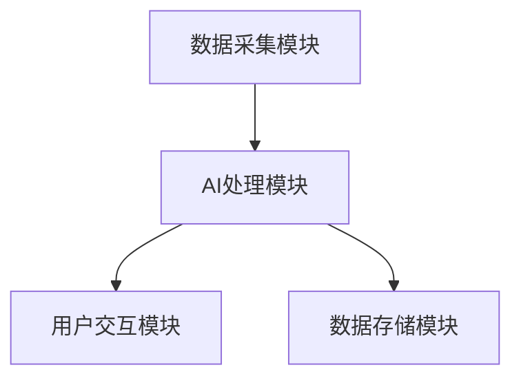
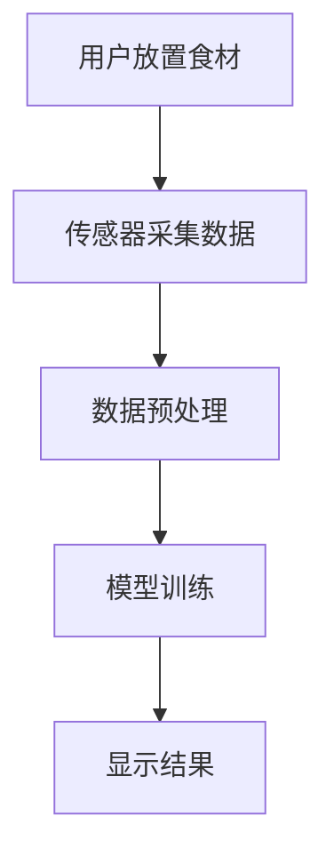
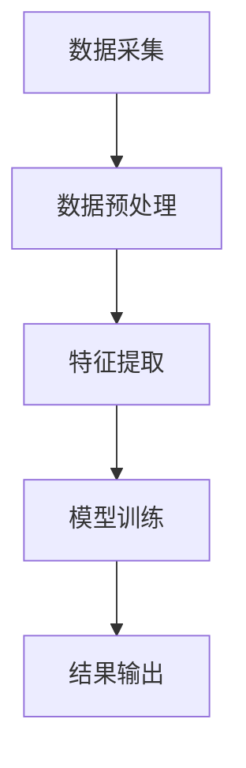
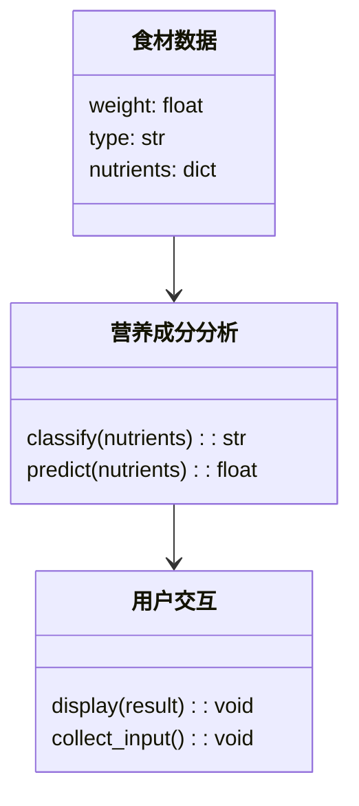
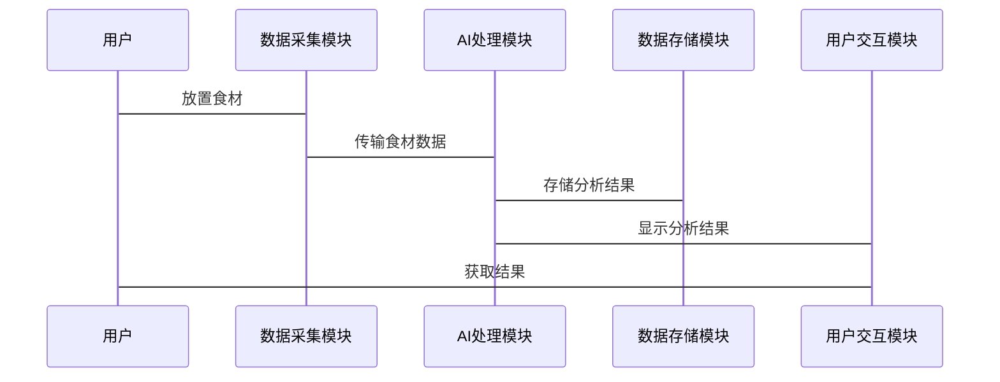
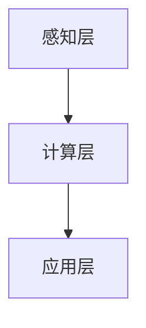
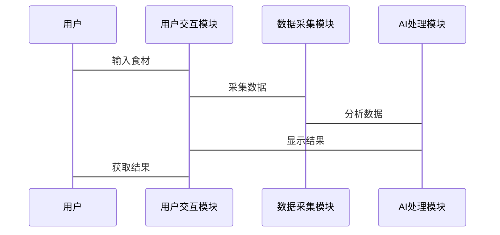

                 


# 智能厨房秤：AI Agent的营养成分分析

## 关键词：智能厨房秤, AI Agent, 营养成分分析, 机器学习, 数据处理, 系统架构

## 摘要：本文探讨了智能厨房秤在营养成分分析中的应用，结合AI Agent技术，分析了其工作原理、算法实现、系统架构及实际案例。通过详细的技术分析，展示了如何利用AI Agent提升食品营养分析的效率与准确性。

---

# 第1章: 问题背景与问题描述

## 1.1 智能厨房秤的背景介绍

### 1.1.1 智能厨房秤的发展历程
智能厨房秤是一种结合物联网和人工智能技术的智能设备，用于测量食材重量并提供营养成分分析。从早期的机械秤到现代的智能传感器，智能厨房秤经历了从单一测量功能到多功能营养分析的演变。

### 1.1.2 当前市场现状与用户需求
随着人们对健康饮食的关注度提高，智能厨房秤市场需求增长迅速。消费者希望通过智能厨房秤快速获取食材的营养信息，帮助他们制定合理的饮食计划。

### 1.1.3 智能厨房秤的核心价值
智能厨房秤的核心价值在于其能够实时测量食材重量，并通过AI技术提供精准的营养成分分析，帮助用户实现健康饮食。

## 1.2 营养成分分析的重要性

### 1.2.1 营养均衡与健康饮食
营养均衡是保持身体健康的关键，通过分析食材的营养成分，用户可以更好地控制饮食结构，预防慢性疾病。

### 1.2.2 消费者对食品营养的关注
现代消费者越来越关注食品的营养价值，希望通过智能设备获取准确的营养信息，满足个性化饮食需求。

### 1.2.3 智能厨房秤在营养分析中的作用
智能厨房秤通过AI技术，快速分析食材的热量、蛋白质、碳水化合物、脂肪、维生素等营养成分，为用户提供科学的饮食建议。

## 1.3 AI Agent在智能厨房秤中的应用

### 1.3.1 AI Agent的基本概念
AI Agent（智能代理）是指能够感知环境、自主决策并执行任务的智能实体。在智能厨房秤中，AI Agent用于处理食材数据、分析营养成分并提供反馈。

### 1.3.2 AI Agent在智能设备中的优势
AI Agent能够实时处理数据，具有自适应能力和学习能力，能够根据用户需求优化营养分析结果。

### 1.3.3 AI Agent与智能厨房秤的结合
通过AI Agent，智能厨房秤能够实现从数据采集到营养分析的全自动处理，为用户提供智能化的健康饮食解决方案。

## 1.4 问题解决与边界定义

### 1.4.1 智能厨房秤解决的核心问题
智能厨房秤解决的核心问题是快速、精准地分析食材的营养成分，帮助用户实现健康饮食。

### 1.4.2 问题解决的边界与限制
由于传感器精度和算法模型的限制，智能厨房秤的营养分析结果可能存在一定的误差，需要结合实际使用场景进行优化。

### 1.4.3 相关概念的外延与扩展
智能厨房秤的应用场景不仅限于家庭使用，还可以扩展到餐饮行业、健康监测等领域。

## 1.5 核心概念与系统组成

### 1.5.1 智能厨房秤的核心组成
智能厨房秤主要由传感器、数据处理模块、AI算法模块和用户交互界面组成。

### 1.5.2 AI Agent的功能模块
AI Agent包括数据采集、特征提取、模型训练、决策推理和结果反馈等功能模块。

### 1.5.3 营养成分分析的实现方式
营养成分分析通过传感器数据采集、特征提取、模型训练和结果输出等步骤，实现对食材营养成分的精准分析。

---

# 第2章: 核心概念与系统架构

## 2.1 AI Agent的核心原理

### 2.1.1 AI Agent的基本原理
AI Agent通过感知环境数据，利用算法进行分析和决策，并通过执行器完成任务。在智能厨房秤中，AI Agent负责处理食材数据并提供营养分析结果。

### 2.1.2 AI Agent的感知与决策机制
AI Agent通过传感器感知食材重量和种类，利用机器学习算法进行决策，并通过用户界面反馈结果。

### 2.1.3 AI Agent的自适应能力
AI Agent能够根据用户反馈和使用数据不断优化模型，提高营养分析的准确性。

## 2.2 营养成分分析的数学模型

### 2.2.1 数据采集与特征提取
传感器采集食材的重量和种类信息，通过特征提取算法提取食材的营养特征。

### 2.2.2 数据预处理与特征工程
对原始数据进行归一化、标准化等预处理，提取有用的特征用于模型训练。

### 2.2.3 营养成分分析的数学公式
$$\text{营养成分} = f(\text{食材重量}, \text{食材种类})$$
其中，$f$ 是AI Agent训练得到的营养成分分析模型。

## 2.3 系统架构设计

### 2.3.1 系统功能模块划分
智能厨房秤系统主要包含数据采集模块、AI处理模块、用户交互模块和数据存储模块。

### 2.3.2 系统架构的层次结构
系统架构分为感知层、计算层和应用层，分别负责数据采集、模型训练和结果展示。

### 2.3.3 系统组件之间的关系
使用Mermaid图展示系统组件之间的关系：



## 2.4 数据流与实体关系

### 2.4.1 数据流的流程图
使用Mermaid图展示数据流的流程：



### 2.4.2 实体关系的ER图
使用Mermaid图展示实体关系：

```mermaid
erDiagram
    actor 用户
    actor 系统
    database 数据库
    object 食材
    object 营养成分
    用户 --> 食材
    系统 --> 食材
    系统 --> 营养成分
    营养成分 --> 数据库
```

### 2.4.3 数据模型的详细描述
智能厨房秤的数据模型包括食材表、营养成分表和用户表，通过关联关系存储食材的营养信息和用户使用记录。

---

# 第3章: 算法原理与数学模型

## 3.1 AI Agent的算法实现

### 3.1.1 算法选择与优化
选择适合营养成分分析的机器学习算法，如支持向量机（SVM）或随机森林（Random Forest），并进行模型优化。

### 3.1.2 算法实现的步骤
1. 数据采集与预处理
2. 特征提取与工程
3. 模型训练与优化
4. 模型验证与部署

### 3.1.3 算法的性能评估
通过准确率、召回率和F1分数等指标评估模型的性能，并进行A/B测试优化。

## 3.2 营养成分分析的数学模型

### 3.2.1 数据预处理与特征提取
对传感器数据进行归一化处理，提取食材的重量、种类和营养成分特征。

### 3.2.2 模型的建立与训练
使用机器学习算法训练营养成分分析模型，通过交叉验证优化模型参数。

### 3.2.3 模型的验证与优化
通过测试数据验证模型的准确性，并进行超参数优化和特征选择。

## 3.3 算法的数学公式与实现

### 3.3.1 数据处理的数学公式
$$\text{归一化} = \frac{x - \text{min}(x)}{\text{max}(x) - \text{min}(x)}$$

### 3.3.2 模型训练的数学公式
$$\text{损失函数} = \sum_{i=1}^{n} (y_i - \hat{y}_i)^2$$
其中，$y_i$ 是真实值，$\hat{y}_i$ 是预测值。

### 3.3.3 算法实现的Python代码
```python
import numpy as np
from sklearn.model import Random ForestClassifier

# 数据预处理
X = np.array([...])  # 特征数据
y = np.array([...])  # 标签数据

# 模型训练
model = Random ForestClassifier()
model.fit(X, y)

# 模型预测
predictions = model.predict(X_test)
```

## 3.4 算法的流程图与实现

### 3.4.1 算法流程图的Mermaid图
使用Mermaid图展示算法流程：



### 3.4.2 算法实现的代码示例
详细代码实现如下：

```python
import pandas as pd
import numpy as np
from sklearn.model import Random ForestClassifier
from sklearn.metrics import accuracy_score

# 数据加载
data = pd.read_csv('食材数据.csv')

# 特征与标签分离
X = data.drop('营养成分', axis=1)
y = data['营养成分']

# 数据划分
from sklearn.model_selection import train_test_split
X_train, X_test, y_train, y_test = train_test_split(X, y, test_size=0.2)

# 模型训练
model = Random ForestClassifier()
model.fit(X_train, y_train)

# 模型预测
y_pred = model.predict(X_test)

# 模型评估
print("准确率:", accuracy_score(y_test, y_pred))
```

### 3.4.3 算法实现的详细步骤
1. 数据预处理：清洗数据，处理缺失值和异常值。
2. 特征提取：提取食材的重量、种类和营养成分特征。
3. 模型训练：选择合适的算法，训练营养成分分析模型。
4. 模型优化：通过调整超参数和特征选择提高模型性能。

---

# 第4章: 系统分析与架构设计

## 4.1 系统功能设计

### 4.1.1 系统功能模块划分
智能厨房秤系统功能模块包括：
- 数据采集模块：负责食材的重量和种类测量。
- AI处理模块：负责营养成分分析和结果反馈。
- 用户交互模块：负责用户输入和结果展示。
- 数据存储模块：负责存储食材数据和分析结果。

### 4.1.2 系统功能的领域模型
使用Mermaid类图展示系统功能的领域模型：



### 4.1.3 系统功能的交互流程
使用Mermaid序列图展示系统功能的交互流程：



## 4.2 系统架构设计

### 4.2.1 系统架构的层次结构
系统架构分为感知层、计算层和应用层：
- 感知层：负责数据采集和传感器通信。
- 计算层：负责数据处理和AI分析。
- 应用层：负责用户交互和结果展示。

### 4.2.2 系统架构的Mermaid图
使用Mermaid图展示系统架构：



### 4.2.3 系统架构的详细描述
感知层通过传感器采集食材数据，计算层利用AI算法进行分析，应用层通过用户界面展示结果。

## 4.3 系统接口设计

### 4.3.1 系统接口的定义
智能厨房秤系统主要接口包括：
- 数据采集接口：用于传感器数据的采集和传输。
- AI处理接口：用于营养成分分析和结果反馈。
- 用户交互接口：用于用户输入和结果展示。

### 4.3.2 接口的设计与实现
使用RESTful API设计系统接口，例如：
- POST /api/measure 接收食材数据。
- GET /api/nutrition 获取营养成分分析结果。

## 4.4 系统交互设计

### 4.4.1 系统交互的流程
用户通过触摸屏或手机App输入食材信息，系统通过传感器采集数据，AI处理模块进行分析，并通过显示屏或App反馈结果。

### 4.4.2 系统交互的Mermaid图
使用Mermaid图展示系统交互流程：



### 4.4.3 系统交互的详细步骤
1. 用户输入食材信息。
2. 系统采集食材数据。
3. AI模块分析数据并生成结果。
4. 用户获取分析结果并进行操作。

---

# 第5章: 项目实战与应用案例

## 5.1 项目环境安装

### 5.1.1 开发环境的安装与配置
安装Python、TensorFlow、Scikit-learn等开发工具和库，配置开发环境。

### 5.1.2 数据集的获取与预处理
获取食材数据集，进行数据清洗和特征工程。

## 5.2 系统核心实现

### 5.2.1 核心功能的代码实现
实现食材数据采集、营养成分分析和结果展示的核心功能。

### 5.2.2 系统功能的详细实现
详细代码实现如下：

```python
import numpy as np
from sklearn.model import Random ForestClassifier

# 数据预处理
data = np.array([...])  # 食材数据
labels = np.array([...])  # 营养成分标签

# 数据划分
X_train, X_test, y_train, y_test = train_test_split(data, labels, test_size=0.2)

# 模型训练
model = Random ForestClassifier()
model.fit(X_train, y_train)

# 模型预测
y_pred = model.predict(X_test)

# 模型评估
print("准确率:", accuracy_score(y_test, y_pred))
```

## 5.3 代码应用解读与分析

### 5.3.1 代码的功能模块划分
代码分为数据加载、数据预处理、模型训练和结果展示四个模块。

### 5.3.2 代码的关键实现部分
详细解读代码的关键部分，如数据预处理、模型训练和结果输出。

## 5.4 实际案例分析

### 5.4.1 案例背景与数据准备
选择一个实际案例，准备食材数据和营养成分标签。

### 5.4.2 案例分析与结果展示
通过代码分析食材的营养成分，展示结果并进行解读。

### 5.4.3 案例总结与经验分享
总结案例分析的经验，提出改进建议和优化方向。

## 5.5 项目小结

### 5.5.1 项目实现的关键点
总结项目实现的关键点，如数据预处理、模型选择和优化。

### 5.5.2 项目的优缺点分析
分析项目的优缺点，提出改进建议和未来发展方向。

---

# 第6章: 最佳实践与总结

## 6.1 最佳实践

### 6.1.1 开发与部署注意事项
在开发和部署过程中，需要注意传感器精度、模型优化和用户体验等问题。

### 6.1.2 系统维护与优化
定期更新模型和优化系统性能，确保系统的稳定性和准确性。

## 6.2 项目总结

### 6.2.1 项目的核心收获
通过项目实现，掌握了AI Agent在智能厨房秤中的应用，提高了营养成分分析的效率和准确性。

### 6.2.2 项目的关键挑战与解决方案
项目中遇到的主要挑战是数据精度和模型优化，通过数据清洗和算法调优解决了这些问题。

## 6.3 未来展望

### 6.3.1 技术发展趋势
未来，智能厨房秤将更加智能化和个性化，AI Agent将更加精准和高效。

### 6.3.2 拓展应用与研究方向
拓展智能厨房秤的应用场景，研究更先进的AI算法和传感器技术，提升用户体验和系统性能。

---

# 结语

智能厨房秤结合AI Agent技术，为营养成分分析提供了高效、精准的解决方案。通过本文的详细分析，读者可以深入了解智能厨房秤的工作原理、算法实现和系统架构。未来，随着技术的不断发展，智能厨房秤将在健康饮食领域发挥更大的作用。

---

# 附录

## 附录A: 相关代码与数据集

### 附录A.1 数据集描述
食材数据集包含食材的重量、种类和营养成分信息，用于训练和测试模型。

### 附录A.2 代码实现细节
详细代码实现，包括数据预处理、模型训练和结果展示的代码。

## 附录B: 工具与资源

### 附录B.1 开发工具
推荐使用的开发工具和库，如Python、TensorFlow、Scikit-learn等。

### 附录B.2 学习资源
推荐的学习资源和参考资料，帮助读者深入学习相关技术。

---

以上是《智能厨房秤：AI Agent的营养成分分析》的技术博客文章大纲，涵盖了从背景介绍到项目实战的完整内容。

