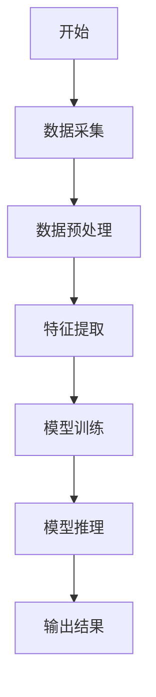
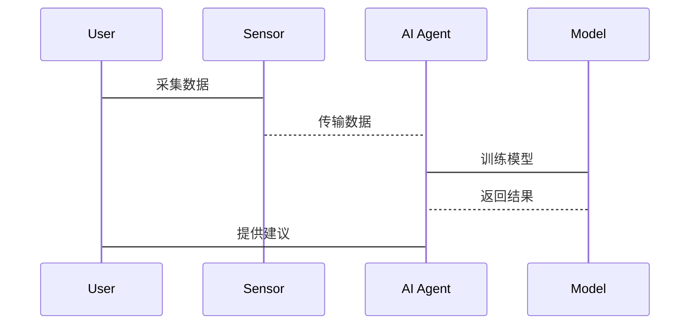

                 


# 智能厨房秤：AI Agent的营养成分分析

---

## 关键词：智能厨房秤、AI Agent、营养成分分析、传感器数据、机器学习模型、用户交互、系统架构

---

## 摘要

智能厨房秤结合AI Agent技术，通过传感器数据采集和机器学习模型分析，实现对食材营养成分的精准识别与评估。本文从背景、原理到系统架构，详细分析了智能厨房秤的工作机制，并通过实战案例展示了AI Agent的实际应用。文章最后总结了技术优势，并展望了未来的发展方向。

---

# 第一部分: 背景与概念

## 第1章: 智能厨房秤的发展与应用

### 1.1 智能厨房秤的定义与功能

#### 1.1.1 智能厨房秤的基本定义

智能厨房秤是一种结合物联网和人工智能技术的智能设备，用于测量食材重量并分析其营养成分。它通常配备多种传感器，能够采集重量、湿度、温度等数据，并通过AI算法提供健康建议。

#### 1.1.2 智能厨房秤的核心功能

- **重量测量**：精准测量食材的重量。
- **营养成分分析**：通过传感器数据和AI算法，分析食材的热量、蛋白质、脂肪、碳水化合物等营养成分。
- **健康建议**：根据分析结果，提供饮食建议或食谱推荐。

#### 1.1.3 智能厨房秤的市场现状

随着健康饮食意识的提升，智能厨房秤在家庭、餐厅和食品加工行业中的应用越来越广泛。市场上的产品逐渐从单一的重量测量向多功能、智能化方向发展。

### 1.2 AI Agent的基本概念

#### 1.2.1 AI Agent的定义

AI Agent（人工智能代理）是指能够感知环境、自主决策并执行任务的智能实体。它能够通过传感器获取数据，利用算法处理信息，并通过执行器与环境互动。

#### 1.2.2 AI Agent的核心特点

- **自主性**：能够自主决策，无需人工干预。
- **反应性**：能够实时感知环境变化并做出反应。
- **学习能力**：通过数据学习和优化算法，提升性能。

#### 1.2.3 AI Agent与传统软件的区别

AI Agent能够通过数据学习和自适应调整，而传统软件依赖固定的程序逻辑。AI Agent具备更强的适应性和问题解决能力。

### 1.3 智能厨房秤与AI Agent的结合

#### 1.3.1 智能厨房秤与AI Agent的结合背景

随着人工智能技术的成熟，智能厨房秤通过集成AI Agent，能够实现更复杂的营养成分分析和健康建议。

#### 1.3.2 AI Agent在智能厨房秤中的作用

- **数据处理**：AI Agent负责处理传感器采集的数据，进行特征提取和模型训练。
- **营养分析**：AI Agent通过机器学习模型分析食材的营养成分。
- **用户交互**：AI Agent通过自然语言处理与用户互动，提供个性化建议。

#### 1.3.3 智能厨房秤与AI Agent的未来发展

随着AI技术的进步，智能厨房秤将更加智能化，能够提供更精准的营养分析和个性化的健康建议。

### 1.4 本章小结

本章介绍了智能厨房秤的发展和AI Agent的基本概念，并探讨了两者结合的应用前景。智能厨房秤通过AI Agent技术，能够实现更精准的营养成分分析和用户交互，为用户带来更好的使用体验。

---

## 第2章: 智能厨房秤的营养成分分析功能

### 2.1 营养成分分析的基本原理

#### 2.1.1 营养成分分析的定义

营养成分分析是通过化学或物理方法测定食材中的营养成分含量，包括蛋白质、脂肪、碳水化合物、维生素等。

#### 2.1.2 营养成分分析的核心步骤

1. **数据采集**：通过传感器获取食材的重量、湿度、温度等数据。
2. **数据预处理**：对采集的数据进行清洗和标准化处理。
3. **特征提取**：提取与营养成分相关的特征，如重量、颜色等。
4. **模型训练**：利用机器学习算法训练营养成分分析模型。
5. **模型推理**：将新数据输入模型，预测营养成分含量。

#### 2.1.3 营养成分分析的数学模型

常用的机器学习模型包括线性回归、支持向量机（SVM）和随机森林等。以下是一个简单的线性回归模型：

$$ y = \beta_0 + \beta_1 x + \epsilon $$

其中，$y$ 是目标变量（营养成分含量），$x$ 是自变量（传感器数据），$\beta_0$ 是截距，$\beta_1$ 是回归系数，$\epsilon$ 是误差项。

---

### 2.2 智能厨房秤的传感器数据采集

#### 2.2.1 传感器类型与功能

智能厨房秤通常配备以下传感器：

1. **称重传感器**：用于测量食材的重量。
2. **湿度传感器**：用于测量食材的湿度。
3. **温度传感器**：用于测量食材的温度。

#### 2.2.2 数据采集的流程

1. **传感器初始化**：启动传感器并校准。
2. **数据采集**：采集食材的重量、湿度和温度等数据。
3. **数据传输**：将数据传输到AI Agent进行处理。

#### 2.2.3 数据预处理方法

- **数据清洗**：去除异常值和噪声数据。
- **数据标准化**：将数据归一化，使其具有相同的量纲。

---

### 2.3 AI Agent的营养成分分析算法

#### 2.3.1 数据特征提取

通过传感器数据提取食材的重量、颜色、形状等特征，并利用这些特征训练营养成分分析模型。

#### 2.3.2 算法原理

使用随机森林算法进行营养成分分析。随机森林是一种基于决策树的集成学习算法，能够处理高维数据。

#### 2.3.3 算法流程图



---

### 2.4 营养成分分析的实现

#### 2.4.1 数据预处理代码

```python
import pandas as pd
from sklearn.preprocessing import StandardScaler

# 读取数据
data = pd.read_csv('nutrition_data.csv')

# 删除缺失值
data = data.dropna()

# 标准化处理
scaler = StandardScaler()
data_scaled = scaler.fit_transform(data)
```

#### 2.4.2 模型训练代码

```python
from sklearn.ensemble import RandomForestRegressor
from sklearn.metrics import mean_squared_error

# 初始化模型
model = RandomForestRegressor(n_estimators=100, random_state=42)

# 训练模型
model.fit(data_scaled, target)
```

---

## 第3章: AI Agent的系统架构与设计

### 3.1 系统架构设计

#### 3.1.1 系统架构图


#### 3.1.2 系统功能模块

1. **传感器模块**：负责数据采集。
2. **AI Agent模块**：负责数据处理和模型推理。
3. **用户界面模块**：负责与用户交互。

---

### 3.2 系统交互流程

#### 3.2.1 交互流程图



---

## 第4章: 项目实战与案例分析

### 4.1 项目实战

#### 4.1.1 环境安装

- 安装Python和相关库：
  ```bash
  pip install numpy pandas scikit-learn
  ```

#### 4.1.2 核心代码实现

```python
import numpy as np
import pandas as pd
from sklearn.ensemble import RandomForestRegressor
from sklearn.metrics import mean_squared_error

# 读取数据
data = pd.read_csv('nutrition_data.csv')

# 删除缺失值
data = data.dropna()

# 标准化处理
scaler = StandardScaler()
data_scaled = scaler.fit_transform(data)

# 初始化模型
model = RandomForestRegressor(n_estimators=100, random_state=42)

# 训练模型
model.fit(data_scaled, target)

# 预测结果
predictions = model.predict(data_scaled)

# 计算均方误差
mse = mean_squared_error(target, predictions)
print(f'Mean Squared Error: {mse}')
```

---

### 4.2 案例分析

#### 4.2.1 案例背景

假设我们有一个食材数据库，包含多种食材的营养成分数据。通过智能厨房秤和AI Agent，我们可以快速分析食材的营养成分。

#### 4.2.2 实际操作步骤

1. **称量食材**：将食材放在秤上，获取重量数据。
2. **传感器数据采集**：采集食材的重量、湿度和温度。
3. **数据预处理**：清洗和标准化数据。
4. **模型推理**：通过训练好的模型预测营养成分。
5. **提供建议**：根据分析结果，提供健康建议。

---

## 第5章: 总结与展望

### 5.1 本章总结

本文详细介绍了智能厨房秤与AI Agent的结合，从背景、原理到系统架构，再到项目实战，全面分析了智能厨房秤的营养成分分析功能。通过AI Agent技术，智能厨房秤能够实现更精准的营养分析和用户交互。

### 5.2 未来展望

随着人工智能技术的不断进步，智能厨房秤将变得更加智能化和个性化。未来，AI Agent可以通过深度学习模型进一步提升营养成分分析的准确性，并与更多智能设备集成，为用户提供更全面的健康解决方案。

---

### 最佳实践 Tips

1. **数据准确性**：确保传感器数据的准确性，定期校准设备。
2. **模型优化**：根据实际需求，不断优化机器学习模型，提升预测精度。
3. **用户隐私**：保护用户的健康数据，确保数据安全。

---

通过本文的分析，读者可以深入了解智能厨房秤与AI Agent的结合，掌握营养成分分析的核心原理和实现方法，并能够通过实际案例分析，提升自己的技术能力。未来，随着AI技术的发展，智能厨房秤将在健康饮食领域发挥更大的作用。

