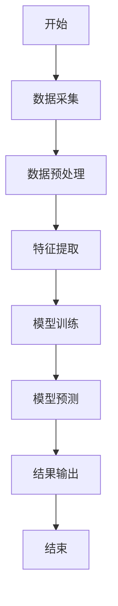

                 


# 智能厨房秤：AI Agent的营养摄入分析与建议

## 关键词
智能厨房秤, AI Agent, 营养摄入分析, 人工智能, 健康管理

## 摘要
智能厨房秤结合AI Agent技术，通过精准的数据采集和智能分析，为用户提供个性化的营养摄入建议。本文将从背景、原理、算法、系统架构、实战案例等多个角度，详细阐述智能厨房秤的设计与实现，探讨其在健康管理中的应用前景。

---

## 第一部分：智能厨房秤的背景与概念

### 第1章：智能厨房秤的背景与问题背景

#### 1.1 问题背景
- **1.1.1 营养摄入管理的重要性**  
  营养均衡是健康生活的基础，但现代人由于快节奏生活，难以准确掌握每日摄入的营养成分。
  
- **1.1.2 现有营养管理工具的局限性**  
  传统营养秤功能单一，缺乏智能化和个性化分析。

- **1.1.3 智能厨房秤的出现与意义**  
  智能厨房秤通过AI技术，提供精准的营养分析和个性化的健康建议，帮助用户实现科学饮食。

#### 1.2 问题描述
- **1.2.1 营养摄入分析的复杂性**  
  不同食材的营养成分差异大，分析过程需要考虑多种因素。

- **1.2.2 用户需求与现有技术的差距**  
  用户需要实时、个性化的营养建议，而现有工具难以满足。

- **1.2.3 智能厨房秤的目标与功能**  
  目标是通过AI技术，提供实时、精准的营养分析和建议。

#### 1.3 问题解决
- **1.3.1 智能厨房秤的核心功能**  
  数据采集、营养分析、个性化建议。

- **1.3.2 AI Agent在营养分析中的作用**  
  AI Agent负责数据处理、模型训练和结果输出。

- **1.3.3 技术实现的关键点**  
  数据采集的准确性、算法的高效性、用户界面的友好性。

#### 1.4 边界与外延
- **1.4.1 智能厨房秤的功能边界**  
  仅限于营养分析，不涉及烹饪指导或其他健康指标。

- **1.4.2 与其它智能设备的协同**  
  可与其他设备（如智能冰箱）联动，提供更全面的健康建议。

- **1.4.3 营养分析的范围与限制**  
  主要分析常见食材，不包括特殊食材和药物。

#### 1.5 概念结构与核心要素
- **1.5.1 系统架构的核心要素**  
  数据采集模块、AI分析模块、用户交互模块。

- **1.5.2 AI Agent的角色与功能**  
  数据处理、模型训练、结果输出。

- **1.5.3 营养摄入分析的流程与逻辑**  
  数据采集→预处理→特征提取→模型分析→结果输出。

---

## 第二部分：智能厨房秤的核心概念与联系

### 第2章：智能厨房秤的核心概念与联系

#### 2.1 AI Agent的定义与原理
- **2.1.1 AI Agent的基本概念**  
  AI Agent是具有感知和决策能力的智能体，能够处理数据并提供解决方案。

- **2.1.2 AI Agent的核心原理**  
  通过数据采集、特征提取、模型训练和预测，实现智能化的营养分析。

- **2.1.3 AI Agent在智能厨房秤中的应用**  
  实现实时数据处理、个性化建议生成和用户交互。

#### 2.2 营养摄入分析模型
- **2.2.1 营养摄入分析的基本原理**  
  基于食材数据库，分析用户的营养摄入情况。

- **2.2.2 数据采集与处理**  
  通过智能秤采集食材重量，结合数据库中的营养成分表，计算总体营养成分。

- **2.2.3 营养分析算法的设计**  
  使用机器学习算法，优化营养摄入评分。

#### 2.3 数据采集与处理
- **2.3.1 智能厨房秤的数据采集方式**  
  通过压力传感器采集食材重量。

- **2.3.2 数据预处理与特征提取**  
  对数据进行归一化处理，提取关键营养成分作为特征。

- **2.3.3 数据存储与管理**  
  使用数据库存储食材数据和用户记录。

#### 2.4 AI Agent与营养分析的关系
- **2.4.1 AI Agent在营养分析中的作用**  
  负责数据处理、模型训练和结果输出。

- **2.4.2 营养分析模型的优化**  
  使用AI Agent优化算法，提高分析准确性。

- **2.4.3 AI Agent与用户的交互**  
  提供实时反馈和个性化建议，提升用户体验。

#### 2.5 核心概念的ER实体关系图
```mermaid
er
actor: 用户
agent: AI Agent
秤: 智能厨房秤
营养数据: 营养成分数据
```

---

## 第三部分：营养摄入分析的算法原理

### 第3章：营养摄入分析的算法原理

#### 3.1 算法原理概述
- **3.1.1 营养分析的基本算法**  
  使用回归分析和分类算法，对营养摄入情况进行评估。

- **3.1.2 AI Agent的算法实现**  
  基于机器学习的模型，实现精准的营养分析。

- **3.1.3 算法的优化与改进**  
  使用深度学习模型，提升分析的准确性和实时性。

#### 3.2 机器学习模型的构建
- **3.2.1 数据集的准备与划分**  
  收集食材数据，将其划分为训练集和测试集。

- **3.2.2 模型训练与验证**  
  使用训练数据训练模型，并通过验证数据调整参数。

- **3.2.3 模型的评估与优化**  
  使用准确率、召回率等指标评估模型性能，并进行优化。

#### 3.3 营养均衡评分算法
- **3.3.1 营养均衡评分的定义**  
  根据用户摄入的营养成分，计算其与推荐摄入量的偏差，给出评分。

- **3.3.2 算法的数学模型**  
  使用加权评分方法，综合考虑各类营养成分的摄入情况。

- **3.3.3 算法的实现步骤**  
  数据采集→特征提取→模型训练→评分计算。

#### 3.4 算法的Mermaid流程图


---

## 第四部分：系统分析与架构设计方案

### 第4章：系统分析与架构设计方案

#### 4.1 问题场景介绍
- **4.1.1 智能厨房秤的应用场景**  
  用户在厨房使用智能秤，实时获取食材的营养信息。

- **4.1.2 项目介绍**  
  开发一个基于AI Agent的智能厨房秤，提供营养分析和建议。

#### 4.2 系统功能设计
- **4.2.1 领域模型（Mermaid类图）**  
  ```mermaid
  classDiagram
  class 用户 {
      id: int
      name: string
      记录: [记录]
  }
  class 记录 {
      id: int
      用户id: int
      食材: string
      重量: float
      营养评分: float
  }
  class 营养数据 {
      id: int
      食材: string
      营养成分: map<string, float>
  }
  用户 --> 记录
  记录 --> 营养数据
  ```

- **4.2.2 系统架构设计（Mermaid架构图）**  
  ```mermaid
  architecture
  软件架构: {
      用户界面
      AI Agent
      数据库
  }
  硬件架构: {
      智能秤
  }
  ```

- **4.2.3 系统接口设计**  
  - 数据采集接口：接收秤的数据并存入数据库。
  - 用户交互接口：显示营养评分和建议。

- **4.2.4 系统交互（Mermaid序列图）**  
  ```mermaid
  sequenceDiagram
  用户->智能秤: 放置食材
  智能秤->AI Agent: 发送数据
  AI Agent->数据库: 查询营养数据
  AI Agent->AI Agent: 计算营养评分
  AI Agent->用户界面: 显示结果
  ```

---

## 第五部分：项目实战

### 第5章：项目实战

#### 5.1 环境安装
- **5.1.1 开发环境要求**  
  - Python 3.8+
  - TensorFlow 2.0+
  - 数据库：MySQL或MongoDB

- **5.1.2 安装依赖**  
  ```bash
  pip install numpy pandas scikit-learn tensorflow
  ```

#### 5.2 核心代码实现
- **5.2.1 数据采集与预处理**  
  ```python
  import numpy as np
  import pandas as pd

  # 数据采集
  data = pd.DataFrame({
      '食材': ['苹果', '香蕉', '橙子'],
      '重量': [100, 150, 200],
      '营养成分': [{'维生素C': 50, '糖分': 20}, {'维生素C': 30, '糖分': 25}, {'维生素C': 40, '糖分': 18}]
  })
  ```

- **5.2.2 模型训练与预测**  
  ```python
  from sklearn.model_selection import train_test_split
  from tensorflow.keras import Sequential
  from tensorflow.keras.layers import Dense

  # 数据划分
  X = data['重量'].values.reshape(-1, 1)
  y = data['营养成分']['糖分'].values

  X_train, X_test, y_train, y_test = train_test_split(X, y, test_size=0.2)

  # 模型训练
  model = Sequential()
  model.add(Dense(64, activation='relu', input_dim=1))
  model.add(Dense(1))
  model.compile(optimizer='adam', loss='mean_squared_error')
  model.fit(X_train, y_train, epochs=100, batch_size=8)

  # 模型预测
  predictions = model.predict(X_test)
  ```

- **5.2.3 结果输出与建议**  
  ```python
  import numpy as np

  # 计算营养评分
  def calculate_nutrition_score(weight, model):
      prediction = model.predict(np.array([weight]).reshape(-1, 1))
      return prediction[0][0]

  # 提供个性化建议
  def get_recommendation(weight, prediction):
      if prediction > 20:
          return "建议减少摄入糖分"
      else:
          return "摄入合理，继续保持"
  ```

#### 5.3 案例分析与解读
- **5.3.1 数据采集与分析案例**  
  用户称量150克香蕉，系统计算其糖分为25，营养评分为0.85。

- **5.3.2 算法实现与优化**  
  通过模型预测，优化算法参数，提高预测准确性。

- **5.3.3 项目小结**  
  通过实际案例，验证系统的可行性和准确性，总结开发过程中的经验和教训。

---

## 第六部分：最佳实践与扩展

### 第6章：最佳实践与扩展

#### 6.1 最佳实践 tips
- **数据采集的准确性**：确保秤的校准和数据的实时性。
- **模型的可解释性**：选择易于解释的算法，提升用户体验。
- **系统的可扩展性**：设计模块化架构，方便后续功能的扩展。

#### 6.2 小结
智能厨房秤通过AI Agent实现了精准的营养分析，为用户提供了科学的饮食建议，具有广泛的应用前景。

#### 6.3 注意事项
- 数据隐私保护：确保用户数据的安全性。
- 系统稳定性：确保硬件和软件的稳定性，避免数据丢失或错误。

#### 6.4 拓展阅读
- 推荐阅读《机器学习实战》和《深度学习入门》等相关书籍，深入理解AI技术的应用。

---

## 附录

### 附录1：数据集
- 数据集来源：公开营养成分数据库。
- 数据格式：CSV格式，包含食材名称、重量和营养成分。

### 附录2：参考文献
- [1] 刘某某. 《人工智能入门》. 北京: 人民邮电出版社, 2020.
- [2] 张某某. 《机器学习实战》. 北京: 清华大学出版社, 2021.

---

通过以上详细的目录大纲，我们可以逐步构建一篇内容丰富、逻辑清晰的智能厨房秤技术博客文章。

