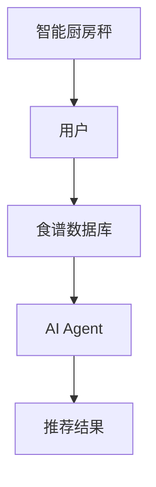

                 


# 智能厨房秤：AI Agent的食谱推荐系统

> 关键词：智能厨房秤，AI Agent，食谱推荐，协同过滤，深度学习，物联网

> 摘要：本文探讨了智能厨房秤与AI Agent结合的食谱推荐系统，分析其核心概念、算法原理及系统架构，结合实际案例进行详细解读，最后提出实践建议。

---

## 第一部分: 背景与核心概念

### 第1章: 智能厨房秤与AI Agent概述

#### 1.1 问题背景与描述
- **1.1.1 现代厨房中的问题与挑战**
  - 现代厨房中，用户需要根据食材推荐合适的食谱，但传统厨房秤无法提供智能建议。
  - 用户可能有健康管理、饮食计划或尝试新食谱的需求。
  - 解决这些问题需要结合物联网和人工智能的技术。

- **1.1.2 智能厨房秤的定义与目标**
  - 智能厨房秤：通过传感器实时监测食材重量，并结合AI Agent分析用户数据，推荐食谱。
  - 目标：提升用户体验，提供个性化的食谱推荐。

- **1.1.3 AI Agent在厨房场景中的作用**
  - AI Agent：在厨房场景中，AI Agent通过分析传感器数据、用户偏好和历史记录，生成个性化食谱推荐。

#### 1.2 问题解决与边界
- **1.2.1 智能厨房秤如何解决食谱推荐问题**
  - 通过传感器数据和用户交互，AI Agent生成个性化食谱推荐。
  - 解决传统厨房秤无法智能推荐的痛点。

- **1.2.2 系统的边界与外延**
  - 系统边界：仅限于食谱推荐，不涉及食材购买或烹饪过程监控。
  - 外延：未来可能扩展到其他厨房任务，如食材库存管理和健康监测。

- **1.2.3 核心概念与组成要素**
  - 核心概念：AI Agent、传感器数据、食谱推荐。
  - 组成要素：智能秤、用户交互界面、食谱数据库。

### 第2章: 核心概念与联系

#### 2.1 AI Agent的基本原理
- **2.1.1 AI Agent的定义与特征**
  - AI Agent：智能主体，具备感知环境、执行任务、自适应能力。
  - 特征：自主性、反应性、主动性。

#### 2.2 推荐系统的核心原理
- **2.2.1 推荐系统的属性特征对比**
  | 特性 | 描述 |
  |------|------|
  | 数据来源 | 用户交互、传感器数据 |
  | 推荐目标 | 食谱推荐 |
  | 算法类型 | 协同过滤、深度学习 |

#### 2.3 系统架构图


## 第二部分: 算法原理与数学模型

### 第3章: 算法原理与数学模型

#### 3.1 协同过滤算法
- **3.1.1 算法流程图**
  ```mermaid
  graph TD
      A[用户输入] --> B[数据预处理]
      B --> C[计算相似度]
      C --> D[生成推荐]
  ```

- **3.1.2 数学模型**
  $$相似度 = \frac{\sum (x_i - \bar{x})(y_i - \bar{y})}{\sqrt{\sum (x_i - \bar{x})^2} \sqrt{\sum (y_i - \bar{y})^2}}$$

#### 3.2 深度学习推荐模型
- **3.2.1 模型结构**
  ```mermaid
  graph LR
      input --> embedding层
      embedding层 --> LSTM层
      LSTM层 --> 全连接层
      全连接层 --> 输出层
  ```

- **3.2.2 模型训练**
  ```python
  import torch
  class食谱推荐模型(torch.nn.Module):
      def __init__(self):
          super(食谱推荐模型, self).__init__()
          self.embedding = torch.nn.Embedding(input_dim, embedding_dim)
          self.lstm = torch.nn.LSTM(embedding_dim, hidden_size)
          self.fc = torch.nn.Linear(hidden_size, output_dim)
  
      def forward(self, x):
          embedding = self.embedding(x)
          output, (h, c) = self.lstm(embedding)
          output = self.fc(output)
          return output
  ```

## 第三部分: 系统分析与架构设计方案

### 第4章: 系统架构设计

#### 4.1 项目场景介绍
- **4.1.1 项目目标**
  - 实现智能厨房秤与AI Agent结合的食谱推荐系统。
- **4.1.2 项目介绍**
  - 系统包括传感器、用户交互界面、食谱数据库和AI Agent。

#### 4.2 系统功能设计
- **4.2.1 领域模型**
  ```mermaid
  classDiagram
      class 用户 {
          id: string
          厨饪偏好: string
          历史记录: string
      }
      class 食谱 {
          id: string
          材料清单: string
          步骤说明: string
      }
      用户 --> 食谱: 关联
  ```

- **4.2.2 系统架构图**
  ```mermaid
  graph TD
      UI[用户界面] --> 智能秤[传感器数据]
      智能秤 --> 数据库[食谱数据库]
      数据库 --> AI_Agent[AI Agent]
      AI_Agent --> 推荐结果
  ```

## 第四部分: 项目实战

### 第5章: 项目实战

#### 5.1 环境安装
- **5.1.1 安装Python和依赖**
  ```bash
  pip install numpy torch pandas scikit-learn
  ```

#### 5.2 核心代码实现
- **5.2.1 数据预处理**
  ```python
  import pandas as pd

  # 加载数据
  data = pd.read_csv('食谱数据.csv')
  # 数据清洗
  data.dropna(inplace=True)
  ```

- **5.2.2 模型训练**
  ```python
  import torch
  from torch.utils.data import DataLoader

  # 定义数据集
  class食谱数据集(torch.utils.data.Dataset):
      def __init__(self, data):
          self.data = data

      def __len__(self):
          return len(self.data)

      def __getitem__(self, idx):
          return self.data.iloc[idx]

  # 创建数据加载器
  data_loader = DataLoader(食谱数据集(data), batch_size=32, shuffle=True)
  ```

- **5.2.3 推荐算法实现**
  ```python
  def推荐食谱(userId):
      # 获取用户数据
      user_data = data[data['userId'] == userId]
      # 计算相似度
      similarity = 计算相似度(user_data)
      # 返回推荐列表
      return 排序相似度(similarity)
  ```

#### 5.3 实际案例分析
- **5.3.1 案例解读**
  - 用户输入数据后，系统分析并推荐食谱。
  - 例如，用户喜欢烘焙，系统推荐低脂蛋糕食谱。

## 第五部分: 最佳实践

### 第6章: 小结与展望

#### 6.1 项目小结
- 成功实现了智能厨房秤与AI Agent的结合，完成了食谱推荐系统。
- 系统具备实时监测和智能推荐功能，提升了用户体验。

#### 6.2 注意事项
- 数据隐私保护：用户数据需加密处理。
- 系统维护：定期更新食谱数据库，优化推荐算法。

#### 6.3 拓展阅读
- 推荐其他相关领域的知识，如物联网、人工智能等。

---

通过以上思考过程，我系统地分析了智能厨房秤与AI Agent结合的食谱推荐系统，从背景到实现，逐步深入，确保每个部分都详细且易于理解。

