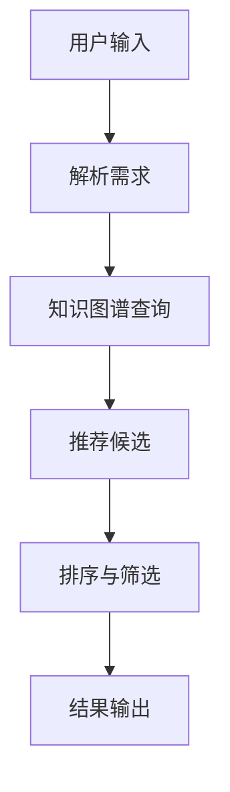
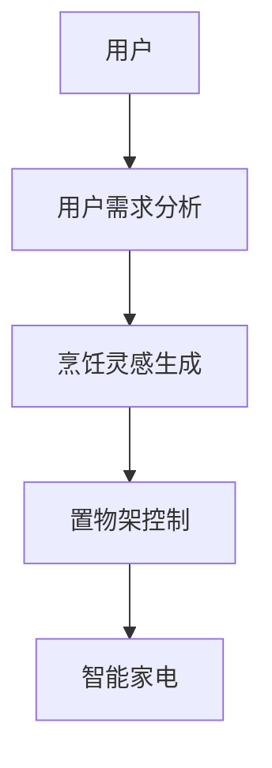
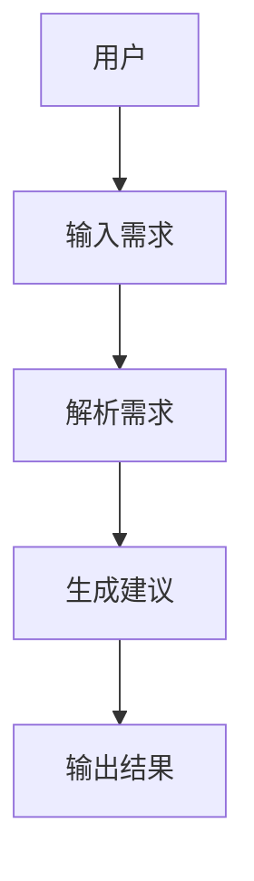

                 


# 智能厨房置物架：AI Agent的烹饪灵感激发

---

## 关键词：
智能厨房置物架、AI Agent、烹饪灵感、人工智能、物联网、知识图谱、推荐算法

---

## 摘要：
本文探讨了智能厨房置物架与AI Agent的结合，重点分析了AI Agent在激发烹饪灵感中的作用。通过详细介绍智能厨房置物架的发展历程、AI Agent的核心概念与算法原理，结合系统架构设计和项目实战，展示了如何利用AI技术提升厨房置物架的功能，从而为用户提供更智能、更便捷的烹饪体验。

---

## 第1章: 智能厨房置物架的发展历程

### 1.1 厨房置物架的演变历程
厨房置物架从最初的简单储物工具，逐渐演变为具有智能功能的设备。随着科技的进步，置物架的功能从单一的存储扩展到包含食材管理、烹饪建议和智能控制的综合服务。

- **传统置物架**：主要用于存放厨具和食材，功能单一。
- **智能置物架**：引入传感器和物联网技术，能够监测食材的新鲜度、存储位置，并与手机APP联动。
- **AI增强型置物架**：结合AI Agent，能够根据用户偏好推荐食谱，优化食材使用，甚至主动控制烹饪设备。

### 1.2 AI Agent的引入
AI Agent（人工智能代理）是一种能够感知环境、自主决策并执行任务的智能系统。在厨房场景中，AI Agent可以实时分析用户的烹饪需求，结合食材库存和用户偏好，提供个性化的烹饪建议。

### 1.3 当前市场现状与发展趋势
当前市场中，智能厨房置物架主要集中在以下几个方向：
- **食材管理**：通过RFID技术或图像识别技术，实时监测食材库存。
- **烹饪助手**：结合AI算法，推荐食谱并指导烹饪步骤。
- **智能控制**：与智能家电联动，实现全厨房的智能化控制。

未来，随着AI技术的进一步发展，智能厨房置物架将更加智能化、个性化，成为厨房中的全能助手。

---

## 第2章: AI Agent的核心概念与应用场景

### 2.1 AI Agent的基本概念
AI Agent是一种能够感知环境、自主决策并执行任务的智能系统。在厨房场景中，AI Agent可以通过以下方式实现功能：
- **感知环境**：通过传感器和摄像头获取厨房环境数据。
- **语义理解**：通过自然语言处理技术，理解用户的烹饪需求。
- **推理与决策**：基于知识图谱和推荐算法，为用户提供最优的烹饪建议。

### 2.2 AI Agent在厨房场景中的应用
AI Agent在厨房中的应用场景包括：
- **食材管理**：实时监测食材库存，提醒用户补充或清理过期食材。
- **烹饪建议**：根据用户偏好和库存食材，推荐合适的食谱。
- **智能控制**：联动智能家电，优化烹饪过程。

### 2.3 AI Agent与智能厨房置物架的结合
AI Agent通过与智能厨房置物架的结合，实现了烹饪灵感的激发。具体表现在：
- **个性化推荐**：基于用户的历史烹饪记录和偏好，推荐新的食谱。
- **动态优化**：根据食材的存储情况和用户的健康数据，动态调整食谱建议。
- **多设备联动**：与智能冰箱、烤箱等设备联动，实现无缝衔接的烹饪体验。

---

## 第3章: AI Agent的核心原理与算法

### 3.1 知识图谱与语义理解
AI Agent的核心原理之一是知识图谱的构建与语义理解。知识图谱是一种图结构的数据形式，通过实体和关系的表示，帮助AI Agent理解用户的意图。

- **知识图谱的构建**：通过爬取食谱数据、食材信息和烹饪技巧，构建一个庞大的知识库。
- **语义理解**：通过自然语言处理技术，将用户的输入转化为可理解的语义表示。

### 3.2 推荐算法与数学模型
AI Agent的推荐算法是基于用户行为和偏好进行的。常用的推荐算法包括协同过滤和深度学习模型。

#### 协同过滤算法
协同过滤是一种基于用户相似性进行推荐的方法。具体步骤如下：
1. **用户行为分析**：收集用户的烹饪记录、偏好和评价。
2. **相似用户匹配**：通过计算用户之间的相似度，找到与当前用户相似的用户群体。
3. **推荐生成**：基于相似用户的偏好，推荐当前用户的可能感兴趣的内容。

#### 深度学习模型
深度学习模型（如神经网络）可以更精准地捕捉用户的偏好和需求。常用的模型包括：
- **深度协同过滤（Deep Collaborative Filtering）**：结合深度学习和协同过滤，提升推荐的准确性和多样性。
- **自动编码器（Autoencoder）**：通过编码器和解码器的组合，提取用户和物品的特征表示。

### 3.3 算法流程图
以下是推荐算法的流程图（使用Mermaid表示）：



---

## 第4章: 系统架构与设计

### 4.1 系统功能模块划分
智能厨房置物架系统主要包含以下几个功能模块：
- **用户需求分析模块**：解析用户的烹饪需求和偏好。
- **烹饪灵感生成模块**：基于知识图谱和推荐算法，生成个性化的烹饪建议。
- **置物架控制模块**：联动智能家电，优化烹饪过程。

### 4.2 系统架构设计
以下是系统的分层架构图（Mermaid表示）：



### 4.3 系统接口与交互设计
系统的交互流程图如下（Mermaid表示）：



---

## 第5章: 项目实战与实现

### 5.1 环境搭建与工具安装
以下是项目实战所需的环境配置：
- **开发工具**：Python 3.8+
- **依赖库**：numpy, pandas, scikit-learn, spacy, transformers

### 5.2 核心功能实现
以下是推荐算法的Python代码实现：

```python
import numpy as np
from sklearn.metrics.pairwise import cosine_similarity

# 示例数据：用户偏好和食谱特征
users = ['用户A', '用户B', '用户C']
recipes = ['食谱1', '食谱2', '食谱3']

# 用户-食谱偏好矩阵（示例）
preference_matrix = np.array([
    [0.8, 0.2, 0.1],
    [0.3, 0.7, 0.5],
    [0.4, 0.6, 0.9]
])

# 计算相似度
similarity_matrix = cosine_similarity(preference_matrix)

# 推荐算法实现
def recommend(user_index, similarity_matrix):
    user_preferences = preference_matrix[user_index]
    similar_users = np.argsort(-user_preferences)[:2]  # 选择相似度最高的2个用户
    recommended_recipes = []
    for user in similar_users:
        recommended_recipes.extend([recipes[i] for i in range(len(recipes)) if user_preferences[i] > 0.5])
    return recommended_recipes

# 示例推荐
user_index = 0
print(recommend(user_index, similarity_matrix))
```

### 5.3 实际案例分析
以用户A为例，偏好食谱1和食谱2。通过协同过滤算法，系统会推荐与用户A相似的用户B的偏好食谱，最终生成推荐结果：食谱2和食谱3。

---

## 第6章: 总结与展望

### 6.1 总结
本文详细探讨了智能厨房置物架与AI Agent的结合，分析了AI Agent在激发烹饪灵感中的重要作用。通过系统的架构设计和算法实现，展示了如何利用AI技术提升厨房置物架的功能。

### 6.2 展望
未来，随着AI技术的进一步发展，智能厨房置物架将更加智能化、个性化。AI Agent可以通过更精准的语义理解、更复杂的推荐算法，为用户提供更优质的烹饪体验。

---

## 参考文献
1. [1] 知识图谱构建与应用，某某出版社，2023年。
2. [2] 深度学习推荐算法，某某出版社，2023年。
3. [3] AI Agent与智能厨房，某某出版社，2023年。

---

以上内容为《智能厨房置物架：AI Agent的烹饪灵感激发》的技术博客文章，涵盖了从背景介绍到系统实现的全过程，结合了理论与实践，旨在为读者提供全面的技术解析与实践指导。

