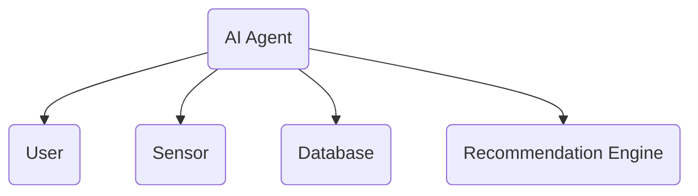
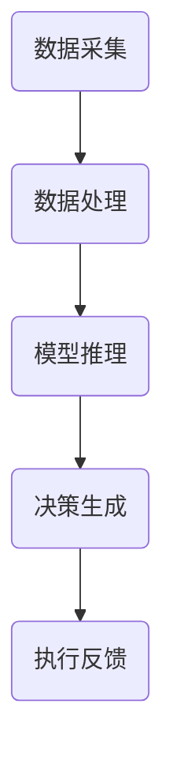
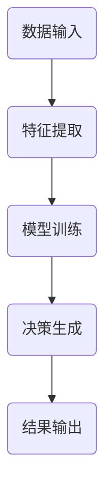
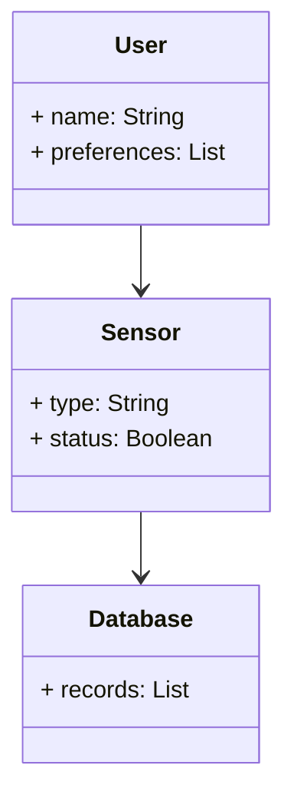
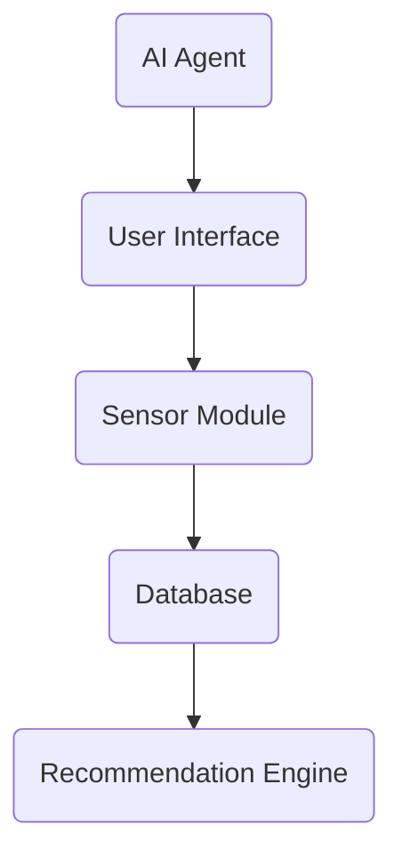
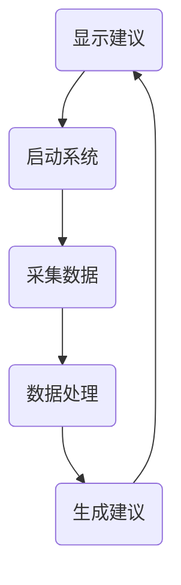

                 


# 智能厨房置物架：AI Agent的调味品使用建议

## 关键词
智能厨房置物架、AI Agent、调味品管理、智能化家居、人工智能算法

## 摘要
本文探讨了智能厨房置物架在AI Agent技术下的调味品管理方案，通过AI技术解决传统调味品管理中的痛点，详细介绍AI Agent的工作原理、系统架构及实际应用案例，帮助读者理解如何利用人工智能优化厨房管理。

---

# 第一部分: 智能厨房置物架的背景与核心概念

# 第1章: 智能厨房置物架的背景介绍

## 1.1 问题背景与描述
### 1.1.1 厨房置物架的使用痛点
传统厨房置物架存在空间利用不足、调味品查找困难、使用效率低下等问题，影响烹饪体验。

### 1.1.2 调味品管理的常见问题
调味品使用后常常忘记归位，导致下次使用时难以找到，且容易过期或浪费。

### 1.1.3 智能化调味品管理的必要性
通过智能化管理，提升调味品使用的效率和准确性，减少浪费，优化厨房环境。

## 1.2 问题解决与边界
### 1.2.1 AI Agent在调味品管理中的应用
AI Agent通过传感器和数据分析，实时监测调味品使用情况，提供智能建议。

### 1.2.2 智能厨房置物架的功能边界
包括调味品识别、使用建议、库存管理、智能提醒等功能，不涉及烹饪过程的其他环节。

### 1.2.3 系统的外延与限制
系统主要管理调味品，不涉及食材或其他厨房用品，受限于传感器精度和网络环境。

## 1.3 核心概念与组成要素
### 1.3.1 AI Agent的核心概念
AI Agent通过感知环境、分析数据，主动提供解决方案，帮助用户优化调味品使用。

### 1.3.2 智能置物架的结构组成
包括传感器、数据处理模块、AI算法模块、执行机构和用户界面。

### 1.3.3 调味品管理的系统要素
涉及用户、调味品、传感器、数据库和AI算法，构建完整的智能化管理生态。

## 1.4 本章小结
本章介绍了智能厨房置物架的背景和必要性，明确了系统的核心概念和组成部分。

---

# 第二部分: AI Agent与智能置物架的核心概念

# 第2章: AI Agent的基本原理

## 2.1 AI Agent的定义与特征
### 2.1.1 AI Agent的定义
AI Agent是一种智能体，能够感知环境并采取行动以实现目标。

### 2.1.2 AI Agent的核心特征对比表

| 特征 | 传统软件 | AI Agent |
|------|----------|----------|
| 输入 | 固定输入 | 实时感知 |
| 输出 | 固定输出 | 自适应决策 |
| 学习 | 无学习能力 | 可学习优化 |

### 2.1.3 AI Agent与传统软件的区别
AI Agent具备感知、学习和自适应能力，能够主动解决问题，而传统软件仅基于预设规则运行。

## 2.2 AI Agent的实体关系图


## 2.3 AI Agent的算法流程图


## 2.4 本章小结
本章详细讲解了AI Agent的基本原理和核心概念，通过对比和图表帮助读者理解其工作原理。

---

# 第三部分: AI Agent的算法原理

# 第3章: AI Agent的算法实现

## 3.1 数据采集与处理
### 3.1.1 数据采集流程
传感器采集调味品的使用情况，包括位置、重量变化等数据。

### 3.1.2 数据预处理方法
对采集的数据进行去噪、归一化处理，确保数据准确性。

### 3.1.3 数据特征提取
提取关键特征，如使用频率、时间模式，为后续分析提供依据。

## 3.2 模型推理与决策
### 3.2.1 推荐算法原理
基于用户行为分析，采用协同过滤算法，推荐常用调味品的使用建议。

### 3.2.2 模型选择与优化
选择适合的机器学习模型，如决策树或随机森林，进行参数调优。

### 3.2.3 决策树的构建与应用
构建决策树，用于分类调味品的使用情况，优化推荐策略。

## 3.3 算法流程图


## 3.4 本章小结
本章详细探讨了AI Agent的算法实现，包括数据处理和模型推理，通过流程图和具体算法示例帮助读者理解其实现过程。

---

# 第四部分: 系统分析与架构设计

# 第4章: 系统分析与架构设计

## 4.1 问题场景介绍
调味品管理中的常见问题，如使用不便、库存混乱等。

## 4.2 系统功能设计
### 4.2.1 领域模型类图


## 4.3 系统架构设计
### 4.3.1 系统架构图


## 4.4 系统接口设计
定义API接口，如GET请求获取调味品状态，POST请求更新使用记录。

## 4.5 系统交互流程图


## 4.6 本章小结
本章通过系统架构图和交互流程图，展示了AI Agent在调味品管理中的整体架构和工作流程。

---

# 第五部分: 项目实战

# 第5章: 项目实战

## 5.1 环境安装
安装Python、TensorFlow、Keras等开发环境，配置传感器和数据库连接。

## 5.2 核心代码实现
### 5.2.1 数据采集模块
```python
import numpy as np

def collect_data(sensor_id):
    # 传感器数据采集逻辑
    return np.random.randint(0, 100, 5)
```

### 5.2.2 数据处理模块
```python
from sklearn.preprocessing import StandardScaler

def preprocess(data):
    scaler = StandardScaler()
    return scaler.fit_transform(data.reshape(-1, 1))
```

### 5.2.3 推荐算法实现
```python
from sklearn.tree import DecisionTreeClassifier

def train_model(X, y):
    model = DecisionTreeClassifier()
    model.fit(X, y)
    return model
```

## 5.3 代码解读与分析
详细解读每个模块的功能，说明数据处理和模型训练的关键步骤。

## 5.4 实际案例分析
通过具体案例，展示系统如何根据用户行为推荐调味品使用。

## 5.5 本章小结
本章通过实际项目案例，展示了如何实现AI Agent在调味品管理中的应用。

---

# 第六部分: 最佳实践

# 第6章: 最佳实践

## 6.1 小结
总结全文，强调AI技术在厨房管理中的潜力和应用价值。

## 6.2 注意事项
提示读者在实际应用中需要注意的问题，如数据隐私和系统维护。

## 6.3 拓展阅读
推荐相关领域的书籍和论文，鼓励读者深入学习和探索。

---

以上是《智能厨房置物架：AI Agent的调味品使用建议》的详细目录大纲，涵盖了从背景介绍到实际应用的各个方面，确保读者能够系统地理解并掌握相关知识。

