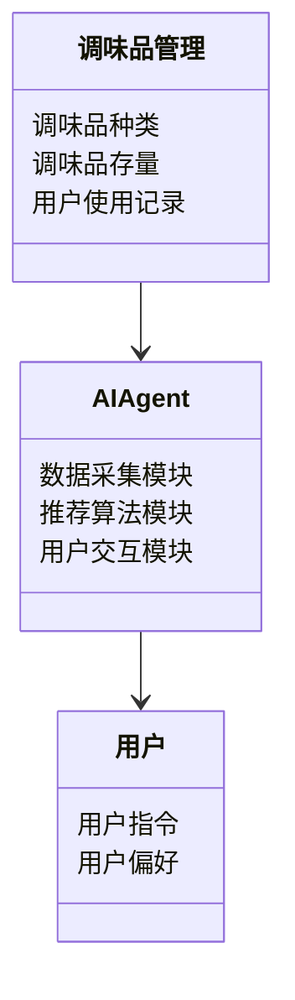
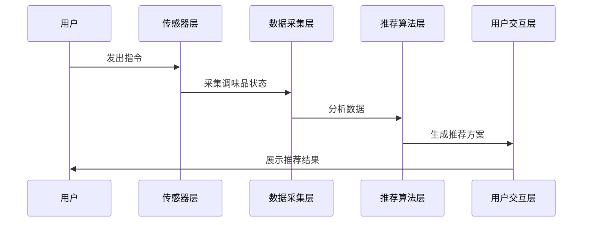

                 


# 智能厨房置物架：AI Agent的调味品使用指导

## 关键词：AI Agent，智能厨房，调味品管理，推荐算法，协同过滤，系统架构

## 摘要：  
本文将探讨如何通过AI Agent技术实现智能厨房置物架的调味品使用指导。通过分析调味品管理的现状与挑战，提出基于AI Agent的解决方案，并详细讲解推荐算法、系统架构及实现细节。通过实际案例分析，展示AI Agent在调味品管理中的应用价值，并总结最佳实践和未来发展。

---

# 第一部分: 背景介绍与核心概念

## 第1章: 背景介绍

### 1.1 问题背景

#### 1.1.1 调味品管理的现状与挑战  
调味品是家庭厨房中不可或缺的物品，但传统管理方式存在以下问题：  
1. **存储混乱**：调味品种类繁多，容易堆积杂乱，导致使用不便。  
2. **用量浪费**：用户常因忘记存量而购买过多，或因过期导致浪费。  
3. **使用低效**：在烹饪时，用户需要翻找调料，影响效率。  

#### 1.1.2 智能厨房置物架的出现背景  
随着智能家居的普及，厨房设备的智能化成为趋势。智能厨房置物架通过传感器和AI技术，能够实时监测调味品的状态，并提供智能化的管理与推荐服务。  

#### 1.1.3 AI Agent在调味品管理中的作用  
AI Agent（智能代理）通过感知环境、学习用户习惯和推荐最优使用方案，能够显著提升调味品的管理效率。  

### 1.2 问题描述

#### 1.2.1 调味品管理中的常见问题  
1. **存储混乱**：调味品摆放无序，查找困难。  
2. **用量浪费**：用户常购买重复的调味品，导致库存积压。  
3. **使用低效**：在烹饪时，用户无法快速找到所需调味品。  

#### 1.2.2 用户需求分析  
1. **便捷性**：用户希望快速找到所需调味品。  
2. **智能化**：用户希望系统能够主动推荐调味品的使用方案。  
3. **数据化**：用户希望了解调味品的使用情况和库存状态。  

#### 1.2.3 现有解决方案的不足  
1. **传统管理**：依赖手工记录，效率低且容易遗忘。  
2. **智能设备不足**：现有设备多为单一功能，缺乏智能化的管理与推荐能力。  

### 1.3 问题解决

#### 1.3.1 AI Agent的核心解决方案  
通过AI Agent实现调味品的智能化管理，包括：  
1. **自动识别**：利用传感器和图像识别技术，自动识别调味品的种类和存量。  
2. **智能推荐**：基于用户习惯和库存状态，推荐最优的调味品使用方案。  
3. **实时反馈**：通过反馈机制优化推荐算法，提升用户体验。  

#### 1.3.2 智能厨房置物架的设计目标  
1. 提供便捷的调味品存储与管理功能。  
2. 实现智能化的调味品使用推荐。  
3. 提供数据化的库存管理与使用记录。  

#### 1.3.3 系统的核心功能与价值  
1. **核心功能**：  
   - 自动识别调味品种类和存量。  
   - 智能推荐调味品的使用方案。  
   - 提供库存预警和用量统计。  
2. **价值**：  
   - 提升厨房管理效率。  
   - 减少调味品的浪费。  
   - 优化用户的烹饪体验。  

### 1.4 系统边界与外延

#### 1.4.1 系统的功能边界  
1. **输入**：用户操作指令、传感器数据。  
2. **输出**：调味品使用推荐、库存状态反馈。  
3. **交互**：通过语音或APP与用户交互。  

#### 1.4.2 系统的外延与扩展性  
1. **扩展调味品种类**：支持更多种类的调味品识别与管理。  
2. **多设备联动**：与智能家居设备联动，实现更复杂的厨房管理功能。  
3. **数据共享**：支持将调味品数据与其他家庭管理系统共享。  

#### 1.4.3 系统与外部环境的交互  
1. **用户**：通过APP或语音指令与系统交互。  
2. **传感器**：采集调味品的存量和使用情况。  
3. **云端**：存储用户数据和推荐算法的优化。  

### 1.5 核心概念与系统结构

#### 1.5.1 AI Agent的基本概念  
AI Agent是一种智能代理，能够感知环境、执行任务并做出决策。在调味品管理中，AI Agent负责数据采集、分析和推荐。  

#### 1.5.2 智能厨房置物架的系统结构  
1. **硬件部分**：传感器、摄像头、显示屏。  
2. **软件部分**：数据采集模块、推荐算法模块、用户交互界面。  
3. **云端支持**：数据存储、算法优化、用户反馈分析。  

#### 1.5.3 系统的核心要素组成  
1. **传感器**：用于采集调味品的状态数据。  
2. **AI算法**：用于分析数据并生成推荐方案。  
3. **用户交互界面**：用于展示推荐结果和用户操作。  

---

# 第二部分: 核心概念与联系

## 第2章: 核心概念与系统结构

### 2.1 AI Agent的核心原理

#### 2.1.1 AI Agent的基本原理  
AI Agent通过感知环境、学习用户行为和优化决策，实现智能化的管理与推荐。  

#### 2.1.2 AI Agent的感知与决策机制  
1. **感知**：通过传感器和图像识别技术，采集调味品的状态数据。  
2. **学习**：基于用户的历史行为数据，学习用户的使用习惯。  
3. **决策**：根据当前状态和用户习惯，推荐最优的调味品使用方案。  

#### 2.1.3 AI Agent与用户交互的方式  
1. **语音交互**：通过语音指令与用户互动。  
2. **APP交互**：通过手机APP展示推荐结果和系统状态。  
3. **可视化反馈**：通过显示屏或灯光提示系统状态。  

### 2.2 调味品管理系统的结构

#### 2.2.1 调味品管理系统的组成  
1. **数据采集模块**：负责采集调味品的状态数据。  
2. **推荐算法模块**：基于数据生成推荐方案。  
3. **用户交互界面**：展示推荐结果并接收用户指令。  

#### 2.2.2 系统的输入输出关系  
1. **输入**：用户指令、传感器数据。  
2. **输出**：调味品使用推荐、库存状态反馈。  

#### 2.2.3 系统的核心功能模块  
1. **数据采集模块**：传感器和摄像头用于采集调味品的状态数据。  
2. **推荐算法模块**：基于协同过滤和基于规则的推荐算法，生成调味品使用推荐。  
3. **用户交互界面**：APP或显示屏用于展示推荐结果和系统状态。  

### 2.3 核心概念的对比分析

#### 2.3.1 AI Agent与传统自动化系统的对比  
| **对比维度** | **AI Agent** | **传统自动化系统** |  
|--------------|--------------|--------------------|  
| 智能性       | 高           | 低                 |  
| 学习能力     | 强           | 无                 |  
| 适应性       | 强           | 弱                 |  

#### 2.3.2 智能厨房置物架与传统置物架的对比  
| **对比维度** | **智能厨房置物架** | **传统置物架** |  
|--------------|------------------|-----------------|  
| 智能性       | 高               | 低               |  
| 功能         | 多               | 单一             |  
| 交互方式     | 丰富             | 简单             |  

#### 2.3.3 系统的核心要素组成  
1. **传感器**：用于采集调味品的状态数据。  
2. **AI算法**：用于分析数据并生成推荐方案。  
3. **用户交互界面**：用于展示推荐结果和用户操作。  

---

## 第3章: 算法原理讲解

### 3.1 算法原理

#### 3.1.1 基于规则的推荐算法  
基于规则的推荐算法通过预设规则，根据调味品的使用场景和用户习惯推荐使用方案。例如，当用户烹饪某种菜系时，系统推荐常用的调味品组合。  

#### 3.1.2 协同过滤推荐算法  
协同过滤推荐算法通过分析用户的历史行为和偏好，推荐相似用户的调味品使用方案。例如，如果用户A喜欢使用酱油和醋，而用户B也喜欢酱油和醋，系统会推荐用户A使用酱油和醋的可能性。  

#### 3.1.3 深度学习推荐算法  
深度学习推荐算法通过训练神经网络模型，学习调味品的使用模式和用户偏好，生成个性化的推荐方案。  

### 3.2 算法实现

#### 3.2.1 基于规则的推荐算法实现  
```python
def rule_based_recommendation(user_behavior):
    # 根据用户行为推荐调味品
    if user_behavior['cooking_style'] == '中式':
        return ['酱油', '醋', '盐']
    elif user_behavior['cooking_style'] == '西式':
        return ['橄榄油', '黑胡椒', '黄油']
    else:
        return []
```

#### 3.2.2 协同过滤推荐算法实现  
```python
def collaborative_filtering_recommendation(user_id):
    # 基于协同过滤推荐调味品
    similar_users = find_similar_users(user_id)
    recommended_spices = []
    for user in similar_users:
        recommended_spices.extend(get_user_recommendations(user))
    return recommended_spices
```

#### 3.2.3 深度学习推荐算法实现  
```python
import tensorflow as tf

def deep_learning_recommendation(user_id):
    # 使用神经网络模型进行推荐
    model = load_model()
    user_features = get_user_features(user_id)
    predictions = model.predict(user_features)
    return predictions
```

### 3.3 数学模型与公式

#### 3.3.1 协同过滤公式  
$$ \text{相似度} = \frac{\sum (x_i - \mu)(y_i - \mu)}{\sqrt{\sum (x_i - \mu)^2} \cdot \sqrt{\sum (y_i - \mu)^2}} $$  

#### 3.3.2 深度学习模型结构  
$$ \text{模型输入} \rightarrow \text{嵌入层} \rightarrow \text{神经网络} \rightarrow \text{输出层} $$  

---

## 第4章: 系统分析与架构设计方案

### 4.1 问题场景介绍

#### 4.1.1 调味品管理问题场景  
用户在厨房中使用调味品时，需要快速找到所需调味品，并获得使用建议。系统需要实时监测调味品的状态，并根据用户习惯推荐使用方案。  

### 4.2 项目介绍

#### 4.2.1 项目目标  
实现一个基于AI Agent的智能厨房置物架，能够自动识别调味品、推荐使用方案，并提供库存管理功能。  

#### 4.2.2 项目需求  
1. **硬件需求**：传感器、摄像头、显示屏。  
2. **软件需求**：AI算法、用户交互界面。  
3. **云端需求**：数据存储、算法优化。  

### 4.3 系统功能设计

#### 4.3.1 领域模型  


#### 4.3.2 系统架构  


#### 4.3.3 系统接口设计  
1. **传感器接口**：用于采集调味品的状态数据。  
2. **用户交互接口**：用于接收用户指令和展示推荐结果。  
3. **云端接口**：用于数据存储和算法优化。  

### 4.4 系统交互流程

#### 4.4.1 交互流程图  


---

## 第5章: 项目实战

### 5.1 环境安装

#### 5.1.1 安装Python与库  
1. **安装Python**：确保安装Python 3.8及以上版本。  
2. **安装库**：安装numpy、pandas、scikit-learn、tensorflow等库。  

#### 5.1.2 安装硬件  
1. **传感器**：购买支持的传感器模块。  
2. **摄像头**：安装图像识别摄像头。  
3. **显示屏**：安装LCD或LED显示屏。  

### 5.2 核心代码实现

#### 5.2.1 数据预处理  
```python
import numpy as np
import pandas as pd

def preprocess_data(data):
    # 数据清洗和特征提取
    data = data.dropna()
    data = pd.get_dummies(data)
    return data
```

#### 5.2.2 推荐算法实现  
```python
from sklearn.neighbors import NearestNeighbors

def collaborative_filtering(X, k=5):
    # 协同过滤推荐算法
    model = NearestNeighbors(n_neighbors=k)
    model.fit(X)
    return model
```

#### 5.2.3 用户交互界面  
```python
def show_recommendations(spices):
    # 展示推荐结果
    print("推荐的调味品：")
    for spice in spices:
        print(spice)
```

### 5.3 实际案例分析

#### 5.3.1 案例背景  
用户A喜欢烹饪中式菜肴，常用酱油、醋和盐。系统需要根据用户的偏好推荐调味品的使用方案。  

#### 5.3.2 系统实现  
```python
user_behavior = {'cooking_style': '中式', 'preferred_spices': ['酱油', '醋', '盐']}
recommended_spices = rule_based_recommendation(user_behavior)
show_recommendations(recommended_spices)
```

#### 5.3.3 结果分析  
系统推荐了酱油、醋和盐，符合用户的使用习惯。  

### 5.4 项目小结  
通过实际案例分析，展示了AI Agent在调味品管理中的应用价值。  

---

## 第6章: 最佳实践与小结

### 6.1 最佳实践

#### 6.1.1 设计建议  
1. **模块化设计**：确保系统模块化，便于维护和扩展。  
2. **数据安全**：保护用户的隐私数据。  
3. **用户体验**：优化用户交互界面，提升用户体验。  

#### 6.1.2 实施建议  
1. **分阶段实施**：逐步实现系统功能，避免一次性开发复杂功能。  
2. **测试优化**：通过测试优化系统性能和推荐算法。  

### 6.2 小结  
本文详细介绍了智能厨房置物架的设计与实现，包括背景分析、算法原理、系统架构和项目实战。通过AI Agent技术，显著提升了调味品的管理效率和用户体验。  

### 6.3 注意事项  
1. **数据准确性**：确保传感器数据的准确性。  
2. **算法优化**：持续优化推荐算法，提升推荐精度。  
3. **系统维护**：定期维护系统，确保其正常运行。  

### 6.4 拓展阅读  
1. **推荐算法研究**：深入研究深度学习在推荐系统中的应用。  
2. **系统优化**：探索更高效的系统架构和优化方法。  
3. **用户研究**：分析用户行为，进一步优化系统功能。  

--- 

通过本文的详细介绍，读者可以全面了解智能厨房置物架的设计与实现，并能够将其应用于实际场景中。

