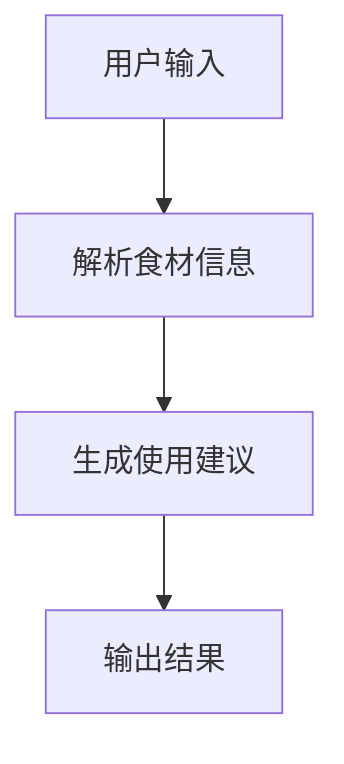
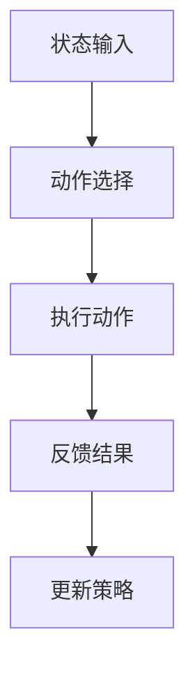
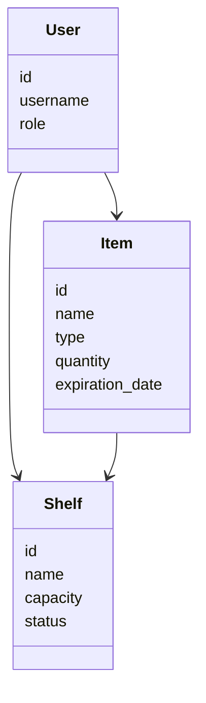
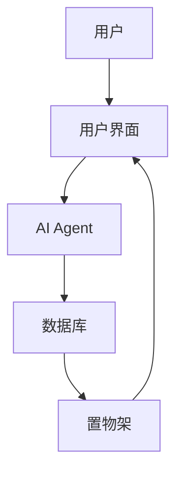
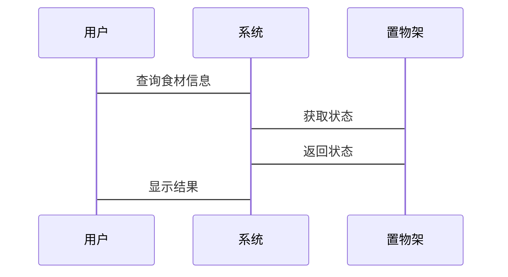

                 


# 《智能厨房置物架：AI Agent的食材使用优化》

> 关键词：智能厨房，AI Agent，食材优化，置物架，人工智能，食材管理

> 摘要：本文将详细介绍智能厨房置物架中AI Agent的应用，探讨其如何通过优化食材的存储和使用，帮助用户提高厨房管理效率，减少食材浪费。文章将从背景介绍、核心概念、算法原理、系统架构、项目实战等多个维度展开，深入分析AI Agent在智能厨房中的作用及其实现原理。

---

# 第一部分: 背景介绍

## 第1章: 智能厨房置物架的背景与问题背景

### 1.1 问题背景
#### 1.1.1 厨房食材管理的痛点
- 食材存储混乱，查找困难。
- 食材使用效率低，容易过期浪费。
- 厨房空间有限，置物架利用不足。

#### 1.1.2 食材浪费与管理效率低下
- 食材购买过多，导致浪费。
- 缺乏智能化管理工具，用户难以高效使用食材。

#### 1.1.3 智能化管理的需求
- 提高食材使用效率。
- 实现智能化食材管理。
- 提供便捷的厨房管理体验。

### 1.2 问题描述
#### 1.2.1 食材使用效率的优化目标
- 最大化食材利用率。
- 减少食材浪费。
- 提高厨房管理效率。

#### 1.2.2 智能厨房置物架的功能需求
- 智能化食材分类存储。
- 自动化食材使用建议。
- 实时监控食材状态。

#### 1.2.3 用户使用场景的分析
- 用户日常食材采购与存储。
- 用户烹饪过程中的食材使用。
- 用户对食材管理的需求。

### 1.3 问题解决
#### 1.3.1 AI Agent的核心作用
- 智能识别食材信息。
- 自动生成食材使用计划。
- 提供烹饪建议。

#### 1.3.2 智能厨房置物架的解决方案
- 基于AI的食材分类与存储。
- 智能化食材使用建议。
- 实时监控食材状态。

#### 1.3.3 技术实现的路径分析
- 数据采集与处理。
- AI算法实现。
- 系统集成与优化。

### 1.4 边界与外延
#### 1.4.1 智能厨房置物架的适用范围
- 家庭厨房。
- 小型商用厨房。
- 智能家居生态系统。

#### 1.4.2 与智能家居系统的边界
- 数据共享。
- 功能协同。
- 用户交互统一。

#### 1.4.3 与其他厨房设备的协同关系
- 智能冰箱。
- 智能灶具。
- 智能垃圾桶。

### 1.5 概念结构与核心要素
#### 1.5.1 系统构成要素
- 用户：系统的主要使用者。
- 置物架：物理存储设备。
- AI Agent：智能管理核心。
- 数据库：食材信息存储。
- 用户界面：人机交互界面。

#### 1.5.2 核心功能模块
- 食材信息采集模块。
- AI推理模块。
- 用户交互模块。
- 数据存储模块。

#### 1.5.3 用户交互界面
- 食材分类展示。
- 使用建议界面。
- 系统设置界面。

---

# 第二部分: 核心概念与联系

## 第2章: 核心概念与联系

### 2.1 AI Agent的核心原理
#### 2.1.1 AI Agent的基本概念
- AI Agent的定义与功能。
- AI Agent与智能系统的区别。

#### 2.1.2 AI Agent的分类
- 基于规则的AI Agent。
- 基于学习的AI Agent。
- 混合型AI Agent。

#### 2.1.3 AI Agent在智能厨房中的应用
- 食材信息采集。
- 食材使用建议生成。
- 系统控制与反馈。

### 2.2 核心概念对比
#### 2.2.1 AI Agent与传统自动化设备的对比
| 特性          | 传统自动化设备          | AI Agent                  |
|---------------|-------------------------|---------------------------|
| 功能          | 单一功能                | 多功能、智能化             |
| 决策能力      | 无                      | 具备自主决策能力           |
| 可扩展性      | 有限                    | 高度可扩展                 |

#### 2.2.2 AI Agent与智能家居系统的对比
| 特性          | 智能家居系统            | AI Agent                  |
|---------------|-------------------------|---------------------------|
| 核心功能      | 多设备协同              | 基于AI的决策与控制        |
| 应用场景      | 家庭自动化              | 厨房智能化管理             |
| 数据处理      | 简单数据处理            | 复杂数据处理与推理         |

#### 2.2.3 AI Agent与食材管理软件的对比
| 特性          | 食材管理软件            | AI Agent                  |
|---------------|-------------------------|---------------------------|
| 核心功能      | 数据记录与管理          | 数据采集、推理与控制      |
| 用户交互      | 界面交互                | 自然语言交互              |
| 智能性        | 低                      | 高                        |

### 2.3 ER实体关系图
```mermaid
erDiagram
    user {
        id INT PRIMARY KEY AUTO_INCREMENT
        username VARCHAR(50)
        role ENUM('admin', 'user')
    }
    item {
        id INT PRIMARY KEY AUTO_INCREMENT
        name VARCHAR(100)
        type VARCHAR(50)
        quantity INT
        expiration_date DATE
    }
    shelf {
        id INT PRIMARY KEY AUTO_INCREMENT
        name VARCHAR(50)
        capacity INT
        status ENUM('empty', 'half', 'full')
    }
    user_item <---N--- shelf_item
    user_shelf <---N--- shelf_item
    item <---N--- shelf_item
```

---

# 第三部分: 算法原理讲解

## 第3章: AI Agent的算法原理

### 3.1 算法原理概述
#### 3.1.1 AI Agent的核心算法
- 基于规则的推理算法。
- 基于强化学习的决策算法。
- 基于自然语言处理的交互算法。

#### 3.1.2 算法实现的步骤
1. 数据采集与预处理。
2. 算法模型的训练与优化。
3. 算法的集成与部署。

### 3.2 算法模型的实现
#### 3.2.1 基于规则的推理算法


#### 3.2.2 基于强化学习的决策算法


#### 3.2.3 算法的数学模型
- 基于规则的推理：
  $$ \text{规则匹配} = \sum_{i=1}^{n} w_i \cdot x_i $$
- 基于强化学习的决策：
  $$ Q(s, a) = Q(s, a) + \alpha (r + \max_{a'} Q(s', a') - Q(s, a)) $$

### 3.3 算法实现的代码示例
```python
def ai_agent_rule_based(user_input):
    # 数据解析
    parsed_data = parse_input(user_input)
    # 规则匹配
    matched_rules = match_rules(parsed_data)
    # 生成建议
    suggestions = generate_suggestions(matched_rules)
    return suggestions

def ai_agent_reinforcement_learning(state):
    # 动作选择
    action = choose_action(state)
    # 执行动作
    next_state = execute_action(action)
    # 反馈处理
    reward = get_reward(next_state)
    # 更新策略
    update_policy(state, action, reward)
    return next_state
```

---

## 第4章: 系统分析与架构设计

### 4.1 项目背景介绍
#### 4.1.1 项目目标
- 实现智能化食材管理。
- 提高厨房管理效率。

#### 4.1.2 项目范围
- 针对家庭厨房设计。
- 支持多种食材管理需求。

### 4.2 系统功能设计
#### 4.2.1 领域模型类图


#### 4.2.2 系统架构图


#### 4.2.3 接口设计
- 用户与系统交互接口。
- 系统与置物架通信接口。
- 系统与数据库交互接口。

#### 4.2.4 交互序列图


---

## 第5章: 项目实战

### 5.1 环境安装
#### 5.1.1 开发环境
- Python 3.8+
- TensorFlow 2.0+
- PyTorch 1.9+

#### 5.1.2 依赖安装
```bash
pip install numpy pandas scikit-learn
```

### 5.2 核心代码实现
#### 5.2.1 数据预处理
```python
import pandas as pd

def preprocess_data(data):
    # 数据清洗
    data = data.dropna()
    # 数据标准化
    data = (data - data.mean()) / data.std()
    return data
```

#### 5.2.2 AI Agent实现
```python
class AIAgent:
    def __init__(self, model):
        self.model = model

    def infer(self, input):
        return self.model.predict(input)
```

#### 5.2.3 置物架控制
```python
class ShelfController:
    def __init__(self, shelf_id):
        self.shelf_id = shelf_id

    def update_status(self, status):
        # 更新置物架状态
        pass
```

### 5.3 代码解读与分析
- 数据预处理代码：实现数据清洗与标准化。
- AI Agent实现代码：定义AI Agent类，集成预训练模型。
- 置物架控制代码：实现置物架状态更新。

### 5.4 实际案例分析
#### 5.4.1 案例一
- 用户输入：需要制作番茄炒蛋。
- 系统输出：推荐使用新鲜的鸡蛋和番茄。

#### 5.4.2 案例二
- 用户输入：冰箱中的牛奶过期。
- 系统输出：提醒用户及时清理。

### 5.5 项目小结
- 项目实现的核心功能。
- 系统性能的优化建议。
- 项目总结与未来改进方向。

---

## 第6章: 最佳实践与总结

### 6.1 最佳实践
#### 6.1.1 系统使用 tips
- 定期更新食材信息。
- 保持系统与设备的连通性。

#### 6.1.2 系统维护 tips
- 定期检查数据库。
- 更新AI模型。

### 6.2 总结
- 本文总结了智能厨房置物架中AI Agent的应用。
- 展望了未来的发展方向。

### 6.3 注意事项
- 数据安全问题。
- 系统兼容性问题。

### 6.4 拓展阅读
- 推荐相关书籍与论文。
- 提供进一步学习的资源。

---

通过以上内容，我们可以看到，AI Agent在智能厨房置物架中的应用不仅提高了食材的使用效率，还为用户提供了更加智能化的厨房管理体验。未来，随着AI技术的不断发展，智能厨房置物架将变得更加智能和高效。

