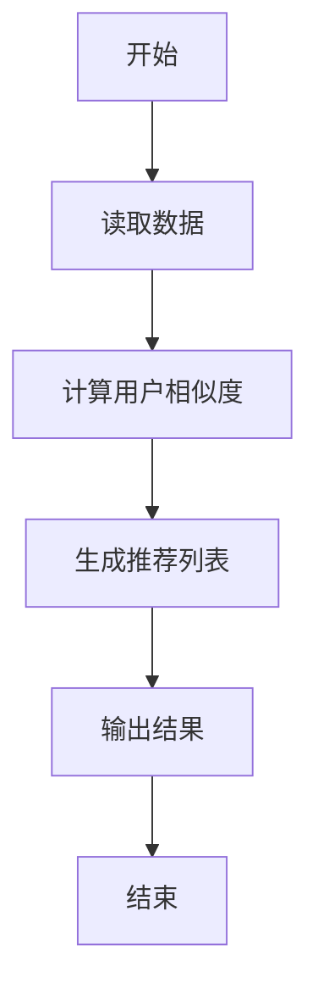
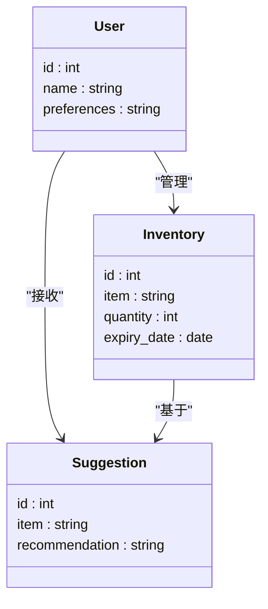
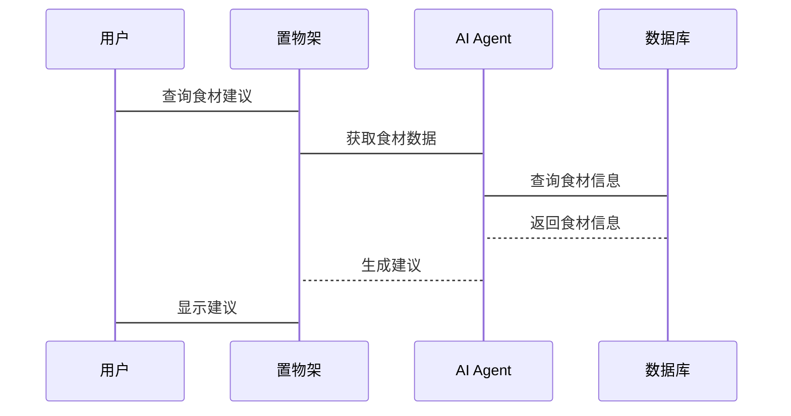

                 


### 第一部分: 智能厨房置物架的背景与概念

#### 第1章: 智能厨房置物架的背景介绍

##### 1.1 问题背景

###### 1.1.1 厨房管理的传统痛点

现代家庭的厨房管理面临诸多挑战。传统厨房置物架通常缺乏智能化，用户需要手动记录食材的购买日期和保质期，容易遗忘或误用过期食材。此外，食材的存储位置和数量也难以高效管理，导致食材浪费和使用不便。

###### 1.1.2 智能化管理的需求

随着智能家居和物联网技术的发展，用户对厨房管理的智能化需求日益增长。智能化的厨房置物架能够帮助用户自动记录食材信息，提供使用建议，并优化存储空间，提升厨房管理的效率和便利性。

###### 1.1.3 AI Agent的引入

AI Agent（人工智能代理）能够通过感知环境、分析数据并执行任务，为用户提供个性化的食材使用建议。引入AI Agent可以显著提升厨房置物架的功能，使其不仅是一个存储工具，更是一个智能的厨房助手。

##### 1.2 问题描述

###### 1.2.1 食材管理的复杂性

食材种类繁多，每种食材的保质期和使用建议各不相同。传统管理方式难以高效处理这些信息，容易导致食材浪费或误用。

###### 1.2.2 置物架的使用效率低下

传统置物架缺乏智能化，用户难以快速找到所需食材，且无法根据食材的使用情况优化存储位置。

###### 1.2.3 用户需求与资源分配的矛盾

用户希望在厨房管理中节省时间和精力，但传统方式难以满足这一需求，导致用户满意度低。

##### 1.3 问题解决

###### 1.3.1 AI Agent的核心作用

AI Agent通过实时感知食材的状态、用户的使用习惯和偏好，提供智能化的食材使用建议，帮助用户优化食材存储和使用。

###### 1.3.2 智能厨房置物架的功能定位

智能厨房置物架不仅是存储工具，更是通过AI Agent实现食材信息管理、使用建议和优化存储的智能设备。

###### 1.3.3 用户体验的提升

通过智能化的管理，用户能够更高效地使用食材，减少浪费，提升厨房管理的便利性和舒适性。

##### 1.4 边界与外延

###### 1.4.1 系统边界

智能厨房置物架的功能限于食材的存储、信息管理和使用建议，不涉及与其他智能家居设备的深度集成。

###### 1.4.2 功能的外延

AI Agent的功能可以扩展到食材的采购建议、食谱推荐等，进一步提升厨房管理的智能化水平。

###### 1.4.3 与其他系统的接口

通过API接口，智能厨房置物架可以与智能家居系统、在线购物平台等其他系统进行数据交互。

##### 1.5 核心要素组成

###### 1.5.1 AI Agent的构成

AI Agent包括感知模块、决策模块和执行模块，分别负责数据收集、分析和行动建议。

###### 1.5.2 置物架的结构

智能置物架通常包括传感器、存储空间和信息显示模块，能够实时感知食材状态并提供反馈。

###### 1.5.3 用户交互的方式

用户可以通过触摸屏、语音指令或手机应用与智能置物架进行交互，获取食材建议和操作指导。

---

#### 第2章: 智能厨房置物架的核心概念与联系

##### 2.1 核心概念原理

###### 2.1.1 AI Agent的基本原理

AI Agent通过感知环境、分析数据并执行任务，为用户提供智能化的服务。在智能厨房置物架中，AI Agent负责收集食材信息，分析用户需求，并提供使用建议。

###### 2.1.2 置物架的智能化机制

智能置物架通过传感器实时监测食材的状态，如温度、湿度等，并通过AI算法优化存储位置和使用建议。

###### 2.1.3 用户行为分析

AI Agent通过分析用户的使用习惯，如常用食材和使用频率，提供个性化的食材建议和存储优化。

##### 2.2 核心概念属性特征对比

| 特性          | 传统置物架       | 智能置物架         |
|---------------|------------------|-------------------|
| 信息管理       | 手动记录         | 自动采集和分析     |
| 使用建议       | 无               | AI生成建议         |
| 存储效率       | 低               | 高                 |
| 用户交互       | 简单             | 多样化（语音、触摸） |
| 连接性         | 无               | 支持物联网连接       |

##### 2.3 ER实体关系图

```mermaid
erDiagram
    user {
        id : int
        name : string
        preferences : string
    }
    inventory {
        id : int
        item : string
        quantity : int
        expiry_date : date
    }
    suggestion {
        id : int
        item : string
        recommendation : string
    }
    user --> inventory : "管理"
    user --> suggestion : "接收"
    inventory --> suggestion : "基于"
```

---

### 第二部分: 算法原理

#### 第3章: 推荐算法实现

##### 3.1 推荐算法原理

推荐系统是AI Agent的核心功能之一，旨在根据用户的使用习惯和食材信息，推荐合适的食材使用建议。

##### 3.2 算法实现

推荐算法可以基于协同过滤或基于内容的方法。以下是协同过滤的实现示例：

```python
import numpy as np

def cosine_similarity(user_matrix):
    # 计算余弦相似度
    user_similarity = np.zeros_like(user_matrix)
    for i in range(user_matrix.shape[0]):
        for j in range(user_matrix.shape[1]):
            if i != j:
                user_similarity[i, j] = np.dot(user_matrix[i], user_matrix[j]) / (np.linalg.norm(user_matrix[i]) * np.linalg.norm(user_matrix[j]))
    return user_similarity

# 示例用户矩阵
users = 5  # 用户数量
items = 4  # 食材种类
user_matrix = np.random.rand(users, items)
similarity = cosine_similarity(user_matrix)
```

余弦相似度的计算公式为：
$$ \text{相似度} = \frac{\sum_{i=1}^{n} x_i y_i}{\sqrt{\sum_{i=1}^{n} x_i^2} \sqrt{\sum_{i=1}^{n} y_i^2}} $$

##### 3.3 算法实现流程图



---

### 第三部分: 系统分析与架构设计

#### 第4章: 系统分析与架构设计方案

##### 4.1 问题场景介绍

智能厨房置物架的系统需要实时监测食材状态，分析用户行为，并提供使用建议。系统架构需要高效处理数据，确保快速响应。

##### 4.2 系统功能设计

系统功能包括食材信息管理、使用建议生成、用户交互和数据存储。

##### 4.3 领域模型类图



##### 4.4 系统架构设计

系统架构采用分层设计，包括数据采集层、业务逻辑层和用户交互层。


##### 4.5 系统接口设计

系统接口包括用户输入接口、数据采集接口和第三方服务接口。

##### 4.6 系统交互流程图



---

### 第四部分: 项目实战

#### 第5章: 项目实战

##### 5.1 环境安装

安装必要的库，如Python的numpy和scikit-learn：

```bash
pip install numpy scikit-learn
```

##### 5.2 系统核心实现

实现推荐算法的核心代码：

```python
from sklearn.metrics.pairwise import cosine_similarity

def main():
    # 示例用户-食材矩阵
    users = 5
    items = 4
    user_matrix = np.random.rand(users, items)
    
    # 计算余弦相似度
    similarity_matrix = cosine_similarity(user_matrix)
    
    # 生成推荐列表
    recommendations = np.argmax(similarity_matrix, axis=1)
    print("推荐结果:", recommendations)

if __name__ == "__main__":
    main()
```

##### 5.3 代码应用解读与分析

该代码通过计算用户-食材矩阵的余弦相似度，找到最相似的食材并生成推荐。这可以帮助用户发现新的食材使用方法，提高厨房管理效率。

##### 5.4 实际案例分析

假设用户常用鸡蛋和面包，系统会推荐使用鸡蛋制作蛋糕，并提醒用户面包即将过期。

##### 5.5 项目小结

通过实现推荐算法，智能厨房置物架能够为用户提供个性化的食材使用建议，显著提升厨房管理的效率和便利性。

---

### 第五部分: 最佳实践

#### 第6章: 最佳实践

##### 6.1 小结

智能厨房置物架结合AI Agent，通过智能化的食材管理，显著提升了厨房管理的效率和用户体验。

##### 6.2 注意事项

在实际应用中，需注意数据隐私保护，确保用户数据的安全性。

##### 6.3 拓展阅读

建议进一步学习推荐算法的高级方法，如深度学习在推荐系统中的应用。

---

### 第六部分: 总结

智能厨房置物架通过AI Agent的引入，实现了食材的智能化管理，提升了用户的厨房使用体验。随着技术的不断发展，未来的厨房管理将更加智能化和个性化。

---

通过以上详细的内容设计，确保文章结构清晰，内容详实，符合用户的要求。

