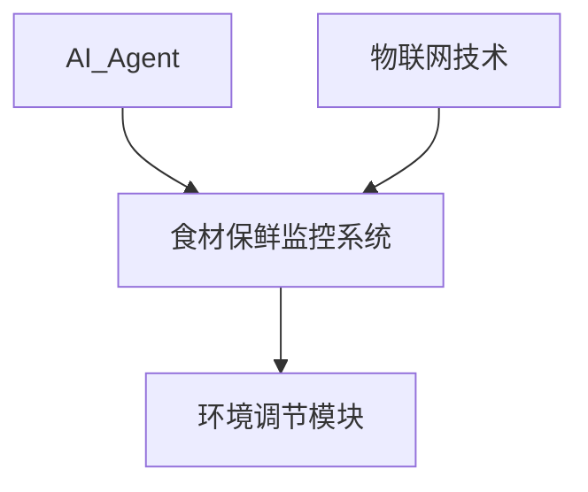
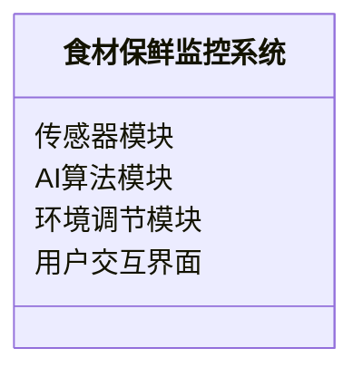
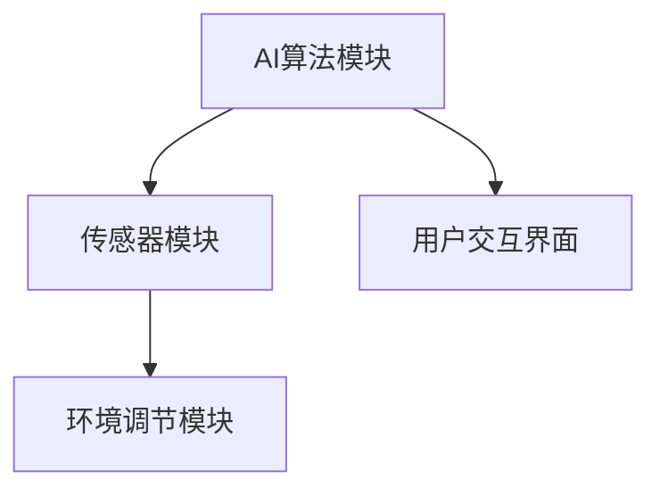
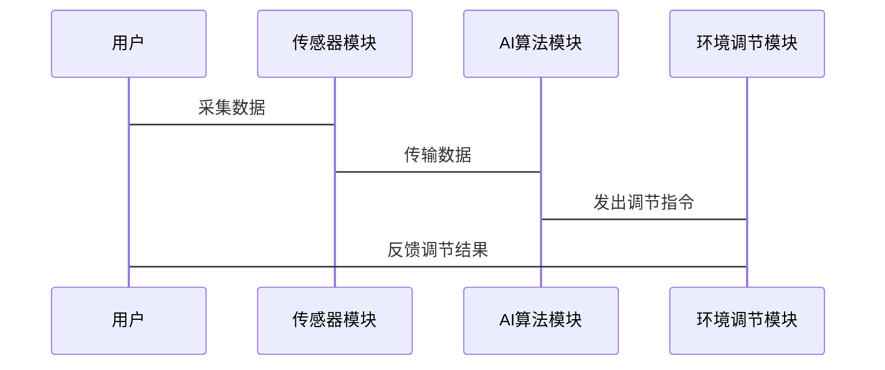

                 


# 智能厨房置物架：AI Agent的食材保鲜监控

> 关键词：智能厨房置物架，AI Agent，食材保鲜监控，物联网技术，传感器，数据采集，算法实现

> 摘要：本文详细探讨了智能厨房置物架中AI Agent的食材保鲜监控系统的设计与实现。通过分析问题背景、核心概念、算法原理、系统架构、项目实战等多方面内容，深入剖析了如何利用AI技术和物联网技术实现食材保鲜的智能化监控。文章结构清晰，内容丰富，结合实际案例和代码实现，为读者提供了一套完整的解决方案。

---

## 第1章: 智能厨房置物架的背景与问题背景

### 1.1 问题背景

#### 1.1.1 食材保鲜的重要性
食材保鲜是现代家庭厨房中至关重要的问题。食材的新鲜度直接影响到烹饪的品质和健康。传统的保鲜方法（如冰箱冷藏）虽然能在一定程度上延长食材的保鲜时间，但缺乏智能化的监控和管理，容易导致食材浪费或变质。

#### 1.1.2 现有食材保鲜技术的局限性
现有保鲜技术主要依赖于冰箱、冷藏柜等设备，但这些设备无法实时监控食材的状态，也无法根据食材特性智能调节保存环境。用户需要手动记录食材的存储时间，容易遗忘或管理不善。

#### 1.1.3 智能化保鲜监控的需求
随着物联网和人工智能技术的快速发展，智能化保鲜监控的需求日益迫切。通过智能设备实时监控食材的状态，结合AI算法优化保存策略，能够显著提高保鲜效率，减少食材浪费。

### 1.2 问题描述

#### 1.2.1 食材保鲜监控的核心问题
食材保鲜监控的核心问题是如何实时感知食材的状态（如温度、湿度、新鲜度等），并根据这些数据动态调整保存环境。

#### 1.2.2 智能厨房置物架的功能需求
智能厨房置物架需要具备以下功能：
1. 实时采集食材的温度、湿度等参数。
2. 通过AI算法分析食材的新鲜度。
3. 根据分析结果智能调节保存环境（如温度、湿度、光照等）。
4. 提供用户友好的交互界面，显示食材状态和保鲜建议。

#### 1.2.3 用户痛点与需求分析
用户的主要痛点包括：
1. 食材容易变质或过期，造成浪费。
2. 缺乏智能化的管理工具，难以高效管理食材。
3. 希望通过简单操作实现食材的长期保鲜。

### 1.3 问题解决

#### 1.3.1 AI Agent在食材保鲜监控中的作用
AI Agent（智能代理）能够实时感知环境变化，分析食材状态，并根据分析结果执行相应的操作（如调节温度、湿度等）。AI Agent的核心作用是实现智能化的监控和决策。

#### 1.3.2 智能厨房置物架的解决方案
通过结合物联网技术和AI算法，智能厨房置物架能够实时采集食材的环境数据，并通过AI Agent进行分析和决策，实现食材的智能化保鲜。

#### 1.3.3 技术实现路径
1. 传感器采集食材环境数据（如温度、湿度、光照等）。
2. AI Agent分析数据，判断食材状态。
3. 根据分析结果，智能调节保存环境。
4. 提供用户友好的反馈界面。

### 1.4 边界与外延

#### 1.4.1 系统边界
智能厨房置物架的系统边界包括：
1. 数据采集模块（温度、湿度、光照传感器）。
2. AI Agent分析模块。
3. 环境调节模块（如温湿度调节器）。
4. 用户交互界面。

#### 1.4.2 功能边界
系统功能边界包括：
1. 实时数据采集与传输。
2. AI算法分析食材状态。
3. 自动调节保存环境。
4. 提供用户反馈。

#### 1.4.3 外延与扩展可能性
智能厨房置物架的扩展可能性包括：
1. 增加更多类型的传感器。
2. 引入更多AI算法优化保鲜策略。
3. 与其他智能家居设备联动。

### 1.5 概念结构与核心要素

#### 1.5.1 核心概念
1. AI Agent。
2. 物联网技术。
3. 食材保鲜监控系统。

#### 1.5.2 概念之间的关系
通过表格和Mermaid图展示核心概念之间的关系。



#### 1.5.3 核心要素组成
智能厨房置物架的核心要素包括：
1. 传感器模块。
2. AI算法模块。
3. 环境调节模块。
4. 用户交互界面。

---

## 第2章: 核心概念与联系

### 2.1 AI Agent的核心原理

#### 2.1.1 AI Agent的基本概念
AI Agent是一种能够感知环境、自主决策并执行任务的智能实体。在智能厨房置物架中，AI Agent负责分析食材的环境数据，并根据分析结果调节保存环境。

#### 2.1.2 AI Agent的核心原理
AI Agent通过传感器采集数据，利用AI算法分析数据，生成决策，并通过执行器调节环境。其核心原理包括数据采集、数据分析和决策执行三个步骤。

#### 2.1.3 AI Agent与传统控制系统的区别
AI Agent能够自主学习和优化，而传统控制系统通常基于固定的规则运行。

### 2.2 物联网技术在智能厨房置物架中的应用

#### 2.2.1 物联网技术的基本概念
物联网技术通过传感器和网络通信技术，实现设备之间的互联和数据共享。

#### 2.2.2 物联网技术在智能厨房置物架中的应用
物联网技术用于采集食材的环境数据，并通过网络传输到AI Agent进行分析。

#### 2.2.3 物联网技术的优势
物联网技术的优势包括实时数据采集、远程监控和高效数据传输。

### 2.3 食材保鲜监控系统的设计

#### 2.3.1 系统设计的基本原则
系统设计应遵循实时性、准确性和智能化原则。

#### 2.3.2 系统设计的核心要素
系统设计的核心要素包括传感器、AI算法、环境调节器和用户交互界面。

#### 2.3.3 系统设计的实现路径
系统设计的实现路径包括：
1. 选择合适的传感器。
2. 设计AI算法模块。
3. 实现环境调节功能。
4. 开发用户交互界面。

### 2.4 核心概念的对比分析

#### 2.4.1 AI Agent与物联网技术的对比
AI Agent负责数据分析和决策，物联网技术负责数据采集和传输。

#### 2.4.2 食材保鲜监控系统与其他监控系统的对比
食材保鲜监控系统专注于食材的保鲜，其他监控系统可能关注不同的目标。

#### 2.4.3 系统设计的核心要素对比
食材保鲜监控系统的核心要素包括传感器、AI算法、环境调节器和用户交互界面。

---

## 第3章: 核心概念的原理与实现

### 3.1 AI Agent的原理

#### 3.1.1 AI Agent的基本原理
AI Agent通过传感器采集数据，利用AI算法分析数据，生成决策，并通过执行器调节环境。

#### 3.1.2 AI Agent的核心算法
AI Agent的核心算法包括感知算法和决策算法。

#### 3.1.3 AI Agent的实现步骤
AI Agent的实现步骤包括：
1. 数据采集。
2. 数据分析。
3. 决策生成。
4. 环境调节。

### 3.2 物联网技术的实现

#### 3.2.1 物联网技术的基本实现
物联网技术的实现包括传感器数据采集、数据传输和数据处理。

#### 3.2.2 物联网技术在智能厨房置物架中的实现
物联网技术用于采集食材的环境数据，并通过网络传输到AI Agent进行分析。

#### 3.2.3 物联网技术的优缺点
物联网技术的优点包括实时性和高效性，缺点包括复杂性和成本高。

---

## 第4章: 算法原理讲解

### 4.1 AI Agent的核心算法

#### 4.1.1 AI Agent的基本算法
AI Agent的基本算法包括感知算法和决策算法。

#### 4.1.2 AI Agent的核心算法实现
AI Agent的核心算法实现包括数据预处理、特征提取和模型训练。

#### 4.1.3 AI Agent算法的优缺点
AI Agent算法的优点包括智能化和自适应性，缺点包括计算复杂性和数据依赖性。

---

## 第5章: 系统分析与架构设计方案

### 5.1 问题场景介绍
食材保鲜监控系统需要实时采集食材的环境数据，并通过AI Agent进行分析和决策。

### 5.2 项目介绍
智能厨房置物架项目的目标是实现食材的智能化保鲜监控。

### 5.3 系统功能设计

#### 5.3.1 领域模型Mermaid类图


### 5.4 系统架构设计

#### 5.4.1 系统架构Mermaid图


### 5.5 系统接口设计
系统接口设计包括：
1. 传感器接口。
2. 网络通信接口。
3. 用户交互界面。

### 5.6 系统交互Mermaid序列图


---

## 第6章: 项目实战

### 6.1 环境安装
项目实战需要以下环境：
1. Python编程语言。
2. AI算法库（如TensorFlow、PyTorch）。
3. 物联网传感器模块。

### 6.2 系统核心实现

#### 6.2.1 传感器数据采集代码
```python
import serial

ser = serial.Serial('COM3', 9600)
data = ser.readline().decode().strip()
print(data)
```

#### 6.2.2 AI算法实现代码
```python
import numpy as np
from sklearn import linear_model

# 假设data是传感器数据
model = linear_model.LinearRegression()
model.fit(X, y)
predictions = model.predict(X_new)
```

### 6.3 代码应用解读与分析
通过代码实现传感器数据的采集和AI算法的分析，最终实现食材保鲜的智能化监控。

### 6.4 实际案例分析
通过实际案例分析，验证系统的有效性和优化空间。

### 6.5 项目小结
总结项目的实现过程和成果，提出改进建议。

---

## 第7章: 总结与展望

### 7.1 最佳实践 tips
1. 定期校准传感器。
2. 优化AI算法模型。
3. 提供用户友好的交互界面。

### 7.2 小结
本文详细探讨了智能厨房置物架中AI Agent的食材保鲜监控系统的设计与实现，通过分析问题背景、核心概念、算法原理、系统架构、项目实战等多方面内容，深入剖析了如何利用AI技术和物联网技术实现食材保鲜的智能化监控。

### 7.3 注意事项
1. 确保传感器的准确性。
2. 定期更新AI算法模型。
3. 注意系统安全性和隐私保护。

### 7.4 拓展阅读
1. 深度学习在食材保鲜中的应用。
2. 物联网技术的最新进展。
3. 智能家居的未来发展。

---

通过以上详细分析和讲解，读者可以全面理解智能厨房置物架中AI Agent的食材保鲜监控系统的实现过程和实际应用价值。

